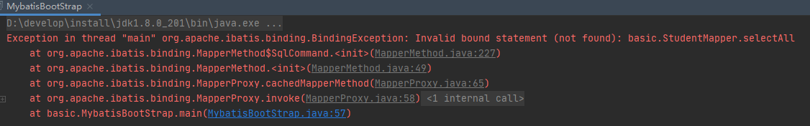
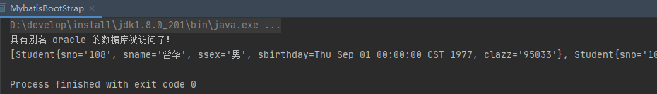

## JDBC

### 步骤

```java
public class TestJDBC {
    public static void main(String[] args) throws Exception {
        Connection con = null;
        PreparedStatement statement = null;
        ResultSet query = null;
        try {

            String sql = "select * from STUDENT";

            /**
             * 1、注册驱动：在使用JDBC连接连接数据库的时候，Java程序并不知道自己是否连接上了相应的
             *             数据库，所以在第一步需要注册驱动，如果连接正常则可以进行接下来的操作。也
             *             就是说注册驱动这一步是通过我们导入的jar包测试能否正常连接数据库。
             */
//            DriverManager.registerDriver(new oracle.jdbc.OracleDriver());
            DriverManager.registerDriver(new com.mysql.cj.jdbc.Driver());

            /**
             * 2、获得连接：数据库服务器中可能存在多个数据库，我们需要连接上我们即将使用的数据库。
             */
//            con = DriverManager.getConnection("jdbc:oracle:thin:@10.88.26.91:1521:focnew", "focnew", "focnew#123");
            con = DriverManager.getConnection("jdbc:mysql://188.131.246.195:3306/mybatis_learn", "root", "601220zjh...");

            /**
             * 3、创建Statement：如果想和数据库进行交互，一定需要使用这个类。JDK对他的解释是：
             *                 The object used for executing a static SQL statementand returning the results it produces.
             */
            statement = con.prepareStatement(sql);
            System.out.println(con.getClass());

            /**
             * 4、执行查询，获得结果集：想数据库中注入SQL语句，是我们能够进行操作
             */
            query = statement.executeQuery();

            /**
             * 5、处理结果集：query是数据库中的元组集合，可以通过循环获得每个元组
             */
            while(query.next()){
                String sno = query.getString("SNO");
                String sname = query.getString("SNAME");
                String ssex = query.getString("SSEX");
                Date sbirthday = query.getDate("SBIRTHDAY");
                String clazz = query.getString("CLASS");
                System.out.println(sno + "  " + sname + "  " + ssex + " " + sbirthday + " " + clazz);
            }
        }catch (Exception e) {
            e.printStackTrace();
        }finally {
            /**
             * 6、释放资源：操作结束后进行操作
             */
            if(query != null) {
                query.close();
            }
            if(statement != null) {
                statement.close();
            }
            if(con != null) {
                con.close();
            }
        }
    }
}
```


### ResultSetType

```java
public class TestResultSetType {

    public static void main(String[] args) throws Exception {
        Connection con = null;
        PreparedStatement statement = null;
        ResultSet query = null;

        try {

            String sql = "select STUDENT.SNO, STUDENT.SNAME, STUDENT.SSEX, STUDENT.SBIRTHDAY, STUDENT.CLASS from STUDENT";

//            DriverManager.registerDriver(new com.mysql.cj.jdbc.Driver());
            DriverManager.registerDriver(new oracle.jdbc.OracleDriver());

//            con = DriverManager.getConnection("jdbc:mysql://188.131.246.xxx:3306/mybatis_learn", "root", "601220zjh...");
            con = DriverManager.getConnection("jdbc:oracle:thin:@10.88.26.xx:1521:focnew", "focnew", "focnew#123");

            /**
             * 测试数据库是否支持 ResultSetType 类型
             */
            DatabaseMetaData metaData = con.getMetaData();
            System.out.println(metaData.supportsResultSetType(ResultSet.TYPE_SCROLL_SENSITIVE));

            statement = con.prepareStatement(sql, ResultSet.TYPE_SCROLL_SENSITIVE, ResultSet.CONCUR_READ_ONLY);
            /**
             * 这个地方必须配置为1，否则不会当第一次执行query.next()的时候，数据库驱动会一次性取出多条数据
             */
            statement.setFetchSize(1);

            query = statement.executeQuery();
            System.out.println(statement.getResultSetType());

            /**
             * queryType有可能会发生降级，比如使用 select * from 的时候。具体需要查看数据文档，比如 oracle10.2 的文档如下
             * https://docs.oracle.com/cd/B19306_01/java.102/b14355/resltset.htm#i1023588
             */
            System.out.println(query.getType());
            System.out.println("modify fetch size: " + statement.getFetchSize());

            int i = 0;
            while(query.next()){
                if(i == 0){
                    Thread.sleep(20000);
                    i++;
                }
                String sno = query.getString("SNO");
                String sname = query.getString("SNAME");
                String ssex = query.getString("SSEX");
                Date sbirthday = query.getDate("SBIRTHDAY");
                String clazz = query.getString("CLASS");
                System.out.println(sno + "  " + sname + "  " + ssex + " " + sbirthday + " " + clazz);
            }
        }catch (Exception e) {
            e.printStackTrace();
        }finally {
            /**
             * 6、释放资源：操作结束后进行操作
             */
            if(query != null) {
                query.close();
            }
            if(statement != null) {
                statement.close();
            }
            if(con != null) {
                con.close();
            }
        }
    }

}
```


### 批量插入

```java
public static void batchInsert() throws SQLException {
    Connection conn = getConnection();
    conn.setAutoCommit(false);
    PreparedStatement ps = null;
    String sql = "insert into xxx values (?,'1','1')";
    ps = conn.prepareStatement(sql); // 批量插入时ps对象必须放到for循环外面
    for (int i = 0; i < 50000; i++) {
        ps.setString(1, i + "");
        ps.addBatch();
        // 每1000条记录插入一次
        if (i % 1000 == 0) {
            ps.executeBatch();
            ps.clearBatch();
        }
    }
    // 剩余数量不足1000
    ps.executeBatch();
    ps.clearBatch();
    conn.commit();
}
```


## Mybatis 极简运行

**Maven依赖**

```xml
<dependencies>
    <dependency>
        <groupId>org.mybatis</groupId>
        <artifactId>mybatis</artifactId>
    </dependency>
    <dependency>
        <groupId>com.oracle</groupId>
        <artifactId>ojdbc6</artifactId>
    </dependency>
</dependencies>
```

**配置文件**

```xml
<!--mybatis-config.xml-->
<?xml version="1.0" encoding="UTF-8" ?>
<!DOCTYPE configuration
  PUBLIC "-//mybatis.org//DTD Config 3.0//EN"
  "http://mybatis.org/dtd/mybatis-3-config.dtd">
<configuration>

    <properties>
        <property name="driver" value="oracle.jdbc.OracleDriver"/>
        <property name="url" value="jdbc:oracle:thin:@10.88.26.91:1521:focnew"/>
        <property name="username" value="focnew"/>
        <property name="password" value="focnew#123"/>
    </properties>

    <environments default="development">
        <environment id="development">
            <transactionManager type="JDBC"/>
            <dataSource type="POOLED">
                <property name="driver" value="${driver}"/>
                <property name="url" value="${url}"/>
                <property name="username" value="${username}"/>
                <property name="password" value="${password}"/>
            </dataSource>
        </environment>
    </environments>

    <mappers>
        <mapper resource="basic\StudentMapper.xml"/>
    </mappers>
</configuration>
```

```xml
<?xml version="1.0" encoding="UTF-8"?>
<!DOCTYPE mapper PUBLIC "-//mybatis.org//DTD Mapper 3.0//EN"
  "http://mybatis.org/dtd/mybatis-3-mapper.dtd">
<mapper namespace="basic.StudentMapper">

    <resultMap id="basicResult" type="pojo.Student">
        <id column="SNO" jdbcType="VARCHAR" property="sno"></id>
        <id column="SNAME" jdbcType="VARCHAR" property="sname"></id>
        <id column="SSEX" jdbcType="VARCHAR" property="ssex"></id>
        <id column="SBIRTHDAY" jdbcType="DATE" property="sbirthday"></id>
        <id column="CLASS" jdbcType="VARCHAR" property="clazz"></id>
    </resultMap>

    <select id="selectAll" resultMap="basicResult">
        select * from STUDENT
    </select>
</mapper>
```

**启动代码**

```java
public class MybatisBootStrap {

    public static void main(String[] args) {
        String resource = "mybatis-config.xml";
        Reader reader;
        try {
            reader = Resources.getResourceAsReader(resource);
            /**
             * SqlSessionFactoryBuilder: 这个类可以被实例化、使用和丢弃，一旦创建了 SqlSessionFactory，
             * 就不再需要它了。 因此其实例的最佳作用域是方法作用域（也就是局部方法变量）。
             */
            /**
             * SqlSessionFactory 一旦被创建就应该在应用的运行期间一直存在，没有任何理由丢弃它或重新创建另一个实例。
             * 使用 SqlSessionFactory 的最佳实践是在应用运行期间不要重复创建多次，多次重建 SqlSessionFactory 被
             * 视为一种代码“坏习惯”。因此 SqlSessionFactory 的最佳作用域是应用作用域。
             */
            SqlSessionFactory sqlMapper = new SqlSessionFactoryBuilder().build(reader);

            /**
             * 每个线程都应该有它自己的 SqlSession 实例。SqlSession 的实例不是线程安全的，因此是不能被共享的，
             * 所以它的最佳的作用域是请求或方法作用域。
             */
            SqlSession session = sqlMapper.openSession();
            try {
                /**
                 * XXXMapper被称为映射器，他们是一些绑定映射语句的接口。虽然从技术层面上来讲，任何映射器实例的最大作用域与
                 * 请求它们的 SqlSession 相同。但方法作用域才是映射器实例的最合适的作用域。就是说，映射器实例应该在调用
                 * 它们的方法中被获取，使用完毕之后即可丢弃。 映射器实例并不需要被显式地关闭。尽管在整个请求作用域保留映射器实例
                 * 不会有什么问题，但是你很快会发现，在这个作用域上管理太多像SqlSession的资源会让你忙不过来。 因此，最好将映射器放在方法作用域内。
                 */
                StudentMapper mapper = session.getMapper(StudentMapper.class);
                List<Student> students = mapper.selectAll();
                System.out.println(students);
            } finally {
                session.close();
            }
        } catch (IOException e) {
            e.printStackTrace();
        }
    }
}
```


## Mapper

 一个 mapper 文件对应一个接口，mapper的根标签是 mapper，其中有一个属性 namespace，关联对应的接口，也就是说当调用A接口的方法时，Mybatis 会去namepsace = "A" 的mapper文件里寻找对应的 sql。

mapper 标签下有如下的几个标签：

- `cache` – 该命名空间的缓存配置。
- `cache-ref` – 引用其它命名空间的缓存配置。
- `resultMap` – 描述如何从数据库结果集中加载对象，是最复杂也是最强大的元素。
- `sql` – 可被其它语句引用的可重用语句块。
- `insert` – 映射插入语句。
- `update` – 映射更新语句。
- `delete` – 映射删除语句。
- `select` – 映射查询语句。


### select

简单查询的 select 语句结构如下：

```xml
<select id="selectPerson" parameterType="int" resultType="hashmap">
    SELECT * FROM PERSON WHERE ID = #{id}
</select>
```

这个语句名为 selectPerson，接受一个 int（或 Integer）类型的参数，并返回一个 HashMap 类型的对象，其中的键是列名，值便是结果行中的对应值。注意参数符号：`#{id}`。这就告诉 MyBatis 创建一个预处理语句（PreparedStatement）参数，在 JDBC 中，这样的一个参数在 SQL 中会由一个“?”来标识，并被传递到一个新的预处理语句中，就像这样：

```java
// 近似的 JDBC 代码，非 MyBatis 代码...
String selectPerson = "SELECT * FROM PERSON WHERE ID=?";
PreparedStatement ps = conn.prepareStatement(selectPerson);
ps.setInt(1,id);
```

select 标签具有很多的属性，具体如下：

```xml
<select
  id="selectPerson"
  parameterType="int"
  parameterMap="deprecated"
  resultType="hashmap"
  resultMap="personResultMap"
  flushCache="false"
  useCache="true"
  timeout="10"
  fetchSize="256"
  statementType="PREPARED"
  resultSetType="FORWARD_ONLY">
```

| 属性            | 描述                                                         |
| :-------------- | :----------------------------------------------------------- |
| `id`            | 在命名空间中唯一的标识符，可以被用来引用这条语句。           |
| `parameterType` | 将会传入这条语句的参数的类全限定名或别名。这个属性是可选的，因为 MyBatis 可以通过类型处理器（TypeHandler）推断出具体传入语句的参数，默认值为未设置（unset）。 |
| `resultType`    | 期望从这条语句中返回结果的类全限定名或别名。 注意，如果返回的是集合，那应该设置为集合包含的类型，而不是集合本身的类型。 resultType 和 resultMap 之间只能同时使用一个。 |
| `resultMap`     | 对外部 resultMap 的命名引用。结果映射是 MyBatis 最强大的特性，如果你对其理解透彻，许多复杂的映射问题都能迎刃而解。 resultType 和 resultMap 之间只能同时使用一个。 |
| `flushCache`    | 将其设置为 true 后，只要语句被调用，都会导致本地缓存和二级缓存被清空，默认值：false。 |
| `useCache`      | 将其设置为 true 后，将会导致本条语句的结果被二级缓存缓存起来，默认值：对 select 元素为 true。 |
| `timeout`       | 这个设置是在抛出异常之前，驱动程序等待数据库返回请求结果的秒数。默认值为未设置（unset）（依赖数据库驱动）。 |
| `statementType` | 可选 STATEMENT，PREPARED 或 CALLABLE。这会让 MyBatis 分别使用 Statement，PreparedStatement 或 CallableStatement（支持存储过程及对应输出输出参数的Statement），默认值：PREPARED。 |
| `resultSetType` | FORWARD_ONLY，SCROLL_SENSITIVE, SCROLL_INSENSITIVE 或 DEFAULT（等价于 unset） 中的一个，默认值为 unset （依赖数据库驱动）。 |
| `fetchSize`     | 这是一个给驱动的建议值，尝试让驱动程序每次批量返回的结果行数等于这个设置值。 默认值为未设置（unset）（依赖驱动）。 |
| `databaseId`    | 如果配置了数据库厂商标识（databaseIdProvider），MyBatis 会加载所有不带 databaseId 或匹配当前 databaseId 的语句；如果带和不带的语句都有，则不带的会被忽略。 |
| `resultOrdered` | 这个设置仅针对嵌套结果 select 语句：如果为 true，将会假设包含了嵌套结果集或是分组，当返回一个主结果行时，就不会产生对前面结果集的引用。 这就使得在获取嵌套结果集的时候不至于内存不够用。默认值：`false`。 |
| `resultSets`    | 这个设置仅适用于多结果集的情况。它将列出语句执行后返回的结果集并赋予每个结果集一个名称，多个名称之间以逗号分隔。 |


#### sql案例

#### 测试select标签的属性

**statementType**

statementType 的三个可选值分别对应Statement接口、PreparedStatement接口和CallableStatement接口。Statement接口会引发sql注入问题，所以一般不使用，当不使用存储过程时使用PreparedStatement，需要使用存储过程时，使用CallableStatement。这三个接口的实现都是由数据库驱动完成。

**resultSetType和fecthSize**

当使用原生JDBC时返回的结果集类型是ResultSet，我们需要调用ResultSet对应的方法完成结果的处理，如下：

```java
statement = con.prepareStatement(sql);
query = statement.executeQuery();
ResultSet query = ps.executeQuery();
while(query.next()){
    String id = query.getString("id");
    String name = query.getString("name");
    String clazz = query.getString("clazz");
    System.out.println(id + "  " + name + "  " + clazz);
}
```

- 上诉代码执行得到的query的类型是FORWARD_ONLY，仅仅支持结果集forward ，不支持backforward，random等操作。
- SCROLL_INSENSITIVE支持结果集backforward ，random等操作，但是对其它 session 对数据库中数据做出的更改是不敏感的。
- SCROLL_SENSITIVE支持结果集backforward ，random等操作，对其它session对数据库中数据做出的更改是敏感的，即其他 session 修改了数据库中的数据，会反应到本结果集中。一般实现方法：从数据库取出数据后，不是把全部数据缓存到cache中，而是把每条数据的rowid缓存到cache中，对结果集后续操作时，是根据rowid再去数据库中取数据。所以数据库中记录发生变化后，通过ResultSet取出的记录是最新的，即ResultSet是SENSITIVE的。但insert和delete 操作不会影响到ResultSet ，因为insert 数据的rowid 不在ResultSet 取出的rowid中，所以insert的数据对ResultSet是不可见的，而delete数据的rowid依旧在ResultSet 中，所以ResultSet仍可以取出被删除的记录（因为一般数据库的删除是标记删除，不是真正在数据库文件中删除）。

```java
public class TestResultSetType {

    public static void main(String[] args) throws Exception {
        Connection con = null;
        PreparedStatement statement = null;
        ResultSet query = null;

        try {

            String sql = "select STUDENT.SNO, STUDENT.SNAME, STUDENT.SSEX, STUDENT.SBIRTHDAY, STUDENT.CLASS from STUDENT";
            DriverManager.registerDriver(new oracle.jdbc.OracleDriver());

            con = DriverManager.getConnection("jdbc:oracle:thin:@10.88.26.91:1521:focnew", "focnew", "focnew#123");

            /**
             * 测试数据库是否支持 ResultSetType 类型
             */
            DatabaseMetaData metaData = con.getMetaData();
            System.out.println(metaData.supportsResultSetType(ResultSet.TYPE_SCROLL_SENSITIVE));

            statement = con.prepareStatement(sql, ResultSet.TYPE_SCROLL_SENSITIVE, ResultSet.CONCUR_READ_ONLY);
            
            /**
             * 这个地方必须配置为1，否则不会当第一次执行query.next()的时候，数据库驱动会一次性取出多条数据
             */
            statement.setFetchSize(1);

            query = statement.executeQuery();
            System.out.println(statement.getResultSetType());

            /**
             * queryType有可能会发生降级，比如使用 select * from 的时候。具体需要查看数据文档，比如 oracle10.2 的文档如下
             * https://docs.oracle.com/cd/B19306_01/java.102/b14355/resltset.htm#i1023588
             */
            System.out.println(query.getType());
            System.out.println("modify fetch size: " + statement.getFetchSize());

            int i = 0;
            while(query.next()){
                /**
                 * 阻塞的时候开启另一个 session 去修改数据库的数据，就可以看到结果。比如使用DataGrip
                 */
                if(i == 0){
                    Thread.sleep(20000);
                    i++;
                }
                String sno = query.getString("SNO");
                String sname = query.getString("SNAME");
                String ssex = query.getString("SSEX");
                Date sbirthday = query.getDate("SBIRTHDAY");
                String clazz = query.getString("CLASS");
                System.out.println(sno + "  " + sname + "  " + ssex + " " + sbirthday + " " + clazz);
            }
        }catch (Exception e) {
            e.printStackTrace();
        }finally {
            if(query != null) {
                query.close();
            }
            if(statement != null) {
                statement.close();
            }
            if(con != null) {
                con.close();
            }
        }
    }
}
```

**databaseId**

MyBatis 可以根据不同的数据库厂商执行不同的语句，这种多厂商的支持是基于映射语句中的 databaseId 属性。 MyBatis 会加载不带 databaseId 属性和带有匹配当前数据库 databaseId 属性的所有语句。 如果同时找到带有 databaseId 和不带 databaseId 的相同语句，则后者会被舍弃。 为支持多厂商特性只要像下面这样在 mybatis-config.xml 文件中加入 databaseIdProvider 即可。

```xml
<databaseIdProvider type="DB_VENDOR">
    <property name="SQL Server" value="sqlserver"/>
    <property name="DB2" value="db2"/>        
    <property name="Oracle" value="oracle" />
    <property name="MySQL" value="mysql"/>
</databaseIdProvider>
```

databaseIdProvider 的 type 属性是必须的，不配置时会报错。上面这个属性值使用的是类 org.apache.ibatis.mapping.VendorDatabaseIdProvider 的别名，我们也可以通过实现 org.apache.ibatis.mapping.DatabaseIdProvider 接口自定义 type。

如果你使用的是 Oracle 数据库，但这里配置的不是 oracle，则会报错，比如我配成 mysql。

```xml
<select id="selectAll" resultMap="basicResult" databaseId="mysql">
    select * from STUDENT
</select>
```

<div align="center"></div>

可以看一下 VendorDatabaseIdProvider 类的实现：

```java
public class VendorDatabaseIdProvider implements DatabaseIdProvider {

    private static final Log log = LogFactory.getLog(VendorDatabaseIdProvider.class);

    // 存储在 mybatis-config.xml 配置的键值对
    private Properties properties;

    @Override
    public String getDatabaseId(DataSource dataSource) {
        if (dataSource == null) {
            throw new NullPointerException("dataSource cannot be null");
        }
        try {
            return getDatabaseName(dataSource);
        } catch (Exception e) {
            log.error("Could not get a databaseId from dataSource", e);
        }
        return null;
    }

    @Override
    public void setProperties(Properties p) {
        this.properties = p;
    }

    private String getDatabaseName(DataSource dataSource) throws SQLException {
        // 从数据库连接里获得数据库的名称
        String productName = getDatabaseProductName(dataSource);
        if (this.properties != null) {
            for (Map.Entry<Object, Object> property : properties.entrySet()) {
                // 通过名称在 properties 里查找
                if (productName.contains((String) property.getKey())) {
                    return (String) property.getValue();
                }
            }
            // no match, return null
            return null;
        }
        return productName;
    }

    private String getDatabaseProductName(DataSource dataSource) throws SQLException {
        Connection con = null;
        try {
            con = dataSource.getConnection();
            DatabaseMetaData metaData = con.getMetaData();
            return metaData.getDatabaseProductName();
        } finally {
            // close con
        }
    } 
}
```

我们可以自定义一个 DatabaseIdProvider 的实现：

```java
private String getDatabaseName(DataSource dataSource) throws SQLException {
    String productName = getDatabaseProductName(dataSource);
    if (this.properties != null) {
        for (Map.Entry<Object, Object> property : properties.entrySet()) {
            if (productName.contains((String) property.getKey())) {
                // 其他地方都和 VendorDatabaseIdProvider 一致，只是这里加一句话。
                System.out.println("具有别名 " + property.getValue() + " 的数据库被访问了！");
                return (String) property.getValue();
            }
        }
        // no match, return null
        return null;
    }
    return productName;
}
```

<div align="center"></div>

#### 一对多的实现

**java**

```java
public class Student {
    private String sno;
    private String sname;
    private String ssex;
    private Date sbirthday;
    private String clazz;
}
public class Score {
    private String sno;
    private String cno;
    private float degree;
}
public class StudentScore extends Student {
    private List<Score> scores;
}
```

**xml配置**

ScoreMapper.xml

```xml
<?xml version="1.0" encoding="UTF-8"?>
<!DOCTYPE mapper PUBLIC "-//mybatis.org//DTD Mapper 3.0//EN"
  "http://mybatis.org/dtd/mybatis-3-mapper.dtd">
<mapper namespace="com.sfa.foc.planning.mapper.ScoreMapper">

  <resultMap id="ScoreResultMap" type="com.sfa.foc.planning.zjhpojo.Score">
    <id column="SCORESNO" jdbcType="NUMERIC" property="sno"/>
    <id column="CNO" jdbcType="VARCHAR" property="cno"/>
    <result column="DEGREE" jdbcType="DOUBLE" property="degree"/>
  </resultMap>

</mapper>
```

StudentMapper.xml

```xml
<?xml version="1.0" encoding="UTF-8"?>
<!DOCTYPE mapper PUBLIC "-//mybatis.org//DTD Mapper 3.0//EN"
  "http://mybatis.org/dtd/mybatis-3-mapper.dtd">
<mapper namespace="com.sfa.foc.planning.mapper.StudentMapper">

    <resultMap id="StudentResultMap" type="com.sfa.foc.planning.zjhpojo.Student">
        <id column="SNO" jdbcType="NUMERIC" property="sno"/>
        <result column="SNAME" jdbcType="VARCHAR" property="sname"/>
        <result column="SSEX" jdbcType="VARCHAR" property="ssex"/>
        <result column="SBIRTHDAY" jdbcType="DATE" property="sbirthday"/>
        <result column="CLASS" jdbcType="VARCHAR" property="clazz"/>
    </resultMap>

    <sql id="studentScore">
        STUDENT.SNO, STUDENT.SNAME, STUDENT.SSEX, STUDENT.SBIRTHDAY, 
        STUDENT.CLASS, SCORE.SNO as SCORESNO, SCORE.CNO, SCORE.DEGREE
    </sql>

    <!--  一对多查询-->
    <resultMap id="StudentScoreResultMap" type="com.sfa.foc.planning.zjhpojo.StudentScore" extends="StudentResultMap">

        <collection property="scores" ofType="com.sfa.foc.planning.zjhpojo.Score" 
                    resultMap="com.sfa.foc.planning.mapper.ScoreMapper.ScoreResultMap" />
    
    </resultMap>

    <select id="queryStudentScores" resultMap="StudentScoreResultMap" resultOrdered="true">
        select
        <include refid="studentScore"></include>
        from SCORE, STUDENT
        where STUDENT.SNO = SCORE.SNO and SCORE.SNO = #{sno} order by STUDENT.SNO
    </select>

</mapper>
```


### insert, update 和 delete

```xml
<insert
  id="insertAuthor"
  parameterType="domain.blog.Author"
  flushCache="true"
  statementType="PREPARED"
  keyProperty=""
  keyColumn=""
  useGeneratedKeys=""
  timeout="20">

<update
  id="updateAuthor"
  parameterType="domain.blog.Author"
  flushCache="true"
  statementType="PREPARED"
  timeout="20">

<delete
  id="deleteAuthor"
  parameterType="domain.blog.Author"
  flushCache="true"
  statementType="PREPARED"
  timeout="20">
```

| 属性               | 描述                                                         |
| :----------------- | :----------------------------------------------------------- |
| `id`               | 在命名空间中唯一的标识符，可以被用来引用这条语句。           |
| `parameterType`    | 将会传入这条语句的参数的类全限定名或别名。这个属性是可选的，因为 MyBatis 可以通过类型处理器（TypeHandler）推断出具体传入语句的参数，默认值为未设置（unset）。 |
| `flushCache`       | 将其设置为 true 后，只要语句被调用，都会导致本地缓存和二级缓存被清空，默认值：（对 insert、update 和 delete 语句）true。 |
| `timeout`          | 这个设置是在抛出异常之前，驱动程序等待数据库返回请求结果的秒数。默认值为未设置（unset）（依赖数据库驱动）。 |
| `statementType`    | 可选 STATEMENT，PREPARED 或 CALLABLE。这会让 MyBatis 分别使用 Statement，PreparedStatement 或 CallableStatement，默认值：PREPARED。 |
| `useGeneratedKeys` | （仅适用于 insert 和 update）这会令 MyBatis 使用 JDBC 的 getGeneratedKeys 方法来取出由数据库内部生成的主键（比如：像 MySQL 和 SQL Server 这样的关系型数据库管理系统的自动递增字段），默认值：false。 |
| `keyProperty`      | （仅适用于 insert 和 update）指定能够唯一识别对象的属性，MyBatis 会使用 getGeneratedKeys 的返回值或 insert 语句的 selectKey 子元素设置它的值，默认值：未设置（`unset`）。如果生成列不止一个，可以用逗号分隔多个属性名称。 |
| `keyColumn`        | （仅适用于 insert 和 update）设置生成键值在表中的列名，在某些数据库（像 PostgreSQL）中，当主键列不是表中的第一列的时候，是必须设置的。如果生成列不止一个，可以用逗号分隔多个属性名称。 |
| `databaseId`       | 如果配置了数据库厂商标识（databaseIdProvider），MyBatis 会加载所有不带 databaseId 或匹配当前 databaseId 的语句；如果带和不带的语句都有，则不带的会被忽略。 |

下面是 insert，update 和 delete 语句的示例：

```xml
<insert id="insertAuthor">
    insert into Author (id,username,password,email,bio)
    values (#{id},#{username},#{password},#{email},#{bio})
</insert>

<update id="updateAuthor">
    update Author set
    username = #{username},
    password = #{password},
    email = #{email},
    bio = #{bio}
    where id = #{id}
</update>

<delete id="deleteAuthor">
    delete from Author where id = #{id}
</delete>
```

#### 批量更新

```java
public class FailedCourse {
    private Long id;
    private String sno;
    private String cno;
}
public class StudentManagerImpl implements StudentManager {
    
    @Autowired
    private StudentMapper studentMapper;
    
    public Long insertBatchWithPrimaryKey(FailedCourse[] failedCourses) {

        SqlSession sqlSession = sqlSessionFactory.openSession(ExecutorType.BATCH);
        // 一定要使用这个mapper，不能使用Autowired注入的mapper
        StudentMapper mapper = sqlSession.getMapper(StudentMapper.class);

        long start = System.currentTimeMillis();
        for (int i = 0; i < failedCourses.length; i++) {
            mapper.insert(failedCourses[i]);
            // 每200条数据执行一次操作，防止数据量过大
            if (i >= 1 && i % 200 == 0) {
                sqlSession.flushStatements();
            }
        }

        sqlSession.flushStatements();
        long end = System.currentTimeMillis();
        System.out.println(end - start);
        return Long.valueOf(failedCourses.length);
    }
}
```


## mybatis-config

此配置文件的跟标签是configuration，configuration下有11个子标签。configuration标签对应类`org.apache.ibatis.session.Configuration`。

<div align="center"></div>


### properties

属性可以在外部使用xml配置，也可以在代码里使用 Properties 对象进行配置。

```java
SqlSessionFactory factory = new SqlSessionFactoryBuilder().build(reader, props);
// ... 或者 ...
SqlSessionFactory factory = new SqlSessionFactoryBuilder().build(reader, environment, props);
```

也可以将具体的数据库参数配置在别的文件中，此时需要使用 properties 标签的属性。如果是 resource 属性，表示使用本地配置文件；如果是 url 属性，表示使用网络资源。

```xml
<configuration>
    <properties resource="db.properties"></properties>

    <environments default="development">
        ...
    </environments>

    <mappers>
        ...
    </mappers>
</configuration>
```

```properties
# db.properties
db.driver=oracle.jdbc.OracleDriver
db.url=jdbc:oracle:thin:@10.88.26.91:1521:focnew
db.username=focnew
db.password=focnew#123
```

当 xml文件 和代码都配置了属性时，Mybatis使用如下的顺序来加载：

- 首先读取在 properties 元素体内指定的属性。
- 然后根据 properties 元素中的 resource 属性读取类路径下属性文件，或根据 url 属性指定的路径读取属性文件，并覆盖之前读取过的同名属性。
- 最后读取作为方法参数传递的属性，并覆盖之前读取过的同名属性。

因此，通过方法参数传递的属性具有最高优先级，resource/url 属性中指定的配置文件次之，最低优先级的则是 properties 元素中指定的属性。


### settings

settings标签的全部子标签在[官方文档](https://mybatis.org/mybatis-3/zh/configuration.html)里，这里列举出了3.5.5版本时的全部setting。

| 设置名                    | 描述                                                         | 有效值      | 默认值 |
| ------------------------- | ------------------------------------------------------------ | ----------- | ------ |
| cacheEnabled              | 全局性地开启或关闭所有映射器配置文件中已配置的任何缓存       | true，false | true   |
| lazyLoadingEnabled        | 延迟加载的全局开关。当开启时，所有关联对象都会延迟加载。 特定关联关系中可通过设置 `fetchType` 属性来覆盖该项的开关状态。 | true，false | false  |
| aggressiveLazyLoading     | 开启时，任一方法的调用都会加载该对象的所有延迟加载属性。 否则，每个延迟加载属性会按需加载（参考 `lazyLoadTriggerMethods`)。 | true，false | false  |
| multipleResultSetsEnabled | 是否允许单个语句返回多结果集（需要数据库驱动支持）。         | true，false | true   |
| useColumnLabel            | 使用列标签代替列名。实际表现依赖于数据库驱动。               | true，false | true   |
|                           |                                                              |             |        |
|                           |                                                              |             |        |
|                           |                                                              |             |        |
|                           |                                                              |             |        |


| 设置名                           | 描述                                                         | 有效值                                                       | 默认值                                                |
| :------------------------------- | :----------------------------------------------------------- | :----------------------------------------------------------- | :---------------------------------------------------- |
| cacheEnabled                     | 全局性地开启或关闭所有映射器配置文件中已配置的任何缓存。     | true \| false                                                | true                                                  |
|                                  |                                                              | true \| false                                                |                                                       |
| aggressiveLazyLoading            | 开启时，任一方法的调用都会加载该对象的所有延迟加载属性。 否则，每个延迟加载属性会按需加载（参考 `lazyLoadTriggerMethods`)。 | true \| false                                                | false （在 3.4.1 及之前的版本中默认为 true）          |
|                                  | 是否允许单个语句返回多结果集（需要数据库驱动支持）。         | true \| false                                                | true                                                  |
| useColumnLabel                   | 使用列标签代替列名。实际表现依赖于数据库驱动，具体可参考数据库驱动的相关文档，或通过对比测试来观察。 | true \| false                                                | true                                                  |
| useGeneratedKeys                 | 允许 JDBC 支持自动生成主键，需要数据库驱动支持。如果设置为 true，将强制使用自动生成主键。尽管一些数据库驱动不支持此特性，但仍可正常工作（如 Derby）。 | true \| false                                                | False                                                 |
| autoMappingBehavior              | 指定 MyBatis 应如何自动映射列到字段或属性。 NONE 表示关闭自动映射；PARTIAL 只会自动映射没有定义嵌套结果映射的字段。 FULL 会自动映射任何复杂的结果集（无论是否嵌套）。 | NONE, PARTIAL, FULL                                          | PARTIAL                                               |
| autoMappingUnknownColumnBehavior | 指定发现自动映射目标未知列（或未知属性类型）的行为。`NONE`: 不做任何反应`WARNING`: 输出警告日志（`'org.apache.ibatis.session.AutoMappingUnknownColumnBehavior'` 的日志等级必须设置为 `WARN`）`FAILING`: 映射失败 (抛出 `SqlSessionException`) | NONE, WARNING, FAILING                                       | NONE                                                  |
| defaultExecutorType              | 配置默认的执行器。SIMPLE 就是普通的执行器；REUSE 执行器会重用预处理语句（PreparedStatement）； BATCH 执行器不仅重用语句还会执行批量更新。 | SIMPLE REUSE BATCH                                           | SIMPLE                                                |
| defaultStatementTimeout          | 设置超时时间，它决定数据库驱动等待数据库响应的秒数。         | 任意正整数                                                   | 未设置 (null)                                         |
| defaultFetchSize                 | 为驱动的结果集获取数量（fetchSize）设置一个建议值。此参数只可以在查询设置中被覆盖。 | 任意正整数                                                   | 未设置 (null)                                         |
| defaultResultSetType             | 指定语句默认的滚动策略。（新增于 3.5.2）                     | FORWARD_ONLY \| SCROLL_SENSITIVE \| SCROLL_INSENSITIVE \| DEFAULT（等同于未设置） | 未设置 (null)                                         |
| safeRowBoundsEnabled             | 是否允许在嵌套语句中使用分页（RowBounds）。如果允许使用则设置为 false。 | true \| false                                                | False                                                 |
| safeResultHandlerEnabled         | 是否允许在嵌套语句中使用结果处理器（ResultHandler）。如果允许使用则设置为 false。 | true \| false                                                | True                                                  |
| mapUnderscoreToCamelCase         | 是否开启驼峰命名自动映射，即从经典数据库列名 A_COLUMN 映射到经典 Java 属性名 aColumn。 | true \| false                                                | False                                                 |
| localCacheScope                  | MyBatis 利用本地缓存机制（Local Cache）防止循环引用和加速重复的嵌套查询。 默认值为 SESSION，会缓存一个会话中执行的所有查询。 若设置值为 STATEMENT，本地缓存将仅用于执行语句，对相同 SqlSession 的不同查询将不会进行缓存。 | SESSION \| STATEMENT                                         | SESSION                                               |
| jdbcTypeForNull                  | 当没有为参数指定特定的 JDBC 类型时，空值的默认 JDBC 类型。 某些数据库驱动需要指定列的 JDBC 类型，多数情况直接用一般类型即可，比如 NULL、VARCHAR 或 OTHER。 | JdbcType 常量，常用值：NULL、VARCHAR 或 OTHER。              | OTHER                                                 |
| lazyLoadTriggerMethods           | 指定对象的哪些方法触发一次延迟加载。                         | 用逗号分隔的方法列表。                                       | equals,clone,hashCode,toString                        |
| defaultScriptingLanguage         | 指定动态 SQL 生成使用的默认脚本语言。                        | 一个类型别名或全限定类名。                                   | org.apache.ibatis.scripting.xmltags.XMLLanguageDriver |
| defaultEnumTypeHandler           | 指定 Enum 使用的默认 `TypeHandler` 。（新增于 3.4.5）        | 一个类型别名或全限定类名。                                   | org.apache.ibatis.type.EnumTypeHandler                |
| callSettersOnNulls               | 指定当结果集中值为 null 的时候是否调用映射对象的 setter（map 对象时为 put）方法，这在依赖于 Map.keySet() 或 null 值进行初始化时比较有用。注意基本类型（int、boolean 等）是不能设置成 null 的。 | true \| false                                                | false                                                 |
| returnInstanceForEmptyRow        | 当返回行的所有列都是空时，MyBatis默认返回 `null`。 当开启这个设置时，MyBatis会返回一个空实例。 请注意，它也适用于嵌套的结果集（如集合或关联）。（新增于 3.4.2） | true \| false                                                | false                                                 |
| logPrefix                        | 指定 MyBatis 增加到日志名称的前缀。                          | 任何字符串                                                   | 未设置                                                |
| logImpl                          | 指定 MyBatis 所用日志的具体实现，未指定时将自动查找。        | SLF4J \| LOG4J \| LOG4J2 \| JDK_LOGGING \| COMMONS_LOGGING \| STDOUT_LOGGING \| NO_LOGGING | 未设置                                                |
| proxyFactory                     | 指定 Mybatis 创建可延迟加载对象所用到的代理工具。            | CGLIB \| JAVASSIST                                           | JAVASSIST （MyBatis 3.3 以上）                        |
| vfsImpl                          | 指定 VFS 的实现                                              | 自定义 VFS 的实现的类全限定名，以逗号分隔。                  | 未设置                                                |
| useActualParamName               | 允许使用方法签名中的名称作为语句参数名称。 为了使用该特性，你的项目必须采用 Java 8 编译，并且加上 `-parameters` 选项。（新增于 3.4.1） | true \| false                                                | true                                                  |
| configurationFactory             | 指定一个提供 `Configuration` 实例的类。 这个被返回的 Configuration 实例用来加载被反序列化对象的延迟加载属性值。 这个类必须包含一个签名为`static Configuration getConfiguration()` 的方法。（新增于 3.2.3） | 一个类型别名或完全限定类名。                                 | 未设置                                                |
| shrinkWhitespacesInSql           | Removes extra whitespace characters from the SQL. Note that this also affects literal strings in SQL. (Since 3.5.5) | true \| false                                                | false                                                 |


## 