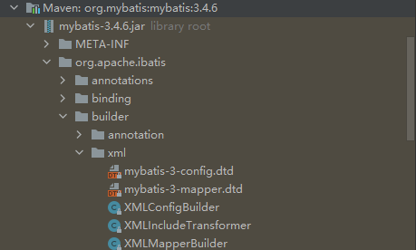
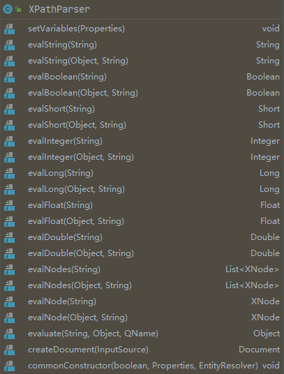
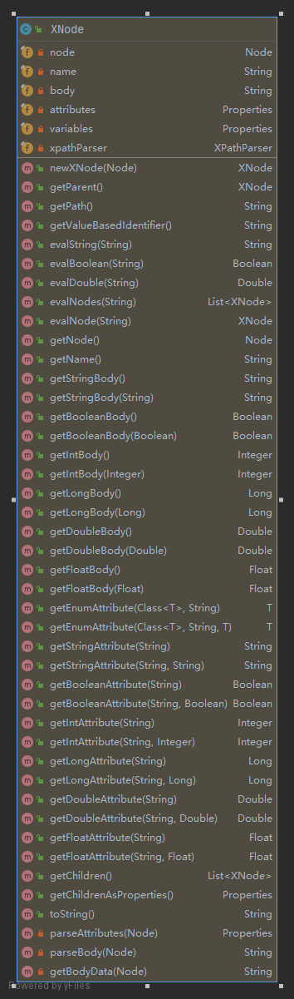
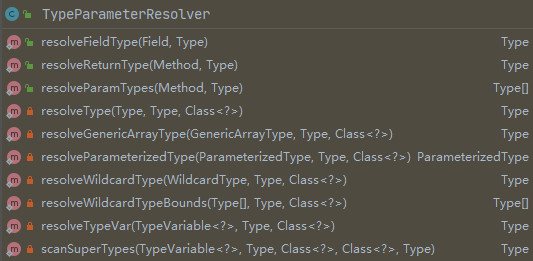

## Mybatis加载流程

```java
public class MybatisBootStrap {
    public static void main(String[] args) {
        String resource = "mybatis-config.xml";
        Reader reader;
        try {
            reader = Resources.getResourceAsReader(resource);
            SqlSessionFactory sqlSessionFactory = new SqlSessionFactoryBuilder().build(reader);
            SqlSession sqlSession = sqlSessionFactory.openSession();
            List<Student> objects = sqlSession.selectList("selectAll");
            System.out.println(objects);
            try {
                StudentMapper studentMapper = sqlSession.getMapper(StudentMapper.class);
                List<Student> students = studentMapper.selectAll();
                System.out.println(students);
            } finally {
                sqlSession.close();
            }
        } catch (IOException e) {
            e.printStackTrace();
        }
    }
}
```

一个极简Mybatis的代码如上所示，我们先分析 `SqlSessionFactory` 类的构建。这个类在构造时使用了建造者模式，建造者是 `SqlSessionFactoryBuilder`。建造者的构造方法仅仅初始化了一个 `SqlSessionFactoryBuilder`的对象，真正的构造是在 `build()` 方法里进行的，`build()` 方法有很多的重载。

```java
public SqlSessionFactory build(Reader reader) {
    return build(reader, null, null);
}
public SqlSessionFactory build(Reader reader, String environment, Properties properties) {
    try {
        XMLConfigBuilder parser = new XMLConfigBuilder(reader, environment, properties);
        return build(parser.parse());
    } catch (Exception e) {
        throw ExceptionFactory.wrapException("Error building SqlSession.", e);
    } finally {
        ErrorContext.instance().reset();
        try {
            reader.close();
        } catch (IOException e) {
            // Intentionally ignore. Prefer previous error.
        }
    }
}
```

上述代码的第6行构建了一个 `XMLConfigBuilder` 类的对象，`XMLConfigBuilder` 类继承了 `BaseBuilder`，`BaseBuilder` 抽取了解析xml文件时的通用代码，它有很多实现类，最常见的就是`XMLConfigBuilder` 和 `XMLMapperBuilder` 两个类，前者用于解析 `mybatis-config.xml`文件，后者用于解析 `XxxMapper.xml` 文件，`BaseBuilder` 里有三个属性：

```java
public abstract class BaseBuilder {
    // Mybatis 的配置信息
    protected final Configuration configuration;
    // 别名注册中心
    protected final TypeAliasRegistry typeAliasRegistry;
    // 类型处理器注册中心
    protected final TypeHandlerRegistry typeHandlerRegistry;
    
    public BaseBuilder(Configuration configuration) {
        this.configuration = configuration;
        this.typeAliasRegistry = this.configuration.getTypeAliasRegistry();
        this.typeHandlerRegistry = this.configuration.getTypeHandlerRegistry();
    }
}
```

在构造 `XMLConfigBuilder` 时依然采用了方法重载的方式。

```java
public class XMLConfigBuilder extends BaseBuilder {
    // 一个XMLConfigBuilder对象只能解析一次
    private boolean parsed;
    // 对XPath的封装
    private final XPathParser parser;
    // 环境名称，表示取mybatis-config.xml里environments标签里配置的哪个environment
    private String environment;
    // 反射工厂
    private final ReflectorFactory localReflectorFactory = new DefaultReflectorFactory();
    public XMLConfigBuilder(Reader reader, String environment, Properties props) {
        this(new XPathParser(reader, true, props, new XMLMapperEntityResolver()), environment, props);
    }
    private XMLConfigBuilder(XPathParser parser, String environment, Properties props) {
        super(new Configuration());
        ErrorContext.instance().resource("SQL Mapper Configuration");
        this.configuration.setVariables(props);
        this.parsed = false;
        this.environment = environment;
        this.parser = parser;
    }
}
```

在这里需要先解释一下 `XPathParser` 和 `ReflectorFactory` 再向下继续分析。

**XPathParser** 

`XPathParser` 是对 `XPath` 类的一层封装，而 `XPath` 是JDK提供的一个封装了[XPath](https://www.w3school.com.cn/xpath/index.asp)规范的解析xml文件的类，这个类有对 xml 文件导航的API，Demo如下。

inventory.xml

```xml
<?xml version="1.0" encoding="UTF-8" ?>
<!DOCTYPE inventory >
<inventory>
    <book year="2000">
        <title>Snow Crash</title>
        <author>Neal Stephenson</author>
        <publisher>Spectra</publisher>
        <isbn>0553380958</isbn>
        <price>14.95</price>
    </book>
    <book year="2005">
        <title>Burning Tower</title>
        <author>Larry Niven</author>
        <author>Jerry Pournelle</author>
        <publisher>Pocket</publisher>
        <isbn>0743416910</isbn>
        <price>5.99</price>
    </book>
    <book year="1995">
        <title>Zodiac</title>
        <author>Neal Stephenson</author>
        <publisher>Spectra</publisher>
        <isbn>0553573862</isbn>
        <price>7.50</price>
    </book>
</inventory>
```

XPathTest.java

```java
public class XPathTest {
    public static void main(String[] args) throws Exception {

        DocumentBuilderFactory documentBuilderFactory = DocumentBuilderFactory.newInstance();
        DocumentBuilder documentBuilder = documentBuilderFactory.newDocumentBuilder();

        // 关闭DTD验证
        documentBuilderFactory.setValidating(false);

        Document document = documentBuilder.parse("mybatis-learn/src/main/java/jishuneimu/basis/xmlparse/inventory.xml");
        XPathFactory xPathFactory = XPathFactory.newInstance();
        XPath xPath = xPathFactory.newXPath();
        // 提取Author为Neal Stephenson的书的title
        XPathExpression expression = xPath.compile("//book[author='Neal Stephenson']/title/text()");
        NodeList nodeList = (NodeList)expression.evaluate(document, XPathConstants.NODESET);
        for (int i = 0; i < nodeList.getLength(); i++) {
            Node item = nodeList.item(i);
            System.out.println(item.getNodeValue());
        }

        System.out.println("\n***********************************************\n");
        
        // 取1997年之后的图书的属性和标题
        nodeList = (NodeList) xPath.evaluate("//book[@year>1997]/@*|//book[@year>1997]/title/text()", 
        	document, XPathConstants.NODESET);
        for (int i = 0; i < nodeList.getLength(); i++) {
            Node item = nodeList.item(i);
            System.out.println(item.getNodeValue());
        }
    }
}
//    Snow Crash
//    Zodiac
//
//    ***********************************************
//
//    2000        
//    Snow Crash
//    2005
//    Burning Tower
```

Mybatis也是如我们上述的案例一样，使用 `DocumentBuilderFactory`、`DocumentBuilder`和 `Document` 等类进行的xml解析。不过Mybatis为其封装了一个类: `XPathParser`。

```java
public class XPathParser {
    public XPathParser(String xml, boolean validation) {
        commonConstructor(validation, null, null);
        this.document = createDocument(new InputSource(new StringReader(xml)));
    }
    // 解析xml文档，生成Document对象
    private Document createDocument(InputSource inputSource) {
        try {
            DocumentBuilderFactory factory = DocumentBuilderFactory.newInstance();
            factory.setValidating(validation);

            factory.setNamespaceAware(false);
            factory.setIgnoringComments(true);
            factory.setIgnoringElementContentWhitespace(false);
            factory.setCoalescing(false);
            factory.setExpandEntityReferences(true);

            DocumentBuilder builder = factory.newDocumentBuilder();
            // EntityResolver只是一个接口，真实类是XMLMapperEntityResolver
            builder.setEntityResolver(entityResolver);
            // 设置错误处理器，用于忽略警告
            builder.setErrorHandler(new ErrorHandler() {
                @Override
                public void error(SAXParseException exception) throws SAXException {
                    throw exception;
                }
                @Override
                public void fatalError(SAXParseException exception) throws SAXException {
                    throw exception;
                }
                @Override
                public void warning(SAXParseException exception) throws SAXException {
                }
            });
            return builder.parse(inputSource);
        } catch (Exception e) {
            throw new BuilderException("Error creating document instance.  Cause: " + e, e);
        }
    }
}
```

可以看到，这个类里解析xml的代码的流程和上述的Demo一致。案例中的代码是关闭的DTD验证的，而在Mybatis的实现中可以让用户决定是否开启DTD验证，我们可以看见在 `XPathParser` 代码里有重载的构造方法可以设置是否验证。验证所需的DTD文件可以通过网络获取，也就是xml文档头里对应的网络路径。

XxxMapper.xml 头

```xml
<?xml version="1.0" encoding="UTF-8"?>
<!DOCTYPE mapper PUBLIC "-//mybatis.org//DTD Mapper 3.0//EN"
  "http://mybatis.org/dtd/mybatis-3-mapper.dtd">
```

但如果应用的部署环境不能访问外网，或网络不好，就无法下载验证文件。这个问题在 `XPath` 里被考虑到了，解决方案就是设置一个 `EntityResolver`对象，此对象可以返回一个DTD文件的InputSource，在Mybatis里就是返回一个本地DTD文件的InputSource。应用在启动时优先使用这个InputStream进行验证。

```java
public class XMLMapperEntityResolver implements EntityResolver {

    private static final String IBATIS_CONFIG_SYSTEM = "ibatis-3-config.dtd";
    private static final String IBATIS_MAPPER_SYSTEM = "ibatis-3-mapper.dtd";
    private static final String MYBATIS_CONFIG_SYSTEM = "mybatis-3-config.dtd";
    private static final String MYBATIS_MAPPER_SYSTEM = "mybatis-3-mapper.dtd";

    private static final String MYBATIS_CONFIG_DTD = "org/apache/ibatis/builder/xml/mybatis-3-config.dtd";
    private static final String MYBATIS_MAPPER_DTD = "org/apache/ibatis/builder/xml/mybatis-3-mapper.dtd";

    @Override
    public InputSource resolveEntity(String publicId, String systemId) throws SAXException {
        try {
            if (systemId != null) {
                String lowerCaseSystemId = systemId.toLowerCase(Locale.ENGLISH);
                if (lowerCaseSystemId.contains(MYBATIS_CONFIG_SYSTEM) ||
                    lowerCaseSystemId.contains(IBATIS_CONFIG_SYSTEM)) {
                    return getInputSource(MYBATIS_CONFIG_DTD, publicId, systemId);
                } else if (lowerCaseSystemId.contains(MYBATIS_MAPPER_SYSTEM) || 
                           lowerCaseSystemId.contains(IBATIS_MAPPER_SYSTEM)) {
                    return getInputSource(MYBATIS_MAPPER_DTD, publicId, systemId);
                }
            }
            return null;
        } catch (Exception e) {
            throw new SAXException(e.toString());
        }
    }

    private InputSource getInputSource(String path, String publicId, String systemId) {
        InputSource source = null;
        if (path != null) {
            try {
                InputStream in = Resources.getResourceAsStream(path);
                source = new InputSource(in);
                source.setPublicId(publicId);
                source.setSystemId(systemId);        
            } catch (IOException e) {
                // ignore, null is ok
            }
        }
        return source;
    }
}
```

我们可以看见MYBATIS_CONFIG_DTD和MYBATIS_MAPPER_DTD对应的路径都在jar包里存在文件。

<div align="center"></div>

`XPathParser` 代码里封装了很多解析不同类型数据的方法。具体的不再解释，这不属于Mybatis的核心逻辑。我们给它当一个工具类用就可以。

<div align="center"></div>

除了 `XPathParser`，Mybatis还封装了一个XNode类，这个类是对JDK内置的Node类的封装。从下图可以看出，它的目的也是提供便捷的解析xml文件的API。

<div align="center"></div>

**Reflector**

在介绍 `ReflectorFactory` 前需要先介绍 `Reflector`。Mybatis给 `Reflector` 的解释是：

> This class represents a cached set of class definition information that allows for easy mapping between property names and getter/setter methods.

所以这个类的目的是为了更好的使用反射调用 setter 和 getter 方法。

```java
public class Reflector {

    // 类的类型
    private final Class<?> type;
    
    // 可读属性。即存在 getter 方法的属性
    private final String[] readablePropertyNames;
    
    // 可写属性。即存在 setter 方法的属性
    private final String[] writeablePropertyNames;
    
    // key是属性名，value 是对应的 setter 方法
    private final Map<String, Invoker> setMethods = new HashMap<String, Invoker>();
    
    // key是属性名，value 是对应的 getter 方法
    private final Map<String, Invoker> getMethods = new HashMap<String, Invoker>();
    
    // key是属性名，value是 setter 参数的类型
    private final Map<String, Class<?>> setTypes = new HashMap<String, Class<?>>();
    
    // key是属性名，value是 getter 返回值的类型
    private final Map<String, Class<?>> getTypes = new HashMap<String, Class<?>>();
    
    // 类对应的无参构造方法
    private Constructor<?> defaultConstructor;

    // 不区分大小写的属性名，key是转大写后的属性名，value是原本的属性名
    private Map<String, String> caseInsensitivePropertyMap = new HashMap<String, String>();

    public Reflector(Class<?> clazz) {
        type = clazz;
        addDefaultConstructor(clazz);
        addGetMethods(clazz);
        addSetMethods(clazz);
        addFields(clazz);
        readablePropertyNames = getMethods.keySet().toArray(new String[getMethods.keySet().size()]);
        writeablePropertyNames = setMethods.keySet().toArray(new String[setMethods.keySet().size()]);
        for (String propName : readablePropertyNames) {
            caseInsensitivePropertyMap.put(propName.toUpperCase(Locale.ENGLISH), propName);
        }
        for (String propName : writeablePropertyNames) {
            caseInsensitivePropertyMap.put(propName.toUpperCase(Locale.ENGLISH), propName);
        }
    }
}
```

处理defaultConstructor

```java
private void addDefaultConstructor(Class<?> clazz) {
    Constructor<?>[] consts = clazz.getDeclaredConstructors();
    for (Constructor<?> constructor : consts) {
        // 取无参构造函数
        if (constructor.getParameterTypes().length == 0) {
            // 查看当前的安全管理器允许访问私有方法吗
            if (canAccessPrivateMethods()) {
                try {
                    constructor.setAccessible(true);
                } catch (Exception e) {
                    // Ignored. This is only a final precaution, nothing we can do.
                }
            }
            if (constructor.isAccessible()) {
                this.defaultConstructor = constructor;
            }
        }
    }
}
```

处理 getMethods 和 getTypes

```java
private void addGetMethods(Class<?> cls) {
    // <属性名，与属性名相关的getter方法>
    Map<String, List<Method>> conflictingGetters = new HashMap<String, List<Method>>();
    Method[] methods = getClassMethods(cls);
    for (Method method : methods) {
        // 过滤掉方法参数大于0的方法
        if (method.getParameterTypes().length > 0) {
            continue;
        }
        String name = method.getName();
        // 以get开头或is开头的方法
        if ((name.startsWith("get") && name.length() > 3)
            || (name.startsWith("is") && name.length() > 2)) {
            // 将方法名映射为属性名，比如：getName -> name
            name = PropertyNamer.methodToProperty(name);
            addMethodConflict(conflictingGetters, name, method);
        }
    }
    // 处理 getter 方法的冲突
    resolveGetterConflicts(conflictingGetters);
}

private Method[] getClassMethods(Class<?> cls) {
    Map<String, Method> uniqueMethods = new HashMap<String, Method>();
    Class<?> currentClass = cls;
    // 向上循环，但是不找Object类的方法
    while (currentClass != null && currentClass != Object.class) {
        addUniqueMethods(uniqueMethods, currentClass.getDeclaredMethods());
        // 寻找接口里的方法
        Class<?>[] interfaces = currentClass.getInterfaces();
        for (Class<?> anInterface : interfaces) {
            addUniqueMethods(uniqueMethods, anInterface.getMethods());
        }
        currentClass = currentClass.getSuperclass();
    }
    // 只要uniqueMethods的value
    Collection<Method> methods = uniqueMethods.values();
    return methods.toArray(new Method[methods.size()]);
}

private void addUniqueMethods(Map<String, Method> uniqueMethods, Method[] methods) {
    for (Method currentMethod : methods) {
        // 排除桥方法
        if (!currentMethod.isBridge()) {
            // 为方法生成签名，格式为：返回值#方法名:参数1,参数2...
            String signature = getSignature(currentMethod);
            // 如果子类中添加了此方法，表示子类覆盖了父类的方法。不需要再添加了。
            if (!uniqueMethods.containsKey(signature)) {
                if (canAccessPrivateMethods()) {
                    try {
                        currentMethod.setAccessible(true);
                    } catch (Exception e) {
                        // Ignored. This is only a final precaution, nothing we can do.
                    }
                }
                uniqueMethods.put(signature, currentMethod);
            }
        }
    }
}

private void addMethodConflict(Map<String, List<Method>> conflictingMethods, String name, Method method) {
    List<Method> list = conflictingMethods.get(name);
    if (list == null) {
        list = new ArrayList<Method>();
        // <属性名，与属性名相关的getter方法>
        conflictingMethods.put(name, list);
    }
    list.add(method);
}

// 一个属性正持情况下对应一个getter方法，但是有一种情况会产生多个getter方法，即子类重写父类方法并缩小返回值的作用范围
// 比如对应属性names，父类方法返回的是List<String>，子类方法返回的是ArrayList<String>。
private void resolveGetterConflicts(Map<String, List<Method>> conflictingGetters) {
    for (Entry<String, List<Method>> entry : conflictingGetters.entrySet()) {
        Method winner = null;
        // 属性名
        String propName = entry.getKey();
        for (Method candidate : entry.getValue()) {
            if (winner == null) {
                winner = candidate;
                continue;
            }
            // 访问到非第一个候选者的时候
            Class<?> winnerType = winner.getReturnType();
            Class<?> candidateType = candidate.getReturnType();
            // 如果candidateType和winnerType相等，表示属性生成了两个方法，一个是getXxx，一个是isXxx
            // isXxx这种情况只能用于布尔类型，所以如果不是布尔类型，抛出异常。同时取is开头的方法作为属性的getter方法
            if (candidateType.equals(winnerType)) {
                if (!boolean.class.equals(candidateType)) {
                    throw new ReflectionException(
                        "Illegal overloaded getter method with ambiguous type for property "
                        + propName + " in class " + winner.getDeclaringClass()
                        + ". This breaks the JavaBeans specification and can cause unpredictable results.");
                } else if (candidate.getName().startsWith("is")) {
                    winner = candidate;
                }
                // A.class.isAssignableFrom(B.class)：A可以不可以接受B对象的参数。如果可以表示A是B的父类，取B，否则取A
            } else if (candidateType.isAssignableFrom(winnerType)) {
                // OK getter type is descendant
            } else if (winnerType.isAssignableFrom(candidateType)) {
                winner = candidate;
            } else {
                throw new ReflectionException(
                    "Illegal overloaded getter method with ambiguous type for property "
                    + propName + " in class " + winner.getDeclaringClass()
                    + ". This breaks the JavaBeans specification and can cause unpredictable results.");
            }
        }
        addGetMethod(propName, winner);
    }
}

private void addGetMethod(String name, Method method) {
    if (isValidPropertyName(name)) {
        getMethods.put(name, new MethodInvoker(method));
        Type returnType = TypeParameterResolver.resolveReturnType(method, type);
        getTypes.put(name, typeToClass(returnType));
    }
}
```

可以看出 `addGetMethods()` 的逻辑并不难，只是为属性解析出对应的getter方法。由于 `addSetMethods()` 和 `addFields()` 也不难所以就不在解释了。需要继续解释的是 `Invoker`，这个接口的目的是封装反射获取属性值、给属性赋值和调用方法的逻辑。

```java
public interface Invoker {
    Object invoke(Object target, Object[] args) throws IllegalAccessException, InvocationTargetException;
    Class<?> getType();
}

public class GetFieldInvoker implements Invoker {
    private final Field field;
    public GetFieldInvoker(Field field) {
        this.field = field;
    }
    @Override
    public Object invoke(Object target, Object[] args) throws IllegalAccessException, InvocationTargetException {
        return field.get(target);
    }
    @Override
    public Class<?> getType() {
        return field.getType();
    }
}

public class MethodInvoker implements Invoker {
    private final Class<?> type;
    private final Method method;
    public MethodInvoker(Method method) {
        this.method = method;
        if (method.getParameterTypes().length == 1) {
            type = method.getParameterTypes()[0];
        } else {
            type = method.getReturnType();
        }
    }
    @Override
    public Object invoke(Object target, Object[] args) throws IllegalAccessException, InvocationTargetException {
        return method.invoke(target, args);
    }
    @Override
    public Class<?> getType() {
        return type;
    }
}

public class SetFieldInvoker implements Invoker {
    private final Field field;
    public SetFieldInvoker(Field field) {
        this.field = field;
    }
    @Override
    public Object invoke(Object target, Object[] args) throws IllegalAccessException, InvocationTargetException {
        field.set(target, args[0]);
        return null;
    }
    @Override
    public Class<?> getType() {
        return field.getType();
    }
}
```

**ReflectorFactory**

`ReflectorFactory` 封装了由Class对象创建Reflector对象的过程。默认只有一个实现：`DefaultReflectorFactory`。

```java
public interface ReflectorFactory {
    // 是否开启缓存
    boolean isClassCacheEnabled();
    void setClassCacheEnabled(boolean classCacheEnabled);
    Reflector findForClass(Class<?> type);
}

public class DefaultReflectorFactory implements ReflectorFactory {
    // 默认是开启缓存的
    private boolean classCacheEnabled = true;
    private final ConcurrentMap<Class<?>, Reflector> reflectorMap = new ConcurrentHashMap<Class<?>, Reflector>();
    @Override
    public boolean isClassCacheEnabled() {
        return classCacheEnabled;
    }
    @Override
    public void setClassCacheEnabled(boolean classCacheEnabled) {
        this.classCacheEnabled = classCacheEnabled;
    }
    @Override
    public Reflector findForClass(Class<?> type) {
        if (classCacheEnabled) {
            // synchronized (type) removed see issue #461
            Reflector cached = reflectorMap.get(type);
            if (cached == null) {
                cached = new Reflector(type);
                reflectorMap.put(type, cached);
            }
            return cached;
        } else {
            return new Reflector(type);
        }
    }
}
```

解释完 `XPathParser` 和 `ReflectorFactory` 后再回到 `XMLConfigBuilder` 。可以清楚的看见 `XMLConfigBuilder` 使用的是默认的反射工厂，同时存在一个解析xml文件的 `XPathParser` 对象。

```java
public class XMLConfigBuilder extends BaseBuilder {
    // 一个XMLConfigBuilder对象只能解析一次
    private boolean parsed;
    // 对XPath的封装
    private final XPathParser parser;
    // 环境名称，表示取mybatis-config.xml里environments标签里配置的哪个environment
    private String environment;
    // 反射工厂
    private final ReflectorFactory localReflectorFactory = new DefaultReflectorFactory();
    
    public XMLConfigBuilder(Reader reader, String environment, Properties props) {
        this(new XPathParser(reader, true, props, new XMLMapperEntityResolver()), environment, props);
    }
    private XMLConfigBuilder(XPathParser parser, String environment, Properties props) {
        super(new Configuration());
        ErrorContext.instance().resource("SQL Mapper Configuration");
        this.configuration.setVariables(props);
        this.parsed = false;
        this.environment = environment;
        this.parser = parser;
    }
}
```

在创建完 `XMLConfigBuilder` 对象之后就回到了如下方法中：

```java
public SqlSessionFactory build(Reader reader, String environment, Properties properties) {
    try {
        XMLConfigBuilder parser = new XMLConfigBuilder(reader, environment, properties);
        return build(parser.parse());
    } catch (Exception e) {
        throw ExceptionFactory.wrapException("Error building SqlSession.", e);
    } finally {
        ErrorContext.instance().reset();
        try {
            reader.close();
        } catch (IOException e) {
            // Intentionally ignore. Prefer previous error.
        }
    }
}
```

然后调用 `XMLConfigBuilder` 的 `parse()` 方法解析文件。从代码里可以看出来它在解析 `/configuration` 标签，这也验证了 mybatis-config.xml 文件以标签 `configuration` 开头。`parseConfiguration()` 方法的逻辑将是我们接下来的的核心。

```java
public class XMLConfigBuilder extends BaseBuilder {
    public Configuration parse() {
        if (parsed) {
            throw new BuilderException("Each XMLConfigBuilder can only be used once.");
        }
        parsed = true;
        parseConfiguration(parser.evalNode("/configuration"));
        return configuration;
    }
}
```

我们下面测试一个Reflector的使用。

```java
public class Student {
    private String sno;
    private String sname;
    private String ssex;
    private Date sbirthday;
    private String clazz;
    public Student(String sno, String sname, String ssex, Date sbirthday, String clazz) {
        this.sno = sno;
        this.sname = sname;
        this.ssex = ssex;
        this.sbirthday = sbirthday;
        this.clazz = clazz;
    }
}
public class TestReflector {
    public static void main(String[] args) throws Exception {
        Student student = new Student("10086", "中国移动", "男", new Date(System.currentTimeMillis()), "大二班");
        ReflectorFactory reflectorFactory = new DefaultReflectorFactory();
        Reflector studentReflector = reflectorFactory.findForClass(Student.class);
        Invoker sno = studentReflector.getGetInvoker("sno");
        Object invoke = sno.invoke(student, null);
        System.out.println(invoke);	// 10086
    }
}
```

**TypeParameterResolver**

刚才的代码中遇到了 `TypeParameterResolver` 类，这个类是为了解析方法和字段的参数类型和返回值类型，它是对 `Type` 接口的一层封装。我们先来看看Java内置的 `Type` 接口，JDK对它的解释是：

> Type is the common superinterface for all types in the Java programming language. These include raw types, parameterized types, array types, type variables and primitive types.

JDK内置了一个它的实现类（Class）和四个接口（ParameterizedType、GenericArrayType、WildcardType和TypeVariable）。

- Class：类类型、接口类型、注解类型、枚举类型、数组类型、原生类型都用此类表示。
- ParameterizedType：表示一个参数化的类型，如 `List<String>`。
- TypeVariable：类型变量，如 `class A<T>` 里的T或 `public void <T> setXxx(T t);`  里的T。
- GenericArrayType：表示一种数组类型，这种数组类型的元素的类型为参数化类型（`List<String>`）或类型变量（T）。
- WildcardType：通配符类型，如 `?`、`? extends Number`、`? super Integer`。

下面是一个Demo。

```java
public class GenericReflectDemoTest {

    public static <T, K extends Comparable<Number> & Cloneable> Map<T, K[]> test(
            GenericReflectDemoTest p1,
            List<GenericReflectDemoTest> p2,
            Map<String, GenericReflectDemoTest> p3,
            List<String>[] p4,
            Map<String, GenericReflectDemoTest>[] p5,
            List<? extends Comparable> p6,
            Map<? extends Number, ? super GenericReflectDemoTest> p7,
            T p8,
            K p9 ) {
        return null;
    }

    private static void showUsingOriginal(Method testMethod) {

        System.out.println("\n以下是第一个参数：----------------------------------");

        Type[] types = testMethod.getGenericParameterTypes();
        // 第一个参数，TestReflect
        Class type0 = (Class) types[0];
        // class jdkclass.reflect.TestReflect
        System.out.println("type0: " + type0.getName());

        System.out.println("\n以下是第二个参数：----------------------------------");
        // 第二个参数，List<TestReflect>
        Type type1 = types[1];
        Type rawType1 = ((ParameterizedType) type1).getRawType();    // 原始类型
        Type ownerType = ((ParameterizedType) type1).getOwnerType();
        // 返回类型所属的类型，例如A<T>里定义了内部类InnerA<T>，则InnerA<T>所属的类型是A<T>，如果是顶层则返回null。
        System.out.println(ownerType);    // null

        System.out.println("rawType  " + rawType1);        // interface java.util.List
        Type[] parameterizedType1 = ((ParameterizedType) type1).getActualTypeArguments();
        Class parameterizedType1_0 = (Class) parameterizedType1[0];    // 泛型类型
        // class jdkclass.reflect.TestReflect
        System.out.println("parameterizedType1_0: " + parameterizedType1_0); 

        System.out.println("\n以下是第三个参数：----------------------------------");
        // 第三个参数，Map<String, TestReflect>
        Type type2 = types[2];
        Type rawType = ((ParameterizedType) type2).getRawType();    // 原始类型
        System.out.println("rawType    " + rawType);
        Type[] parameterizedType2 = ((ParameterizedType) type2).getActualTypeArguments();
        Class parameterizedType2_0 = (Class) parameterizedType2[0];
        System.out.println("parameterizedType2_0: " + parameterizedType2_0); // class java.lang.String
        Class parameterizedType2_1 = (Class) parameterizedType2[1];
        // class jdkclass.reflect.TestReflect
        System.out.println("parameterizedType2_1: " + parameterizedType2_1); 

        System.out.println("\n以下是第四个参数：----------------------------------");
        // 第四个参数，List<String>[]
        Type type3 = types[3];
        // 获得数组的元素类型
        Type genericArrayType3 = ((GenericArrayType) type3).getGenericComponentType();
        ParameterizedType parameterizedType3 = (ParameterizedType) genericArrayType3;
        Type[] parameterizedType3Arr = parameterizedType3.getActualTypeArguments();
        Class class3 = (Class) parameterizedType3Arr[0];
        System.out.println("class3:" + class3); // java.lang.String

        System.out.println("\n以下是第五个参数：----------------------------------");
        // 第五个参数，Map<String, TestReflect>[]
        Type type4 = types[4];
        // 获得数组的元素类型
        Type genericArrayType4 = ((GenericArrayType) type4).getGenericComponentType();
        ParameterizedType parameterizedType4 = (ParameterizedType) genericArrayType4;
        Type[] parameterizedType4Arr = parameterizedType4.getActualTypeArguments();
        Class class4_0 = (Class) parameterizedType4Arr[0];
        System.out.println("class4_0:" + class4_0);  // class java.lang.String
        Class class4_1 = (Class) parameterizedType4Arr[1];
        System.out.println("class4_1:" + class4_1);  // class jdkclass.reflect.TestReflect

        System.out.println("\n以下是第六个参数：----------------------------------");
        // 第六个参数，List<? extends Comparable>
        Type type5 = types[5];
        Type[] parameterizedType5 = ((ParameterizedType) type5).getActualTypeArguments();
        // 上界
        Type[] parameterizedType5_0_upper = ((WildcardType) parameterizedType5[0]).getUpperBounds();
        // 下界
        Type[] parameterizedType5_0_lower = ((WildcardType) parameterizedType5[0]).getLowerBounds();
        for (Type type : parameterizedType5_0_upper) {
            System.out.println(type);    // interface java.lang.Comparable
        }
        System.out.println("*******************");
        for (Type type : parameterizedType5_0_lower) {
            System.out.println(type);    // 不输出任何信息
        }

        System.out.println("\n以下是第七个参数：----------------------------------");
        // 第七个参数，Map<? extends Number, ? super TestReflect> p6
        Type type6 = types[6];
        Type[] parameterizedType6 = ((ParameterizedType) type6).getActualTypeArguments();
        Type[] parameterizedType6_0_upper = ((WildcardType) parameterizedType6[0]).getUpperBounds();
        Type[] parameterizedType6_0_lower = ((WildcardType) parameterizedType6[0]).getLowerBounds();
        Type[] parameterizedType6_1_upper = ((WildcardType) parameterizedType6[1]).getUpperBounds();
        Type[] parameterizedType6_1_lower = ((WildcardType) parameterizedType6[1]).getLowerBounds();
        for (Type type : parameterizedType6_0_upper) {
            System.out.println(type);    // class java.lang.Number
        }
        System.out.println("*******************");
        for (Type type : parameterizedType6_0_lower) {
            System.out.println(type);    // 不输出任何信息
        }
        System.out.println("*******************");
        for (Type type : parameterizedType6_1_upper) {
            System.out.println(type);    // class java.lang.Object
        }
        System.out.println("*******************");
        for (Type type : parameterizedType6_1_lower) {
            System.out.println(type);    // class jdkclass.reflect.TestReflect
        }

        System.out.println("\n以下是第八个参数：----------------------------------");
        TypeVariable type7 = (TypeVariable) types[7];
        System.out.println(type7);    // T
        System.out.println(type7.getGenericDeclaration());
        // public static void jdkclass.reflect.TestReflect
        // 			.test(jdkclass.reflect.TestReflect,java.util.List,java.util.Map,
        // java.util.List[],java.util.Map[],java.util.List,java.util.Map,java.lang.Object,java.lang.Comparable)

        System.out.println("\n以下是第九个参数：----------------------------------");
        TypeVariable type8 = (TypeVariable) types[8];
        System.out.println(type8);    // K
        Type[] bounds = type8.getBounds();
        for (Type t : bounds) {
            System.out.println(t);
            // java.lang.Comparable<java.lang.Number>
            // interface java.lang.Cloneable
        }

        System.out.println("\n以下是返回值类型：----------------------------------");
        Type genericReturnType = testMethod.getGenericReturnType();

        Type[] actualReturnTypeArguments = 
            ((ParameterizedType) genericReturnType).getActualTypeArguments();

        System.out.println(actualReturnTypeArguments[0]);   // T
        System.out.println(actualReturnTypeArguments[1]);   // K[]

        Type bounds1 = ((GenericArrayTypeImpl) actualReturnTypeArguments[1]).getGenericComponentType();
        System.out.println(bounds1);    // K

        Type[] bounds2 = ((TypeVariable) bounds1).getBounds();
        for (Type t : bounds2) {
            System.out.println(t);
            // java.lang.Comparable<java.lang.Number>
            // interface java.lang.Cloneable
        }

        ParameterizedType type9 = (ParameterizedType) bounds2[0];
        System.out.println(type9.getRawType()); // interface java.lang.Comparable
        System.out.println(type9.getActualTypeArguments()[0]);  // class java.lang.Number
    }

    public static void main(String[] args) {
        Method[] methods = GenericReflectDemoTest.class.getMethods();
        for (int i = 0; i < methods.length; i++) {
            Method testMethod = methods[i];
            if (testMethod.getName().equals("test")) {
                showUsingOriginal(testMethod);
            }
        }
    }
}
```

Demo 里的演示都是在方法上进行的。下面演示一个在类上使用 TypeVariable 的例子

```java
class A<T> {
    public T[] ts;
    public A(T[] ts) {
        this.ts = ts;
    }
}
public class TestReflect {
    public static void main(String[] args) throws Exception {
        TypeVariable<Class<A>>[] typeParameters = A.class.getTypeParameters();
        for(TypeVariable<Class<A>> typeVariable : typeParameters){
            System.out.println(typeVariable);	// T
        }
    }
}
```

可以看出来JDK内置的反射方式非常复杂，所以Mybatis对其进行了一层封装，就是 `TypeParameterResolver`。

<div align="center"></div>

下面是一个测试 `TypeParameterResolver` 的 Demo：

```java
class ClassA<K, V> {
    public Map<K, V> map;
    public Map<K, V> getMap() {
        return map;
    }
    public void setMap(Map<K, V> map) {
        this.map = map;
    }
}
class SubClassA<T> extends ClassA<T, T> { }

public class TestType {
    static SubClassA<Long> sa = new SubClassA<>();
    public static void main(String[] args) throws Exception {

        Field f = ClassA.class.getDeclaredField("map");
        // java.util.Map<K, V>
        System.out.println(f.getGenericType());
        Type sa = TestType.class.getDeclaredField("sa").getGenericType();
        Type sab = ClassB.class.getDeclaredField("sa").getGenericType();

        // ParameterizedTypeImpl [rawType=interface java.util.Map, ownerType=null, 
        // actualTypeArguments=[class java.lang.Long, class java.lang.Long]]
        System.out.println(TypeParameterResolver.resolveFieldType(f, sa));
        System.out.println("------------------------------------------------");
        // ParameterizedTypeImpl [rawType=interface java.util.Map, ownerType=null, 
        // actualTypeArguments=[class java.lang.String, class java.lang.String]]
        System.out.println(TypeParameterResolver.resolveFieldType(f, sab));
        System.out.println("------------------------------------------------");

        System.out.println("\n***********************************\n");

        Method getMethod = ClassA.class.getDeclaredMethod("getMap");
        // java.util.Map<K, V>
        System.out.println(getMethod.getGenericReturnType());
        // ParameterizedTypeImpl [rawType=interface java.util.Map, ownerType=null, 
        // actualTypeArguments=[class java.lang.Long, class java.lang.Long]]
        System.out.println(TypeParameterResolver.resolveReturnType(getMethod, sa));
        System.out.println("------------------------------------------------");
        // ParameterizedTypeImpl [rawType=interface java.util.Map, ownerType=null, 
        // actualTypeArguments=[class java.lang.String, class java.lang.String]]
        System.out.println(TypeParameterResolver.resolveReturnType(getMethod, sab));
        System.out.println("------------------------------------------------");

        System.out.println("\n***********************************\n");

        Method setMethod = ClassA.class.getDeclaredMethod("setMap", Map.class);
        // [java.util.Map<K, V>]
        System.out.println(Arrays.deepToString(setMethod.getGenericParameterTypes()));
        // [ParameterizedTypeImpl [rawType=interface java.util.Map, ownerType=null, 
        // actualTypeArguments=[class java.lang.Long, class java.lang.Long]]]
        System.out.println(Arrays.deepToString(TypeParameterResolver.resolveParamTypes(setMethod, sa)));
        System.out.println("------------------------------------------------");
        // [ParameterizedTypeImpl [rawType=interface java.util.Map, ownerType=null, 
        // actualTypeArguments=[class java.lang.String, class java.lang.String]]]
        System.out.println(Arrays.deepToString(TypeParameterResolver.resolveParamTypes(setMethod, sab)));
        System.out.println("------------------------------------------------");
        
    }
}
```

我们Debug一下 `TypeParameterResolver` 的源码，看看到底做了什么。

```java
// 参数：map，SubClassA<Long>的Type
public static Type resolveFieldType(Field field, Type srcType) {
    Type fieldType = field.getGenericType();
    // 字段被定义的类，上述Demo就是ClassA
    Class<?> declaringClass = field.getDeclaringClass();
    return resolveType(fieldType, srcType, declaringClass);
}

// 参数：java.util.Map<K, V>，SubClassA<Long>的Type，ClassA.class
private static Type resolveType(Type type, Type srcType, Class<?> declaringClass) {
    if (type instanceof TypeVariable) {
        return resolveTypeVar((TypeVariable<?>) type, srcType, declaringClass);
    }
    // 很明显，Demo走的是这个流程
    else if (type instanceof ParameterizedType) {
        return resolveParameterizedType((ParameterizedType) type, srcType, declaringClass);
    } else if (type instanceof GenericArrayType) {
        return resolveGenericArrayType((GenericArrayType) type, srcType, declaringClass);
    } else {
        return type;
    }
}

// parameterizedType是map字段的类型，srcType是TestType#as的类型，declaringClass是定义Map的类的类型
private static ParameterizedType resolveParameterizedType
    (ParameterizedType parameterizedType, Type srcType, Class<?> declaringClass) {
    Class<?> rawType = (Class<?>) parameterizedType.getRawType();
    // parameterizedType：java.util.Map<K, V>
    // typeArgs：K, V
    Type[] typeArgs = parameterizedType.getActualTypeArguments();
    Type[] args = new Type[typeArgs.length];
    for (int i = 0; i < typeArgs.length; i++) {
        if (typeArgs[i] instanceof TypeVariable) {
            // K，srcType是TestType#as的类型，定义Map的类的类型
            args[i] = resolveTypeVar((TypeVariable<?>) typeArgs[i], srcType, declaringClass);
        } else if (typeArgs[i] instanceof ParameterizedType) {
            args[i] = resolveParameterizedType((ParameterizedType) typeArgs[i], srcType, declaringClass);
        } else if (typeArgs[i] instanceof WildcardType) {
            args[i] = resolveWildcardType((WildcardType) typeArgs[i], srcType, declaringClass);
        } else {
            args[i] = typeArgs[i];
        }
    }
    return new ParameterizedTypeImpl(rawType, null, args);
}

// K，srcType是TestType#as的类型，定义Map的类的类型
private static Type resolveTypeVar(TypeVariable<?> typeVar, Type srcType, Class<?> declaringClass) {
    Type result = null;
    Class<?> clazz = null;
    if (srcType instanceof Class) {
        clazz = (Class<?>) srcType;
    }
    // 代码经过这里
    else if (srcType instanceof ParameterizedType) {
        ParameterizedType parameterizedType = (ParameterizedType) srcType;
        // clazz 保存原始类型，是SubCLassA.class
        clazz = (Class<?>) parameterizedType.getRawType();
    } else {
        throw new IllegalArgumentException("...");
    }
    // clazz是SubCLassA.class，declaringClass是ClassA.class，很明显，他俩不一致
    if (clazz == declaringClass) {
        Type[] bounds = typeVar.getBounds();
        if(bounds.length > 0) {
            return bounds[0];
        }
        return Object.class;
    }

    // 扫描父类，ClassA的参数化类型
    Type superclass = clazz.getGenericSuperclass();
    result = scanSuperTypes(typeVar, srcType, declaringClass, clazz, superclass);
    if (result != null) {
        return result;
    }

    // 扫描接口
    Type[] superInterfaces = clazz.getGenericInterfaces();
    for (Type superInterface : superInterfaces) {
        result = scanSuperTypes(typeVar, srcType, declaringClass, clazz, superInterface);
        if (result != null) {
            return result;
        }
    }
    return Object.class;
}

// 参数：map里的K，TestType#as的类型，ClassA.class，SubCLassA.class，ClassA的参数化类型
private static Type scanSuperTypes
    	(TypeVariable<?> typeVar, Type srcType, Class<?> declaringClass, Class<?> clazz, Type superclass) {
    Type result = null;
    // superclass是ClassA对应的ParameterizedTypeImpl
    if (superclass instanceof ParameterizedType) {
        // 强转为参数化类型
        ParameterizedType parentAsType = (ParameterizedType) superclass;
        // ClassA的原始类型，parentAsClass的值就是ClassA.class
        Class<?> parentAsClass = (Class<?>) parentAsType.getRawType();
        // map就是在ClassA里定义的，所以可以进入
        if (declaringClass == parentAsClass) {
            
            // typeArgs和declaredTypeVars都是从ClassA.class里获得的
            // 区别是前者被参数化过了，后者还是原始的参数化类型
            
            // T T。这里是T的原因是parentAsType是从SubCLassA.class里获得的，所以这里得到的ClassA的参数化类型不再是K V了
            Type[] typeArgs = parentAsType.getActualTypeArguments();
            // K V。declaringClass是从map这个字段中获得的，所以是参数化类型是K V。
            TypeVariable<?>[] declaredTypeVars = declaringClass.getTypeParameters();
            
            // 两层循环的目的是为了寻找参数化类型在实例化类型里的真正的类型，比如在Map<String, Long>里寻找Map<K, V>的K或V的真实类型
            
            for (int i = 0; i < declaredTypeVars.length; i++) {
                // 要搜寻的是K，所以K == K 时进入
                // 和typeVar比较的时候要用原始的参数化类型
                if (declaredTypeVars[i] == typeVar) {
                    // 暂时不知道为什么要加一个判断
                    if (typeArgs[i] instanceof TypeVariable) {
                        // T。clazz是SubCLassA.class，所以只有一个T
                        TypeVariable<?>[] typeParams = clazz.getTypeParameters();
                        for (int j = 0; j < typeParams.length; j++) {
                            // T == T
                            if (typeParams[j] == typeArgs[i]) {
                                if (srcType instanceof ParameterizedType) {
                                    result = ((ParameterizedType) srcType).getActualTypeArguments()[j];
                                }
                                break;
                            }
                        }
                    } else {
                        result = typeArgs[i];
                    }
                }
            }
        } 
        // 如果定义map的类型是当前类型的父类，进入递归
        else if (declaringClass.isAssignableFrom(parentAsClass)) {
            result = resolveTypeVar(typeVar, parentAsType, declaringClass);
        }
    } else if (superclass instanceof Class) {
        if (declaringClass.isAssignableFrom((Class<?>) superclass)) {
            result = resolveTypeVar(typeVar, superclass, declaringClass);
        }
    }
    return result;
}
```


## 参考

- https://blog.csdn.net/lkforce/article/details/82466893
- Mybatis技术内幕
