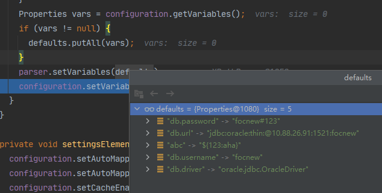
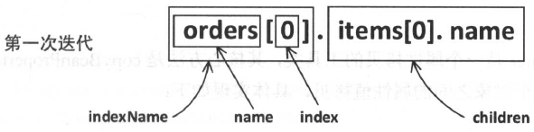
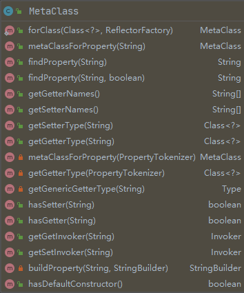

## parseConfiguration()

```java
private void parseConfiguration(XNode root) {
    try {
        // issue #117 read properties first
        propertiesElement(root.evalNode("properties"));
        Properties settings = settingsAsProperties(root.evalNode("settings"));
        loadCustomVfs(settings);
        typeAliasesElement(root.evalNode("typeAliases"));
        pluginElement(root.evalNode("plugins"));
        objectFactoryElement(root.evalNode("objectFactory"));
        objectWrapperFactoryElement(root.evalNode("objectWrapperFactory"));
        reflectorFactoryElement(root.evalNode("reflectorFactory"));
        settingsElement(settings);
        // read it after objectFactory and objectWrapperFactory issue #631
        environmentsElement(root.evalNode("environments"));
        databaseIdProviderElement(root.evalNode("databaseIdProvider"));
        typeHandlerElement(root.evalNode("typeHandlers"));
        mapperElement(root.evalNode("mappers"));
    } catch (Exception e) {
        throw new BuilderException("Error parsing SQL Mapper Configuration. Cause: " + e, e);
    }
}
```

`parseConfiguration()` 方法的作用就是解析 `/configuration` 标签下的十一个标签。


### properties

```java
private void propertiesElement(XNode context) throws Exception {
    if (context != null) {
        // 获得子节点的属性值，形成键值对形式，子节点就是 property 标签
        // <property name="abc" value="123"/>
        Properties defaults = context.getChildrenAsProperties();
        // 加载 properties 标签上 resource 属性对应的值
        String resource = context.getStringAttribute("resource");
        // 加载 properties 标签上 url 属性对应的值
        String url = context.getStringAttribute("url");
        // resource 和 url 只允许同时出现一个
        if (resource != null && url != null) {
            throw new BuilderException("...");
        }
        // 把 resource 或 url 指定的外部链接的配置加载进来
        if (resource != null) {
            defaults.putAll(Resources.getResourceAsProperties(resource));
        } else if (url != null) {
            defaults.putAll(Resources.getUrlAsProperties(url));
        }
        // 需要先获得默认的 Properties 是因为 SqlSessionFactory 的 build 方法有可以传入 Properties 的重载形式
        // public SqlSessionFactory build(Reader reader, Properties properties);
        Properties vars = configuration.getVariables();
        if (vars != null) {
            defaults.putAll(vars);
        }
        parser.setVariables(defaults);
        configuration.setVariables(defaults);
    }
}

public Properties getChildrenAsProperties() {
    Properties properties = new Properties();
    for (XNode child : getChildren()) {
        String name = child.getStringAttribute("name");
        String value = child.getStringAttribute("value");
        if (name != null && value != null) {
            properties.setProperty(name, value);
        }
    }
    return properties;
}
```

properties 节点的加载比较简单，我们不再继续叙述。我们需要注意的是，在加载的过程中是不进行解析的，比如在property中使用了 `${}` 表达式，加载之后也只会把表达式加载进来。如下面的配置文件和图所示。

```xml
<properties resource="db.properties">
    <property name="abc" value="${123:aha}"/>
</properties>
```

<div align="center"></div>


### settings

```java
private final ReflectorFactory localReflectorFactory = new DefaultReflectorFactory();

private Properties settingsAsProperties(XNode context) {
    if (context == null) {
        return new Properties();
    }
    Properties props = context.getChildrenAsProperties();
    // Check that all settings are known to the configuration class
    MetaClass metaConfig = MetaClass.forClass(Configuration.class, localReflectorFactory);
    for (Object key : props.keySet()) {
        if (!metaConfig.hasSetter(String.valueOf(key))) {
            throw new BuilderException("The setting " + key + " is not known.  Make sure you spelled it correctly (case sensitive).");
        }
    }
    return props;
}

private void settingsElement(Properties props) throws Exception {
    configuration.setAutoMappingBehavior(AutoMappingBehavior.valueOf(props.getProperty("autoMappingBehavior", "PARTIAL")));
    configuration.setAutoMappingUnknownColumnBehavior(AutoMappingUnknownColumnBehavior.valueOf(props.getProperty("autoMappingUnknownColumnBehavior", "NONE")));
    configuration.setCacheEnabled(booleanValueOf(props.getProperty("cacheEnabled"), true));
    configuration.setProxyFactory((ProxyFactory) createInstance(props.getProperty("proxyFactory")));
    configuration.setLazyLoadingEnabled(booleanValueOf(props.getProperty("lazyLoadingEnabled"), false));
    configuration.setAggressiveLazyLoading(booleanValueOf(props.getProperty("aggressiveLazyLoading"), false));
    configuration.setMultipleResultSetsEnabled(booleanValueOf(props.getProperty("multipleResultSetsEnabled"), true));
    configuration.setUseColumnLabel(booleanValueOf(props.getProperty("useColumnLabel"), true));
    configuration.setUseGeneratedKeys(booleanValueOf(props.getProperty("useGeneratedKeys"), false));
    configuration.setDefaultExecutorType(ExecutorType.valueOf(props.getProperty("defaultExecutorType", "SIMPLE")));
    configuration.setDefaultStatementTimeout(integerValueOf(props.getProperty("defaultStatementTimeout"), null));
    configuration.setDefaultFetchSize(integerValueOf(props.getProperty("defaultFetchSize"), null));
    configuration.setMapUnderscoreToCamelCase(booleanValueOf(props.getProperty("mapUnderscoreToCamelCase"), false));
    configuration.setSafeRowBoundsEnabled(booleanValueOf(props.getProperty("safeRowBoundsEnabled"), false));
    configuration.setLocalCacheScope(LocalCacheScope.valueOf(props.getProperty("localCacheScope", "SESSION")));
    configuration.setJdbcTypeForNull(JdbcType.valueOf(props.getProperty("jdbcTypeForNull", "OTHER")));
    configuration.setLazyLoadTriggerMethods(stringSetValueOf(props.getProperty("lazyLoadTriggerMethods"), "equals,clone,hashCode,toString"));
    configuration.setSafeResultHandlerEnabled(booleanValueOf(props.getProperty("safeResultHandlerEnabled"), true));
    configuration.setDefaultScriptingLanguage(resolveClass(props.getProperty("defaultScriptingLanguage")));
    @SuppressWarnings("unchecked")
    Class<? extends TypeHandler> typeHandler = (Class<? extends TypeHandler>)resolveClass(props.getProperty("defaultEnumTypeHandler"));
    configuration.setDefaultEnumTypeHandler(typeHandler);
    configuration.setCallSettersOnNulls(booleanValueOf(props.getProperty("callSettersOnNulls"), false));
    configuration.setUseActualParamName(booleanValueOf(props.getProperty("useActualParamName"), true));
    configuration.setReturnInstanceForEmptyRow(booleanValueOf(props.getProperty("returnInstanceForEmptyRow"), false));
    configuration.setLogPrefix(props.getProperty("logPrefix"));
    @SuppressWarnings("unchecked")
    Class<? extends Log> logImpl = (Class<? extends Log>)resolveClass(props.getProperty("logImpl"));
    configuration.setLogImpl(logImpl);
    configuration.setConfigurationFactory(resolveClass(props.getProperty("configurationFactory")));
}
```

settings是整个配置中最繁杂的配置，我们只介绍其中常用的一些属性。实际上我也只明白常用的属性。在解释这个标签之前，还是先解释一些基础类。

#### 属性工具类

属性工具类一共有三个，`PropertyNamer`、`PropertyCopier` 和 `PropertyTokenizer`。

```java
public final class PropertyNamer {
    private PropertyNamer() {
    }
    
    // 由方法名得到属性名
    public static String methodToProperty(String name) {
        if (name.startsWith("is")) {
            name = name.substring(2);
        } else if (name.startsWith("get") || name.startsWith("set")) {
            name = name.substring(3);
        } else {
            throw new ReflectionException("Error parsing property name '" + 
                                          name + "'.  Didn't start with 'is', 'get' or 'set'.");
        }
        if (name.length() == 1 || (name.length() > 1 && !Character.isUpperCase(name.charAt(1)))) {
            name = name.substring(0, 1).toLowerCase(Locale.ENGLISH) + name.substring(1);
        }
        return name;
    }
    public static boolean isProperty(String name) {
        return name.startsWith("get") || name.startsWith("set") || name.startsWith("is");
    }
    public static boolean isGetter(String name) {
        return name.startsWith("get") || name.startsWith("is");
    }
    public static boolean isSetter(String name) {
        return name.startsWith("set");
    }
}
```

```java
public final class PropertyCopier {
    private PropertyCopier() {
    }

    // 属性拷贝
    public static void copyBeanProperties(Class<?> type, Object sourceBean, Object destinationBean) {
        Class<?> parent = type;
        while (parent != null) {
            final Field[] fields = parent.getDeclaredFields();
            for(Field field : fields) {
                try {
                    field.setAccessible(true);
                    field.set(destinationBean, field.get(sourceBean));
                } catch (Exception e) {
                    // Nothing useful to do, will only fail on final fields, which will be ignored.
                }
            }
            parent = parent.getSuperclass();
        }
    }
}
```

这两个比较简单，就不在赘述。我们主要看看 `PropertyTokenizer`。

```java
public class PropertyTokenizer implements Iterator<PropertyTokenizer> {
    private String name;
    private final String indexedName;
    private String index;
    private final String children;

    public PropertyTokenizer(String fullname) {
        int delim = fullname.indexOf('.');
        if (delim > -1) {
            name = fullname.substring(0, delim);
            children = fullname.substring(delim + 1);
        } else {
            name = fullname;
            children = null;
        }
        indexedName = name;
        delim = name.indexOf('[');
        if (delim > -1) {
            index = name.substring(delim + 1, name.length() - 1);
            name = name.substring(0, delim);
        }
    }
    public String getName() {
        return name;
    }
    public String getIndex() {
        return index;
    }
    public String getIndexedName() {
        return indexedName;
    }
    public String getChildren() {
        return children;
    }
    @Override
    public boolean hasNext() {
        return children != null;
    }
    @Override
    public PropertyTokenizer next() {
        return new PropertyTokenizer(children);
    }
    @Override
    public void remove() {
        throw new UnsupportedOperationException("Remove is not supported ...");
    }
}
```

这个类是一个分词器，主要的作用是解析集合或者Map元素的String表达形式。下面是一个测试的Demo。

```java
public class TestPropertyTokenizer {
    public static void main(String[] args) {
        PropertyTokenizer propertyTokenizer = new PropertyTokenizer("orders[0].item[0].name");
        show(propertyTokenizer);
        show(propertyTokenizer.next());
        show(propertyTokenizer.next().next());
    }
    private static void show(PropertyTokenizer propertyTokenizer) {
        System.out.println(propertyTokenizer.getIndex());
        System.out.println(propertyTokenizer.getIndexedName());
        System.out.println(propertyTokenizer.getName());
        System.out.println(propertyTokenizer.getChildren());
        System.out.println("---------------------------");
    }
}
        /**
         * 0
         * orders[0]
         * orders
         * item[0].name
         * ---------------------------
         * 0
         * item[0]
         * item
         * name
         * ---------------------------
         * null
         * name
         * name
         * null
         * ---------------------------
         */
```

<div align="center"></div>

#### MetaClass

```java
public class MetaClass {
    private final ReflectorFactory reflectorFactory;
    private final Reflector reflector;
}
```

MetaClass 通过应用Reflector和PropertyTokenizer实现了对复杂属性表达式解析的能力。

<div align="center"></div>

我们来看一下它解析属性的实现过程，即 `findProperty()` 方法。

```java
public String findProperty(String name) {
    StringBuilder prop = buildProperty(name, new StringBuilder());
    return prop.length() > 0 ? prop.toString() : null;
}
// 递归调用。
private StringBuilder buildProperty(String name, StringBuilder builder) {
    PropertyTokenizer prop = new PropertyTokenizer(name);
    // 还有下一个的时候就递归
    if (prop.hasNext()) {
        // 如果当前属性找不着，就直接return了
        String propertyName = reflector.findPropertyName(prop.getName());
        if (propertyName != null) {
            builder.append(propertyName);
            builder.append(".");
            MetaClass metaProp = metaClassForProperty(propertyName);
            metaProp.buildProperty(prop.getChildren(), builder);
        }
    } else {
        // 最后一个的时候就不递归了
        String propertyName = reflector.findPropertyName(name);
        if (propertyName != null) {
            builder.append(propertyName);
        }
    }
    return builder;
}
public MetaClass metaClassForProperty(String name) {
    Class<?> propType = reflector.getGetterType(name);
    return MetaClass.forClass(propType, reflectorFactory);
}
public static MetaClass forClass(Class<?> type, ReflectorFactory reflectorFactory) {
    return new MetaClass(type, reflectorFactory);
}
```

从下面的Demo中可以看出来 `findProperty()` 的功能。

```java
public class TestMetaClass {
    public static void main(String[] args) {
        MetaClass metaClass = MetaClass.forClass(Customer.class, new DefaultReflectorFactory());
        System.out.println(metaClass.findProperty("order.name"));
        System.out.println(metaClass.findProperty("order.price"));
        System.out.println(metaClass.findProperty("order.age"));
        System.out.println(metaClass.getSetterType("order.name"));
        System.out.println(metaClass.getSetterType("order.price"));
    }
    class Customer {
        private Order order;
		// getter and setter
    }
    class Order {
        String name;
        Double price;
		// getter and setter
    }
}
    /**
     * order.name
     * order.price
     * order.
     * class java.lang.String
     * class java.lang.Double
     */
```

此类中唯一一个能解析集合的方法：`getGetterType()`。

```java
public Class<?> getGetterType(String name) {
    PropertyTokenizer prop = new PropertyTokenizer(name);
    if (prop.hasNext()) {
        // 由属性构建MetaClass。但是解析出来的不再是集合本身，而是集合里元素的类型
        MetaClass metaProp = metaClassForProperty(prop);
        return metaProp.getGetterType(prop.getChildren());
    }
    // issue #506. Resolve the type inside a Collection Object
    return getGetterType(prop);
}
private MetaClass metaClassForProperty(PropertyTokenizer prop) {
    Class<?> propType = getGetterType(prop);
    return MetaClass.forClass(propType, reflectorFactory);
}
private Class<?> getGetterType(PropertyTokenizer prop) {
    Class<?> type = reflector.getGetterType(prop.getName());
    // 存在index，即使index为""也算是存在
    if (prop.getIndex() != null && Collection.class.isAssignableFrom(type)) {
        // 获得集合本身的类型
        Type returnType = getGenericGetterType(prop.getName());
        if (returnType instanceof ParameterizedType) {
            // 获得集合参数的类型
            Type[] actualTypeArguments = ((ParameterizedType) returnType).getActualTypeArguments();
            if (actualTypeArguments != null && actualTypeArguments.length == 1) {
                returnType = actualTypeArguments[0];
                if (returnType instanceof Class) {
                    type = (Class<?>) returnType;
                } else if (returnType instanceof ParameterizedType) {
                    type = (Class<?>) ((ParameterizedType) returnType).getRawType();
                }
            }
        }
    }
    return type;
}
private Type getGenericGetterType(String propertyName) {
    try {
        Invoker invoker = reflector.getGetInvoker(propertyName);
        if (invoker instanceof MethodInvoker) {
            Field _method = MethodInvoker.class.getDeclaredField("method");
            _method.setAccessible(true);
            Method method = (Method) _method.get(invoker);
            return TypeParameterResolver.resolveReturnType(method, reflector.getType());
        } else if (invoker instanceof GetFieldInvoker) {
            Field _field = GetFieldInvoker.class.getDeclaredField("field");
            _field.setAccessible(true);
            Field field = (Field) _field.get(invoker);
            return TypeParameterResolver.resolveFieldType(field, reflector.getType());
        }
    } catch (NoSuchFieldException e) {
    } catch (IllegalAccessException e) {
    }
    return null;
}
```

看完了MetaClass就可以很容易明白 `settingsAsProperties()` 方法本身是加载并验证这些属性的。

```java
private Properties settingsAsProperties(XNode context) {
    if (context == null) {
        return new Properties();
    }
    Properties props = context.getChildrenAsProperties();
    // Check that all settings are known to the configuration class
    MetaClass metaConfig = MetaClass.forClass(Configuration.class, localReflectorFactory);
    for (Object key : props.keySet()) {
        if (!metaConfig.hasSetter(String.valueOf(key))) {
            throw new BuilderException("The setting " + key + 
                                       " is not known.  Make sure you spelled it correctly (case sensitive).");
        }
    }
    return props;
}
```

真正的解析settings的逻辑在settingsElement()方法里。

```java
private void settingsElement(Properties props) throws Exception {
    // 不使用自动映射，对于实际开发的帮助不大，因为一旦出现问题很难排查
    configuration.setAutoMappingBehavior(
        AutoMappingBehavior.valueOf(props.getProperty("autoMappingBehavior", "PARTIAL")));
    configuration.setAutoMappingUnknownColumnBehavior(
        AutoMappingUnknownColumnBehavior.valueOf(props.getProperty("autoMappingUnknownColumnBehavior", "NONE")));
    
    // cache 默认的开启的，关于cache会单独讲
    configuration.setCacheEnabled(booleanValueOf(props.getProperty("cacheEnabled"), true));
    
    // 动态代理的工厂类，有 CGLIB 和 JAVASSIST 两种，3.3版本以上默认是JAVASSIST。实际开发中无用
    configuration.setProxyFactory((ProxyFactory) createInstance(props.getProperty("proxyFactory")));
    
    // 延迟加载对象，实际开发中无用
    configuration.setLazyLoadingEnabled(booleanValueOf(props.getProperty("lazyLoadingEnabled"), false));
    
    // 延迟加载属性，实际开发中无用
    configuration.setAggressiveLazyLoading(booleanValueOf(props.getProperty("aggressiveLazyLoading"), false));
    
    // 允许单语句返回多结果集，需要数据库驱动的支持。我暂时还没遇到
    configuration.setMultipleResultSetsEnabled(booleanValueOf(props.getProperty("multipleResultSetsEnabled"), true));
    
    // 允许使用列标签代替列名，比如select NAME as SNAME from STUDENT; 中的SNAME是列标签，NAME是列名
    configuration.setUseColumnLabel(booleanValueOf(props.getProperty("useColumnLabel"), true));
    
    // 允许 JDBC 支持自动生成主键。如果设置为 true，将强制使用自动生成主键。所以一般不开启。
    configuration.setUseGeneratedKeys(booleanValueOf(props.getProperty("useGeneratedKeys"), false));
    
    // 设置默认的执行器，执行器有三种 SIMPLE REUSE BATCH。常用的是 SIMPLE和BATCH。后面会介绍如何使用 BATCH
    configuration.setDefaultExecutorType(ExecutorType.valueOf(props.getProperty("defaultExecutorType", "SIMPLE")));
    
    // 数据库驱动等待数据库响应的秒数
    configuration.setDefaultStatementTimeout(integerValueOf(props.getProperty("defaultStatementTimeout"), null));
    
    // 设置一次从数据库取多少条数据，默认不设置
    configuration.setDefaultFetchSize(integerValueOf(props.getProperty("defaultFetchSize"), null));
    
    // 是否开启驼峰命名自动映射，即从经典数据库列名 A_COLUMN 映射到经典 Java 属性名 aColumn。开不开启取决于自己的项目规范。
    configuration.setMapUnderscoreToCamelCase(booleanValueOf(props.getProperty("mapUnderscoreToCamelCase"), false));
    configuration.setSafeRowBoundsEnabled(booleanValueOf(props.getProperty("safeRowBoundsEnabled"), false));
    configuration.setLocalCacheScope(LocalCacheScope.valueOf(props.getProperty("localCacheScope", "SESSION")));
    configuration.setJdbcTypeForNull(JdbcType.valueOf(props.getProperty("jdbcTypeForNull", "OTHER")));
    
    // 延迟加载的触发方法
    configuration.setLazyLoadTriggerMethods(
        stringSetValueOf(props.getProperty("lazyLoadTriggerMethods"), "equals,clone,hashCode,toString"));
    configuration.setSafeResultHandlerEnabled(booleanValueOf(props.getProperty("safeResultHandlerEnabled"), true));
    configuration.setDefaultScriptingLanguage(resolveClass(props.getProperty("defaultScriptingLanguage")));
    
    // 默认的枚举处理器
    @SuppressWarnings("unchecked")
    Class<? extends TypeHandler> typeHandler = 
        (Class<? extends TypeHandler>)resolveClass(props.getProperty("defaultEnumTypeHandler"));
    configuration.setDefaultEnumTypeHandler(typeHandler);
    configuration.setCallSettersOnNulls(booleanValueOf(props.getProperty("callSettersOnNulls"), false));
    configuration.setUseActualParamName(booleanValueOf(props.getProperty("useActualParamName"), true));
    configuration.setReturnInstanceForEmptyRow(booleanValueOf(props.getProperty("returnInstanceForEmptyRow"), false));
    configuration.setLogPrefix(props.getProperty("logPrefix"));
    @SuppressWarnings("unchecked")
    Class<? extends Log> logImpl = (Class<? extends Log>)resolveClass(props.getProperty("logImpl"));
    configuration.setLogImpl(logImpl);
    configuration.setConfigurationFactory(resolveClass(props.getProperty("configurationFactory")));
}
```

settings的解析非常复杂，但是绝大多数都使用默认设置就可以了，所以我们不花费过多的时间讨论。


### loadCustomVfs

虚拟文件系统的目的是屏蔽真实文件系统的差异。这里其实算不上文件系统，因为Mybatis里的VFS作用是从不同的位置加载文件，比如jar包

XMLConfigBuilder.java

```java
private void loadCustomVfs(Properties props) throws ClassNotFoundException {
    String value = props.getProperty("vfsImpl");
    if (value != null) {
        String[] clazzes = value.split(",");
        for (String clazz : clazzes) {
            if (!clazz.isEmpty()) {
                @SuppressWarnings("unchecked")
                Class<? extends VFS> vfsImpl = (Class<? extends VFS>)Resources.classForName(clazz);
                configuration.setVfsImpl(vfsImpl);
            }
        }
    }
}
```

Configuration.java

```java
public void setVfsImpl(Class<? extends VFS> vfsImpl) {
    if (vfsImpl != null) {
        this.vfsImpl = vfsImpl;
        VFS.addImplClass(this.vfsImpl);
    }
}
```

VFS.java

```java
public static final List<Class<? extends VFS>> USER_IMPLEMENTATIONS = new ArrayList<Class<? extends VFS>>();
public static void addImplClass(Class<? extends VFS> clazz) {
    if (clazz != null) {
        USER_IMPLEMENTATIONS.add(clazz);
    }
}
```


### typeAliasesElement

```java
protected final Configuration configuration;
private void typeAliasesElement(XNode parent) {
    if (parent != null) {
        for (XNode child : parent.getChildren()) {
            if ("package".equals(child.getName())) {
                String typeAliasPackage = child.getStringAttribute("name");
                configuration.getTypeAliasRegistry().registerAliases(typeAliasPackage);
            } else {
                String alias = child.getStringAttribute("alias");
                String type = child.getStringAttribute("type");
                try {
                    Class<?> clazz = Resources.classForName(type);
                    if (alias == null) {
                        typeAliasRegistry.registerAlias(clazz);
                    } else {
                        typeAliasRegistry.registerAlias(alias, clazz);
                    }
                } catch (ClassNotFoundException e) {
                    throw new BuilderException("Error registering typeAlias for '" + alias + "'. Cause: " + e, e);
                }
            }
        }
    }
}
public TypeAliasRegistry getTypeAliasRegistry() {
    return typeAliasRegistry;
}
public void registerAliases(String packageName){
    registerAliases(packageName, Object.class);
}
public void registerAliases(String packageName, Class<?> superType){
    ResolverUtil<Class<?>> resolverUtil = new ResolverUtil<Class<?>>();
    resolverUtil.find(new ResolverUtil.IsA(superType), packageName);
    Set<Class<? extends Class<?>>> typeSet = resolverUtil.getClasses();
    for(Class<?> type : typeSet){
        // Ignore inner classes and interfaces (including package-info.java)
        // Skip also inner classes. See issue #6
        if (!type.isAnonymousClass() && !type.isInterface() && !type.isMemberClass()) {
            registerAlias(type);
        }
    }
}
```


