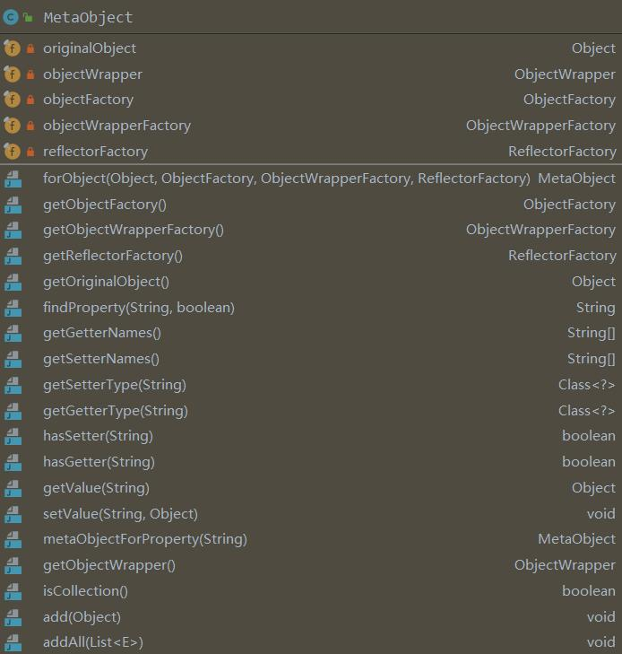
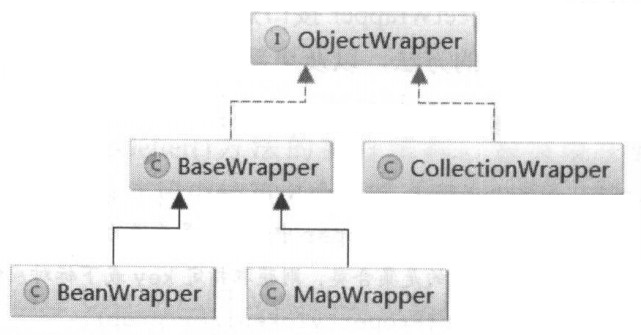
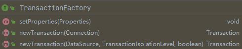
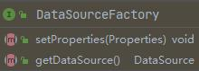
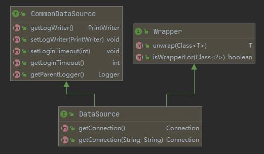
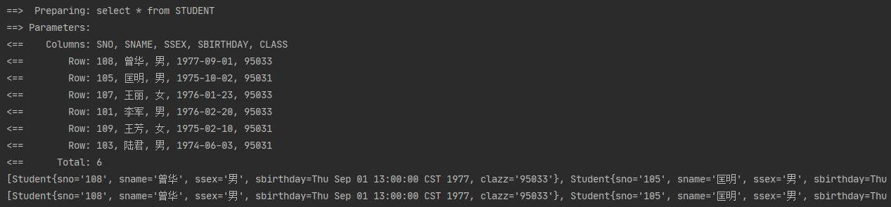

## parseConfiguration

### objectFactoryElement

```java
private void objectFactoryElement(XNode context) throws Exception {
    if (context != null) {
        String type = context.getStringAttribute("type");
        Properties properties = context.getChildrenAsProperties();
        ObjectFactory factory = (ObjectFactory) resolveClass(type).newInstance();
        factory.setProperties(properties);
        configuration.setObjectFactory(factory);
    }
}
```

#### ObjectFactory

当Mybatis想创建一个实体类对象的时候就会使用这个接口，比如 `List<Student> selectAll();`  这个方法对返回值进行封装的时候。

```java
public interface ObjectFactory {
  /**
   * Sets configuration properties.
   * @param properties configuration properties
   */
  void setProperties(Properties properties);
  /**
   * Creates a new object with default constructor. 
   * @param type Object type
   * @return
   */
  <T> T create(Class<T> type);
  /**
   * Creates a new object with the specified constructor and params.
   * @param type Object type
   * @param constructorArgTypes Constructor argument types
   * @param constructorArgs Constructor argument values
   * @return
   */
  <T> T create(Class<T> type, List<Class<?>> constructorArgTypes, List<Object> constructorArgs);
  /**
   * Returns true if this object can have a set of other objects.
   * It's main purpose is to support non-java.util.Collection objects like Scala collections.
   * 
   * @param type Object type
   * @return whether it is a collection or not
   * @since 3.1.0
   */
  <T> boolean isCollection(Class<T> type);
}
```

```java
public class DefaultObjectFactory implements ObjectFactory, Serializable {
  private static final long serialVersionUID = -8855120656740914948L;
  @Override
  public <T> T create(Class<T> type) {
    return create(type, null, null);
  }
  @SuppressWarnings("unchecked")
  @Override
  public <T> T create(Class<T> type, List<Class<?>> constructorArgTypes, List<Object> constructorArgs) {
    Class<?> classToCreate = resolveInterface(type);
    // we know types are assignable
    return (T) instantiateClass(classToCreate, constructorArgTypes, constructorArgs);
  }
  @Override
  public void setProperties(Properties properties) {
    // no props for default
  }
  private  <T> T instantiateClass
      (Class<T> type, List<Class<?>> constructorArgTypes, List<Object> constructorArgs) {
    try {
      Constructor<T> constructor;
      if (constructorArgTypes == null || constructorArgs == null) {
        constructor = type.getDeclaredConstructor();
        if (!constructor.isAccessible()) {
          constructor.setAccessible(true);
        }
        return constructor.newInstance();
      }
      constructor = type.getDeclaredConstructor
          (constructorArgTypes.toArray(new Class[constructorArgTypes.size()]));
      if (!constructor.isAccessible()) {
        constructor.setAccessible(true);
      }
      return constructor.newInstance(constructorArgs.toArray(new Object[constructorArgs.size()]));
    } catch (Exception e) {
      StringBuilder argTypes = new StringBuilder();
      if (constructorArgTypes != null && !constructorArgTypes.isEmpty()) {
        for (Class<?> argType : constructorArgTypes) {
          argTypes.append(argType.getSimpleName());
          argTypes.append(",");
        }
        argTypes.deleteCharAt(argTypes.length() - 1); // remove trailing ,
      }
      StringBuilder argValues = new StringBuilder();
      if (constructorArgs != null && !constructorArgs.isEmpty()) {
        for (Object argValue : constructorArgs) {
          argValues.append(String.valueOf(argValue));
          argValues.append(",");
        }
        argValues.deleteCharAt(argValues.length() - 1); // remove trailing ,
      }
      throw new ReflectionException("Error instantiating " 
       + type + " with invalid types (" + argTypes + ") or values (" + argValues + "). Cause: " + e, e);
    }
  }
  // 从这个方法可以看出来，返回的集合数据的原始类型
  protected Class<?> resolveInterface(Class<?> type) {
    Class<?> classToCreate;
    if (type == List.class || type == Collection.class || type == Iterable.class) {
      classToCreate = ArrayList.class;
    } else if (type == Map.class) {
      classToCreate = HashMap.class;
    } else if (type == SortedSet.class) { // issue #510 Collections Support
      classToCreate = TreeSet.class;
    } else if (type == Set.class) {
      classToCreate = HashSet.class;
    } else {
      classToCreate = type;
    }
    return classToCreate;
  }
  @Override
  public <T> boolean isCollection(Class<T> type) {
    return Collection.class.isAssignableFrom(type);
  }
}
```

`objectFactoryElement()` 方法的目的就是配置 `ObjectFactory`。


### objectWrapperFactoryElement

```java
private void objectWrapperFactoryElement(XNode context) throws Exception {
    if (context != null) {
        String type = context.getStringAttribute("type");
        ObjectWrapperFactory factory = (ObjectWrapperFactory) resolveClass(type).newInstance();
        configuration.setObjectWrapperFactory(factory);
    }
}
```


#### MetaObject

MetaClass 是对类的封装，而 MetaObject 是对对象的封装。

<div align="center"></div>

 ```java
public class TestMetaObject {
    public static void main(String[] args) throws Exception {
        Customer customer = new Customer();
        MetaObject metaObject = MetaObject.forObject(customer, new DefaultObjectFactory(), 
                                new DefaultObjectWrapperFactory(), new DefaultReflectorFactory());
        System.out.println(Arrays.deepToString(metaObject.getGetterNames()));
        System.out.println(metaObject.getValue("order"));
    }
    static class Customer {
        private Order order = new Order();
        private List<Address> addressList;
		// getter and setter
    }
    static class Order {
        String name;
        Double price;
		// getter and setter
    }
    static class Address {
        String name;
        String Postcode;
		// getter and setter
    }
}
 ```

MetaObject的实现中，我们可以看见，几乎所有的方法都被委托给了ObjectWrapper。

```java
public class MetaObject {
    private final Object originalObject;
    private final ObjectWrapper objectWrapper;
    private final ObjectFactory objectFactory;
    private final ObjectWrapperFactory objectWrapperFactory;
    private final ReflectorFactory reflectorFactory;
    private MetaObject(Object object, ObjectFactory objectFactory, 
                       ObjectWrapperFactory objectWrapperFactory, ReflectorFactory reflectorFactory) {
        this.originalObject = object;
        this.objectFactory = objectFactory;
        this.objectWrapperFactory = objectWrapperFactory;
        this.reflectorFactory = reflectorFactory;

        if (object instanceof ObjectWrapper) {
            this.objectWrapper = (ObjectWrapper) object;
        } else if (objectWrapperFactory.hasWrapperFor(object)) {
            this.objectWrapper = objectWrapperFactory.getWrapperFor(this, object);
        } else if (object instanceof Map) {
            this.objectWrapper = new MapWrapper(this, (Map) object);
        } else if (object instanceof Collection) {
            this.objectWrapper = new CollectionWrapper(this, (Collection) object);
        } else {
            this.objectWrapper = new BeanWrapper(this, object);
        }
    }

    public static MetaObject forObject(Object object, ObjectFactory objectFactory, 
                       ObjectWrapperFactory objectWrapperFactory, ReflectorFactory reflectorFactory) {
        if (object == null) {
            return SystemMetaObject.NULL_META_OBJECT;
        } else {
            return new MetaObject(object, objectFactory, objectWrapperFactory, reflectorFactory);
        }
    }
    
	// getter

    public String findProperty(String propName, boolean useCamelCaseMapping) {
        return objectWrapper.findProperty(propName, useCamelCaseMapping);
    }
    public String[] getGetterNames() {
        return objectWrapper.getGetterNames();
    }
    public String[] getSetterNames() {
        return objectWrapper.getSetterNames();
    }
    public Class<?> getSetterType(String name) {
        return objectWrapper.getSetterType(name);
    }
    public Class<?> getGetterType(String name) {
        return objectWrapper.getGetterType(name);
    }
    public boolean hasSetter(String name) {
        return objectWrapper.hasSetter(name);
    }
    public boolean hasGetter(String name) {
        return objectWrapper.hasGetter(name);
    }
    public Object getValue(String name) {
        PropertyTokenizer prop = new PropertyTokenizer(name);
        if (prop.hasNext()) {
            MetaObject metaValue = metaObjectForProperty(prop.getIndexedName());
            if (metaValue == SystemMetaObject.NULL_META_OBJECT) {
                return null;
            } else {
                return metaValue.getValue(prop.getChildren());
            }
        } else {
            return objectWrapper.get(prop);
        }
    }
    public void setValue(String name, Object value) {
        PropertyTokenizer prop = new PropertyTokenizer(name);
        if (prop.hasNext()) {
            MetaObject metaValue = metaObjectForProperty(prop.getIndexedName());
            if (metaValue == SystemMetaObject.NULL_META_OBJECT) {
                if (value == null && prop.getChildren() != null) {
                    // don't instantiate child path if value is null
                    return;
                } else {
                    metaValue = objectWrapper.instantiatePropertyValue(name, prop, objectFactory);
                }
            }
            metaValue.setValue(prop.getChildren(), value);
        } else {
            objectWrapper.set(prop, value);
        }
    }
    public MetaObject metaObjectForProperty(String name) {
        Object value = getValue(name);
        return MetaObject.forObject(value, objectFactory, objectWrapperFactory, reflectorFactory);
    }
    public ObjectWrapper getObjectWrapper() {
        return objectWrapper;
    }
    public boolean isCollection() {
        return objectWrapper.isCollection();
    }
    public void add(Object element) {
        objectWrapper.add(element);
    }
    public <E> void addAll(List<E> list) {
        objectWrapper.addAll(list);
    }
}
```

ObjectWrapper 是一个接口。

```java
public interface ObjectWrapper {
    Object get(PropertyTokenizer prop);
    void set(PropertyTokenizer prop, Object value);
    String findProperty(String name, boolean useCamelCaseMapping);
    String[] getGetterNames();
    String[] getSetterNames();
    Class<?> getSetterType(String name);
    Class<?> getGetterType(String name);
    boolean hasSetter(String name);
    boolean hasGetter(String name);
    MetaObject instantiatePropertyValue
        (String name, PropertyTokenizer prop, ObjectFactory objectFactory);
    boolean isCollection();
    void add(Object element);
    <E> void addAll(List<E> element);
}
```

<div align="center"></div>

MetaObject的作用是完成对实体类对象的包装，包装以后方便传参，以及处理结果。Mybatis给对象分为了两类，一类是集合，另一类包含Bean和Map。集合Wrapper只用在封装返回值的时候使用，所以它不用于传参。我们来写一个MapWrapper的Demo并Debug源码。

```java
public class TestObjectWrapper {
    public static void main(String[] args) {
        Map<String, Customer> stringCustomerMap = new HashMap<>();
        Customer customer = new Customer();
        stringCustomerMap.put("customer", customer);
        MetaObject metaObject = MetaObject.forObject(stringCustomerMap, new DefaultObjectFactory(), 
                                                     new DefaultObjectWrapperFactory(), new DefaultReflectorFactory());
        
        ArrayList<Object> objects = new ArrayList<>(10);
        objects.add("Avbc");

        metaObject.setValue("customer.addressList", objects);
        metaObject.setValue("customer.addressList[0]", new Address("深圳", "123"));

        System.out.println(metaObject.getValue("customer.addressList[0].name"));
    }
    static class Customer {
        private Order order = new Order();
        private List<Address> addressList;
		// getter and setter
    }
    static class Order {
        String name;
        Double price;
		// getter and setter
    }
    static class Address {
        String name;
        String postcode;
        public Address(String name, String postcode) {
            this.name = name;
            this.postcode = postcode;
        }
		// getter and setter
    }
}
```

我们从这句代码开始Debug：`metaObject.setValue("customer.addressList[0]", new Address("深圳", "123"));`。

```java
// MetaObject.java
public void setValue(String name, Object value) {
    PropertyTokenizer prop = new PropertyTokenizer(name);
    // 第一次进来的时候是 indexedName 是 customer，第二次进来的时候是 addressList 
    if (prop.hasNext()) {
        MetaObject metaValue = metaObjectForProperty(prop.getIndexedName());
        if (metaValue == SystemMetaObject.NULL_META_OBJECT) {
            if (value == null) {
                // don't instantiate child path if value is null
                return;	
            } else {
                metaValue = objectWrapper.instantiatePropertyValue(name, prop, objectFactory);
            }
        }
        metaValue.setValue(prop.getChildren(), value);
    } else {
        objectWrapper.set(prop, value);
    }
}
```

```java
// MapWrapper.java
public void set(PropertyTokenizer prop, Object value) {
    if (prop.getIndex() != null) {
        Object collection = resolveCollection(prop, map);
        setCollectionValue(prop, collection, value);
    } else {
        map.put(prop.getName(), value);
    }
}
protected Object resolveCollection(PropertyTokenizer prop, Object object) {
    if ("".equals(prop.getName())) {
        return object;
    } else {
        // metaObject 就是我们在Demo里创建的那个，prop.getName()是addressList
        return metaObject.getValue(prop.getName());
    }
}
protected void setCollectionValue(PropertyTokenizer prop, Object collection, Object value) {
    if (collection instanceof Map) {
        ((Map) collection).put(prop.getIndex(), value);
    } else {
        int i = Integer.parseInt(prop.getIndex());
        if (collection instanceof List) {
            // 这个地方有一点问题，个人觉得最好用add(i, value)
            ((List) collection).set(i, value);
        } else if (collection instanceof Object[]) {
            ((Object[]) collection)[i] = value;
        } else if (collection instanceof char[]) {
            ((char[]) collection)[i] = (Character) value;
        } else if (collection instanceof boolean[]) {
            ((boolean[]) collection)[i] = (Boolean) value;
        } else if (collection instanceof byte[]) {
            ((byte[]) collection)[i] = (Byte) value;
        } else if (collection instanceof double[]) {
            ((double[]) collection)[i] = (Double) value;
        } else if (collection instanceof float[]) {
            ((float[]) collection)[i] = (Float) value;
        } else if (collection instanceof int[]) {
            ((int[]) collection)[i] = (Integer) value;
        } else if (collection instanceof long[]) {
            ((long[]) collection)[i] = (Long) value;
        } else if (collection instanceof short[]) {
            ((short[]) collection)[i] = (Short) value;
        } else {
            throw new ReflectionException("The '" + prop.getName() + 
                                          "' property of " + collection + " is not a List or Array.");
        }
    }
}
```

这个ObjectWrapperFactory的作用和ReflectorFactory差不多，我们可以对其进行缓存，但是没什么太大用，因为很难进行对象的Key的确定，所以对象的缓存不容易实现。默认的ObjectWrapperFactory实现也只是一个空架子。

```java
public interface ObjectWrapperFactory {
  boolean hasWrapperFor(Object object);
  ObjectWrapper getWrapperFor(MetaObject metaObject, Object object);
}
```

```java
public class DefaultObjectWrapperFactory implements ObjectWrapperFactory {
    @Override
    public boolean hasWrapperFor(Object object) {
        return false;
    }
    @Override
    public ObjectWrapper getWrapperFor(MetaObject metaObject, Object object) {
        throw new ReflectionException("The DefaultObjectWrapperFactory should never be called to provide an ObjectWrapper.");
    }
}
```

```java
// MetaObject.java
private MetaObject(Object object, ObjectFactory objectFactory, 
                   ObjectWrapperFactory objectWrapperFactory, ReflectorFactory reflectorFactory) {
    this.originalObject = object;
    this.objectFactory = objectFactory;
    this.objectWrapperFactory = objectWrapperFactory;
    this.reflectorFactory = reflectorFactory;
    if (object instanceof ObjectWrapper) {
        this.objectWrapper = (ObjectWrapper) object;
    } else if (objectWrapperFactory.hasWrapperFor(object)) {
        this.objectWrapper = objectWrapperFactory.getWrapperFor(this, object);
    } else if (object instanceof Map) {
        this.objectWrapper = new MapWrapper(this, (Map) object);
    } else if (object instanceof Collection) {
        this.objectWrapper = new CollectionWrapper(this, (Collection) object);
    } else {
        this.objectWrapper = new BeanWrapper(this, object);
    }
}
```


### reflectorFactoryElement

```java
private void reflectorFactoryElement(XNode context) throws Exception {
    if (context != null) {
        String type = context.getStringAttribute("type");
        ReflectorFactory factory = (ReflectorFactory) resolveClass(type).getDeclaredConstructor().newInstance();
        configuration.setReflectorFactory(factory);
    }
}
```

这个之前介绍的很详细了，不再说了。


### environmentsElement

```java
private void environmentsElement(XNode context) throws Exception {
    if (context != null) {
        if (environment == null) {
            environment = context.getStringAttribute("default");
        }
        for (XNode child : context.getChildren()) {
            String id = child.getStringAttribute("id");
            if (isSpecifiedEnvironment(id)) {
                TransactionFactory txFactory = transactionManagerElement(child.evalNode("transactionManager"));
                DataSourceFactory dsFactory = dataSourceElement(child.evalNode("dataSource"));
                DataSource dataSource = dsFactory.getDataSource();
                Environment.Builder environmentBuilder = new Environment.Builder(id)
                    .transactionFactory(txFactory)
                    .dataSource(dataSource);
                configuration.setEnvironment(environmentBuilder.build());
            }
        }
    }
}
```

#### TransactionFactory

```java
private TransactionFactory transactionManagerElement(XNode context) throws Exception {
    if (context != null) {
        String type = context.getStringAttribute("type");
        Properties props = context.getChildrenAsProperties();
        TransactionFactory factory = (TransactionFactory) resolveClass(type).getDeclaredConstructor().newInstance();
        factory.setProperties(props);
        return factory;
    }
    throw new BuilderException("Environment declaration requires a TransactionFactory.");
}
```

<div align="center"></div>

#### dataSourceElement

```java
private DataSourceFactory dataSourceElement(XNode context) throws Exception {
    if (context != null) {
        String type = context.getStringAttribute("type");
        Properties props = context.getChildrenAsProperties();
        DataSourceFactory factory = (DataSourceFactory) resolveClass(type).getDeclaredConstructor().newInstance();
        factory.setProperties(props);
        return factory;
    }
    throw new BuilderException("Environment declaration requires a DataSourceFactory.");
}
```

<div align="center"></div>

#### DataSource

这个是jdk的类。

<div align="center"></div>

这一块不Debug了，后期在Spring整合Mybatis的时候再看。


### databaseIdProviderElement

```java
private void databaseIdProviderElement(XNode context) throws Exception {
    DatabaseIdProvider databaseIdProvider = null;
    if (context != null) {
        String type = context.getStringAttribute("type");
        // awful patch to keep backward compatibility
        if ("VENDOR".equals(type)) {
            type = "DB_VENDOR";
        }
        Properties properties = context.getChildrenAsProperties();
        databaseIdProvider = (DatabaseIdProvider) resolveClass(type).getDeclaredConstructor().newInstance();
        databaseIdProvider.setProperties(properties);
    }
    Environment environment = configuration.getEnvironment();
    if (environment != null && databaseIdProvider != null) {
        String databaseId = databaseIdProvider.getDatabaseId(environment.getDataSource());
        configuration.setDatabaseId(databaseId);
    }
}
```

这个元素基本用不到，只要了解一下就可以了。

```java
public class MyDatabaseIdProvider implements DatabaseIdProvider {
    private static final Log log = LogFactory.getLog(MyDatabaseIdProvider.class);
    private Properties properties;
    @Override
    public String getDatabaseId(DataSource dataSource) {
        if (dataSource == null) {
            throw new NullPointerException("dataSource cannot be null");
        }
        try {
            return getDatabaseName(dataSource);
        } catch (Exception e) {
            log.error("Could not get a databaseId from dataSource", e);
        }
        return null;
    }
    @Override
    public void setProperties(Properties p) {
        this.properties = p;
    }
    private String getDatabaseName(DataSource dataSource) throws SQLException {
        String productName = getDatabaseProductName(dataSource);
        if (this.properties != null) {
            for (Map.Entry<Object, Object> property : properties.entrySet()) {
                if (productName.contains((String) property.getKey())) {
                    System.out.println("具有别名 " + property.getValue() + " 的数据库被访问了！");
                    return (String) property.getValue();
                }
            }
            // no match, return null
            return null;
        }
        return productName;
    }
    private String getDatabaseProductName(DataSource dataSource) throws SQLException {
        Connection con = null;
        try {
            con = dataSource.getConnection();
            DatabaseMetaData metaData = con.getMetaData();
            return metaData.getDatabaseProductName();
        } finally {
            if (con != null) {
                try {
                    con.close();
                } catch (SQLException e) {
                    // ignored
                }
            }
        }
    }
}
```


### typeHandlerElement

```java
private void typeHandlerElement(XNode parent) {
    if (parent != null) {
        for (XNode child : parent.getChildren()) {
            if ("package".equals(child.getName())) {
                String typeHandlerPackage = child.getStringAttribute("name");
                typeHandlerRegistry.register(typeHandlerPackage);
            } else {
                String javaTypeName = child.getStringAttribute("javaType");
                String jdbcTypeName = child.getStringAttribute("jdbcType");
                String handlerTypeName = child.getStringAttribute("handler");
                Class<?> javaTypeClass = resolveClass(javaTypeName);
                JdbcType jdbcType = resolveJdbcType(jdbcTypeName);
                Class<?> typeHandlerClass = resolveClass(handlerTypeName);
                if (javaTypeClass != null) {
                    if (jdbcType == null) {
                        typeHandlerRegistry.register(javaTypeClass, typeHandlerClass);
                    } else {
                        typeHandlerRegistry.register(javaTypeClass, jdbcType, typeHandlerClass);
                    }
                } else {
                    typeHandlerRegistry.register(typeHandlerClass);
                }
            }
        }
    }
}
```

注册类型处理器。这个逻辑比较简单，就不再多说了。


### mapperElement

```java
private void mapperElement(XNode parent) throws Exception {
    if (parent != null) {
        for (XNode child : parent.getChildren()) {
            if ("package".equals(child.getName())) {
                String mapperPackage = child.getStringAttribute("name");
                configuration.addMappers(mapperPackage);
            } else {
                String resource = child.getStringAttribute("resource");
                String url = child.getStringAttribute("url");
                String mapperClass = child.getStringAttribute("class");
                if (resource != null && url == null && mapperClass == null) {
                    ErrorContext.instance().resource(resource);
                    InputStream inputStream = Resources.getResourceAsStream(resource);
                    XMLMapperBuilder mapperParser = 
                        new XMLMapperBuilder(inputStream, configuration, resource, configuration.getSqlFragments());
                    mapperParser.parse();
                } else if (resource == null && url != null && mapperClass == null) {
                    ErrorContext.instance().resource(url);
                    InputStream inputStream = Resources.getUrlAsStream(url);
                    XMLMapperBuilder mapperParser = 
                        new XMLMapperBuilder(inputStream, configuration, url, configuration.getSqlFragments());
                    mapperParser.parse();
                } else if (resource == null && url == null && mapperClass != null) {
                    Class<?> mapperInterface = Resources.classForName(mapperClass);
                    configuration.addMapper(mapperInterface);
                } else {
                    throw new BuilderException("A mapper element may only specify a url, " 
                                               + "resource or class, but not more than one.");	
                }
            }
        }
    }
}
```

Mapper的配置有三种方式，每个Mapper只能同时使用一种。

```xml
<!-- 使用相对于类路径的资源引用 -->
<mappers>
    <mapper resource="org/mybatis/builder/AuthorMapper.xml"/>
    <mapper resource="org/mybatis/builder/BlogMapper.xml"/>
    <mapper resource="org/mybatis/builder/PostMapper.xml"/>
</mappers>
<!-- 使用完全限定资源定位符（URL） -->
<mappers>
    <mapper url="file:///var/mappers/AuthorMapper.xml"/>
    <mapper url="file:///var/mappers/BlogMapper.xml"/>
    <mapper url="file:///var/mappers/PostMapper.xml"/>
</mappers>
<!-- 使用映射器接口实现类的完全限定类名 -->
<mappers>
    <mapper class="org.mybatis.builder.AuthorMapper"/>
    <mapper class="org.mybatis.builder.BlogMapper"/>
    <mapper class="org.mybatis.builder.PostMapper"/>
</mappers>
```

Mapper的处理是后面的一个重点，这里不再多说。

解析完mappers标签，对mybatis-config.xml的解析也就进行完了。


## Mybatis的Cache

### 一级缓存

```java
public class MybatisBootStrap {
    public static void main(String[] args) {
        String resource = "mybatis-config.xml";
        Reader reader;
        try {
            reader = Resources.getResourceAsReader(resource);
            SqlSessionFactory sqlSessionFactory = new SqlSessionFactoryBuilder().build(reader);
            SqlSession sqlSession = sqlSessionFactory.openSession();    
            try {
				List<Student> objects = sqlSession.selectList("selectAll");
            	System.out.println(objects);
            	List<Student> objects1 = sqlSession.selectList("selectAll");
            	System.out.println(objects1);
            } finally {
                sqlSession.close();
            }
        } catch (IOException e) {
            e.printStackTrace();
        }
    }
}
```

mybatis-config.xml

```xml
<?xml version="1.0" encoding="UTF-8" ?>
<!DOCTYPE configuration
  PUBLIC "-//mybatis.org//DTD Config 3.0//EN"
  "http://mybatis.org/dtd/mybatis-3-config.dtd">
<configuration>
    <properties resource="db.properties" />
    <settings>
        <setting name="logImpl" value="STDOUT_LOGGING" />
        <setting name="mapUnderscoreToCamelCase" value="true"/>
    </settings>
    <environments default="development">
        <environment id="development">
            <transactionManager type="JDBC"/>
            <dataSource type="POOLED">
                <property name="driver" value="${db.driver}"/>
                <property name="url" value="${db.url}"/>
                <property name="username" value="${db.username}"/>
                <property name="password" value="${db.password}"/>
            </dataSource>
        </environment>
    </environments>
    <databaseIdProvider type="basic.MyDatabaseIdProvider">
        <property name="Oracle" value="oracle"/>
        <property name="MySQL" value="mysql"/>
    </databaseIdProvider>
    <mappers>
        <mapper resource="basic\StudentMapper.xml"/>
    </mappers>
</configuration>
```

这段Demo代码只会向数据库发送一次请求，原因就是使用了一级缓存。

<div align="center"></div>

一级缓存的存在范围是SqlSession，我们看看这个是怎么实现的。

Debug可以发现SqlSession的实现类是DefaultSqlSession。

```java
// DefaultSqlSession.java
private final Configuration configuration;
private final Executor executor;
public <E> List<E> selectList(String statement) {
    return this.selectList(statement, null);
}
public <E> List<E> selectList(String statement, Object parameter) {
    return this.selectList(statement, parameter, RowBounds.DEFAULT);
}
public <E> List<E> selectList(String statement, Object parameter, RowBounds rowBounds) {
    try {
        MappedStatement ms = configuration.getMappedStatement(statement);
        return executor.query(ms, wrapCollection(parameter), rowBounds, Executor.NO_RESULT_HANDLER);
    } catch (Exception e) {
        throw ExceptionFactory.wrapException("Error querying database.  Cause: " + e, e);
    } finally {
        ErrorContext.instance().reset();
    }
}
```

可以看到真正执行query的对象是executor对象。

```java
// CachingExecutor.java
public <E> List<E> query(MappedStatement ms, Object parameterObject, RowBounds rowBounds, ResultHandler resultHandler) 
    	throws SQLException {
    BoundSql boundSql = ms.getBoundSql(parameterObject);
    CacheKey key = createCacheKey(ms, parameterObject, rowBounds, boundSql);
    return query(ms, parameterObject, rowBounds, resultHandler, key, boundSql);
}
public CacheKey createCacheKey(MappedStatement ms, Object parameterObject, RowBounds rowBounds, BoundSql boundSql) {
    return delegate.createCacheKey(ms, parameterObject, rowBounds, boundSql);
}
```

`createCacheKey()` 是 `BaseExecutor` 的实现。从代码中可以看出key是由留个部分组成的。

```java
// BaseExecutor.java
public CacheKey createCacheKey(MappedStatement ms, Object parameterObject, RowBounds rowBounds, BoundSql boundSql) {
    if (closed) {
        throw new ExecutorException("Executor was closed.");
    }
    CacheKey cacheKey = new CacheKey();
    // 方法的全限定名
    cacheKey.update(ms.getId());
    // rowBounds的偏移量
    cacheKey.update(rowBounds.getOffset());
    // rowBounds的最大值
    cacheKey.update(rowBounds.getLimit());
    // sql
    cacheKey.update(boundSql.getSql());
    List<ParameterMapping> parameterMappings = boundSql.getParameterMappings();
    TypeHandlerRegistry typeHandlerRegistry = ms.getConfiguration().getTypeHandlerRegistry();
    // mimic DefaultParameterHandler logic
    for (ParameterMapping parameterMapping : parameterMappings) {
        if (parameterMapping.getMode() != ParameterMode.OUT) {
            Object value;
            String propertyName = parameterMapping.getProperty();
            if (boundSql.hasAdditionalParameter(propertyName)) {
                value = boundSql.getAdditionalParameter(propertyName);
            } else if (parameterObject == null) {
                value = null;
            } else if (typeHandlerRegistry.hasTypeHandler(parameterObject.getClass())) {
                value = parameterObject;
            } else {
                MetaObject metaObject = configuration.newMetaObject(parameterObject);
                value = metaObject.getValue(propertyName);
            }
            // 输入参数
            cacheKey.update(value);
        }
    }
    if (configuration.getEnvironment() != null) {
       	// environment的id 
        cacheKey.update(configuration.getEnvironment().getId());
    }
    return cacheKey;
}
```

二级缓存的部分在下一个小节聊，这里直接进行一级缓存。

```java
// CachingExecutor.java
public <E> List<E> query(MappedStatement ms, Object parameterObject, RowBounds rowBounds, 
                         ResultHandler resultHandler, CacheKey key, BoundSql boundSql) throws SQLException {
    Cache cache = ms.getCache();
    if (cache != null) {
        flushCacheIfRequired(ms);
        if (ms.isUseCache() && resultHandler == null) {
            ensureNoOutParams(ms, boundSql);
            @SuppressWarnings("unchecked")
            List<E> list = (List<E>) tcm.getObject(cache, key);
            if (list == null) {
                // 一级缓存
                list = delegate.query(ms, parameterObject, rowBounds, resultHandler, key, boundSql);
                tcm.putObject(cache, key, list); // issue #578 and #116
            }
            return list;
        }
    }
    return delegate.query(ms, parameterObject, rowBounds, resultHandler, key, boundSql);
}
```

BaseExecutor.java

```java
protected PerpetualCache localCache;
public <E> List<E> query(MappedStatement ms, Object parameter, RowBounds rowBounds, 
            ResultHandler resultHandler, CacheKey key, BoundSql boundSql) throws SQLException {
    ErrorContext.instance().resource(ms.getResource()).activity("executing a query").object(ms.getId());
    if (closed) {
        throw new ExecutorException("Executor was closed.");
    }
    if (queryStack == 0 && ms.isFlushCacheRequired()) {
        clearLocalCache();
    }
    List<E> list;
    try {
        queryStack++;
        // 直接获取缓存里的数据
        list = resultHandler == null ? (List<E>) localCache.getObject(key) : null;
        if (list != null) {
            handleLocallyCachedOutputParameters(ms, key, parameter, boundSql);
        } else {
            list = queryFromDatabase(ms, parameter, rowBounds, resultHandler, key, boundSql);
        }
    } finally {
        queryStack--;
    }
    if (queryStack == 0) {
        for (DeferredLoad deferredLoad : deferredLoads) {
            deferredLoad.load();
        }
        // issue #601
        deferredLoads.clear();
        if (configuration.getLocalCacheScope() == LocalCacheScope.STATEMENT) {
            // issue #482
            clearLocalCache();
        }
    }
    return list;
}
```

Cache接口和唯一的真实实现类。可以看到PerpetualCache的缓存就是使用HashMap实现的。

```java
public interface Cache {
    String getId();
    void putObject(Object key, Object value);
    Object getObject(Object key);
    Object removeObject(Object key);
    void clear();
    int getSize();
    default ReadWriteLock getReadWriteLock() {
        return null;
    }
}

public class PerpetualCache implements Cache {
    private final String id;
    private final Map<Object, Object> cache = new HashMap<>();
    public PerpetualCache(String id) {
        this.id = id;
    }
    @Override
    public String getId() {
        return id;
    }
    @Override
    public int getSize() {
        return cache.size();
    }
    @Override
    public void putObject(Object key, Object value) {
        cache.put(key, value);
    }
    @Override
    public Object getObject(Object key) {
        return cache.get(key);
    }
    @Override
    public Object removeObject(Object key) {
        return cache.remove(key);
    }
    @Override
    public void clear() {
        cache.clear();
    }
    @Override
    public boolean equals(Object o) {
        if (getId() == null) {
            throw new CacheException("Cache instances require an ID.");
        }
        if (this == o) {
            return true;
        }
        if (!(o instanceof Cache)) {
            return false;
        }

        Cache otherCache = (Cache) o;
        return getId().equals(otherCache.getId());
    }
    @Override
    public int hashCode() {
        if (getId() == null) {
            throw new CacheException("Cache instances require an ID.");
        }
        return getId().hashCode();
    }
}
```

存放数据进入缓存。

```java
private <E> List<E> queryFromDatabase(MappedStatement ms, Object parameter, 
        RowBounds rowBounds, ResultHandler resultHandler, CacheKey key, BoundSql boundSql) throws SQLException {
    List<E> list;
    // 这是一个占位符，这个操作没看懂
    localCache.putObject(key, EXECUTION_PLACEHOLDER);
    try {
        list = doQuery(ms, parameter, rowBounds, resultHandler, boundSql);
    } finally {
        localCache.removeObject(key);
    }
    localCache.putObject(key, list);
    if (ms.getStatementType() == StatementType.CALLABLE) {
        localOutputParameterCache.putObject(key, parameter);
    }
    return list;
}
```

所有更新数据的方法都会清除缓存

```java
public int update(MappedStatement ms, Object parameter) throws SQLException {
    ErrorContext.instance().resource(ms.getResource()).activity("executing an update").object(ms.getId());
    if (closed) {
        throw new ExecutorException("Executor was closed.");
    }
    // 清除缓存
    clearLocalCache();
    return doUpdate(ms, parameter);
}
```

一级缓存会存在脏数据问题。https://tech.meituan.com/2018/01/19/mybatis-cache.html。


### 二级缓存

一级缓存是强制开启的，但是二级缓存却是可以配置的，默认就是开启的，如果想关闭，可以通过配置mybatis-config.xml实现。一级缓存针对SqlSession，二级缓存针对namespace。二级缓存必须提交才能生效。

```xml
<settings>
    <setting name="cacheEnabled" value="true"/>
</settings>
```

然后需要在Mapper中配置。需要注意的是下面两个标签只能同时存在一个。

```xml
<mapper namespace="basic.StudentMapper">
    <cache-ref namespace="basic.ATeacherMapper"/>
    <cache type="PERPETUAL" eviction="LRU" flushInterval="120000" readOnly="true" size="1024"></cache>
</mapper>
```

解析 `cache` 和 `cache-ref` 标签的代码。

```java
private void cacheRefElement(XNode context) {
    if (context != null) {
        configuration.addCacheRef(builderAssistant.getCurrentNamespace(), context.getStringAttribute("namespace"));
        CacheRefResolver cacheRefResolver = new CacheRefResolver(builderAssistant, context.getStringAttribute("namespace"));
        try {
            cacheRefResolver.resolveCacheRef();
        } catch (IncompleteElementException e) {
            configuration.addIncompleteCacheRef(cacheRefResolver);
        }
    }
}

private void cacheElement(XNode context) {
    if (context != null) {
        String type = context.getStringAttribute("type", "PERPETUAL");
        Class<? extends Cache> typeClass = typeAliasRegistry.resolveAlias(type);
        String eviction = context.getStringAttribute("eviction", "LRU");
        Class<? extends Cache> evictionClass = typeAliasRegistry.resolveAlias(eviction);
        Long flushInterval = context.getLongAttribute("flushInterval");
        Integer size = context.getIntAttribute("size");
        boolean readWrite = !context.getBooleanAttribute("readOnly", false);
        boolean blocking = context.getBooleanAttribute("blocking", false);
        Properties props = context.getChildrenAsProperties();
        builderAssistant.useNewCache(typeClass, 
                                     evictionClass, flushInterval, size, readWrite, blocking, props);
    }
}
```

二级缓存的实现。

```java
// CachingExecutor.java
private final TransactionalCacheManager tcm = new TransactionalCacheManager();
public <E> List<E> query(MappedStatement ms, Object parameterObject, RowBounds rowBounds, 
    	ResultHandler resultHandler, CacheKey key, BoundSql boundSql) throws SQLException {
    Cache cache = ms.getCache();
    if (cache != null) {
        flushCacheIfRequired(ms);
        if (ms.isUseCache() && resultHandler == null) {
            // 为什么需要没有输出参数呢？因为输出参数没有作为cache的key
            ensureNoOutParams(ms, boundSql);
            @SuppressWarnings("unchecked")
            // 从二级缓存中获取数据
            // 使用cache而不使用namespace的原因是可能多个namespace关联一个cache
            List<E> list = (List<E>) tcm.getObject(cache, key);
            if (list == null) {
                // 一级缓存
                // 放数据进入二级缓存
                tcm.putObject(cache, key, list); // issue #578 and #116
            }
            return list;
        }
    }
    return delegate.query(ms, parameterObject, rowBounds, resultHandler, key, boundSql);
}
private void flushCacheIfRequired(MappedStatement ms) {
    // 这个cache就是每一个namespace的cache。多个namespace可以使用同一个cache
    Cache cache = ms.getCache();
    // flushCacheRequired 默认时false， 可以配置：flushCache="true"
    if (cache != null && ms.isFlushCacheRequired()) {
        tcm.clear(cache);
    }
}
```

CachingExecutor对二级缓存的实现就是TransactionalCacheManager。

```java
public class TransactionalCacheManager {
    private final Map<Cache, TransactionalCache> transactionalCaches = new HashMap<>();
    public void clear(Cache cache) {
        getTransactionalCache(cache).clear();
    }
    public Object getObject(Cache cache, CacheKey key) {
        return getTransactionalCache(cache).getObject(key);
    }
    public void putObject(Cache cache, CacheKey key, Object value) {
        getTransactionalCache(cache).putObject(key, value);
    }
    public void commit() {
        for (TransactionalCache txCache : transactionalCaches.values()) {
            txCache.commit();
        }
    }
    public void rollback() {
        for (TransactionalCache txCache : transactionalCaches.values()) {
            txCache.rollback();
        }
    }
    private TransactionalCache getTransactionalCache(Cache cache) {
        TransactionalCache txCache = transactionalCaches.get(cache);
        if (txCache == null) {
            txCache = new TransactionalCache(cache);
            transactionalCaches.put(cache, txCache);
        }
        return txCache;
    }
}
```

```java
public class TransactionalCache implements Cache {
    private static final Log log = LogFactory.getLog(TransactionalCache.class);
    private final Cache delegate;
    private boolean clearOnCommit;
    private final Map<Object, Object> entriesToAddOnCommit;
    private final Set<Object> entriesMissedInCache;
    public TransactionalCache(Cache delegate) {
        this.delegate = delegate;
        this.clearOnCommit = false;
        this.entriesToAddOnCommit = new HashMap<>();
        this.entriesMissedInCache = new HashSet<>();
    }
    @Override
    public String getId() {
        return delegate.getId();
    }
    @Override
    public int getSize() {
        return delegate.getSize();
    }
    @Override
    public Object getObject(Object key) {
        Object object = delegate.getObject(key);
        if (object == null) {
            entriesMissedInCache.add(key);
        }
        if (clearOnCommit) {
            return null;
        } else {
            return object;
        }
    }
    @Override
    public void putObject(Object key, Object object) {
        entriesToAddOnCommit.put(key, object);
    }
    @Override
    public Object removeObject(Object key) {
        return null;
    }
    @Override
    public void clear() {
        clearOnCommit = true;
        entriesToAddOnCommit.clear();
    }
    public void commit() {
        if (clearOnCommit) {
            delegate.clear();
        }
        flushPendingEntries();
        reset();
    }
    public void rollback() {
        unlockMissedEntries();
        reset();
    }
    private void reset() {
        clearOnCommit = false;
        entriesToAddOnCommit.clear();
        entriesMissedInCache.clear();
    }
    private void flushPendingEntries() {
        for (Map.Entry<Object, Object> entry : entriesToAddOnCommit.entrySet()) {
            delegate.putObject(entry.getKey(), entry.getValue());
        }
        for (Object entry : entriesMissedInCache) {
            if (!entriesToAddOnCommit.containsKey(entry)) {
                delegate.putObject(entry, null);
            }
        }
    }
    private void unlockMissedEntries() {
        for (Object entry : entriesMissedInCache) {
            try {
                delegate.removeObject(entry);
            } catch (Exception e) {
                log.warn("Unexpected exception while notifiying a rollback to the cache adapter. "
                         + "Consider upgrading your cache adapter to the latest version. Cause: " + e);
            }
        }
    }
}
```

每一个CachingExecutor都有一个TransactionalCacheManager，每个TransactionalCacheManager都有一个Map<Cache，TransactionalCache>，TransactionalCache是一个Cache装饰器，被装饰的就是Cache。这个Cache，就是Mapper文件里配置的那个，可能是引用的其他Mapper的，也可能是新的。

getObejct()的执行流程。

```java
// CachingExecutor.java
public <E> List<E> query(MappedStatement ms, Object parameterObject, RowBounds rowBounds, 
    	ResultHandler resultHandler, CacheKey key, BoundSql boundSql) throws SQLException {
    Cache cache = ms.getCache();
    if (cache != null) {
        flushCacheIfRequired(ms);
        if (ms.isUseCache() && resultHandler == null) {
            ensureNoOutParams(ms, boundSql);
            @SuppressWarnings("unchecked")
            List<E> list = (List<E>) tcm.getObject(cache, key);
            if (list == null) {
                list = delegate.<E> query(ms, parameterObject, rowBounds, resultHandler, key, boundSql);
                tcm.putObject(cache, key, list); // issue #578 and #116
            }
            return list;
        }
    }
    return delegate.<E> query(ms, parameterObject, rowBounds, resultHandler, key, boundSql);
}
```

```java
// TransactionalCacheManager.java
public Object getObject(Cache cache, CacheKey key) {
    return getTransactionalCache(cache).getObject(key);
}
private TransactionalCache getTransactionalCache(Cache cache) {
    TransactionalCache txCache = transactionalCaches.get(cache);
    if (txCache == null) {
        txCache = new TransactionalCache(cache);
        transactionalCaches.put(cache, txCache);
    }
    return txCache;
}
```

```java
// TransactionalCache.java
public Object getObject(Object key) {
    // delegate就是TransactionalCacheManager里Map的key，也就是Mapper文件里配置的那个
    Object object = delegate.getObject(key);
    if (object == null) {
        entriesMissedInCache.add(key);
    }
    // issue #146
    if (clearOnCommit) {
        return null;
    } else {
        return object;
    }
}
```

putObject()的执行流程。

```java
// TransactionalCache.java
private final Map<Object, Object> entriesToAddOnCommit;
public void putObject(Cache cache, CacheKey key, Object value) {
    getTransactionalCache(cache).putObject(key, value);
}
public void putObject(Object key, Object object) {
    entriesToAddOnCommit.put(key, object);
}
```

提交的执行流程。

```java
// CachingExecutor.java
public void commit(boolean required) throws SQLException {
    delegate.commit(required);
    tcm.commit();
}
```

```java
// TransactionalCacheManager.java
public void commit() {
    for (TransactionalCache txCache : transactionalCaches.values()) {
        txCache.commit();
    }
}
```

```java
// TransactionalCache.java
public void commit() {
    if (clearOnCommit) {
        delegate.clear();
    }
    flushPendingEntries();
    reset();
}
private void flushPendingEntries() {
    for (Map.Entry<Object, Object> entry : entriesToAddOnCommit.entrySet()) {
        delegate.putObject(entry.getKey(), entry.getValue());
    }
    for (Object entry : entriesMissedInCache) {
        if (!entriesToAddOnCommit.containsKey(entry)) {
            delegate.putObject(entry, null);
        }
    }
}
```

当两个线程的SqlSession同时进行操作的时候，不会产生并发问题，因为Mybatis对Cache进行了一层封装。

```java
public class SynchronizedCache implements Cache {
    private final Cache delegate;
    public SynchronizedCache(Cache delegate) {
        this.delegate = delegate;
    }
    @Override
    public String getId() {
        return delegate.getId();
    }
    @Override
    public synchronized int getSize() {
        return delegate.getSize();
    }
    @Override
    public synchronized void putObject(Object key, Object object) {
        delegate.putObject(key, object);
    }
    @Override
    public synchronized Object getObject(Object key) {
        return delegate.getObject(key);
    }
    @Override
    public synchronized Object removeObject(Object key) {
        return delegate.removeObject(key);
    }
    @Override
    public synchronized void clear() {
        delegate.clear();
    }
    @Override
    public int hashCode() {
        return delegate.hashCode();
    }
    @Override
    public boolean equals(Object obj) {
        return delegate.equals(obj);
    }
    @Override
    public ReadWriteLock getReadWriteLock() {
        return null;
    }
}
```

二级缓存必须提交才能生效。

