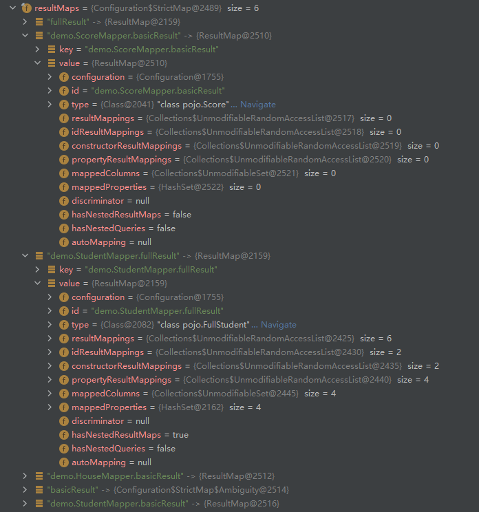
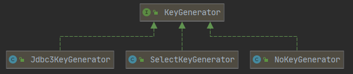

## 解析Mapper

```java
// XMLConfigBuilder.java
private void mapperElement(XNode parent) throws Exception {
    if (parent != null) {
        for (XNode child : parent.getChildren()) {
            if ("package".equals(child.getName())) {
                String mapperPackage = child.getStringAttribute("name");
                configuration.addMappers(mapperPackage);
            } else {
                String resource = child.getStringAttribute("resource");
                String url = child.getStringAttribute("url");
                String mapperClass = child.getStringAttribute("class");
                if (resource != null && url == null && mapperClass == null) {
                    ErrorContext.instance().resource(resource);
                    InputStream inputStream = Resources.getResourceAsStream(resource);
                    XMLMapperBuilder mapperParser = 
                        new XMLMapperBuilder(inputStream, configuration, resource, configuration.getSqlFragments());
                    mapperParser.parse();
                } else if (resource == null && url != null && mapperClass == null) {
                    ErrorContext.instance().resource(url);
                    InputStream inputStream = Resources.getUrlAsStream(url);
                    XMLMapperBuilder mapperParser = 
                        new XMLMapperBuilder(inputStream, configuration, url, configuration.getSqlFragments());
                    mapperParser.parse();
                } else if (resource == null && url == null && mapperClass != null) {
                    Class<?> mapperInterface = Resources.classForName(mapperClass);
                    configuration.addMapper(mapperInterface);
                } else {
                    throw new BuilderException("A mapper element may only specify a url, " 
                                               + "resource or class, but not more than one.");
                }
            }
        }
    }
}
```

在Mapper文件中，最重要的就是resultMap和select|update|insert|delete标签，所以后面的内容主要分析这两部分是如何解析的。由于我们最常用的方式是配置包，所以就从这里开始进行debug。

```java
// Configuration.java
public void addMappers(String packageName) {
    mapperRegistry.addMappers(packageName);
}
```

```java
// MapperRegistry.java
public void addMappers(String packageName) {
    addMappers(packageName, Object.class);
}
// 搜索所有的类，可能某些类并不是我们的Mapper类
public void addMappers(String packageName, Class<?> superType) {
    ResolverUtil<Class<?>> resolverUtil = new ResolverUtil<>();
    resolverUtil.find(new ResolverUtil.IsA(superType), packageName);
    Set<Class<? extends Class<?>>> mapperSet = resolverUtil.getClasses();
    for (Class<?> mapperClass : mapperSet) {
        addMapper(mapperClass);
    }
}
private final Map<Class<?>, MapperProxyFactory<?>> knownMappers = new HashMap<>();
public <T> void addMapper(Class<T> type) {
    // Mapper只能是接口
    if (type.isInterface()) {
        // 每个Mapper只能被绑定一次
        if (hasMapper(type)) {
            throw new BindingException("Type " + type + " is already known to the MapperRegistry.");
        }
        boolean loadCompleted = false;
        try {
            knownMappers.put(type, new MapperProxyFactory<>(type));
            MapperAnnotationBuilder parser = new MapperAnnotationBuilder(config, type);
            // 解析流程
            parser.parse();
            loadCompleted = true;
        } finally {
            if (!loadCompleted) {
                knownMappers.remove(type);
            }
        }
    }
}
```

```java
// MapperAnnotationBuilder.java
public void parse() {
    String resource = type.toString();
    if (!configuration.isResourceLoaded(resource)) {
        // 这里会加载对应的XML文件
        loadXmlResource();
        // 加载过的文件放在Configuration对象中
        configuration.addLoadedResource(resource);
        assistant.setCurrentNamespace(type.getName());
        parseCache();
        parseCacheRef();
        for (Method method : type.getMethods()) {
            if (!canHaveStatement(method)) {
                continue;
            }
            if (getAnnotationWrapper(method, false, Select.class, SelectProvider.class).isPresent()
                && method.getAnnotation(ResultMap.class) == null) {
                parseResultMap(method);
            }
            try {
                parseStatement(method);
            } catch (IncompleteElementException e) {
                configuration.addIncompleteMethod(new MethodResolver(this, method));
            }
        }
    }
    parsePendingMethods();
}
private void loadXmlResource() {
    // Spring may not know the real resource name so we check a flag
    // to prevent loading again a resource twice
    // this flag is set at XMLMapperBuilder#bindMapperForNamespace
    // ？
    if (!configuration.isResourceLoaded("namespace:" + type.getName())) {
        String xmlResource = type.getName().replace('.', '/') + ".xml";
        // #1347
        InputStream inputStream = type.getResourceAsStream("/" + xmlResource);
        if (inputStream == null) {
            // Search XML mapper that is not in the module but in the classpath.
            try {
                inputStream = Resources.getResourceAsStream(type.getClassLoader(), xmlResource);
            } catch (IOException e2) {
                // ignore, resource is not required
            }
        }
        if (inputStream != null) {
            XMLMapperBuilder xmlParser = new XMLMapperBuilder(inputStream, 
            					assistant.getConfiguration(), xmlResource, configuration.getSqlFragments(), type.getName());
            // 解析mybatis-config.xml文件使用的是XMLConfigBuilder类，解析Mapper文件使用的是XMLMapperBuilder类。
            xmlParser.parse();
        }
    }
}
```

解析xml文件

```java
// XMLMapperBuilder.java
public void parse() {
    if (!configuration.isResourceLoaded(resource)) {
        configurationElement(parser.evalNode("/mapper"));
        configuration.addLoadedResource(resource);
        bindMapperForNamespace();
    }

    parsePendingResultMaps();
    parsePendingCacheRefs();
    parsePendingStatements();
}
private void configurationElement(XNode context) {
    try {
        String namespace = context.getStringAttribute("namespace");
        if (namespace == null || namespace.isEmpty()) {
            throw new BuilderException("Mapper's namespace cannot be empty");
        }
        builderAssistant.setCurrentNamespace(namespace);
        cacheRefElement(context.evalNode("cache-ref"));
        cacheElement(context.evalNode("cache"));
        // 这个标签已经被废弃了，所以不再考虑这个标签
        parameterMapElement(context.evalNodes("/mapper/parameterMap"));
        resultMapElements(context.evalNodes("/mapper/resultMap"));
        sqlElement(context.evalNodes("/mapper/sql"));
        buildStatementFromContext(context.evalNodes("select|insert|update|delete"));
    } catch (Exception e) {
        throw new BuilderException("Error parsing Mapper XML. The XML location is '" + resource + "'. Cause: " + e, e);
    }
}
```


### cacheRefElement

```java
// XMLMapperBuilder.java
protected final Configuration configuration;
private void cacheRefElement(XNode context) {
    if (context != null) {
        // 在configuration里添加记录
        configuration.addCacheRef(builderAssistant.getCurrentNamespace(), context.getStringAttribute("namespace"));
        CacheRefResolver cacheRefResolver = new CacheRefResolver(builderAssistant, context.getStringAttribute("namespace"));
        try {
            // 解析当前的CacheRefResolver
            cacheRefResolver.resolveCacheRef();
        } catch (IncompleteElementException e) {
            configuration.addIncompleteCacheRef(cacheRefResolver);
        }
    }
}
```

```java
// Configuration.java
protected final Map<String, String> cacheRefMap = new HashMap<>();
public void addCacheRef(String namespace, String referencedNamespace) {
    // <当前的 namespace, 引用的namespace>
    cacheRefMap.put(namespace, referencedNamespace);
}
```

```java
// CacheRefResolver.java
private final MapperBuilderAssistant assistant;
public CacheRefResolver(MapperBuilderAssistant assistant, String cacheRefNamespace) {
    this.assistant = assistant;
    this.cacheRefNamespace = cacheRefNamespace;
}
public Cache resolveCacheRef() {
    return assistant.useCacheRef(cacheRefNamespace);
}
```

```java
// MapperBuilderAssistant.java
private Cache currentCache;
private boolean unresolvedCacheRef;
public Cache useCacheRef(String namespace) {
    if (namespace == null) {
        throw new BuilderException("cache-ref element requires a namespace attribute.");
    }
    try {
        unresolvedCacheRef = true;
        // 如果未加载到这个namespace的cache，先不处理
        Cache cache = configuration.getCache(namespace);
        if (cache == null) {
            throw new IncompleteElementException("No cache for namespace '" + namespace + "' could be found.");
        }
        // 这个currentCache就是后面用于构建MappedStatement的cache
        currentCache = cache;
        unresolvedCacheRef = false;
        return cache;
    } catch (IllegalArgumentException e) {
        throw new IncompleteElementException("No cache for namespace '" + namespace + "' could be found.", e);
    }
}
```

```java
// MapperBuilderAssistant.java
public MappedStatement addMappedStatement(String id, SqlSource sqlSource, StatementType statementType,
    SqlCommandType sqlCommandType, Integer fetchSize, Integer timeout, String parameterMap, Class<?> parameterType,
    String resultMap, Class<?> resultType, ResultSetType resultSetType, boolean flushCache, boolean useCache,
    boolean resultOrdered, KeyGenerator keyGenerator, String keyProperty, String keyColumn, String databaseId,
    LanguageDriver lang, String resultSets) {
    if (unresolvedCacheRef) {
        throw new IncompleteElementException("Cache-ref not yet resolved");
    }
    
    id = applyCurrentNamespace(id, false);
    boolean isSelect = sqlCommandType == SqlCommandType.SELECT;
    MappedStatement.Builder statementBuilder = new MappedStatement.Builder(configuration, id, sqlSource, sqlCommandType)
        .resource(resource).fetchSize(fetchSize).timeout(timeout).statementType(statementType).keyGenerator(keyGenerator)
        .keyProperty(keyProperty).keyColumn(keyColumn).databaseId(databaseId).lang(lang).resultOrdered(resultOrdered)
        .resultSets(resultSets).resultMaps(getStatementResultMaps(resultMap, resultType, id)).resultSetType(resultSetType)
        .flushCacheRequired(valueOrDefault(flushCache, !isSelect)).useCache(valueOrDefault(useCache, isSelect))
        .cache(currentCache);
    // 上面就是在使用currentCache构建MappedStatement
    ParameterMap statementParameterMap = getStatementParameterMap(parameterMap, parameterType, id);
    if (statementParameterMap != null) {
        statementBuilder.parameterMap(statementParameterMap);
    }
    MappedStatement statement = statementBuilder.build();
    configuration.addMappedStatement(statement);
    return statement;
}
```


### 解析失败的处理

在解析Mapper时，可能无法解析当前的标签，比如在没有cache标签之前就解析对应的cache-ref标签。没有解析完成的标签会放incompleteXxx集合中。在使用xml文件作为配置文件时，会使用到三个未完成集合。incompleteMethods是注解配置时会用到的未完成集合。

```java
protected final Collection<XMLStatementBuilder> incompleteStatements = new LinkedList<>();
protected final Collection<CacheRefResolver> incompleteCacheRefs = new LinkedList<>();
protected final Collection<ResultMapResolver> incompleteResultMaps = new LinkedList<>();
protected final Collection<MethodResolver> incompleteMethods = new LinkedList<>();
```

Mapper解析完成之后会尝试解析所有的未完成集合里的数据。由此完成对全部Mapper的解析。

```java
// XMLMapperBuilder.java
public void parse() {
    if (!configuration.isResourceLoaded(resource)) {
        configurationElement(parser.evalNode("/mapper"));
        configuration.addLoadedResource(resource);
        bindMapperForNamespace();
    }

    parsePendingResultMaps();
    parsePendingCacheRefs();
    parsePendingStatements();
}
```


### cacheElement

```java
private void cacheElement(XNode context) {
    if (context != null) {
        String type = context.getStringAttribute("type", "PERPETUAL");
        Class<? extends Cache> typeClass = typeAliasRegistry.resolveAlias(type);
        String eviction = context.getStringAttribute("eviction", "LRU");
        Class<? extends Cache> evictionClass = typeAliasRegistry.resolveAlias(eviction);
        Long flushInterval = context.getLongAttribute("flushInterval");
        Integer size = context.getIntAttribute("size");
        boolean readWrite = !context.getBooleanAttribute("readOnly", false);
        boolean blocking = context.getBooleanAttribute("blocking", false);
        Properties props = context.getChildrenAsProperties();
        builderAssistant.useNewCache(typeClass, evictionClass, flushInterval, size, readWrite, blocking, props);
    }
}
```

```java
// MapperBuilderAssistant.java
public Cache useNewCache(Class<? extends Cache> typeClass, Class<? extends Cache> evictionClass, Long flushInterval,
		Integer size, boolean readWrite, boolean blocking, Properties props) {
    Cache cache = new CacheBuilder(currentNamespace)
        .implementation(valueOrDefault(typeClass, PerpetualCache.class))
        .addDecorator(valueOrDefault(evictionClass, LruCache.class)).clearInterval(flushInterval)
        .size(size).readWrite(readWrite).blocking(blocking).properties(props).build();
    // 
    configuration.addCache(cache);
    currentCache = cache;
    return cache;
}
```

```java
// Configuration.java
protected final Map<String, Cache> caches = new StrictMap<>("Caches collection");
public void addCache(Cache cache) {
    caches.put(cache.getId(), cache);
}
```

#### StrictMap

```java
protected static class StrictMap<V> extends HashMap<String, V> {
    private static final long serialVersionUID = -4950446264854982944L;
    private final String name;
    private BiFunction<V, V, String> conflictMessageProducer;

    public StrictMap(String name, int initialCapacity, float loadFactor) {
        super(initialCapacity, loadFactor);
        this.name = name;
    }
    public StrictMap(String name, int initialCapacity) {
        super(initialCapacity);
        this.name = name;
    }
    public StrictMap(String name) {
        super();
        this.name = name;
    }
    public StrictMap(String name, Map<String, ? extends V> m) {
        super(m);
        this.name = name;
    }

    /**
     * Assign a function for producing a conflict error message when contains value with the same key.
     * <p>
     * function arguments are 1st is saved value and 2nd is target value.
     * @param conflictMessageProducer A function for producing a conflict error message
     * @return a conflict error message
     * @since 3.5.0
     */
    public StrictMap<V> conflictMessageProducer(BiFunction<V, V, String> conflictMessageProducer) {
        this.conflictMessageProducer = conflictMessageProducer;
        return this;
    }

    @Override
    @SuppressWarnings("unchecked")
    public V put(String key, V value) {
        // 重复会报错
        if (containsKey(key)) {
            throw new IllegalArgumentException(name + " already contains value for " + key + 
            	(conflictMessageProducer == null ? "" : conflictMessageProducer.apply(super.get(key), value)));
        }
        if (key.contains(".")) {
            final String shortKey = getShortName(key);
            if (super.get(shortKey) == null) {
                // <短名，值>
                super.put(shortKey, value);
            } else {
                super.put(shortKey, (V) new Ambiguity(shortKey));
            }
        }
        // <全名，值>
        return super.put(key, value);
    }

    @Override
    public V get(Object key) {
        V value = super.get(key);
        if (value == null) {
            throw new IllegalArgumentException(name + " does not contain value for " + key);
        }
        if (value instanceof Ambiguity) {
            throw new IllegalArgumentException(((Ambiguity) value).getSubject() + " is ambiguous in " + name
            	+ " (try using the full name including the namespace, or rename one of the entries)");
        }
        return value;
    }

    protected static class Ambiguity {
        private final String subject;
        public Ambiguity(String subject) {
            this.subject = subject;
        }
        public String getSubject() {
            return subject;
        }
    }

    private String getShortName(String key) {
        final String[] keyParts = key.split("\\.");
        return keyParts[keyParts.length - 1];
    }
}
```


### sqlElement

```java
private void sqlElement(List<XNode> list) {
    if (configuration.getDatabaseId() != null) {
        sqlElement(list, configuration.getDatabaseId());
    }
    sqlElement(list, null);
}
private void sqlElement(List<XNode> list, String requiredDatabaseId) {
    for (XNode context : list) {
        String databaseId = context.getStringAttribute("databaseId");
        String id = context.getStringAttribute("id");
        id = builderAssistant.applyCurrentNamespace(id, false);
        if (databaseIdMatchesCurrent(id, databaseId, requiredDatabaseId)) {
            // 这个地方会放入一个全名和一个短名，比如testA命名空间下面有一个叫aaa的sql这里会放入
            // <testA.aaa, context> 和 <aaa, context>
            sqlFragments.put(id, context);
        }
    }
}
private boolean databaseIdMatchesCurrent(String id, String databaseId, String requiredDatabaseId) {
    if (requiredDatabaseId != null) {
        return requiredDatabaseId.equals(databaseId);
    }
    if (databaseId != null) {
        return false;
    }
    if (!this.sqlFragments.containsKey(id)) {
        return true;
    }
    // skip this fragment if there is a previous one with a not null databaseId
    XNode context = this.sqlFragments.get(id);
    return context.getStringAttribute("databaseId") == null;
}
```


### Configuration

Configuration是一个rich类。整个Mybatis所有的配置都被放在这个类中，比如之前说到的cache和sql。

```java
protected final Map<String, MappedStatement> mappedStatements = 
    new StrictMap<MappedStatement>("Mapped Statements collection")
    .conflictMessageProducer((savedValue, targetValue) ->
          ". please check " + savedValue.getResource() + " and " + targetValue.getResource());
protected final Map<String, Cache> caches = new StrictMap<>("Caches collection");
protected final Map<String, ResultMap> resultMaps = new StrictMap<>("Result Maps collection");
protected final Map<String, ParameterMap> parameterMaps = new StrictMap<>("Parameter Maps collection");
protected final Map<String, KeyGenerator> keyGenerators = new StrictMap<>("Key Generators collection");

protected final Set<String> loadedResources = new HashSet<>();
protected final Map<String, XNode> sqlFragments = 
    new StrictMap<>("XML fragments parsed from previous mappers");
```


### resultMapElements

下面以几个常用的案例debug对这个标签的解释。这些案例也会用在解析CURD语句和封装结果集等中。

```java
public class Student {
    private String sno;
    private String sname;
    private String ssex;
    private Date sbirthday;
    private String clazz;
}

public class Score {
    private String sno;
    private String cno;
    private String degree;
}

public class House {
    private String houseId;
    private String houseHolder;
    private String houseMember;
}
```

HouseMapper.xml

```xml
<?xml version="1.0" encoding="UTF-8"?>
<!DOCTYPE mapper PUBLIC "-//mybatis.org//DTD Mapper 3.0//EN"
  "http://mybatis.org/dtd/mybatis-3-mapper.dtd">

<mapper namespace="demo.HouseMapper"  >
  <resultMap id="basicResult" type="pojo.House">
    <result property="houseMember" column="SNO" jdbcType="VARCHAR" />
  </resultMap>
</mapper>
```

ScoreMapper.xml

```xml
<?xml version="1.0" encoding="UTF-8"?>
<!DOCTYPE mapper PUBLIC "-//mybatis.org//DTD Mapper 3.0//EN"
  "http://mybatis.org/dtd/mybatis-3-mapper.dtd">

<mapper namespace="demo.ScoreMapper"  >
  <resultMap id="basicResult" type="pojo.Score" />
</mapper>
```

StudentMapper.xml

```xml
<?xml version="1.0" encoding="UTF-8"?>
<!DOCTYPE mapper PUBLIC "-//mybatis.org//DTD Mapper 3.0//EN"
      "http://mybatis.org/dtd/mybatis-3-mapper.dtd">

<mapper namespace="demo.StudentMapper" >

    <cache type="PERPETUAL" eviction="LRU" flushInterval="120000" readOnly="true" size="1024"></cache>

    <resultMap id="basicResult" type="pojo.Student">
        <id column="SNO" property="sno" jdbcType="VARCHAR"></id>
        <result column="CLASS" jdbcType="VARCHAR" property="clazz"></result>
    </resultMap>
    <resultMap id="fullResult" type="pojo.FullStudent" extends="demo.StudentMapper.basicResult">
        <constructor>
            <idArg column="ID" javaType="java.lang.Integer" />
            <arg column="SBIRTHDAY" javaType="java.util.Date" />
        </constructor>
        <!--    <association property="house" javaType="pojo.House" />-->
        <!--    <collection property="scoreList" ofType="pojo.Score"/>-->
        <association property="house"  resultMap="demo.HouseMapper.basicResult" />
        <collection property="scoreList" resultMap="demo.ScoreMapper.basicResult" />
    </resultMap>

    <sql id="columns">
        STUDENT.ID ID,
        STUDENT.SNO SNO,
        STUDENT.SNAME SNAME,
        STUDENT.SSEX SSEX,
        STUDENT.SBIRTHDAY SBIRTHDAY,
        STUDENT.CLASS CLASS,
        SCORE.CNO CNO,
        SCORE.DEGREE DEGREE,
        HOUSE.HOUSE_ID HOUSE_ID,
        HOUSE.HOUSE_HOLDER HOUSE_HOLDER,
        HOUSE.HOUSE_MEMBER HOUSE_MEMBER
    </sql>

    <insert id="insert" useGeneratedKeys="true" keyProperty="id" keyColumn="ID"  databaseId="mysql">
        <!-- select * from STUDENT  -->
        insert into STUDENT(SNO, SNAME, SSEX, SBIRTHDAY, CLASS) values (#{sno}, #{sname}, #{ssex}, #{sbirthday}, #{clazz})
    </insert>
    
    <select id="selectFullStudent" resultMap="fullResult" databaseId="mysql">
        select
        <include refid="columns"></include>
        from STUDENT, SCORE, HOUSE
        <where>
            <if test="sex != null">
                STUDENT.SSEX = #{sex};
            </if>
            and STUDENT.SNO = SCORE.SNO and HOUSE.HOUSE_MEMBER = STUDENT.SNO
        </where>
    </select>
</mapper>
```

StudentMapper.java

```java
public interface StudentMapper {
    Integer insert(Student student);
    List<FullStudent> selectFullStudent(@Param("sex") String sex);
}
```

FullStudent.java

```java
public class FullStudent extends Student {
    private List<Score> scoreList;
    private House house;
    public FullStudent(Integer id, Date sbirthday) {
        super.setId(id + 10000);
        super.setSbirthday(new Date(sbirthday.getTime() + 24 * 60 * 60 * 1000));
        System.out.println("constructor with two argument is called! ");
    }
	// setter and getter
}
```

mybatis-config.xml

```xml
<?xml version="1.0" encoding="UTF-8" ?>
<!DOCTYPE configuration
    PUBLIC "-//mybatis.org//DTD Config 3.0//EN"
    "http://mybatis.org/dtd/mybatis-3-config.dtd">
<configuration>
    <properties resource="db.properties" />
    <settings>
        <!-- 开启二级缓存 -->
        <setting name="cacheEnabled" value="true"/>
        <setting name="logImpl" value="STDOUT_LOGGING" />
        <!-- 开启自动驼峰映射缓存 -->
        <setting name="mapUnderscoreToCamelCase" value="true"/>
        <!-- 开启嵌套自动映射 -->
        <setting name="autoMappingBehavior" value="FULL"/>
    </settings>
    <environments default="development">
        <environment id="development">
            <transactionManager type="JDBC"/>
            <dataSource type="POOLED">
                <property name="driver" value="${db.driver}"/>
                <property name="url" value="${db.url}"/>
                <property name="username" value="${db.username}"/>
                <property name="password" value="${db.password}"/>
            </dataSource>
        </environment>
    </environments>
    <databaseIdProvider type="demo.MyDatabaseIdProvider">
        <property name="Oracle" value="oracle"/>
        <property name="MySQL" value="mysql"/>
    </databaseIdProvider>
    <mappers>
        <mapper resource="demo\HouseMapper.xml"/>
        <mapper resource="demo\ScoreMapper.xml"/>
        <mapper resource="demo\StudentMapper.xml"/>
    </mappers>
</configuration>
```

按照上述的配置，没有incompleteXxx集合，这样方便分析。

```java
// XMLConfigBuilder.java
private void mapperElement(XNode parent) throws Exception {
    if (parent != null) {
        for (XNode child : parent.getChildren()) {
            if ("package".equals(child.getName())) {
                String mapperPackage = child.getStringAttribute("name");
                configuration.addMappers(mapperPackage);
            } else {
                String resource = child.getStringAttribute("resource");
                String url = child.getStringAttribute("url");
                String mapperClass = child.getStringAttribute("class");
                // 此时从这里进来
                if (resource != null && url == null && mapperClass == null) {
                    ErrorContext.instance().resource(resource);
                    InputStream inputStream = Resources.getResourceAsStream(resource);
                    XMLMapperBuilder mapperParser = 
                        new XMLMapperBuilder(inputStream, configuration, resource, 
                                             configuration.getSqlFragments());
                    mapperParser.parse();
                } else if (resource == null && url != null && mapperClass == null) {
                    ErrorContext.instance().resource(url);
                    InputStream inputStream = Resources.getUrlAsStream(url);
                    XMLMapperBuilder mapperParser = 
                        new XMLMapperBuilder(inputStream, configuration, url, 
                                             configuration.getSqlFragments());
                    mapperParser.parse();
                } else if (resource == null && url == null && mapperClass != null) {
                    Class<?> mapperInterface = Resources.classForName(mapperClass);
                    configuration.addMapper(mapperInterface);
                } else {
                    throw new BuilderException("...");
                }
            }
        }
    }
}
```

`XMLConfigBuilder#mapperElement()` 会调用 `XMLMapperBuilder#parse()`。

```java
// XMLMapperBuilder.java
public void parse() {
    if (!configuration.isResourceLoaded(resource)) {
        configurationElement(parser.evalNode("/mapper"));
        configuration.addLoadedResource(resource);
        bindMapperForNamespace();
    }

    parsePendingResultMaps();
    parsePendingCacheRefs();
    parsePendingStatements();
}
private void configurationElement(XNode context) {
    try {
        String namespace = context.getStringAttribute("namespace");
        if (namespace == null || namespace.isEmpty()) {
            throw new BuilderException("Mapper's namespace cannot be empty");
        }
        builderAssistant.setCurrentNamespace(namespace);
        cacheRefElement(context.evalNode("cache-ref"));
        cacheElement(context.evalNode("cache"));
        parameterMapElement(context.evalNodes("/mapper/parameterMap"));
        // 这里是本节分析的核心
        resultMapElements(context.evalNodes("/mapper/resultMap"));
        sqlElement(context.evalNodes("/mapper/sql"));
        buildStatementFromContext(context.evalNodes("select|insert|update|delete"));
    } catch (Exception e) {
        throw new BuilderException("Error parsing Mapper XML. The XML location is '" + resource + "'. Cause: " + e, e);
    }
}
```

#### 保存resultMap的数据结构

每个resultMap标签都会对应一个ResultMap的实例。

```java
public class ResultMap {
    private Configuration configuration;
    private String id;
    private Class<?> type;
    private List<ResultMapping> resultMappings;
    private List<ResultMapping> idResultMappings;
    private List<ResultMapping> constructorResultMappings;
    private List<ResultMapping> propertyResultMappings;
    private Set<String> mappedColumns;
    private Set<String> mappedProperties;
    private Discriminator discriminator;
    private boolean hasNestedResultMaps;
    private boolean hasNestedQueries;
    private Boolean autoMapping;
    private ResultMap() {
    }
}
```

每一个resultMap标签下的constructor、id和result标签都会对应一个ResultMapping的实例。

```java
public class ResultMapping {
    private Configuration configuration;
    private String property;
    private String column;
    private Class<?> javaType;
    private JdbcType jdbcType;
    private TypeHandler<?> typeHandler;
    private String nestedResultMapId;
    private String nestedQueryId;
    private Set<String> notNullColumns;
    private String columnPrefix;
    private List<ResultFlag> flags;
    private List<ResultMapping> composites;
    private String resultSet;
    private String foreignColumn;
    private boolean lazy;
    ResultMapping() {
    }
}
```

#### 解析过程

XMLMapperBuilder.java

```java
private void resultMapElements(List<XNode> list) {
    for (XNode resultMapNode : list) {
        try {
            resultMapElement(resultMapNode);
        } catch (IncompleteElementException e) {
            // ignore, it will be retried
        }
    }
}
private ResultMap resultMapElement(XNode resultMapNode) {
    return resultMapElement(resultMapNode, Collections.emptyList(), null);
}
private ResultMap resultMapElement
    (XNode resultMapNode, List<ResultMapping> additionalResultMappings, Class<?> enclosingType) {
    ErrorContext.instance().activity("processing " + resultMapNode.getValueBasedIdentifier());
    // 找实体类的type
    String type = resultMapNode.getStringAttribute("type",
    				resultMapNode.getStringAttribute("ofType", 
                      resultMapNode.getStringAttribute("resultType", 
                        resultMapNode.getStringAttribute("javaType"))));
    Class<?> typeClass = resolveClass(type);
    if (typeClass == null) {
        typeClass = inheritEnclosingType(resultMapNode, enclosingType);
    }
    Discriminator discriminator = null;
    List<ResultMapping> resultMappings = new ArrayList<>(additionalResultMappings);
    List<XNode> resultChildren = resultMapNode.getChildren();
    for (XNode resultChild : resultChildren) {
        if ("constructor".equals(resultChild.getName())) {
             List<XNode> argChildren = resultChild.getChildren();
    		 for (XNode argChild : argChildren) {
        	 	List<ResultFlag> flags = new ArrayList<>();
             	// ResultFlag是一个枚举，有两个值CONSTRUCTOR和ID
        	 	flags.add(ResultFlag.CONSTRUCTOR);
        	 	if ("idArg".equals(argChild.getName())) {
             		flags.add(ResultFlag.ID);
             	}
             }
        	 resultMappings.add(buildResultMappingFromContext(argChild, typeClass, flags));
        } 
        // 这个实际开发中没用过，所以暂且略过    
        else if ("discriminator".equals(resultChild.getName())) {
            discriminator = processDiscriminatorElement(resultChild, typeClass, resultMappings);
        } else {
            List<ResultFlag> flags = new ArrayList<>();
            if ("id".equals(resultChild.getName())) {
                flags.add(ResultFlag.ID);
            }
            resultMappings.add(buildResultMappingFromContext(resultChild, typeClass, flags));
        }
    }
    String id = resultMapNode.getStringAttribute("id", resultMapNode.getValueBasedIdentifier());
    String extend = resultMapNode.getStringAttribute("extends");
    Boolean autoMapping = resultMapNode.getBooleanAttribute("autoMapping");
    ResultMapResolver resultMapResolver = 
        new ResultMapResolver(builderAssistant, id, typeClass, 
                              extend, discriminator, resultMappings, autoMapping);
    try {
        return resultMapResolver.resolve();
    } catch (IncompleteElementException e) {
        configuration.addIncompleteResultMap(resultMapResolver);
        throw e;
    }
}  
```

从代码中可以看出来，像resultMappings里加入resultMapping的方法是buildResultMappingFromContext，所以下面分析一个这个方法。

```java
private ResultMapping buildResultMappingFromContext(XNode context, Class<?> resultType, List<ResultFlag> flags) {
    String property;
    if (flags.contains(ResultFlag.CONSTRUCTOR)) {
        // 对于构造器标签，我们建议不要使用name，而是使用javaType。如果使用name，需要开启编译时加上方法参数。
        property = context.getStringAttribute("name");
    } else {
        property = context.getStringAttribute("property");
    }
    String column = context.getStringAttribute("column");
    String javaType = context.getStringAttribute("javaType");
    String jdbcType = context.getStringAttribute("jdbcType");
    // 处理嵌套的select
    String nestedSelect = context.getStringAttribute("select");
    // 处理association、collection、case三个标签
    String nestedResultMap = context.getStringAttribute("resultMap", () ->
    							processNestedResultMappings(context, Collections.emptyList(), resultType));
    String notNullColumn = context.getStringAttribute("notNullColumn");
    String columnPrefix = context.getStringAttribute("columnPrefix");
    String typeHandler = context.getStringAttribute("typeHandler");
    String resultSet = context.getStringAttribute("resultSet");
    String foreignColumn = context.getStringAttribute("foreignColumn");
    boolean lazy = "lazy".equals(context.getStringAttribute("fetchType", 
                                configuration.isLazyLoadingEnabled() ? "lazy" : "eager"));
    Class<?> javaTypeClass = resolveClass(javaType);
    Class<? extends TypeHandler<?>> typeHandlerClass = resolveClass(typeHandler);
    JdbcType jdbcTypeEnum = resolveJdbcType(jdbcType);
    // 对ResultMapping的构造使用了建造者模式，MapperBuilderAssistant是用于辅助构建的类。
    // ResultMapping的内部类Builder是用来构建ResultMappingd的建造者类。
    return builderAssistant.buildResultMapping(resultType, property, column, javaTypeClass, jdbcTypeEnum, 
                                               nestedSelect, nestedResultMap, notNullColumn, columnPrefix, 
                                               typeHandlerClass, flags, resultSet, foreignColumn, lazy);
}
private String processNestedResultMappings(XNode context, List<ResultMapping> resultMappings, Class<?> enclosingType) {
    if (Arrays.asList("association", "collection", "case").contains(context.getName())
        	&& context.getStringAttribute("select") == null) {
        validateCollection(context, enclosingType);
        // association、collection实际上就是一个嵌套的resultMap
        ResultMap resultMap = resultMapElement(context, resultMappings, enclosingType);
        return resultMap.getId();
    }
    return null;
}
protected void validateCollection(XNode context, Class<?> enclosingType) {
    if ("collection".equals(context.getName()) && context.getStringAttribute("resultMap") == null
        	&& context.getStringAttribute("javaType") == null) {
        MetaClass metaResultType = MetaClass.forClass(enclosingType, configuration.getReflectorFactory());
        String property = context.getStringAttribute("property");
        if (!metaResultType.hasSetter(property)) {
            throw new BuilderException(
                "Ambiguous collection type for property '" + property + "'. You must specify 'javaType' or 'resultMap'.");
        }
    }
}
```

MapperBuilderAssistant#buildResultMapping用于赋值和解析参数等操作。

```java
public ResultMapping buildResultMapping(Class<?> resultType, String property, String column, Class<?> javaType, 
    	JdbcType jdbcType, String nestedSelect, String nestedResultMap, String notNullColumn, 
        String columnPrefix, Class<? extends TypeHandler<?>> typeHandler, List<ResultFlag> flags, 
        String resultSet, String foreignColumn, boolean lazy) {
    Class<?> javaTypeClass = resolveResultJavaType(resultType, property, javaType);
    TypeHandler<?> typeHandlerInstance = resolveTypeHandler(javaTypeClass, typeHandler);
    List<ResultMapping> composites;
    if ((nestedSelect == null || nestedSelect.isEmpty()) && (foreignColumn == null || foreignColumn.isEmpty())) {
        composites = Collections.emptyList();
    } else {
        composites = parseCompositeColumnName(column);
    }
    return new ResultMapping.Builder(configuration, property, column, javaTypeClass)
        .jdbcType(jdbcType)
        .nestedQueryId(applyCurrentNamespace(nestedSelect, true))
        .nestedResultMapId(applyCurrentNamespace(nestedResultMap, true))
        .resultSet(resultSet)
        .typeHandler(typeHandlerInstance)
        .flags(flags == null ? new ArrayList<>() : flags)
        .composites(composites)
        .notNullColumns(parseMultipleColumnNames(notNullColumn))
        .columnPrefix(columnPrefix)
        .foreignColumn(foreignColumn)
        .lazy(lazy)
        .build();
}
private Class<?> resolveResultJavaType(Class<?> resultType, String property, Class<?> javaType) {
    if (javaType == null && property != null) {
        try {
            MetaClass metaResultType = MetaClass.forClass(resultType, configuration.getReflectorFactory());
            javaType = metaResultType.getSetterType(property);
        } catch (Exception e) {
            // ignore, following null check statement will deal with the situation
        }
    }
    if (javaType == null) {
        javaType = Object.class;
    }
    return javaType;
}
protected final TypeHandlerRegistry typeHandlerRegistry;
protected TypeHandler<?> resolveTypeHandler(Class<?> javaType, Class<? extends TypeHandler<?>> typeHandlerType) {
    if (typeHandlerType == null) {
        return null;
    }
    // javaType ignored for injected handlers see issue #746 for full detail
    TypeHandler<?> handler = typeHandlerRegistry.getMappingTypeHandler(typeHandlerType);
    if (handler == null) {
        // not in registry, create a new one
        handler = typeHandlerRegistry.getInstance(javaType, typeHandlerType);
    }
    return handler;
}
private List<ResultMapping> parseCompositeColumnName(String columnName) {
    List<ResultMapping> composites = new ArrayList<>();
    if (columnName != null && (columnName.indexOf('=') > -1 || columnName.indexOf(',') > -1)) {
        StringTokenizer parser = new StringTokenizer(columnName, "{}=, ", false);
        while (parser.hasMoreTokens()) {
            String property = parser.nextToken();
            String column = parser.nextToken();
            ResultMapping complexResultMapping = new ResultMapping.Builder(
                configuration, property, column, configuration.getTypeHandlerRegistry().getUnknownTypeHandler()).build();
            composites.add(complexResultMapping);
        }
    }
    return composites;
}
```

ResultMapping.Builder类中有很多用于赋值的方法。

```java
// ResultMapping.Result
public Builder javaType(Class<?> javaType) {
    resultMapping.javaType = javaType;
    return this;
}
public Builder jdbcType(JdbcType jdbcType) {
    resultMapping.jdbcType = jdbcType;
    return this;
}
```

最后的build方法做了一下数据的验证。

```java
public ResultMapping build() {
    // lock down collections
    resultMapping.flags = Collections.unmodifiableList(resultMapping.flags);
    resultMapping.composites = Collections.unmodifiableList(resultMapping.composites);
    resolveTypeHandler();
    validate();
    return resultMapping;
}
private void resolveTypeHandler() {
    if (resultMapping.typeHandler == null && resultMapping.javaType != null) {
        Configuration configuration = resultMapping.configuration;
        TypeHandlerRegistry typeHandlerRegistry = configuration.getTypeHandlerRegistry();
        resultMapping.typeHandler = typeHandlerRegistry.getTypeHandler(resultMapping.javaType, resultMapping.jdbcType);
    }
}
private void validate() {
    // Issue #697: cannot define both nestedQueryId and nestedResultMapId
    if (resultMapping.nestedQueryId != null && resultMapping.nestedResultMapId != null) {
        throw new IllegalStateException("Cannot define both nestedQueryId and nestedResultMapId in property " + 
                                        resultMapping.property);
    }
    // Issue #5: there should be no mappings without typehandler
    if (resultMapping.nestedQueryId == null && resultMapping.nestedResultMapId == null
        	&& resultMapping.typeHandler == null) {
        throw new IllegalStateException("No typehandler found for property " + resultMapping.property);
    }
    // Issue #4 and GH #39: column is optional only in nested resultmaps but not in the rest
    if (resultMapping.nestedResultMapId == null && resultMapping.column == null && resultMapping.composites.isEmpty()) {
        throw new IllegalStateException("Mapping is missing column attribute for property " + resultMapping.property);
    }
    if (resultMapping.getResultSet() != null) {
        int numColumns = 0;
        if (resultMapping.column != null) {
            numColumns = resultMapping.column.split(",").length;
        }
        int numForeignColumns = 0;
        if (resultMapping.foreignColumn != null) {
            numForeignColumns = resultMapping.foreignColumn.split(",").length;
        }
        if (numColumns != numForeignColumns) {
            throw new IllegalStateException("...");
        }
    }
}
```

`buildResultMappingFromContext()` 运行完成后，就会将resultMappin放到resultMappings中。

```java
private ResultMap resultMapElement
    (XNode resultMapNode, List<ResultMapping> additionalResultMappings, Class<?> enclosingType) {
    ErrorContext.instance().activity("processing " + resultMapNode.getValueBasedIdentifier());
    // 找实体类的type
    String type = resultMapNode.getStringAttribute("type",
    				resultMapNode.getStringAttribute("ofType", 
                      resultMapNode.getStringAttribute("resultType", 
                        resultMapNode.getStringAttribute("javaType"))));
    Class<?> typeClass = resolveClass(type);
    if (typeClass == null) {
        typeClass = inheritEnclosingType(resultMapNode, enclosingType);
    }
    Discriminator discriminator = null;
    List<ResultMapping> resultMappings = new ArrayList<>(additionalResultMappings);
    List<XNode> resultChildren = resultMapNode.getChildren();
    for (XNode resultChild : resultChildren) {
        if ("constructor".equals(resultChild.getName())) {
             List<XNode> argChildren = resultChild.getChildren();
    		 for (XNode argChild : argChildren) {
        	 	List<ResultFlag> flags = new ArrayList<>();
             	// ResultFlag是一个枚举，有两个值CONSTRUCTOR和ID
        	 	flags.add(ResultFlag.CONSTRUCTOR);
        	 	if ("idArg".equals(argChild.getName())) {
             		flags.add(ResultFlag.ID);
             	}
             }
        	 resultMappings.add(buildResultMappingFromContext(argChild, typeClass, flags));
        } 
        // 这个实际开发中没用过，所以暂且略过    
        else if ("discriminator".equals(resultChild.getName())) {
            discriminator = processDiscriminatorElement(resultChild, typeClass, resultMappings);
        } else {
            List<ResultFlag> flags = new ArrayList<>();
            if ("id".equals(resultChild.getName())) {
                flags.add(ResultFlag.ID);
            }
            resultMappings.add(buildResultMappingFromContext(resultChild, typeClass, flags));
        }
    }
    String id = resultMapNode.getStringAttribute("id", resultMapNode.getValueBasedIdentifier());
    String extend = resultMapNode.getStringAttribute("extends");
    Boolean autoMapping = resultMapNode.getBooleanAttribute("autoMapping");
    ResultMapResolver resultMapResolver = new ResultMapResolver(builderAssistant, id, typeClass, 
                              					extend, discriminator, resultMappings, autoMapping);
    try {
        return resultMapResolver.resolve();
    } catch (IncompleteElementException e) {
        configuration.addIncompleteResultMap(resultMapResolver);
        throw e;
    }
}  
```

```java
// ResultMapResolver
public class ResultMapResolver {
    private final MapperBuilderAssistant assistant;
    private final String id;
    private final Class<?> type;
    private final String extend;
    private final Discriminator discriminator;
    private final List<ResultMapping> resultMappings;
    private final Boolean autoMapping;
    public ResultMapResolver(MapperBuilderAssistant assistant, String id, Class<?> type, 
        	String extend, Discriminator discriminator, List<ResultMapping> resultMappings, Boolean autoMapping) {
        this.assistant = assistant;
        this.id = id;
        this.type = type;
        this.extend = extend;
        this.discriminator = discriminator;
        this.resultMappings = resultMappings;
        this.autoMapping = autoMapping;
    }
    public ResultMap resolve() {
        return assistant.addResultMap(this.id, this.type, this.extend, this.discriminator, 
                                      this.resultMappings, this.autoMapping);
    }
}
```

```java
// MapperBuilderAssistant.java
public ResultMap addResultMap(String id, Class<?> type, String extend, Discriminator discriminator,
    			List<ResultMapping> resultMappings, Boolean autoMapping) {
    id = applyCurrentNamespace(id, false);
    extend = applyCurrentNamespace(extend, true);
	// 处理extend属性
    if (extend != null) {
        if (!configuration.hasResultMap(extend)) {
            throw new IncompleteElementException("Could not find a parent resultmap with id '" + extend + "'");
        }
        ResultMap resultMap = configuration.getResultMap(extend);
        List<ResultMapping> extendedResultMappings = new ArrayList<>(resultMap.getResultMappings());
        extendedResultMappings.removeAll(resultMappings);
        // Remove parent constructor if this resultMap declares a constructor.
        boolean declaresConstructor = false;
        for (ResultMapping resultMapping : resultMappings) {
            if (resultMapping.getFlags().contains(ResultFlag.CONSTRUCTOR)) {
                declaresConstructor = true;
                break;
            }
        }
        if (declaresConstructor) {
            extendedResultMappings.removeIf(resultMapping -> resultMapping.getFlags().contains(ResultFlag.CONSTRUCTOR));
        }
        resultMappings.addAll(extendedResultMappings);
    }
    // 真正构造ResultMap的类
    ResultMap resultMap = new ResultMap.Builder(configuration, id, type, resultMappings, autoMapping)
        .discriminator(discriminator)
        .build();
    // 这里将构造完成的resultMap放到configuration中
    configuration.addResultMap(resultMap);
    return resultMap;
}
```

```java
// ResultMap.Builder
public ResultMap build() {
    if (resultMap.id == null) {
        throw new IllegalArgumentException("ResultMaps must have an id");
    }
    resultMap.mappedColumns = new HashSet<>();
    resultMap.mappedProperties = new HashSet<>();
    resultMap.idResultMappings = new ArrayList<>();
    resultMap.constructorResultMappings = new ArrayList<>();
    resultMap.propertyResultMappings = new ArrayList<>();
    final List<String> constructorArgNames = new ArrayList<>();
    for (ResultMapping resultMapping : resultMap.resultMappings) {
        resultMap.hasNestedQueries = resultMap.hasNestedQueries || resultMapping.getNestedQueryId() != null;
        resultMap.hasNestedResultMaps = resultMap.hasNestedResultMaps || 
            (resultMapping.getNestedResultMapId() != null && resultMapping.getResultSet() == null);
        final String column = resultMapping.getColumn();
        if (column != null) {
            resultMap.mappedColumns.add(column.toUpperCase(Locale.ENGLISH));
        } else if (resultMapping.isCompositeResult()) {
            for (ResultMapping compositeResultMapping : resultMapping.getComposites()) {
                final String compositeColumn = compositeResultMapping.getColumn();
                if (compositeColumn != null) {
                    resultMap.mappedColumns.add(compositeColumn.toUpperCase(Locale.ENGLISH));
                }
            }
        }
        final String property = resultMapping.getProperty();
        if (property != null) {
            resultMap.mappedProperties.add(property);
        }
        if (resultMapping.getFlags().contains(ResultFlag.CONSTRUCTOR)) {
            resultMap.constructorResultMappings.add(resultMapping);
            if (resultMapping.getProperty() != null) {
                constructorArgNames.add(resultMapping.getProperty());
            }
        } else {
            resultMap.propertyResultMappings.add(resultMapping);
        }
        if (resultMapping.getFlags().contains(ResultFlag.ID)) {
            resultMap.idResultMappings.add(resultMapping);
        }
    }
    if (resultMap.idResultMappings.isEmpty()) {
        resultMap.idResultMappings.addAll(resultMap.resultMappings);
    }
    if (!constructorArgNames.isEmpty()) {
        // 使用构造器时一般使用参数类型，不使用参数名称
		// ...
    }
    // lock down collections
    resultMap.resultMappings = Collections.unmodifiableList(resultMap.resultMappings);
    resultMap.idResultMappings = Collections.unmodifiableList(resultMap.idResultMappings);
    resultMap.constructorResultMappings = Collections.unmodifiableList(resultMap.constructorResultMappings);
    resultMap.propertyResultMappings = Collections.unmodifiableList(resultMap.propertyResultMappings);
    resultMap.mappedColumns = Collections.unmodifiableSet(resultMap.mappedColumns);
    return resultMap;
}
```

下图显示了解析完上诉三个Mapper文件后，Configuration里拥有的数据。

<div align="center"></div>


### CURD结点解析

```java
private void configurationElement(XNode context) {
    try {
        String namespace = context.getStringAttribute("namespace");
        if (namespace == null || namespace.isEmpty()) {
            throw new BuilderException("Mapper's namespace cannot be empty");
        }
        builderAssistant.setCurrentNamespace(namespace);
        cacheRefElement(context.evalNode("cache-ref"));
        cacheElement(context.evalNode("cache"));
        parameterMapElement(context.evalNodes("/mapper/parameterMap"));
        resultMapElements(context.evalNodes("/mapper/resultMap"));
        sqlElement(context.evalNodes("/mapper/sql"));
        // 处理CURD
        buildStatementFromContext(context.evalNodes("select|insert|update|delete"));
    } catch (Exception e) {
        throw new BuilderException("Error parsing Mapper XML. The XML location is '" + resource + "'. Cause: " + e, e);
    }
}
private void buildStatementFromContext(List<XNode> list) {
    if (configuration.getDatabaseId() != null) {
        buildStatementFromContext(list, configuration.getDatabaseId());
    }
    buildStatementFromContext(list, null);
}
private void buildStatementFromContext(List<XNode> list, String requiredDatabaseId) {
    for (XNode context : list) {
        // 真正的解析 XMLStatement 的类
        final XMLStatementBuilder statementParser = 
            new XMLStatementBuilder(configuration, builderAssistant, context, requiredDatabaseId);
        try {
            // 解析 XMLStatement 的方法
            statementParser.parseStatementNode();
        } catch (IncompleteElementException e) {
            configuration.addIncompleteStatement(statementParser);
        }
    }
}
```

我们将xml文件的解析分为两类，一类是DELETE|INSERT|UPDATE，一类是SELECT，前者采用INSERT作为代表。

```xml
<!-- StudentMapper.xml -->
<insert id="insert" useGeneratedKeys="true" keyProperty="id" keyColumn="ID"  databaseId="mysql">
    <!-- select * from STUDENT  -->
    insert into STUDENT(SNO, SNAME, SSEX, SBIRTHDAY, CLASS) values (#{sno}, #{sname}, #{ssex}, #{sbirthday}, #{clazz})
</insert>
<!-- StudentMapper.xml -->
<select id="selectFullStudent" resultMap="fullResult" databaseId="mysql">
    select
    <include refid="columns"></include>
    from STUDENT, SCORE, HOUSE
    <where>
        <if test="sex != null">
            STUDENT.SSEX = #{sex};
        </if>
        and STUDENT.SNO = SCORE.SNO and HOUSE.HOUSE_MEMBER = STUDENT.SNO
    </where>
</select>
```

对于这段配置文件，我们需要关注的是处理静态方法的处理套路，解析自增主键，

```java
// XMLStatementBuilder.java
public void parseStatementNode() {
    String id = context.getStringAttribute("id");
    String databaseId = context.getStringAttribute("databaseId");

    // 验证databaseId是否符合当前的Statement
    if (!databaseIdMatchesCurrent(id, databaseId, this.requiredDatabaseId)) {
        return;
    }

    String nodeName = context.getNode().getNodeName();
    SqlCommandType sqlCommandType = SqlCommandType.valueOf(nodeName.toUpperCase(Locale.ENGLISH));
    boolean isSelect = sqlCommandType == SqlCommandType.SELECT;
    boolean flushCache = context.getBooleanAttribute("flushCache", !isSelect);
    boolean useCache = context.getBooleanAttribute("useCache", isSelect);
    boolean resultOrdered = context.getBooleanAttribute("resultOrdered", false);

    // 处理include标签，但是insert标签段中没有include标签，略过
    // 在select标签中，处理之后变成：
    
    /**
     *  <select id="selectFullStudent" resultMap="fullResult" databaseId="mysql">
     *   select
     *       STUDENT.ID ID,
     *  	 STUDENT.SNO SNO,
     *       STUDENT.SNAME SNAME,
     *       STUDENT.SSEX SSEX,
     *       STUDENT.SBIRTHDAY SBIRTHDAY,
     *       STUDENT.CLASS CLASS,
     *       SCORE.CNO CNO,
     *       SCORE.DEGREE DEGREE,
     *       HOUSE.HOUSE_ID HOUSE_ID,
     *       HOUSE.HOUSE_HOLDER HOUSE_HOLDER,
     *       HOUSE.HOUSE_MEMBER HOUSE_MEMBER
     *   from STUDENT, SCORE, HOUSE
     *       <where>
     *         <if test="sex != null">
     *           STUDENT.SSEX = #{sex};
     *         </if>
     *         and STUDENT.SNO = SCORE.SNO and HOUSE.HOUSE_MEMBER = STUDENT.SNO
     *       </where>
     *  </select>
     */
    
    // 底层实现逻辑是寻找到include结点，然后替换为对应的sql结点
    XMLIncludeTransformer includeParser = new XMLIncludeTransformer(configuration, builderAssistant);
    includeParser.applyIncludes(context.getNode());

    String parameterType = context.getStringAttribute("parameterType");
    Class<?> parameterTypeClass = resolveClass(parameterType);
	
    
    // Mybatis是支持自定义语言解析器，
    String lang = context.getStringAttribute("lang");
    LanguageDriver langDriver = getLanguageDriver(lang);

    // 解析 selectKey 结点
    processSelectKeyNodes(id, parameterTypeClass, langDriver);

    // Parse the SQL (pre: <selectKey> and <include> were parsed and removed)
    KeyGenerator keyGenerator;
    String keyStatementId = id + SelectKeyGenerator.SELECT_KEY_SUFFIX;
    keyStatementId = builderAssistant.applyCurrentNamespace(keyStatementId, true);
    if (configuration.hasKeyGenerator(keyStatementId)) {
        keyGenerator = configuration.getKeyGenerator(keyStatementId);
    } else {
        keyGenerator = context.getBooleanAttribute("useGeneratedKeys",
        				configuration.isUseGeneratedKeys() && SqlCommandType.INSERT.equals(sqlCommandType))
            				? Jdbc3KeyGenerator.INSTANCE : NoKeyGenerator.INSTANCE;
    }

    SqlSource sqlSource = langDriver.createSqlSource(configuration, context, parameterTypeClass);
    StatementType statementType = StatementType.valueOf(context.getStringAttribute("statementType", 
                                                        	StatementType.PREPARED.toString()));
    Integer fetchSize = context.getIntAttribute("fetchSize");
    Integer timeout = context.getIntAttribute("timeout");
    String parameterMap = context.getStringAttribute("parameterMap");
    String resultType = context.getStringAttribute("resultType");
    Class<?> resultTypeClass = resolveClass(resultType);
    String resultMap = context.getStringAttribute("resultMap");
    String resultSetType = context.getStringAttribute("resultSetType");
    ResultSetType resultSetTypeEnum = resolveResultSetType(resultSetType);
    if (resultSetTypeEnum == null) {
        resultSetTypeEnum = configuration.getDefaultResultSetType();
    }
    String keyProperty = context.getStringAttribute("keyProperty");
    String keyColumn = context.getStringAttribute("keyColumn");
    String resultSets = context.getStringAttribute("resultSets");

    builderAssistant.addMappedStatement(id, sqlSource, statementType, sqlCommandType,
                                        fetchSize, timeout, parameterMap, parameterTypeClass, resultMap, resultTypeClass,
                                        resultSetTypeEnum, flushCache, useCache, resultOrdered,
                                        keyGenerator, keyProperty, keyColumn, databaseId, langDriver, resultSets);
}
```

#### SqlSource

SqlSource 只有一个目的，就是获取Sql语句。

```java
public interface SqlSource {
    BoundSql getBoundSql(Object parameterObject);
}
```

SqlSource有四个实现类，其中ProviderSqlSource是用于注解方式解析的。这里不再Debug。

<div align="center"></div>


mybatis语言驱动器XMLLanguageDriver。


虽然官方名称叫做LanguageDriver，其实叫做解析器可能更加合理。MyBatis 从 3.2 开始支持可插拔的脚本语言，因此你可以在插入一种语言的驱动（language driver）之后来写基于这种语言的动态 SQL 查询。比如mybatis除了XML格式外，还提供了mybatis-velocity，允许使用velocity表达式编写SQL语句。可以通过实现LanguageDriver接口的方式来插入一种语言：

```java
public interface LanguageDriver {
    ParameterHandler createParameterHandler(MappedStatement mappedStatement, Object parameterObject, BoundSql boundSql);
    SqlSource createSqlSource(Configuration configuration, XNode script, Class<?> parameterType);
    SqlSource createSqlSource(Configuration configuration, String script, Class<?> parameterType);
}
```


#### 解析selectKey结点

```java
// XMLStatementBuilder.java
private void processSelectKeyNodes(String id, Class<?> parameterTypeClass, LanguageDriver langDriver) {
    List<XNode> selectKeyNodes = context.evalNodes("selectKey");
    if (configuration.getDatabaseId() != null) {
        parseSelectKeyNodes(id, selectKeyNodes, parameterTypeClass, langDriver, configuration.getDatabaseId());
    }
    parseSelectKeyNodes(id, selectKeyNodes, parameterTypeClass, langDriver, null);
    removeSelectKeyNodes(selectKeyNodes);
}
private void parseSelectKeyNodes(String parentId, List<XNode> list, 
                                 Class<?> parameterTypeClass, LanguageDriver langDriver, String skRequiredDatabaseId) {
    for (XNode nodeToHandle : list) {
        // public static final String SELECT_KEY_SUFFIX = "!selectKey";
        String id = parentId + SelectKeyGenerator.SELECT_KEY_SUFFIX;
        String databaseId = nodeToHandle.getStringAttribute("databaseId");
        if (databaseIdMatchesCurrent(id, databaseId, skRequiredDatabaseId)) {
            parseSelectKeyNode(id, nodeToHandle, parameterTypeClass, langDriver, databaseId);
        }
    }
}
private void parseSelectKeyNode(String id, XNode nodeToHandle, Class<?> parameterTypeClass,
                                LanguageDriver langDriver, String databaseId) {
    String resultType = nodeToHandle.getStringAttribute("resultType");
    Class<?> resultTypeClass = resolveClass(resultType);
    StatementType statementType = 
        StatementType.valueOf(nodeToHandle.getStringAttribute("statementType", StatementType.PREPARED.toString()));
    String keyProperty = nodeToHandle.getStringAttribute("keyProperty");
    String keyColumn = nodeToHandle.getStringAttribute("keyColumn");
    boolean executeBefore = "BEFORE".equals(nodeToHandle.getStringAttribute("order", "AFTER"));

    // defaults
    boolean useCache = false;
    boolean resultOrdered = false;
    KeyGenerator keyGenerator = NoKeyGenerator.INSTANCE;
    Integer fetchSize = null;
    Integer timeout = null;
    boolean flushCache = false;
    String parameterMap = null;
    String resultMap = null;
    ResultSetType resultSetTypeEnum = null;

    // SelectKey结点本身也是一个 MappedStatement
    SqlSource sqlSource = langDriver.createSqlSource(configuration, nodeToHandle, parameterTypeClass);
    SqlCommandType sqlCommandType = SqlCommandType.SELECT;

    builderAssistant.addMappedStatement(id, sqlSource, statementType, sqlCommandType,
                                        fetchSize, timeout, parameterMap, parameterTypeClass, resultMap, resultTypeClass,
                                        resultSetTypeEnum, flushCache, useCache, resultOrdered,
                                        keyGenerator, keyProperty, keyColumn, databaseId, langDriver, null);

    id = builderAssistant.applyCurrentNamespace(id, false);

    MappedStatement keyStatement = configuration.getMappedStatement(id, false);
    // 将SelectKey结点对应的MappedStatement封装为KeyGenerator
    configuration.addKeyGenerator(id, new SelectKeyGenerator(keyStatement, executeBefore));
}
```

KeyGenerator的类图如下。

<div align="center"></div>

如果配置了useGeneratedKeys，就会使用Jdbc3KeyGenerator。


对curd节点的解析分为四部分，


```xml

```


```java

```


