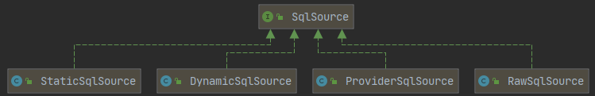
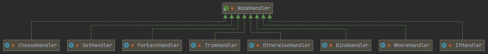
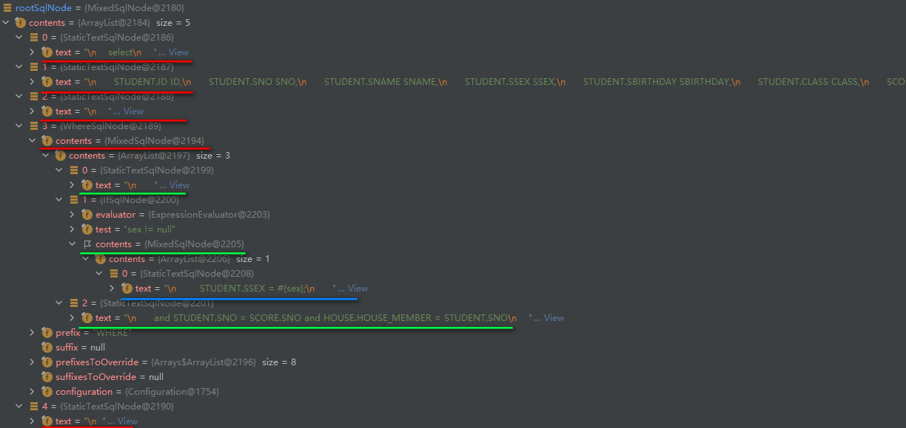
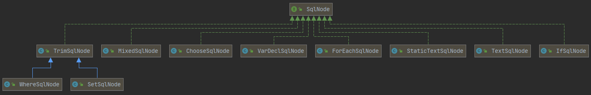
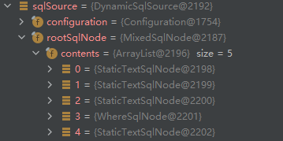
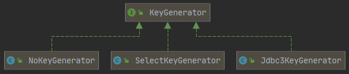
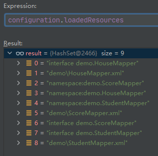
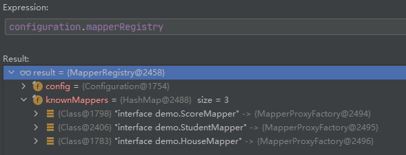

## 解析Mapper

### CURD结点解析

```java
private void configurationElement(XNode context) {
    try {
        String namespace = context.getStringAttribute("namespace");
        if (namespace == null || namespace.isEmpty()) {
            throw new BuilderException("Mapper's namespace cannot be empty");
        }
        builderAssistant.setCurrentNamespace(namespace);
        cacheRefElement(context.evalNode("cache-ref"));
        cacheElement(context.evalNode("cache"));
        parameterMapElement(context.evalNodes("/mapper/parameterMap"));
        resultMapElements(context.evalNodes("/mapper/resultMap"));
        sqlElement(context.evalNodes("/mapper/sql"));
        // 处理CURD
        buildStatementFromContext(context.evalNodes("select|insert|update|delete"));
    } catch (Exception e) {
        throw new BuilderException("Error parsing Mapper XML. The XML location is '" + resource + "'. Cause: " + e, e);
    }
}
private void buildStatementFromContext(List<XNode> list) {
    if (configuration.getDatabaseId() != null) {
        buildStatementFromContext(list, configuration.getDatabaseId());
    }
    buildStatementFromContext(list, null);
}
private void buildStatementFromContext(List<XNode> list, String requiredDatabaseId) {
    for (XNode context : list) {
        // 真正的解析 XMLStatement 的类
        final XMLStatementBuilder statementParser = 
            new XMLStatementBuilder(configuration, builderAssistant, context, requiredDatabaseId);
        try {
            // 解析 XMLStatement 的方法
            statementParser.parseStatementNode();
        } catch (IncompleteElementException e) {
            configuration.addIncompleteStatement(statementParser);
        }
    }
}
```

我们将xml文件的解析分为两类，一类是DELETE|INSERT|UPDATE，一类是SELECT，前者采用INSERT作为代表。

```xml
<!-- StudentMapper.xml -->
<insert id="insert" useGeneratedKeys="true" keyProperty="id" keyColumn="ID"  databaseId="mysql">
    <!-- select * from STUDENT  -->
    insert into STUDENT(SNO, SNAME, SSEX, SBIRTHDAY, CLASS) values (#{sno}, #{sname}, #{ssex}, #{sbirthday}, #{clazz})
</insert>
<!-- StudentMapper.xml -->
<select id="selectFullStudent" resultMap="fullResult" databaseId="mysql">
    select
    <include refid="columns"></include>
    from STUDENT, SCORE, HOUSE
    <where>
        <if test="sex != null">
            STUDENT.SSEX = #{sex};
        </if>
        and STUDENT.SNO = SCORE.SNO and HOUSE.HOUSE_MEMBER = STUDENT.SNO
    </where>
</select>
```

对于这段配置文件，我们需要关注的是处理静态方法的处理套路，解析自增主键，

```java
// XMLStatementBuilder.java
public void parseStatementNode() {
    String id = context.getStringAttribute("id");
    String databaseId = context.getStringAttribute("databaseId");
	
    // 验证databaseId是否符合当前的Statement
    if (!databaseIdMatchesCurrent(id, databaseId, this.requiredDatabaseId)) {
        return;
    }
	
    String nodeName = context.getNode().getNodeName();
    SqlCommandType sqlCommandType = SqlCommandType.valueOf(nodeName.toUpperCase(Locale.ENGLISH));
    boolean isSelect = sqlCommandType == SqlCommandType.SELECT;
    boolean flushCache = context.getBooleanAttribute("flushCache", !isSelect);
    boolean useCache = context.getBooleanAttribute("useCache", isSelect);
    boolean resultOrdered = context.getBooleanAttribute("resultOrdered", false);
	
    // 处理include标签，但是insert标签段中没有include标签，略过
    // 在select标签中，处理之后变成：
    
    /**
     *  <select id="selectFullStudent" resultMap="fullResult" databaseId="mysql">
     *   select
     *       STUDENT.ID ID,
     *  	 STUDENT.SNO SNO,
     *       STUDENT.SNAME SNAME,
     *       STUDENT.SSEX SSEX,
     *       STUDENT.SBIRTHDAY SBIRTHDAY,
     *       STUDENT.CLASS CLASS,
     *       SCORE.CNO CNO,
     *       SCORE.DEGREE DEGREE,
     *       HOUSE.HOUSE_ID HOUSE_ID,
     *       HOUSE.HOUSE_HOLDER HOUSE_HOLDER,
     *       HOUSE.HOUSE_MEMBER HOUSE_MEMBER
     *   from STUDENT, SCORE, HOUSE
     *       <where>
     *         <if test="sex != null">
     *           STUDENT.SSEX = #{sex};
     *         </if>
     *         and STUDENT.SNO = SCORE.SNO and HOUSE.HOUSE_MEMBER = STUDENT.SNO
     *       </where>
     *  </select>
     */
    
    // 底层实现逻辑是寻找到include结点，然后替换为对应的sql结点
    XMLIncludeTransformer includeParser = new XMLIncludeTransformer(configuration, builderAssistant);
    includeParser.applyIncludes(context.getNode());
	
    String parameterType = context.getStringAttribute("parameterType");
    Class<?> parameterTypeClass = resolveClass(parameterType);
	
    
    // Mybatis是支持自定义语言解析器，
    String lang = context.getStringAttribute("lang");
    LanguageDriver langDriver = getLanguageDriver(lang);

    // 解析 selectKey 结点
    processSelectKeyNodes(id, parameterTypeClass, langDriver);

    // Parse the SQL (pre: <selectKey> and <include> were parsed and removed)
    KeyGenerator keyGenerator;
    String keyStatementId = id + SelectKeyGenerator.SELECT_KEY_SUFFIX;
    keyStatementId = builderAssistant.applyCurrentNamespace(keyStatementId, true);
    if (configuration.hasKeyGenerator(keyStatementId)) {
        keyGenerator = configuration.getKeyGenerator(keyStatementId);
    } else {
        keyGenerator = context.getBooleanAttribute("useGeneratedKeys",
        				configuration.isUseGeneratedKeys() && SqlCommandType.INSERT.equals(sqlCommandType))
            				? Jdbc3KeyGenerator.INSTANCE : NoKeyGenerator.INSTANCE;
    }

    SqlSource sqlSource = langDriver.createSqlSource(configuration, context, parameterTypeClass);
    StatementType statementType = StatementType.valueOf(context.getStringAttribute("statementType", 
                                                        	StatementType.PREPARED.toString()));
    Integer fetchSize = context.getIntAttribute("fetchSize");
    Integer timeout = context.getIntAttribute("timeout");
    String parameterMap = context.getStringAttribute("parameterMap");
    String resultType = context.getStringAttribute("resultType");
    Class<?> resultTypeClass = resolveClass(resultType);
    String resultMap = context.getStringAttribute("resultMap");
    String resultSetType = context.getStringAttribute("resultSetType");
    ResultSetType resultSetTypeEnum = resolveResultSetType(resultSetType);
    if (resultSetTypeEnum == null) {
        resultSetTypeEnum = configuration.getDefaultResultSetType();
    }
    String keyProperty = context.getStringAttribute("keyProperty");
    String keyColumn = context.getStringAttribute("keyColumn");
    String resultSets = context.getStringAttribute("resultSets");

    builderAssistant.addMappedStatement(id, sqlSource, statementType, sqlCommandType,
                                        fetchSize, timeout, parameterMap, parameterTypeClass, resultMap, resultTypeClass,
                                        resultSetTypeEnum, flushCache, useCache, resultOrdered,
                                        keyGenerator, keyProperty, keyColumn, databaseId, langDriver, resultSets);
}
```

#### SqlSource

SqlSource 只有一个目的，就是获取Sql语句。

```java
public interface SqlSource {
    BoundSql getBoundSql(Object parameterObject);
}
```

```java
public class BoundSql {
    private final String sql;
    private final List<ParameterMapping> parameterMappings;
    private final Object parameterObject;
    private final Map<String, Object> additionalParameters;
    private final MetaObject metaParameters;

    public BoundSql(Configuration configuration, String sql, 
                    List<ParameterMapping> parameterMappings, Object parameterObject) {
        this.sql = sql;
        this.parameterMappings = parameterMappings;
        this.parameterObject = parameterObject;
        this.additionalParameters = new HashMap<>();
        this.metaParameters = configuration.newMetaObject(additionalParameters);
    }
    public String getSql() {
        return sql;
    }
    public List<ParameterMapping> getParameterMappings() {
        return parameterMappings;
    }
    public Object getParameterObject() {
        return parameterObject;
    }
    public boolean hasAdditionalParameter(String name) {
        String paramName = new PropertyTokenizer(name).getName();
        return additionalParameters.containsKey(paramName);
    }
    public void setAdditionalParameter(String name, Object value) {
        metaParameters.setValue(name, value);
    }
    public Object getAdditionalParameter(String name) {
        return metaParameters.getValue(name);
    }
}
```

BoundSql的定义：sql语句以及参数。

SqlSource有四个实现类，其中ProviderSqlSource是用于注解方式解析的。这里不再Debug。

<div align="center"></div>

Debug一下，就知道剩余的三个SqlSource是什么意思，由于我们使用的是xml方式配置，所以解析时采用的是XMLLanguageDriver。

XMLLanguageDriver是LanguageDriver的实现类，虽然官方名称叫做LanguageDriver，其实叫做解析器可能更加合理。MyBatis 从 3.2 开始支持可插拔的脚本语言，因此你可以在插入一种语言的驱动（language driver）之后来写基于这种语言的动态 SQL 查询。比如mybatis除了XML格式外，还提供了mybatis-velocity，允许使用velocity表达式编写SQL语句。可以通过实现LanguageDriver接口的方式来插入一种语言：

```java
public interface LanguageDriver {
    ParameterHandler createParameterHandler(MappedStatement mappedStatement, Object parameterObject, BoundSql boundSql);
    SqlSource createSqlSource(Configuration configuration, XNode script, Class<?> parameterType);
    SqlSource createSqlSource(Configuration configuration, String script, Class<?> parameterType);
}
```

从LanguageDriver定义的方法中可以看出，它的作用就是获得SqlSource和ParameterHandler。其中ParameterHandler是用于处理参数的。

```java
// XMLLanguageDriver.java
public SqlSource createSqlSource(Configuration configuration, XNode script, Class<?> parameterType) {
    XMLScriptBuilder builder = new XMLScriptBuilder(configuration, script, parameterType);
    return builder.parseScriptNode();
}
```

每创建一次sqlSource，就会创建一个XMLScriptBuilder对象。	

```java
public class XMLScriptBuilder extends BaseBuilder {
    private final XNode context;
    // 判断是否是动态标签。
    private boolean isDynamic;
    private final Class<?> parameterType;
    private final Map<String, NodeHandler> nodeHandlerMap = new HashMap<>();
    public XMLScriptBuilder(Configuration configuration, XNode context) {
        this(configuration, context, null);
    }
    public XMLScriptBuilder(Configuration configuration, XNode context, Class<?> parameterType) {
        super(configuration);
        this.context = context;
        this.parameterType = parameterType;
        initNodeHandlerMap();
    }
    // 处理动态结点
    private void initNodeHandlerMap() {
        nodeHandlerMap.put("trim", new TrimHandler());
        nodeHandlerMap.put("where", new WhereHandler());
        nodeHandlerMap.put("set", new SetHandler());
        nodeHandlerMap.put("foreach", new ForEachHandler());
        nodeHandlerMap.put("if", new IfHandler());
        nodeHandlerMap.put("choose", new ChooseHandler());
        nodeHandlerMap.put("when", new IfHandler());
        nodeHandlerMap.put("otherwise", new OtherwiseHandler());
        nodeHandlerMap.put("bind", new BindHandler());
    }
}
```

NodeHandler是用来处理结点的。

<div align="center"></div>

解析sql结点并获得SqlSource。

```java
// XMLScriptBuilder.java
public SqlSource parseScriptNode() {
    MixedSqlNode rootSqlNode = parseDynamicTags(context);
    SqlSource sqlSource;
    if (isDynamic) {
        sqlSource = new DynamicSqlSource(configuration, rootSqlNode);
    } else {
        sqlSource = new RawSqlSource(configuration, rootSqlNode, parameterType);
    }
    return sqlSource;
}

// 此方法的目的有两个，一个是处理结点称为SqlNode树；一个是看看当前结点是不是动态结点。
protected MixedSqlNode parseDynamicTags(XNode node) {
    List<SqlNode> contents = new ArrayList<>();
    NodeList children = node.getNode().getChildNodes();
    for (int i = 0; i < children.getLength(); i++) {
        XNode child = node.newXNode(children.item(i));
        if (child.getNode().getNodeType() == Node.CDATA_SECTION_NODE || child.getNode().getNodeType() == Node.TEXT_NODE) {
            String data = child.getStringBody("");
            TextSqlNode textSqlNode = new TextSqlNode(data);
            if (textSqlNode.isDynamic()) {
                contents.add(textSqlNode);
                isDynamic = true;
            } else {
                contents.add(new StaticTextSqlNode(data));
            }
        } else if (child.getNode().getNodeType() == Node.ELEMENT_NODE) { // issue #628
            String nodeName = child.getNode().getNodeName();
            NodeHandler handler = nodeHandlerMap.get(nodeName);
            if (handler == null) {
                throw new BuilderException("Unknown element <" + nodeName + "> in SQL statement.");
            }
            handler.handleNode(child, contents);
            isDynamic = true;
        }
    }
    return new MixedSqlNode(contents);
}
```

<div align="center"></div>

上图是一个SqlNode的结点树。SqlNode采用组合设计模式，将结点全部处理为SqlNode的对象。

<div align="center"></div>

##### RawSqlSource

```java
public class RawSqlSource implements SqlSource {
	// getBoundSql() 时会委托给这个sqlSource，它的类型取决于sqlSourceParser#parse方法的返回值，实际上是StaticSqlSource
    private final SqlSource sqlSource;
    public RawSqlSource(Configuration configuration, SqlNode rootSqlNode, Class<?> parameterType) {
        this(configuration, getSql(configuration, rootSqlNode), parameterType);
    }
    public RawSqlSource(Configuration configuration, String sql, Class<?> parameterType) {
        SqlSourceBuilder sqlSourceParser = new SqlSourceBuilder(configuration);
        Class<?> clazz = parameterType == null ? Object.class : parameterType;
        sqlSource = sqlSourceParser.parse(sql, clazz, new HashMap<>());
    }
    private static String getSql(Configuration configuration, SqlNode rootSqlNode) {
        DynamicContext context = new DynamicContext(configuration, null);
        rootSqlNode.apply(context);
        return context.getSql();
    }
    @Override
    public BoundSql getBoundSql(Object parameterObject) {
        return sqlSource.getBoundSql(parameterObject);
    }
}
```

##### DynamicSqlSource

```java
public class DynamicSqlSource implements SqlSource {
    private final Configuration configuration;
    private final SqlNode rootSqlNode;
    public DynamicSqlSource(Configuration configuration, SqlNode rootSqlNode) {
        this.configuration = configuration;
        this.rootSqlNode = rootSqlNode;
    }
    @Override
    public BoundSql getBoundSql(Object parameterObject) {
        DynamicContext context = new DynamicContext(configuration, parameterObject);
        rootSqlNode.apply(context);
        SqlSourceBuilder sqlSourceParser = new SqlSourceBuilder(configuration);
        Class<?> parameterType = parameterObject == null ? Object.class : parameterObject.getClass();
        // getBoundSql() 时会委托给这个sqlSource，它的类型取决于sqlSourceParser#parse方法的返回值，实际上也是StaticSqlSource
        SqlSource sqlSource = sqlSourceParser.parse(context.getSql(), parameterType, context.getBindings());
        BoundSql boundSql = sqlSource.getBoundSql(parameterObject);
        context.getBindings().forEach(boundSql::setAdditionalParameter);
        return boundSql;
    }
}
```

##### SqlSourceBuilder

```java
public class SqlSourceBuilder extends BaseBuilder {
    private static final String PARAMETER_PROPERTIES = 
        "javaType,jdbcType,mode,numericScale,resultMap,typeHandler,jdbcTypeName";

    public SqlSourceBuilder(Configuration configuration) {
        super(configuration);
    }

    public SqlSource parse(String originalSql, Class<?> parameterType, Map<String, Object> additionalParameters) {
        ParameterMappingTokenHandler handler = 
            new ParameterMappingTokenHandler(configuration, parameterType, additionalParameters);
        GenericTokenParser parser = new GenericTokenParser("#{", "}", handler);
        String sql;
        if (configuration.isShrinkWhitespacesInSql()) {
            // GenericTokenParser#parse解析占位符
            // 比如有一条语句：insert into STUDENT(SNO) values (#{sno})
            // 解析完成后就是：insert into STUDENT(SNO) values (?)
            sql = parser.parse(removeExtraWhitespaces(originalSql));
        } else {
            sql = parser.parse(originalSql);
        }
        return new StaticSqlSource(configuration, sql, handler.getParameterMappings());
    }
}
```

最终返回的SqlSource所包含的核心信息就是rootSqlNode。

<div align="center"></div>


### 生成MappedStatement

```java
public void parseStatementNode() {
    // ... 
    SqlSource sqlSource = langDriver.createSqlSource(configuration, context, parameterTypeClass);
    
    // 解析玩Statement之后就是获取属性值
    StatementType statementType = 
        StatementType.valueOf(context.getStringAttribute("statementType", StatementType.PREPARED.toString()));
    Integer fetchSize = context.getIntAttribute("fetchSize");
    Integer timeout = context.getIntAttribute("timeout");
    String parameterMap = context.getStringAttribute("parameterMap");
    String resultType = context.getStringAttribute("resultType");
    Class<?> resultTypeClass = resolveClass(resultType);
    String resultMap = context.getStringAttribute("resultMap");
    String resultSetType = context.getStringAttribute("resultSetType");
    ResultSetType resultSetTypeEnum = resolveResultSetType(resultSetType);
    if (resultSetTypeEnum == null) {
        resultSetTypeEnum = configuration.getDefaultResultSetType();
    }
    String keyProperty = context.getStringAttribute("keyProperty");
    String keyColumn = context.getStringAttribute("keyColumn");
    String resultSets = context.getStringAttribute("resultSets");

    // 最后由addMappedStatement进行创建
    builderAssistant.addMappedStatement(id, sqlSource, statementType, sqlCommandType,
                                        fetchSize, timeout, parameterMap, parameterTypeClass, resultMap, resultTypeClass,
                                        resultSetTypeEnum, flushCache, useCache, resultOrdered,
                                        keyGenerator, keyProperty, keyColumn, databaseId, langDriver, resultSets);
}
```

```java
// MapperBuilderAssistant.java

// 如果使用的是cache标签，会新生成一个cache；如果是cache-ref标签，会使用别的Mapper的cache
private Cache currentCache;
public MappedStatement addMappedStatement(
    String id, SqlSource sqlSource, StatementType statementType, SqlCommandType sqlCommandType, Integer fetchSize,
    Integer timeout, String parameterMap, Class<?> parameterType, String resultMap, Class<?> resultType,
    ResultSetType resultSetType, boolean flushCache, boolean useCache, boolean resultOrdered, KeyGenerator keyGenerator,
    String keyProperty, String keyColumn, String databaseId, LanguageDriver lang, String resultSets) {

    if (unresolvedCacheRef) {
        throw new IncompleteElementException("Cache-ref not yet resolved");
    }

    id = applyCurrentNamespace(id, false);
    boolean isSelect = sqlCommandType == SqlCommandType.SELECT;

    MappedStatement.Builder statementBuilder = new MappedStatement.Builder(configuration, id, sqlSource, sqlCommandType)
        .resource(resource)
        .fetchSize(fetchSize)
        .timeout(timeout)
        .statementType(statementType)
        .keyGenerator(keyGenerator)
        .keyProperty(keyProperty)
        .keyColumn(keyColumn)
        .databaseId(databaseId)
        .lang(lang)
        .resultOrdered(resultOrdered)
        .resultSets(resultSets)
        .resultMaps(getStatementResultMaps(resultMap, resultType, id))
        .resultSetType(resultSetType)
        .flushCacheRequired(valueOrDefault(flushCache, !isSelect))
        .useCache(valueOrDefault(useCache, isSelect))
        .cache(currentCache);

    // 这个对应着 paramterMap 属性，所以可以不理它
    ParameterMap statementParameterMap = getStatementParameterMap(parameterMap, parameterType, id);
    if (statementParameterMap != null) {
        statementBuilder.parameterMap(statementParameterMap);
    }

    MappedStatement statement = statementBuilder.build();
    configuration.addMappedStatement(statement);
    return statement;
}
```

```java
// Configuration.java
protected final Map<String, MappedStatement> mappedStatements = 
    new StrictMap<MappedStatement>("Mapped Statements collection").conflictMessageProducer(
    	(savedValue, targetValue) ->". please check " + savedValue.getResource() + " and " + targetValue.getResource());
public void addMappedStatement(MappedStatement ms) {
    mappedStatements.put(ms.getId(), ms);
}
```


### 解析selectKey结点

```java
public void parseStatementNode() {
    // ...
    SqlCommandType sqlCommandType = SqlCommandType.valueOf(nodeName.toUpperCase(Locale.ENGLISH));
    String lang = context.getStringAttribute("lang");
    LanguageDriver langDriver = getLanguageDriver(lang);

    // 如果配置了SelectKey标签，这个方法会生成一个MappedStatement并且包装在SelectKeyGenerator中。
    processSelectKeyNodes(id, parameterTypeClass, langDriver);

    KeyGenerator keyGenerator;
    String keyStatementId = id + SelectKeyGenerator.SELECT_KEY_SUFFIX;
    keyStatementId = builderAssistant.applyCurrentNamespace(keyStatementId, true);
    if (configuration.hasKeyGenerator(keyStatementId)) {
        keyGenerator = configuration.getKeyGenerator(keyStatementId);
    } else {
        keyGenerator = context.getBooleanAttribute("useGeneratedKeys",
                      	configuration.isUseGeneratedKeys() && SqlCommandType.INSERT.equals(sqlCommandType))
            ? Jdbc3KeyGenerator.INSTANCE : NoKeyGenerator.INSTANCE;
    }
    // ...
}
```

KeyGenerator就是两个方法，一个是在主sql之前处理，一个是在主sql之后处理。

```java
public interface KeyGenerator {
    void processBefore(Executor executor, MappedStatement ms, Statement stmt, Object parameter);
    void processAfter(Executor executor, MappedStatement ms, Statement stmt, Object parameter);
}
```

KeyGenerator有三个实现类，NoKeyGenerator是在不需要处理主键的时候使用。Jdbc3KeyGenerator用于CURD标签上useGeneratedKeys为true的情况。SelectKeyGenerator用于CURD标签里嵌套 `<selectKey>` 标签的情况。

```xml
<insert id="insert" useGeneratedKeys="true" keyProperty="id" keyColumn="ID" databaseId="mysql"></insert>
```

```xml
<insert id="insert" databaseId="mysql">
    <selectKey>
        // ...
    </selectKey>
</insert>
```

<div align="center"></div>

```java
// XMLStatementBuilder.java
private void processSelectKeyNodes(String id, Class<?> parameterTypeClass, LanguageDriver langDriver) {
    List<XNode> selectKeyNodes = context.evalNodes("selectKey");
    if (configuration.getDatabaseId() != null) {
        parseSelectKeyNodes(id, selectKeyNodes, parameterTypeClass, langDriver, configuration.getDatabaseId());
    }
    parseSelectKeyNodes(id, selectKeyNodes, parameterTypeClass, langDriver, null);
    removeSelectKeyNodes(selectKeyNodes);
}
private void parseSelectKeyNodes(String parentId, List<XNode> list, 
                                 Class<?> parameterTypeClass, LanguageDriver langDriver, String skRequiredDatabaseId) {
    for (XNode nodeToHandle : list) {
        // public static final String SELECT_KEY_SUFFIX = "!selectKey";
        String id = parentId + SelectKeyGenerator.SELECT_KEY_SUFFIX;
        String databaseId = nodeToHandle.getStringAttribute("databaseId");
        if (databaseIdMatchesCurrent(id, databaseId, skRequiredDatabaseId)) {
            parseSelectKeyNode(id, nodeToHandle, parameterTypeClass, langDriver, databaseId);
        }
    }
}
private void parseSelectKeyNode(String id, XNode nodeToHandle, Class<?> parameterTypeClass,
                                LanguageDriver langDriver, String databaseId) {
    String resultType = nodeToHandle.getStringAttribute("resultType");
    Class<?> resultTypeClass = resolveClass(resultType);
    StatementType statementType = 
        StatementType.valueOf(nodeToHandle.getStringAttribute("statementType", StatementType.PREPARED.toString()));
    String keyProperty = nodeToHandle.getStringAttribute("keyProperty");
    String keyColumn = nodeToHandle.getStringAttribute("keyColumn");
    boolean executeBefore = "BEFORE".equals(nodeToHandle.getStringAttribute("order", "AFTER"));

    // defaults
    boolean useCache = false;
    boolean resultOrdered = false;
    KeyGenerator keyGenerator = NoKeyGenerator.INSTANCE;
    Integer fetchSize = null;
    Integer timeout = null;
    boolean flushCache = false;
    String parameterMap = null;
    String resultMap = null;
    ResultSetType resultSetTypeEnum = null;

    // SelectKey结点本身也是一个 MappedStatement
    SqlSource sqlSource = langDriver.createSqlSource(configuration, nodeToHandle, parameterTypeClass);
    SqlCommandType sqlCommandType = SqlCommandType.SELECT;

    builderAssistant.addMappedStatement(id, sqlSource, statementType, sqlCommandType,
                                        fetchSize, timeout, parameterMap, parameterTypeClass, resultMap, resultTypeClass,
                                        resultSetTypeEnum, flushCache, useCache, resultOrdered,
                                        keyGenerator, keyProperty, keyColumn, databaseId, langDriver, null);

    id = builderAssistant.applyCurrentNamespace(id, false);

    MappedStatement keyStatement = configuration.getMappedStatement(id, false);
    // 将SelectKey结点对应的MappedStatement封装为KeyGenerator
    configuration.addKeyGenerator(id, new SelectKeyGenerator(keyStatement, executeBefore));
}
```

```java
// Configuration.java
protected final Map<String, KeyGenerator> keyGenerators = new StrictMap<>("Key Generators collection");
public void addKeyGenerator(String id, KeyGenerator keyGenerator) {
    keyGenerators.put(id, keyGenerator);
}
```


### 记录Mapper

```java
// XMLMapperBuilder.java
public void parse() {
    if (!configuration.isResourceLoaded(resource)) {
        configurationElement(parser.evalNode("/mapper"));
        configuration.addLoadedResource(resource);
        bindMapperForNamespace();
    }

    parsePendingResultMaps();
    parsePendingCacheRefs();
    parsePendingStatements();
}
private void bindMapperForNamespace() {
    String namespace = builderAssistant.getCurrentNamespace();
    if (namespace != null) {
        Class<?> boundType = null;
        try {
            boundType = Resources.classForName(namespace);
        } catch (ClassNotFoundException e) {
            // ignore, bound type is not required
        }
        if (boundType != null && !configuration.hasMapper(boundType)) {
            // Spring may not know the real resource name so we set a flag
            // to prevent loading again this resource from the mapper interface
            // look at MapperAnnotationBuilder#loadXmlResource
            configuration.addLoadedResource("namespace:" + namespace);
            configuration.addMapper(boundType);
        }
    }
}
```

```java
// Configuration.java
protected final Set<String> loadedResources = new HashSet<>();
public void addLoadedResource(String resource) {
    loadedResources.add(resource);
}
```

加载过的xml文件和Interface都会放在loadedResources里面存储。类似于interface *这么结构的是在注解解析中杯add进来的。

<div align="center"></div>


### 生成MapperProxyFactory

采用动态代理进行开发的时候，每个接口都会生成一个MapperProxyFactory。

```java
protected final MapperRegistry mapperRegistry = new MapperRegistry(this);
public <T> void addMapper(Class<T> type) {
    mapperRegistry.addMapper(type);
}
```

```java
// MapperRegistry.java
private final Map<Class<?>, MapperProxyFactory<?>> knownMappers = new HashMap<>();
public <T> void addMapper(Class<T> type) {
    if (type.isInterface()) {
        if (hasMapper(type)) {
            throw new BindingException("Type " + type + " is already known to the MapperRegistry.");
        }
        boolean loadCompleted = false;
        try {
            // 这里只会创建MapperProxyFactory，真正的MapperProxy的创建会延后
            knownMappers.put(type, new MapperProxyFactory<>(type));
            // It's important that the type is added before the parser is run
            // otherwise the binding may automatically be attempted by the
            // mapper parser. If the type is already known, it won't try.
            // 对于解析Mapper接口上的注解。
            MapperAnnotationBuilder parser = new MapperAnnotationBuilder(config, type);
            parser.parse();
            loadCompleted = true;
        } finally {
            if (!loadCompleted) {
                knownMappers.remove(type);
            }
        }
    }
}
```

Configuration里存储的MapperProxyFactory。

<div align="center"></div>

解析完Mapper之后，Configuration就配置好了，之后就是调用过程了。


```java
public class MybatisBootStrapParseResultMap {
    public static void main(String[] args) {
        String resource = "mybatis-config.xml";
        Reader reader;
        try {
            reader = Resources.getResourceAsReader(resource);
            // 处理完成了mybatis-config.xml文件和mapper.xml文件，返回的是 DefaultSqlSessionFactory
            SqlSessionFactory sqlSessionFactory = new SqlSessionFactoryBuilder().build(reader);
            SqlSession sqlSession = sqlSessionFactory.openSession();
            try {
                StudentMapper studentMapper = sqlSession.getMapper(StudentMapper.class);
                List<FullStudent> fullStudents = studentMapper.selectFullStudent(null);
                fullStudents.forEach(System.out::println);
            } finally {
                sqlSession.close();
            }
        } catch (IOException e) {
            e.printStackTrace();
        }
    }
}
```


## 获得SqlSession

```java
public class DefaultSqlSessionFactory implements SqlSessionFactory {
    private final Configuration configuration;
    public DefaultSqlSessionFactory(Configuration configuration) {
        this.configuration = configuration;
    }

    @Override
    public SqlSession openSession() {
        return openSessionFromDataSource(configuration.getDefaultExecutorType(), null, false);
    }
    
    private SqlSession openSessionFromDataSource
        	(ExecutorType execType, TransactionIsolationLevel level, boolean autoCommit) {
        Transaction tx = null;
        try {
            final Environment environment = configuration.getEnvironment();
            final TransactionFactory transactionFactory = getTransactionFactoryFromEnvironment(environment);
            tx = transactionFactory.newTransaction(environment.getDataSource(), level, autoCommit);
            final Executor executor = configuration.newExecutor(tx, execType);
            return new DefaultSqlSession(configuration, executor, autoCommit);
        } catch (Exception e) {
            closeTransaction(tx); // may have fetched a connection so lets call close()
            throw ExceptionFactory.wrapException("Error opening session.  Cause: " + e, e);
        } finally {
            ErrorContext.instance().reset();
        }
    }
}
```

Spring 整合 Mybatis 后事务的管理会由Spring来做，所以这里先不Debug源码，关于事务部分的Debug会放在和Spring Transaction模块一起。


## 获得动态代理对象

```java
// DefaultSqlSession.java
public <T> T getMapper(Class<T> type) {
    return configuration.getMapper(type, this);
}
```

```java
// Configuration.java
public <T> T getMapper(Class<T> type, SqlSession sqlSession) {
    return mapperRegistry.getMapper(type, sqlSession);
}
```

```java
// MapperRegistry.java
public <T> T getMapper(Class<T> type, SqlSession sqlSession) {
    final MapperProxyFactory<T> mapperProxyFactory = (MapperProxyFactory<T>) knownMappers.get(type);
    if (mapperProxyFactory == null) {
        throw new BindingException("Type " + type + " is not known to the MapperRegistry.");
    }
    try {
        return mapperProxyFactory.newInstance(sqlSession);
    } catch (Exception e) {
        throw new BindingException("Error getting mapper instance. Cause: " + e, e);
    }
}
```

```java
// MapperProxyFactory.java
public T newInstance(SqlSession sqlSession) {
    // 真正对方法进行拦截的对象是MapperProxy
    final MapperProxy<T> mapperProxy = new MapperProxy<>(sqlSession, mapperInterface, methodCache);
    return newInstance(mapperProxy);
}
protected T newInstance(MapperProxy<T> mapperProxy) {
    return (T) Proxy.newProxyInstance(mapperInterface.getClassLoader(), new Class[] { mapperInterface }, mapperProxy);
}
```


### MapperProxy执行流程

```java
public class MapperProxy<T> implements InvocationHandler, Serializable {

    private static final long serialVersionUID = -4724728412955527868L;
    private final SqlSession sqlSession;
    private final Class<T> mapperInterface;
    private final Map<Method, MapperMethodInvoker> methodCache;

    public MapperProxy(SqlSession sqlSession, Class<T> mapperInterface, Map<Method, MapperMethodInvoker> methodCache) {
        this.sqlSession = sqlSession;
        this.mapperInterface = mapperInterface;
        this.methodCache = methodCache;
    }

    @Override
    public Object invoke(Object proxy, Method method, Object[] args) throws Throwable {
        try {
            if (Object.class.equals(method.getDeclaringClass())) {
                return method.invoke(this, args);
            } else {
                return cachedInvoker(method).invoke(proxy, method, args, sqlSession);
            }
        } catch (Throwable t) {
            throw ExceptionUtil.unwrapThrowable(t);
        }
    }

    private MapperMethodInvoker cachedInvoker(Method method) throws Throwable {
        try {
            // A workaround for https://bugs.openjdk.java.net/browse/JDK-8161372
            // It should be removed once the fix is backported to Java 8 or
            // MyBatis drops Java 8 support. See gh-1929
            MapperMethodInvoker invoker = methodCache.get(method);
            if (invoker != null) {
                return invoker;
            }

            return methodCache.computeIfAbsent(method, m -> {
                // 处理默认方法，这部分的源码被删除了，想看可以跟Mybatis源码
                if (m.isDefault()) {
                    try {
                        if (privateLookupInMethod == null) {
                            return new DefaultMethodInvoker(getMethodHandleJava8(method));
                        } else {
                            return new DefaultMethodInvoker(getMethodHandleJava9(method));
                        }
                    } catch (IllegalAccessException | InstantiationException | InvocationTargetException
                             | NoSuchMethodException e) {
                        throw new RuntimeException(e);
                    }
                } 
                // 普通方法的执行
                else {
                    return new PlainMethodInvoker(new MapperMethod(mapperInterface, method, sqlSession.getConfiguration()));
                }
            });
        } catch (RuntimeException re) {
            Throwable cause = re.getCause();
            throw cause == null ? re : cause;
        }
    }

    interface MapperMethodInvoker {
        Object invoke(Object proxy, Method method, Object[] args, SqlSession sqlSession) throws Throwable;
    }
    private static class PlainMethodInvoker implements MapperMethodInvoker {
        private final MapperMethod mapperMethod;
        public PlainMethodInvoker(MapperMethod mapperMethod) {
            super();
            this.mapperMethod = mapperMethod;
        }
        @Override
        public Object invoke(Object proxy, Method method, Object[] args, SqlSession sqlSession) throws Throwable {
            return mapperMethod.execute(sqlSession, args);
        }
    }
}
```

接口的动态代理对象调用方法会拦截到MapperProxy#invoke，MapperProxy实现了InvocationHandler接口。MapperProxy#invoke会将普通接口方法委托给PlainMethodInvoker#invoke方法。PlainMethodInvoker#invoke又会将方法的执行委托给MapperMethod#execute方法。

```java
public class MapperMethod {

    private final SqlCommand command;
    private final MethodSignature method;

    public MapperMethod(Class<?> mapperInterface, Method method, Configuration config) {
        this.command = new SqlCommand(config, mapperInterface, method);
        this.method = new MethodSignature(config, mapperInterface, method);
    }

    public Object execute(SqlSession sqlSession, Object[] args) {
        Object result;
        switch (command.getType()) {
            case INSERT: {
                Object param = method.convertArgsToSqlCommandParam(args);
                result = rowCountResult(sqlSession.insert(command.getName(), param));
                break;
            }
            case UPDATE: {
                Object param = method.convertArgsToSqlCommandParam(args);
                result = rowCountResult(sqlSession.update(command.getName(), param));
                break;
            }
            case DELETE: {
                Object param = method.convertArgsToSqlCommandParam(args);
                result = rowCountResult(sqlSession.delete(command.getName(), param));
                break;
            }
            case SELECT:
                if (method.returnsVoid() && method.hasResultHandler()) {
                    executeWithResultHandler(sqlSession, args);
                    result = null;
                } else if (method.returnsMany()) {
                    // 调用 sqlSession#selectList 方法
                    result = executeForMany(sqlSession, args);
                } else if (method.returnsMap()) {
                    // 调用 sqlSession#selectMap 方法
                    result = executeForMap(sqlSession, args);
                } else if (method.returnsCursor()) {
                    result = executeForCursor(sqlSession, args);
                } else {
                    Object param = method.convertArgsToSqlCommandParam(args);
                    result = sqlSession.selectOne(command.getName(), param);
                    if (method.returnsOptional()
                        && (result == null || !method.getReturnType().equals(result.getClass()))) {
                        result = Optional.ofNullable(result);
                    }
                }
                break;
            case FLUSH:
                result = sqlSession.flushStatements();
                break;
            default:
                throw new BindingException("Unknown execution method for: " + command.getName());
        }
        if (result == null && method.getReturnType().isPrimitive() && !method.returnsVoid()) {
            throw new BindingException("...");
        }
        return result;
    }
}
```

可以看出，在MapperMethod#execute方法里，最终调用的是SqlSession的方法完成CURD操作的执行。


