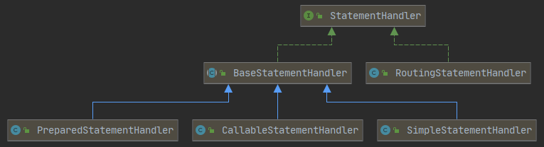

## INSERT | UPDATE | DELETE 的执行

插入的xml代码。

```xml
<insert id="insert" useGeneratedKeys="true" keyProperty="id" keyColumn="ID" databaseId="mysql">
    <!--  select * from STUDENT  -->
    insert into STUDENT(SNO, SNAME, SSEX, SBIRTHDAY, CLASS) values (#{sno}, #{sname}, #{ssex}, #{sbirthday}, #{clazz})
</insert>
```

动态代理的拦截方法。

```java
// MapperProxy.java
public Object invoke(Object proxy, Method method, Object[] args) throws Throwable {
    try {
        if (Object.class.equals(method.getDeclaringClass())) {
            return method.invoke(this, args);
        } else {
            // invoke是PlainMethodInvoker#invoke方法
            return cachedInvoker(method).invoke(proxy, method, args, sqlSession);
        }
    } catch (Throwable t) {
        throw ExceptionUtil.unwrapThrowable(t);
    }
}
private final Map<Method, MapperMethodInvoker> methodCache;
private MapperMethodInvoker cachedInvoker(Method method) throws Throwable {
    try {
        // 每调用一个方法就会再代理对象中缓存方法对应的Method对象
        MapperMethodInvoker invoker = methodCache.get(method);
        if (invoker != null) {
            return invoker;
        }
        return methodCache.computeIfAbsent(method, m -> {
            if (m.isDefault()) {
                try {
                    if (privateLookupInMethod == null) {
                        return new DefaultMethodInvoker(getMethodHandleJava8(method));
                    } else {
                        return new DefaultMethodInvoker(getMethodHandleJava9(method));
                    }
                } catch (IllegalAccessException | InstantiationException | InvocationTargetException
                         | NoSuchMethodException e) {
                    throw new RuntimeException(e);
                }
            } else {
                // 对于普通方法来说，会走这里
                return new PlainMethodInvoker(new MapperMethod(mapperInterface, method, sqlSession.getConfiguration()));
            }
        });
    } catch (RuntimeException re) {
        Throwable cause = re.getCause();
        throw cause == null ? re : cause;
    }
}
```

真正执行的CURD操作的 PlainMethodInvoker。

```java
private static class PlainMethodInvoker implements MapperMethodInvoker {
    private final MapperMethod mapperMethod;
    public PlainMethodInvoker(MapperMethod mapperMethod) {
        super();
        this.mapperMethod = mapperMethod;
    }
    @Override
    public Object invoke(Object proxy, Method method, Object[] args, SqlSession sqlSession) throws Throwable {
        return mapperMethod.execute(sqlSession, args);
    }
}
```

一个 MapperMethod 对象表示一个映射方法。

```java
// MapperMethod.java
public Object execute(SqlSession sqlSession, Object[] args) {
    Object result;
    switch (command.getType()) {
        case INSERT: {
            Object param = method.convertArgsToSqlCommandParam(args);
            // 方法 SqlSession#insert(java.lang.String, java.lang.Object) 的第一个参数是statementd的id，第二个参数是sql的入参。
            result = rowCountResult(sqlSession.insert(command.getName(), param));
            break;
        }
        // ...
    }
    if (result == null && method.getReturnType().isPrimitive() && !method.returnsVoid()) {
        throw new BindingException("Mapper method '" + command.getName()
               + " attempted to return null from a method with a primitive return type (" + method.getReturnType() + ").");
    }
    return result;
}
```

```java
// DefaultSqlSession.java
@Override
public int insert(String statement, Object parameter) {
    return update(statement, parameter);
}

@Override
public int update(String statement, Object parameter) {
    try {
        dirty = true;
        MappedStatement ms = configuration.getMappedStatement(statement);
        // SqlSession#update最终是调用Executor#update完成的
        // executor的类型是CachingExecutor，内部委托对象是SimpleExecutor
        return executor.update(ms, wrapCollection(parameter));
    } catch (Exception e) {
        throw ExceptionFactory.wrapException("Error updating database.  Cause: " + e, e);
    } finally {
        ErrorContext.instance().reset();
    }
}

private Object wrapCollection(final Object object) {
    return ParamNameResolver.wrapToMapIfCollection(object, null);
}
```

```java
// ParamNameResolver.java
public static Object wrapToMapIfCollection(Object object, String actualParamName) {
    if (object instanceof Collection) {
        ParamMap<Object> map = new ParamMap<>();
        // mapper.xml 里的集合用list表示是从这里出来的
        map.put("collection", object);
        if (object instanceof List) {
            map.put("list", object);
        }
        Optional.ofNullable(actualParamName).ifPresent(name -> map.put(name, object));
        return map;
    } else if (object != null && object.getClass().isArray()) {
        ParamMap<Object> map = new ParamMap<>();
        // mapper.xml 里的数组用array表示是从这里出来的
        map.put("array", object);
        Optional.ofNullable(actualParamName).ifPresent(name -> map.put(name, object));
        return map;
    }
    return object;
}
```

对数据库的操作是接口Executor及其实现类完成的。CachingExecutor是一个装饰器，它的作用是给其他的Executor增加二级缓存的功能。如果 `mybatis-config.xml` 中不配置 `<setting name="cacheEnabled" value="false"/>` 表示启用这个装饰器，如果Mapper.xml配置了 `<cache-ref>` 或 `<cache>`  会对当前Mapper开启二级缓存。

```java
// CachingExecutor.java
// SimpleExecutor
private final Executor delegate;
public int update(MappedStatement ms, Object parameterObject) throws SQLException {
    flushCacheIfRequired(ms);
    // Executor#update是一个模板方法，它的实现在类BaseExecutor里面
    return delegate.update(ms, parameterObject);
}

// 这个方法的作用是清除二级缓存
private void flushCacheIfRequired(MappedStatement ms) {
    Cache cache = ms.getCache();
    // cache是否为null取决于是否开启二级缓存，flushCacheRequired的值取决于CURD标签上配置的flushCache属性的值
    // 如果没有配置flushCache，select标签下flushCacheRequired的值为false，其他标签下flushCacheRequired的值为true
    if (cache != null && ms.isFlushCacheRequired()) {
        tcm.clear(cache);
    }
}
```

```java
// BaseExecutor.java
public int update(MappedStatement ms, Object parameter) throws SQLException {
    ErrorContext.instance().resource(ms.getResource()).activity("executing an update").object(ms.getId());
    if (closed) {
        throw new ExecutorException("Executor was closed.");
    }
    // 清除一级缓存
    clearLocalCache();
    return doUpdate(ms, parameter);
}

// PerpetualCache 内部封装了一个Map
protected PerpetualCache localCache;
protected PerpetualCache localOutputParameterCache;
@Override
public void clearLocalCache() {
    if (!closed) {
        localCache.clear();
        localOutputParameterCache.clear();
    }
}
```

演示的例子中，执行 `doUpdate()` 方法的是 SimpleExecutor。

```java
// SimpleExecutor.java
public int doUpdate(MappedStatement ms, Object parameter) throws SQLException {
    Statement stmt = null;
    try {
        Configuration configuration = ms.getConfiguration();
        StatementHandler handler = configuration.newStatementHandler(this, ms, parameter, RowBounds.DEFAULT, null, null);
        stmt = prepareStatement(handler, ms.getStatementLog());
        return handler.update(stmt);
    } finally {
        closeStatement(stmt);
    }
}
```

Mybatis提供了三个XxxHandler：ParameterHandler、ResultSetHandler、StatementHandler。

```java
public StatementHandler newStatementHandler(Executor executor, MappedStatement mappedStatement, Object parameterObject, 
    											RowBounds rowBounds, ResultHandler resultHandler, BoundSql boundSql) {
    StatementHandler statementHandler = 
        new RoutingStatementHandler(executor, mappedStatement, parameterObject, rowBounds, resultHandler, boundSql);
    statementHandler = (StatementHandler) interceptorChain.pluginAll(statementHandler);
    return statementHandler;
}
```

SimpleStatementHandler、PreparedStatementHandler和CallableStatementHandler对应着三类Statement，RoutingStatementHandler是一个装饰器。仅仅为了创建其他类型的Handler，没有其他作用。关于插件的执行，会单独Debug，这里不再深入。

<div align="center"></div>

```java
public RoutingStatementHandler(Executor executor, MappedStatement ms, Object parameter, 
                               RowBounds rowBounds, ResultHandler resultHandler, BoundSql boundSql) {
    switch (ms.getStatementType()) {
        case STATEMENT:
            delegate = new SimpleStatementHandler(executor, ms, parameter, rowBounds, resultHandler, boundSql);
            break;
        case PREPARED:
            delegate = new PreparedStatementHandler(executor, ms, parameter, rowBounds, resultHandler, boundSql);
            break;
        case CALLABLE:
            delegate = new CallableStatementHandler(executor, ms, parameter, rowBounds, resultHandler, boundSql);
            break;
        default:
            throw new ExecutorException("Unknown statement type: " + ms.getStatementType());
    }
}
```

```java
public PreparedStatementHandler(Executor executor, MappedStatement mappedStatement, 
                                Object parameter, RowBounds rowBounds, ResultHandler resultHandler, BoundSql boundSql) {
    super(executor, mappedStatement, parameter, rowBounds, resultHandler, boundSql);
}
```

```java
protected BaseStatementHandler(Executor executor, MappedStatement mappedStatement, 
                               Object parameterObject, RowBounds rowBounds, ResultHandler resultHandler, BoundSql boundSql) {
    this.configuration = mappedStatement.getConfiguration();
    this.executor = executor;
    this.mappedStatement = mappedStatement;
    this.rowBounds = rowBounds;

    this.typeHandlerRegistry = configuration.getTypeHandlerRegistry();
    this.objectFactory = configuration.getObjectFactory();

    if (boundSql == null) { // issue #435, get the key before calculating the statement
        generateKeys(parameterObject);
        boundSql = mappedStatement.getBoundSql(parameterObject);
    }

    this.boundSql = boundSql;

    this.parameterHandler = configuration.newParameterHandler(mappedStatement, parameterObject, boundSql);
    this.resultSetHandler = 
        configuration.newResultSetHandler(executor, mappedStatement, rowBounds, parameterHandler, resultHandler, boundSql);
}
```

ParameterHandler 只有一个实现类，DefaultParameterHandler，它的作用就是为预编译的SQL语句设置值，核心方法ParameterHandler#setParameters。

ResultSetHandler 的作用是封装结果集，结果集有三类：游标、正常输出和输出参数。对应三个方法：handleCursorResultSets、handleResultSets和handleOutputParameters。

至此，在doUpdate()方法中就会获得一个StatementHandler对象。

```java
// SimpleExecutor.java
public int doUpdate(MappedStatement ms, Object parameter) throws SQLException {
    Statement stmt = null;
    try {
        Configuration configuration = ms.getConfiguration();
        // RoutingStatementHandler，内部委托对象是 PreparedStatementHandler
        StatementHandler handler = configuration.newStatementHandler(this, ms, parameter, RowBounds.DEFAULT, null, null);
        stmt = prepareStatement(handler, ms.getStatementLog());
        return handler.update(stmt);
    } finally {
        closeStatement(stmt);
    }
}
```

下面是获取Statement的流程。

```java
private Statement prepareStatement(StatementHandler handler, Log statementLog) throws SQLException {
    Statement stmt;
    Connection connection = getConnection(statementLog);
    stmt = handler.prepare(connection, transaction.getTimeout());
    handler.parameterize(stmt);
    return stmt;
}
protected Connection getConnection(Log statementLog) throws SQLException {
    Connection connection = transaction.getConnection();
    if (statementLog.isDebugEnabled()) {
        return ConnectionLogger.newInstance(connection, statementLog, queryStack);
    } else {
        return connection;
    }
}
```

ConnectionLogger 的作用是对 Connection 的封装。它的作用是对prepareStatement、prepareCall和createStatement方法做拦截来输出日志。

```java
public final class ConnectionLogger extends BaseJdbcLogger implements InvocationHandler {
    private final Connection connection;

    private ConnectionLogger(Connection conn, Log statementLog, int queryStack) {
        super(statementLog, queryStack);
        this.connection = conn;
    }

    @Override
    public Object invoke(Object proxy, Method method, Object[] params) throws Throwable {
        try {
            if (Object.class.equals(method.getDeclaringClass())) {
                return method.invoke(this, params);
            }
            if ("prepareStatement".equals(method.getName()) || "prepareCall".equals(method.getName())) {
                if (isDebugEnabled()) {
                    debug(" Preparing: " + removeExtraWhitespace((String) params[0]), true);
                }
                PreparedStatement stmt = (PreparedStatement) method.invoke(connection, params);
                stmt = PreparedStatementLogger.newInstance(stmt, statementLog, queryStack);
                return stmt;
            } else if ("createStatement".equals(method.getName())) {
                Statement stmt = (Statement) method.invoke(connection, params);
                stmt = StatementLogger.newInstance(stmt, statementLog, queryStack);
                return stmt;
            } else {
                return method.invoke(connection, params);
            }
        } catch (Throwable t) {
            throw ExceptionUtil.unwrapThrowable(t);
        }
    }
	
    public static Connection newInstance(Connection conn, Log statementLog, int queryStack) {
        InvocationHandler handler = new ConnectionLogger(conn, statementLog, queryStack);
        ClassLoader cl = Connection.class.getClassLoader();
        return (Connection) Proxy.newProxyInstance(cl, new Class[]{Connection.class}, handler);
    }
}
```

`handler.prepare()` 的目的是初始化Statement，在JDBC原生的操作中就是 `con.prepareStatement(sql);`，

```java
// BaseStatementHandler.java
public Statement prepare(Connection connection, Integer transactionTimeout) throws SQLException {
    ErrorContext.instance().sql(boundSql.getSql());
    Statement statement = null;
    try {
        statement = instantiateStatement(connection);
        setStatementTimeout(statement, transactionTimeout);
        setFetchSize(statement);
        return statement;
    } catch (SQLException e) {
        closeStatement(statement);
        throw e;
    } catch (Exception e) {
        closeStatement(statement);
        throw new ExecutorException("Error preparing statement.  Cause: " + e, e);
    }
}
```

instantiateStatement 是个抽象方法。

```java
// PreparedStatementHandler.java
protected Statement instantiateStatement(Connection connection) throws SQLException {
    String sql = boundSql.getSql();
    // 如果是自增的插入，会走这个逻辑。
    if (mappedStatement.getKeyGenerator() instanceof Jdbc3KeyGenerator) {
        String[] keyColumnNames = mappedStatement.getKeyColumns();
        if (keyColumnNames == null) {
            // 没有指定列名的时候，也会使用返回自增主键的模式
            return connection.prepareStatement(sql, PreparedStatement.RETURN_GENERATED_KEYS);
        } else {
            // 指定列名的时候，会使用指定列名的编译方式
            return connection.prepareStatement(sql, keyColumnNames);
        }
    }
    // 默认的编译
    else if (mappedStatement.getResultSetType() == ResultSetType.DEFAULT) {
        return connection.prepareStatement(sql);
    } else {
       	// 用户指定的编译方式级别
        return connection.prepareStatement(sql, mappedStatement.getResultSetType().getValue(), ResultSet.CONCUR_READ_ONLY);
    }
}
```

prepareStatement() 在拿到 instantiateStatement() 返回的 Statement 的时候，会预编译的sql语句赋值。

```java
private Statement prepareStatement(StatementHandler handler, Log statementLog) throws SQLException {
    Statement stmt;
    Connection connection = getConnection(statementLog);
    stmt = handler.prepare(connection, transaction.getTimeout());
    // 给预编译的sql语句赋值
    handler.parameterize(stmt);
    return stmt;
}
```

PreparedStatementHandler#parameterize 最终调用的是方法 setParameters()。

```java
public void setParameters(PreparedStatement ps) {
    ErrorContext.instance().activity("setting parameters").object(mappedStatement.getParameterMap().getId());
    List<ParameterMapping> parameterMappings = boundSql.getParameterMappings();
    if (parameterMappings != null) {
        // parameterMappings 是用org.apache.ibatis.builder.SqlSourceBuilder.ParameterMappingTokenHandler类中解析出来的
        for (int i = 0; i < parameterMappings.size(); i++) {
            ParameterMapping parameterMapping = parameterMappings.get(i);
            if (parameterMapping.getMode() != ParameterMode.OUT) {
                Object value;
                String propertyName = parameterMapping.getProperty();
                // 对于@Param指定的值，会作为additionalParameter存在，先查询additionalParameter表示这种方式是最高优先级
                if (boundSql.hasAdditionalParameter(propertyName)) { // issue #448 ask first for additional params
                    value = boundSql.getAdditionalParameter(propertyName);
                } 
                // 如果参数为空，解析的结果自然为空
                else if (parameterObject == null) {
                    value = null;
                }
                // 如果存在此类型的类型处理器，表示此对象自己是一个参数
                else if (typeHandlerRegistry.hasTypeHandler(parameterObject.getClass())) {
                    value = parameterObject;
                }
                // 将对象作为一个元对象（可以理解为POJO），处理其内部的值
                else {
                    MetaObject metaObject = configuration.newMetaObject(parameterObject);
                    value = metaObject.getValue(propertyName);
                }
                TypeHandler typeHandler = parameterMapping.getTypeHandler();
                JdbcType jdbcType = parameterMapping.getJdbcType();
                if (value == null && jdbcType == null) {
                    jdbcType = configuration.getJdbcTypeForNull();
                }
                try {
                    // 类型处理器向预编译sql里面设值
                    typeHandler.setParameter(ps, i + 1, value, jdbcType);
                } catch (TypeException | SQLException e) {
                    throw new TypeException("...");
                }
            }
        }
    }
}
```

setParameter的实现是在类BaseTypeHandler中。

```java
// BaseTypeHandler.java
public void setParameter(PreparedStatement ps, int i, T parameter, JdbcType jdbcType) throws SQLException {
    if (parameter == null) {
        if (jdbcType == null) {
            throw new TypeException("JDBC requires that the JdbcType must be specified for all nullable parameters.");
        }
        try {
            ps.setNull(i, jdbcType.TYPE_CODE);
        } catch (SQLException e) {
            throw new TypeException("...");
        }
    } else {
        try {
            setNonNullParameter(ps, i, parameter, jdbcType);
        } catch (Exception e) {
            throw new TypeException("...");
        }
    }
}
// 具体的TypeHandler可以通过实现这个方法来设置值
public abstract void setNonNullParameter(PreparedStatement ps, int i, T parameter, JdbcType jdbcType) throws SQLException;
// 具体的TypeHandler可以通过实现这个方法来从结果集获取值
public abstract T getNullableResult(ResultSet rs, String columnName) throws SQLException;
```

执行完 setParameters() 方法后，对

```java
public int doUpdate(MappedStatement ms, Object parameter) throws SQLException {
    Statement stmt = null;
    try {
        Configuration configuration = ms.getConfiguration();
        StatementHandler handler = configuration.newStatementHandler(this, ms, parameter, RowBounds.DEFAULT, null, null);
        stmt = prepareStatement(handler, ms.getStatementLog());
        // 最终的执行还是交给了StatementHandler，因为它会对应一个Statement，原生的JDBC写法中直接与数据库打交道的就是Statement
        return handler.update(stmt);
    } finally {
        closeStatement(stmt);
    }
}
```

默认的 Statement 是 PreparementStatementHandler。

```java
// PreparementStatementHandler.java
public int update(Statement statement) throws SQLException {
    PreparedStatement ps = (PreparedStatement) statement;
    // 执行sql语句
    ps.execute();
    int rows = ps.getUpdateCount();
    Object parameterObject = boundSql.getParameterObject();
    KeyGenerator keyGenerator = mappedStatement.getKeyGenerator();
    // 拿到返回值，给主键赋值
    keyGenerator.processAfter(executor, mappedStatement, ps, parameterObject);
    return rows;
}
```

下面是给主键赋值的Debug。

```java
public void processAfter(Executor executor, MappedStatement ms, Statement stmt, Object parameter) {
    processBatch(ms, stmt, parameter);
}
public void processBatch(MappedStatement ms, Statement stmt, Object parameter) {
    // 这里的 keyProperties 是从INSERT标签的keyProperty属性获取的
    final String[] keyProperties = ms.getKeyProperties();
    if (keyProperties == null || keyProperties.length == 0) {
        return;
    }
    try (ResultSet rs = stmt.getGeneratedKeys()) {
        // ResultSetMetaData 是对ResultSet的一层包装，为了是获取ResultSet的信息
        final ResultSetMetaData rsmd = rs.getMetaData();
        final Configuration configuration = ms.getConfiguration();
        if (rsmd.getColumnCount() < keyProperties.length) {
            // Error?
        } else {
            assignKeys(configuration, rs, rsmd, keyProperties, parameter);
        }
    } catch (Exception e) {
        throw new ExecutorException("Error getting generated key or setting result to parameter object. Cause: " + e, e);
    }
}
private void assignKeys(Configuration configuration, ResultSet rs, ResultSetMetaData rsmd, String[] keyProperties,
                        Object parameter) throws SQLException {
    if (parameter instanceof ParamMap || parameter instanceof StrictMap) {
        // Multi-param or single param with @Param
        assignKeysToParamMap(configuration, rs, rsmd, keyProperties, (Map<String, ?>) parameter);
    } else if (parameter instanceof ArrayList && !((ArrayList<?>) parameter).isEmpty()
               && ((ArrayList<?>) parameter).get(0) instanceof ParamMap) {
        // Multi-param or single param with @Param in batch operation
        assignKeysToParamMapList(configuration, rs, rsmd, keyProperties, (ArrayList<ParamMap<?>>) parameter);
    } else {
        // Single param without @Param
        assignKeysToParam(configuration, rs, rsmd, keyProperties, parameter);
    }
}
private void assignKeysToParam(Configuration configuration, ResultSet rs, ResultSetMetaData rsmd,
                               String[] keyProperties, Object parameter) throws SQLException {
    Collection<?> params = collectionize(parameter);
    if (params.isEmpty()) {
        return;
    }
    List<KeyAssigner> assignerList = new ArrayList<>();
    // keyProperty 是有顺序的
    for (int i = 0; i < keyProperties.length; i++) {
        assignerList.add(new KeyAssigner(configuration, rsmd, i + 1, null, keyProperties[i]));
    }
    Iterator<?> iterator = params.iterator();
    while (rs.next()) {
        if (!iterator.hasNext()) {
            throw new ExecutorException(String.format(MSG_TOO_MANY_KEYS, params.size()));
        }
        Object param = iterator.next();
        assignerList.forEach(x -> x.assign(rs, param));
    }
}
```

KeyAssigner 是 Jdbc3KeyGenerator 的内部类，目的就是给对象赋值。

```java
private class KeyAssigner {
    private final Configuration configuration;
    private final ResultSetMetaData rsmd;
    private final TypeHandlerRegistry typeHandlerRegistry;
    private final int columnPosition;
    private final String paramName;
    private final String propertyName;
    private TypeHandler<?> typeHandler;

    protected void assign(ResultSet rs, Object param) {
        if (paramName != null) {
            // If paramName is set, param is ParamMap
            param = ((ParamMap<?>) param).get(paramName);
        }
        MetaObject metaParam = configuration.newMetaObject(param);
        try {
            if (typeHandler == null) {
                if (metaParam.hasSetter(propertyName)) {
                    Class<?> propertyType = metaParam.getSetterType(propertyName);
                    typeHandler = typeHandlerRegistry.getTypeHandler(propertyType,
                                                                     JdbcType.forCode(rsmd.getColumnType(columnPosition)));
                } else {
                    throw new ExecutorException("...");
                }
            }
            if (typeHandler == null) {
                // Error?
            } else {
                // 从结果集里面取数据出来，对于主键自增的场景来说，进入此方法的columnPosition只能为1，其他场景目前没有遇到过
                Object value = typeHandler.getResult(rs, columnPosition);
                metaParam.setValue(propertyName, value);
            }
        } catch (SQLException e) {
            throw new ExecutorException("...");
        }
    }
}
```

给主键赋值之后，插入操作就完成了。接下来就是简单的封装返回值。

```java
// MapperMethod
public Object execute(SqlSession sqlSession, Object[] args) {
    Object result;
    switch (command.getType()) {
        case INSERT: {
            Object param = method.convertArgsToSqlCommandParam(args);
            result = rowCountResult(sqlSession.insert(command.getName(), param));
            break;	
        }
            // ...
    }
}
private Object rowCountResult(int rowCount) {
    final Object result;
    if (method.returnsVoid()) {
        result = null;
    } else if (Integer.class.equals(method.getReturnType()) || Integer.TYPE.equals(method.getReturnType())) {
        result = rowCount;
    } else if (Long.class.equals(method.getReturnType()) || Long.TYPE.equals(method.getReturnType())) {
        result = (long) rowCount;
    } else if (Boolean.class.equals(method.getReturnType()) || Boolean.TYPE.equals(method.getReturnType())) {
        result = rowCount > 0;
    } else {
        throw new BindingException("Mapper method '" + command.getName() + "' has an unsupported return type: " + method.getReturnType());
    }
    return result;
}
```


## SELECT 的执行

select的动态代理也是进入MapperMethod#execute()方法开始的。

```java
public Object execute(SqlSession sqlSession, Object[] args) {
    Object result;
    switch (command.getType()) {
		// ...
        case SELECT:
            // 用于存储过程的调用 （不常用）
            if (method.returnsVoid() && method.hasResultHandler()) {
                executeWithResultHandler(sqlSession, args);
                result = null;
            } 
            // 返回集合数据类型 （常用）
            else if (method.returnsMany()) {
                result = executeForMany(sqlSession, args);
            } 
            // 返回Map诗句类型 （常用）
            else if (method.returnsMap()) {
                result = executeForMap(sqlSession, args);
            } 
            // 返回游标类型 （不常用）
            else if (method.returnsCursor()) {
                result = executeForCursor(sqlSession, args);
            } 
            // 返回单一值 （常用）
            else {
                Object param = method.convertArgsToSqlCommandParam(args);
                result = sqlSession.selectOne(command.getName(), param);
                if (method.returnsOptional()
                    && (result == null || !method.getReturnType().equals(result.getClass()))) {
                    result = Optional.ofNullable(result);
                }
            }
            break;
        case FLUSH:
            result = sqlSession.flushStatements();
            break;
        default:
            throw new BindingException("Unknown execution method for: " + command.getName());
    }
	// ...
}
```

返回的结果是集合类型，所以会走这个方法。

```java
private <E> Object executeForMany(SqlSession sqlSession, Object[] args) {
    List<E> result;
    Object param = method.convertArgsToSqlCommandParam(args);
    if (method.hasRowBounds()) {
        // 获得分页的RowBounds，RowBounds是内存分页，所以我们不使用
        RowBounds rowBounds = method.extractRowBounds(args);
        result = sqlSession.selectList(command.getName(), param, rowBounds);
    } else {
        // 默认路线
        result = sqlSession.selectList(command.getName(), param);
    }
    // issue #510 Collections & arrays support
    if (!method.getReturnType().isAssignableFrom(result.getClass())) {
        if (method.getReturnType().isArray()) {
            return convertToArray(result);
        } else {
            return convertToDeclaredCollection(sqlSession.getConfiguration(), result);
        }
    }
    return result;
}

// RowBounds有两个属性，offset和limit，前者表示跨过多少记录，后者表示最多显示多少记录
public <E> List<E> selectList(String statement, Object parameter) {
    return this.selectList(statement, parameter, RowBounds.DEFAULT);
}

public <E> List<E> selectList(String statement, Object parameter, RowBounds rowBounds) {
    try {
        MappedStatement ms = configuration.getMappedStatement(statement);
        return executor.query(ms, wrapCollection(parameter), rowBounds, Executor.NO_RESULT_HANDLER);
    } catch (Exception e) {
        throw ExceptionFactory.wrapException("Error querying database.  Cause: " + e, e);
    } finally {
        ErrorContext.instance().reset();
    }
}
```

模板设计模式，将一级缓存放在BaseExecutor里面执行。

```java
// BaseExecutor.java
public <E> List<E> query(MappedStatement ms, Object parameter, 
                         RowBounds rowBounds, ResultHandler resultHandler) throws SQLException {
    BoundSql boundSql = ms.getBoundSql(parameter);
    // 所有参数的哈希值之和:msID:offset:limit:sql:参数:环境
    CacheKey key = createCacheKey(ms, parameter, rowBounds, boundSql);
    return query(ms, parameter, rowBounds, resultHandler, key, boundSql);
}

public <E> List<E> query(MappedStatement ms, Object parameter, RowBounds rowBounds, 
    	ResultHandler resultHandler, CacheKey key, BoundSql boundSql) throws SQLException {
    ErrorContext.instance().resource(ms.getResource()).activity("executing a query").object(ms.getId());
    if (closed) {
        throw new ExecutorException("Executor was closed.");
    }
    if (queryStack == 0 && ms.isFlushCacheRequired()) {
        clearLocalCache();
    }
    List<E> list;
    try {
        // 嵌套查询（collection或者association里面使用select）的结果不会被记录，queryStack的作用便是实现此功能
        queryStack++;
        list = resultHandler == null ? (List<E>) localCache.getObject(key) : null;
        if (list != null) {
            handleLocallyCachedOutputParameters(ms, key, parameter, boundSql);
        } else {
            list = queryFromDatabase(ms, parameter, rowBounds, resultHandler, key, boundSql);
        }
    } finally {
        queryStack--;
    }
    if (queryStack == 0) {
        for (DeferredLoad deferredLoad : deferredLoads) {
            deferredLoad.load();
        }
        // issue #601
        deferredLoads.clear();
        if (configuration.getLocalCacheScope() == LocalCacheScope.STATEMENT) {
            // issue #482
            clearLocalCache();
        }
    }
    return list;
}

private <E> List<E> queryFromDatabase(MappedStatement ms, Object parameter, RowBounds rowBounds, 
    	ResultHandler resultHandler, CacheKey key, BoundSql boundSql) throws SQLException {
    List<E> list;
    localCache.putObject(key, EXECUTION_PLACEHOLDER);
    try {
        list = doQuery(ms, parameter, rowBounds, resultHandler, boundSql);
    } finally {
        localCache.removeObject(key);
    }
    localCache.putObject(key, list);
    if (ms.getStatementType() == StatementType.CALLABLE) {
        localOutputParameterCache.putObject(key, parameter);
    }
    return list;
}
```

真正从数据库查询的doQuery()方法放在不同的实现类中。

```java
// SimpleExecutor.java
public <E> List<E> doQuery(MappedStatement ms, Object parameter, RowBounds rowBounds, 
                           ResultHandler resultHandler, BoundSql boundSql) throws SQLException {
    Statement stmt = null;
    try {
        Configuration configuration = ms.getConfiguration();
        // 在doUpdate方法里面这里后两个参数用的是null, null。这里第一个参数实际上也是null。
        // 第二个参数不是空的原因是如果为空，会执行keyGenerator.processBefore()，查询方法不具有此功能
        StatementHandler handler = configuration.newStatementHandler(wrapper, 
                                   	ms, parameter, rowBounds, resultHandler, boundSql);
        // 此方法的功能和doUpdate一样，都是进行预编译，就不看了
        stmt = prepareStatement(handler, ms.getStatementLog());
        return handler.query(stmt, resultHandler);
    } finally {
        closeStatement(stmt);
    }
}
```

StatementHandler是对Statement的一层包装。

```java
// PreparedStatementHandler.java
public <E> List<E> query(Statement statement, ResultHandler resultHandler) throws SQLException {
    PreparedStatement ps = (PreparedStatement) statement;
    ps.execute();
    // 修改的核心是事务的控制，因为要确保数据一致性。
    // 查询的核心在这个地方，结果集的封装
    return resultSetHandler.handleResultSets(ps);
}
```

### 结果集的封装

```java
public List<Object> handleResultSets(Statement stmt) throws SQLException {
    ErrorContext.instance().activity("handling results").object(mappedStatement.getId());
    final List<Object> multipleResults = new ArrayList<>();

    int resultSetCount = 0;
    // 对JDBC返回的ResultSet进行包装
    ResultSetWrapper rsw = getFirstResultSet(stmt);

    List<ResultMap> resultMaps = mappedStatement.getResultMaps();
    int resultMapCount = resultMaps.size();
    // 当前需要存在至少一个ResultMap
    validateResultMapsCount(rsw, resultMapCount);
    while (rsw != null && resultMapCount > resultSetCount) {
        ResultMap resultMap = resultMaps.get(resultSetCount);
        handleResultSet(rsw, resultMap, multipleResults, null);
        rsw = getNextResultSet(stmt);
        cleanUpAfterHandlingResultSet();
        resultSetCount++;
    }

    String[] resultSets = mappedStatement.getResultSets();
    if (resultSets != null) {
        while (rsw != null && resultSetCount < resultSets.length) {
            ResultMapping parentMapping = nextResultMaps.get(resultSets[resultSetCount]);
            if (parentMapping != null) {
                String nestedResultMapId = parentMapping.getNestedResultMapId();
                ResultMap resultMap = configuration.getResultMap(nestedResultMapId);
                handleResultSet(rsw, resultMap, null, parentMapping);
            }
            rsw = getNextResultSet(stmt);
            cleanUpAfterHandlingResultSet();
            resultSetCount++;
        }
    }
    return collapseSingleResultList(multipleResults);
}
```

获得结果集的包装对象

```java
// DefalutResultSetHandler.java
private ResultSetWrapper getFirstResultSet(Statement stmt) throws SQLException {
    ResultSet rs = stmt.getResultSet();
    while (rs == null) {
        // move forward to get the first resultset in case the driver
        // doesn't return the resultset as the first result (HSQLDB 2.1)
        if (stmt.getMoreResults()) {
            rs = stmt.getResultSet();
        } else {
            if (stmt.getUpdateCount() == -1) {
                // no more results. Must be no resultset
                break;
            }
        }
    }
    return rs != null ? new ResultSetWrapper(rs, configuration) : null;
}
```

ResultSetWrapper存储了结果集的一些元信息。

```java
// ResultSetWrapper.java
private final List<String> columnNames = new ArrayList<>();
private final List<JdbcType> jdbcTypes = new ArrayList<>();
private final List<String> classNames = new ArrayList<>();

private final Map<String, Map<Class<?>, TypeHandler<?>>> typeHandlerMap = new HashMap<>();
private final Map<String, List<String>> mappedColumnNamesMap = new HashMap<>();
private final Map<String, List<String>> unMappedColumnNamesMap = new HashMap<>();

public ResultSetWrapper(ResultSet rs, Configuration configuration) throws SQLException {
    super();
    this.typeHandlerRegistry = configuration.getTypeHandlerRegistry();
    this.resultSet = rs;
    final ResultSetMetaData metaData = rs.getMetaData();
    final int columnCount = metaData.getColumnCount();
    for (int i = 1; i <= columnCount; i++) {
        // 都是有序的
        columnNames.add(configuration.isUseColumnLabel() ? 
                        metaData.getColumnLabel(i) : metaData.getColumnName(i));
        jdbcTypes.add(JdbcType.forCode(metaData.getColumnType(i)));
        classNames.add(metaData.getColumnClassName(i));
    }
}
```


```java
// DefaultResultSetHandler.java
private void handleResultSet(ResultSetWrapper rsw, ResultMap resultMap, 
    	List<Object> multipleResults, ResultMapping parentMapping) throws SQLException {
    try {
        if (parentMapping != null) {
            handleRowValues(rsw, resultMap, null, RowBounds.DEFAULT, parentMapping);
        } else {
            if (resultHandler == null) {
                DefaultResultHandler defaultResultHandler = new DefaultResultHandler(objectFactory);
                handleRowValues(rsw, resultMap, defaultResultHandler, rowBounds, null);
                multipleResults.add(defaultResultHandler.getResultList());
            } else {
                handleRowValues(rsw, resultMap, resultHandler, rowBounds, null);
            }
        }
    } finally {
        // issue #228 (close resultsets)
        closeResultSet(rsw.getResultSet());
    }
}

public void handleRowValues(ResultSetWrapper rsw, ResultMap resultMap, ResultHandler<?> resultHandler, 
    	RowBounds rowBounds, ResultMapping parentMapping) throws SQLException {
    if (resultMap.hasNestedResultMaps()) {
        ensureNoRowBounds();
        checkResultHandler();
        handleRowValuesForNestedResultMap(rsw, resultMap, resultHandler, rowBounds, parentMapping);
    } else {
        handleRowValuesForSimpleResultMap(rsw, resultMap, resultHandler, rowBounds, parentMapping);
    }
}
```


```java
private void handleRowValuesForNestedResultMap(ResultSetWrapper rsw, ResultMap resultMap, 
                                               ResultHandler<?> resultHandler, RowBounds rowBounds, 
                                               ResultMapping parentMapping) throws SQLException {
    final DefaultResultContext<Object> resultContext = new DefaultResultContext<>();
    ResultSet resultSet = rsw.getResultSet();
    // 内存分页
    skipRows(resultSet, rowBounds);
    Object rowValue = previousRowValue;
    // 对每一个记录进行循环
    while (shouldProcessMoreRows(resultContext, rowBounds) 
           && !resultSet.isClosed() && resultSet.next()) {
        final ResultMap discriminatedResultMap = 
            resolveDiscriminatedResultMap(resultSet, resultMap, null);
        final CacheKey rowKey = createRowKey(discriminatedResultMap, rsw, null);
        // ...
    }
	// ...
}

private boolean shouldProcessMoreRows(ResultContext<?> context, RowBounds rowBounds) {
    return !context.isStopped() && context.getResultCount() < rowBounds.getLimit();
}

private CacheKey createRowKey(ResultMap resultMap, ResultSetWrapper rsw, String columnPrefix) throws SQLException {
    final CacheKey cacheKey = new CacheKey();
    cacheKey.update(resultMap.getId());
    // 作为Key的属性。默认是id列，如果没有id列，则是全部的属性
    List<ResultMapping> resultMappings = getResultMappingsForRowKey(resultMap);
    if (resultMappings.isEmpty()) {
        if (Map.class.isAssignableFrom(resultMap.getType())) {
            createRowKeyForMap(rsw, cacheKey);
        } else {
            createRowKeyForUnmappedProperties(resultMap, rsw, cacheKey, columnPrefix);
        }
    } else {
        // 给key列创建RowKey
        createRowKeyForMappedProperties(resultMap, rsw, cacheKey, resultMappings, columnPrefix);
    }
    if (cacheKey.getUpdateCount() < 2) {
        return CacheKey.NULL_CACHE_KEY;
    }
    return cacheKey;
}

private void createRowKeyForMappedProperties(ResultMap resultMap, ResultSetWrapper rsw, 
    	CacheKey cacheKey, List<ResultMapping> resultMappings, String columnPrefix) throws SQLException {
    // 对每个key属性都进行
    for (ResultMapping resultMapping : resultMappings) {
        if (resultMapping.isSimple()) {
            // association和collection标签可以指定列前缀
            final String column = prependPrefix(resultMapping.getColumn(), columnPrefix);
            final TypeHandler<?> th = resultMapping.getTypeHandler();
            // 获得所有映射的列名
            // 在resultMap标签中指定过column的列属于mappedColumnNames，否则属于unMappedColumnNames
            List<String> mappedColumnNames = rsw.getMappedColumnNames(resultMap, columnPrefix);
            if (column != null && mappedColumnNames.contains(column.toUpperCase(Locale.ENGLISH))) {
                final Object value = th.getResult(rsw.getResultSet(), column);
                if (value != null || configuration.isReturnInstanceForEmptyRow()) {
                    cacheKey.update(column);
                    cacheKey.update(value);
                }
            }
        }
    }
}
```


```java
// ResultSetWrapper.java
private final Map<String, List<String>> mappedColumnNamesMap = new HashMap<>();
private final Map<String, List<String>> unMappedColumnNamesMap = new HashMap<>();
public List<String> getMappedColumnNames(ResultMap resultMap, String columnPrefix) throws SQLException {
    List<String> mappedColumnNames = mappedColumnNamesMap.get(getMapKey(resultMap, columnPrefix));
    if (mappedColumnNames == null) {
        // 将列加载到Result
        loadMappedAndUnmappedColumnNames(resultMap, columnPrefix);
        mappedColumnNames = mappedColumnNamesMap.get(getMapKey(resultMap, columnPrefix));
    }
    return mappedColumnNames;
}

// 目的就是将JDBC返回的列放在mappedColumnNamesMap和unMappedColumnNamesMap中
// 这俩的数据结构都是：<resultMapId + prefix, 列名集合>
private void loadMappedAndUnmappedColumnNames(ResultMap resultMap, String columnPrefix) throws SQLException {
    List<String> mappedColumnNames = new ArrayList<>();
    List<String> unmappedColumnNames = new ArrayList<>();
    final String upperColumnPrefix = columnPrefix == null ? null : columnPrefix.toUpperCase(Locale.ENGLISH);
    final Set<String> mappedColumns = prependPrefixes(resultMap.getMappedColumns(), upperColumnPrefix);
    for (String columnName : columnNames) {
        final String upperColumnName = columnName.toUpperCase(Locale.ENGLISH);
        if (mappedColumns.contains(upperColumnName)) {
            mappedColumnNames.add(upperColumnName);
        } else {
            unmappedColumnNames.add(columnName);
        }
    }
    mappedColumnNamesMap.put(getMapKey(resultMap, columnPrefix), mappedColumnNames);
    unMappedColumnNamesMap.put(getMapKey(resultMap, columnPrefix), unmappedColumnNames);
}
```


```java
private void handleRowValuesForNestedResultMap(ResultSetWrapper rsw, ResultMap resultMap, 
                                               ResultHandler<?> resultHandler, RowBounds rowBounds, 
                                               ResultMapping parentMapping) throws SQLException {
    final DefaultResultContext<Object> resultContext = new DefaultResultContext<>();
    ResultSet resultSet = rsw.getResultSet();
    // 内存分页
    skipRows(resultSet, rowBounds);
    Object rowValue = previousRowValue;
    // 对结果集进行循环
    while (shouldProcessMoreRows(resultContext, rowBounds) 
           && !resultSet.isClosed() && resultSet.next()) {
        final ResultMap discriminatedResultMap = 
            resolveDiscriminatedResultMap(resultSet, resultMap, null);
        final CacheKey rowKey = createRowKey(discriminatedResultMap, rsw, null);
        // 分区数据。第一次遇到此分区的数据，这里为空
        Object partialObject = nestedResultObjects.get(rowKey);
        // issue #577 && #542
        if (mappedStatement.isResultOrdered()) {
            if (partialObject == null && rowValue != null) {
                nestedResultObjects.clear();
                storeObject(resultHandler, resultContext, rowValue, parentMapping, resultSet);
            }
            // 获得rowKey，之后就要在Key里面存数据了
            rowValue = getRowValue(rsw, discriminatedResultMap, rowKey, null, partialObject);
        } else {
            rowValue = getRowValue(rsw, discriminatedResultMap, rowKey, null, partialObject);
            if (partialObject == null) {
                storeObject(resultHandler, resultContext, rowValue, parentMapping, resultSet);
            }
        }
    }
    if (rowValue != null && mappedStatement.isResultOrdered() 
        && shouldProcessMoreRows(resultContext, rowBounds)) {
        // 存在resultHandler中，默认的Handler就是以集合形式保存所有的数据
        storeObject(resultHandler, resultContext, rowValue, parentMapping, resultSet);
        previousRowValue = null;
    } else if (rowValue != null) {
        previousRowValue = rowValue;
    }
}
```


```java
private Object getRowValue(ResultSetWrapper rsw, ResultMap resultMap, CacheKey combinedKey, 
                           String columnPrefix, Object partialObject) throws SQLException {
    final String resultMapId = resultMap.getId();
    Object rowValue = partialObject;
    // 非第一次遇到分区对象，完成映射
    if (rowValue != null) {
        final MetaObject metaObject = configuration.newMetaObject(rowValue);
        putAncestor(rowValue, resultMapId);
        applyNestedResultMappings(rsw, resultMap, metaObject, columnPrefix, combinedKey, false);
        ancestorObjects.remove(resultMapId);
    } else {
        // 第一次遇到分区对象，创建分区对象
        final ResultLoaderMap lazyLoader = new ResultLoaderMap();
        // 创建结果对象
        rowValue = createResultObject(rsw, resultMap, lazyLoader, columnPrefix);
        // ...
    }
    return rowValue;
}
```

创建结果对象。

```java
private Object createResultObject(ResultSetWrapper rsw, ResultMap resultMap, 
                                  ResultLoaderMap lazyLoader, String columnPrefix) throws SQLException {
    this.useConstructorMappings = false; // reset previous mapping result
    final List<Class<?>> constructorArgTypes = new ArrayList<>();
    final List<Object> constructorArgs = new ArrayList<>();
    // 创建结果对象
    Object resultObject = createResultObject(rsw, resultMap, constructorArgTypes, constructorArgs, columnPrefix);
    if (resultObject != null && !hasTypeHandlerForResultObject(rsw, resultMap.getType())) {
        final List<ResultMapping> propertyMappings = resultMap.getPropertyResultMappings();
        for (ResultMapping propertyMapping : propertyMappings) {
            // issue gcode #109 && issue #149
            // 暂时看不懂
            if (propertyMapping.getNestedQueryId() != null && propertyMapping.isLazy()) {
                resultObject = configuration.getProxyFactory().
                   createProxy(resultObject, lazyLoader, configuration, objectFactory, constructorArgTypes, constructorArgs);
                break;
            }
        }
    }
    this.useConstructorMappings = resultObject != null && !constructorArgTypes.isEmpty(); // set current mapping result
    return resultObject;
}

private Object createResultObject(ResultSetWrapper rsw, ResultMap resultMap, 
                                  List<Class<?>> constructorArgTypes, List<Object> constructorArgs, String columnPrefix)
    throws SQLException {
    final Class<?> resultType = resultMap.getType();
    final MetaClass metaType = MetaClass.forClass(resultType, reflectorFactory);
    final List<ResultMapping> constructorMappings = resultMap.getConstructorResultMappings();
    if (hasTypeHandlerForResultObject(rsw, resultType)) {
        return createPrimitiveResultObject(rsw, resultMap, columnPrefix);
    } 
    // 根据constructorMappings创建对象
    else if (!constructorMappings.isEmpty()) {
        return createParameterizedResultObject
            (rsw, resultType, constructorMappings, constructorArgTypes, constructorArgs, columnPrefix);
    } else if (resultType.isInterface() || metaType.hasDefaultConstructor()) {
        return objectFactory.create(resultType);
    } else if (shouldApplyAutomaticMappings(resultMap, false)) {
        return createByConstructorSignature(rsw, resultType, constructorArgTypes, constructorArgs);
    }
    throw new ExecutorException("Do not know how to create an instance of " + resultType);
}

Object createParameterizedResultObject(ResultSetWrapper rsw, Class<?> resultType, List<ResultMapping> constructorMappings,
    	List<Class<?>> constructorArgTypes, List<Object> constructorArgs, String columnPrefix) {
    boolean foundValues = false;
    for (ResultMapping constructorMapping : constructorMappings) {
        final Class<?> parameterType = constructorMapping.getJavaType();
        final String column = constructorMapping.getColumn();
        final Object value;
        try {
            // 通过嵌套查询获得对象
            if (constructorMapping.getNestedQueryId() != null) {
                value = getNestedQueryConstructorValue(rsw.getResultSet(), constructorMapping, columnPrefix);
            } 
            // 将当前结果集按ResultMap封装
            else if (constructorMapping.getNestedResultMapId() != null) {
                final ResultMap resultMap = configuration.getResultMap(constructorMapping.getNestedResultMapId());
                value = getRowValue(rsw, resultMap, getColumnPrefix(columnPrefix, constructorMapping));
            }
            // 从结果集里面获取数据
            else {
                final TypeHandler<?> typeHandler = constructorMapping.getTypeHandler();
                value = typeHandler.getResult(rsw.getResultSet(), prependPrefix(column, columnPrefix));
            }
        } catch (ResultMapException | SQLException e) {
            throw new ExecutorException("Could not process result for mapping: " + constructorMapping, e);
        }
        constructorArgTypes.add(parameterType);
        constructorArgs.add(value);
        foundValues = value != null || foundValues;
    }
    // 创建对象
    return foundValues ? objectFactory.create(resultType, constructorArgTypes, constructorArgs) : null;
}
```

从 `DefaultResultSetHandler#createResultObject(ResultSetWrapper, ResultMap, ResultLoaderMap, String);` 方法里出来后，就调用我们自定义的构造器创建FullStudent对象了。

```java
private Object getRowValue(ResultSetWrapper rsw, ResultMap resultMap, CacheKey combinedKey, 
                           String columnPrefix, Object partialObject) throws SQLException {
    final String resultMapId = resultMap.getId();
    Object rowValue = partialObject;
    if (rowValue != null) {
        final MetaObject metaObject = configuration.newMetaObject(rowValue);
        putAncestor(rowValue, resultMapId);
        applyNestedResultMappings(rsw, resultMap, metaObject, columnPrefix, combinedKey, false);
        ancestorObjects.remove(resultMapId);
    } else {
        final ResultLoaderMap lazyLoader = new ResultLoaderMap();
        // 创建结果对象
        rowValue = createResultObject(rsw, resultMap, lazyLoader, columnPrefix);
        if (rowValue != null && !hasTypeHandlerForResultObject(rsw, resultMap.getType())) {
            final MetaObject metaObject = configuration.newMetaObject(rowValue);
            boolean foundValues = this.useConstructorMappings;
            if (shouldApplyAutomaticMappings(resultMap, true)) {
                foundValues = applyAutomaticMappings(rsw, resultMap, metaObject, columnPrefix) || foundValues;
            }
            foundValues = applyPropertyMappings(rsw, resultMap, metaObject, lazyLoader, columnPrefix) || foundValues;
            // 目的是解决循环依赖
            putAncestor(rowValue, resultMapId);
            foundValues = applyNestedResultMappings(rsw, resultMap, metaObject, columnPrefix, combinedKey, true) 
                														|| foundValues;
            ancestorObjects.remove(resultMapId);
            foundValues = lazyLoader.size() > 0 || foundValues;
            rowValue = foundValues || configuration.isReturnInstanceForEmptyRow() ? rowValue : null;
        }
        if (combinedKey != CacheKey.NULL_CACHE_KEY) {
            nestedResultObjects.put(combinedKey, rowValue);
        }
    }
    return rowValue;
}
```

对于嵌套查询需要配置AutoMappingBehavior为FULL才能自动映射。

```java
private boolean shouldApplyAutomaticMappings(ResultMap resultMap, boolean isNested) {
    if (resultMap.getAutoMapping() != null) {
        return resultMap.getAutoMapping();
    } else {
        if (isNested) {
            return AutoMappingBehavior.FULL == configuration.getAutoMappingBehavior();
        } else {
            return AutoMappingBehavior.NONE != configuration.getAutoMappingBehavior();
        }
    }
}
```

应用自动映射

```java
private boolean applyAutomaticMappings(ResultSetWrapper rsw, ResultMap resultMap, 
                                       MetaObject metaObject, String columnPrefix) throws SQLException {
    List<UnMappedColumnAutoMapping> autoMapping = 
    	createAutomaticMappings(rsw, resultMap, metaObject, columnPrefix);
    boolean foundValues = false;
    // 对于自动映射上去的属性，会设置属性
    if (!autoMapping.isEmpty()) {
        for (UnMappedColumnAutoMapping mapping : autoMapping) {
            final Object value = mapping.typeHandler.getResult(rsw.getResultSet(), mapping.column);
            if (value != null) {
                foundValues = true;
            }
            if (value != null || (configuration.isCallSettersOnNulls() && !mapping.primitive)) {
                // gcode issue #377, call setter on nulls (value is not 'found')
                metaObject.setValue(mapping.property, value);
            }
        }
    }
    return foundValues;
}

private List<UnMappedColumnAutoMapping> createAutomaticMappings(ResultSetWrapper rsw, 
    	ResultMap resultMap, MetaObject metaObject, String columnPrefix) throws SQLException {
    final String mapKey = resultMap.getId() + ":" + columnPrefix;
    List<UnMappedColumnAutoMapping> autoMapping = autoMappingsCache.get(mapKey);
    if (autoMapping == null) {
        autoMapping = new ArrayList<>();
        // unmappedColumnNames已经被记录在ResultSetWrapper中了
        final List<String> unmappedColumnNames = rsw.getUnmappedColumnNames(resultMap, columnPrefix);
        for (String columnName : unmappedColumnNames) {
            String propertyName = columnName;
            // 对于有前缀的情况，没有前缀的忽略，有前缀的需要去除前缀后在匹配属性
            if (columnPrefix != null && !columnPrefix.isEmpty()) {
                if (columnName.toUpperCase(Locale.ENGLISH).startsWith(columnPrefix)) {
                    propertyName = columnName.substring(columnPrefix.length());
                } else {
                    continue;
                }
            }
            // 查找对应的属性
            final String property = metaObject.findProperty(propertyName, 
                                    	configuration.isMapUnderscoreToCamelCase());
            if (property != null && metaObject.hasSetter(property)) {
                // 如果已经被手动映射了，就不需要自动映射了
                if (resultMap.getMappedProperties().contains(property)) {
                    continue;
                }
                final Class<?> propertyType = metaObject.getSetterType(property);
                if (typeHandlerRegistry.hasTypeHandler(propertyType, rsw.getJdbcType(columnName))) {
                    final TypeHandler<?> typeHandler = rsw.getTypeHandler(propertyType, columnName);
                    autoMapping.add(new UnMappedColumnAutoMapping(columnName, 
                                    	property, typeHandler, propertyType.isPrimitive()));
                } else {
                    // 默认是什么都不做，实际上可以配置打印日志，见AutoMappingUnknownColumnBehavior
                    configuration.getAutoMappingUnknownColumnBehavior()
                        .doAction(mappedStatement, columnName, property, propertyType);
                }
            } else {
                configuration.getAutoMappingUnknownColumnBehavior()
                    .doAction(mappedStatement, columnName, (property != null) ? 
                              			property : propertyName, null);
            }
        }
        autoMappingsCache.put(mapKey, autoMapping);
    }
    return autoMapping;
}
```

应用属性映射

```java
private boolean applyPropertyMappings(ResultSetWrapper rsw, ResultMap resultMap, MetaObject metaObject, 
    	ResultLoaderMap lazyLoader, String columnPrefix) throws SQLException {
    final List<String> mappedColumnNames = rsw.getMappedColumnNames(resultMap, columnPrefix);
    boolean foundValues = false;
    final List<ResultMapping> propertyMappings = resultMap.getPropertyResultMappings();
    for (ResultMapping propertyMapping : propertyMappings) {
        String column = prependPrefix(propertyMapping.getColumn(), columnPrefix);
        if (propertyMapping.getNestedResultMapId() != null) {
            // the user added a column attribute to a nested result map, ignore it
            column = null;
        }
        if (propertyMapping.isCompositeResult()
            || (column != null && mappedColumnNames.contains(column.toUpperCase(Locale.ENGLISH)))
            || propertyMapping.getResultSet() != null) {
            Object value = getPropertyMappingValue(rsw.getResultSet(), 
                           		metaObject, propertyMapping, lazyLoader, columnPrefix);
            // issue #541 make property optional
            final String property = propertyMapping.getProperty();
            if (property == null) {
                continue;
            } else if (value == DEFERRED) {
                foundValues = true;
                continue;
            }
            if (value != null) {
                foundValues = true;
            }
            if (value != null || (configuration.isCallSettersOnNulls() && 
                                  !metaObject.getSetterType(property).isPrimitive())) {
                // gcode issue #377, call setter on nulls (value is not 'found')
                metaObject.setValue(property, value);
            }
        }
    }
    return foundValues;
}

private Object getPropertyMappingValue(ResultSet rs, MetaObject metaResultObject, 
		ResultMapping propertyMapping, ResultLoaderMap lazyLoader, String columnPrefix)
    		throws SQLException {
    // 子查询，对应 select 属性
    if (propertyMapping.getNestedQueryId() != null) {
        return getNestedQueryMappingValue(rs, 
                                          metaResultObject, propertyMapping, lazyLoader, columnPrefix);
    } else if (propertyMapping.getResultSet() != null) {
        // 看不懂，略过
        addPendingChildRelation(rs, metaResultObject, propertyMapping);   // TODO is that OK?
        return DEFERRED;
    } else {
        // 我们走的是最普通的从结果集获取数据
        final TypeHandler<?> typeHandler = propertyMapping.getTypeHandler();
        final String column = prependPrefix(propertyMapping.getColumn(), columnPrefix);
        return typeHandler.getResult(rs, column);
    }
}
```

应用嵌套结果。

```java
private boolean applyNestedResultMappings(ResultSetWrapper rsw, ResultMap resultMap, 
    	MetaObject metaObject, String parentPrefix, CacheKey parentRowKey, boolean newObject) {
    boolean foundValues = false;
    for (ResultMapping resultMapping : resultMap.getPropertyResultMappings()) {
        final String nestedResultMapId = resultMapping.getNestedResultMapId();
        if (nestedResultMapId != null && resultMapping.getResultSet() == null) {
            try {
                final String columnPrefix = getColumnPrefix(parentPrefix, resultMapping);
                final ResultMap nestedResultMap = getNestedResultMap(rsw.getResultSet(), nestedResultMapId, columnPrefix);
                if (resultMapping.getColumnPrefix() == null) {
                    // try to fill circular reference only when columnPrefix
                    // is not specified for the nested result map (issue #215)
                    Object ancestorObject = ancestorObjects.get(nestedResultMapId);
                    if (ancestorObject != null) {
                        if (newObject) {
                            linkObjects(metaObject, resultMapping, ancestorObject); // issue #385
                        }
                        continue;
                    }
                }
                final CacheKey rowKey = createRowKey(nestedResultMap, rsw, columnPrefix);
                final CacheKey combinedKey = combineKeys(rowKey, parentRowKey);
                // 分区里一对一的属性第二次遇到这里的时候kownvalue为true
                Object rowValue = nestedResultObjects.get(combinedKey);
                boolean knownValue = rowValue != null;
                instantiateCollectionPropertyIfAppropriate(resultMapping, metaObject); // mandatory
                if (anyNotNullColumnHasValue(resultMapping, columnPrefix, rsw)) {
                    rowValue = getRowValue(rsw, nestedResultMap, combinedKey, columnPrefix, rowValue);
                    if (rowValue != null && !knownValue) {
                        // 将嵌套结果关联到分区对象
                        linkObjects(metaObject, resultMapping, rowValue);
                        foundValues = true;
                    }
                }
            } catch (SQLException e) {
                throw new ExecutorException("Error getting nested result map values for '" + resultMapping.getProperty() + "'.  Cause: " + e, e);
            }
        }
    }
    return foundValues;
}
```


```java
public void handleRowValues(ResultSetWrapper rsw, ResultMap resultMap, ResultHandler<?> resultHandler, 
   		RowBounds rowBounds, ResultMapping parentMapping) throws SQLException {
    if (resultMap.hasNestedResultMaps()) {
        ensureNoRowBounds();
        checkResultHandler();
        // 处理完结果之后就可以退出了
        handleRowValuesForNestedResultMap(rsw, resultMap, resultHandler, rowBounds, parentMapping);
    } else {
        handleRowValuesForSimpleResultMap(rsw, resultMap, resultHandler, rowBounds, parentMapping);
    }
}
```


```java
private void handleResultSet(ResultSetWrapper rsw, ResultMap resultMap, List<Object> multipleResults, 
                             ResultMapping parentMapping) throws SQLException {
    try {
        if (parentMapping != null) {
            handleRowValues(rsw, resultMap, null, RowBounds.DEFAULT, parentMapping);
        } else {
            if (resultHandler == null) {
                DefaultResultHandler defaultResultHandler = new DefaultResultHandler(objectFactory);
                handleRowValues(rsw, resultMap, defaultResultHandler, rowBounds, null);
                // 处理完的结果放在multipleResults中
                multipleResults.add(defaultResultHandler.getResultList());
            } else {
                handleRowValues(rsw, resultMap, resultHandler, rowBounds, null);
            }
        }
    } finally {
        // issue #228 (close resultsets)
        closeResultSet(rsw.getResultSet());
    }
}
```


```java
public List<Object> handleResultSets(Statement stmt) throws SQLException {
    ErrorContext.instance().activity("handling results").object(mappedStatement.getId());

    final List<Object> multipleResults = new ArrayList<>();

    int resultSetCount = 0;
    ResultSetWrapper rsw = getFirstResultSet(stmt);

    List<ResultMap> resultMaps = mappedStatement.getResultMaps();
    int resultMapCount = resultMaps.size();
    validateResultMapsCount(rsw, resultMapCount);
    while (rsw != null && resultMapCount > resultSetCount) {
        ResultMap resultMap = resultMaps.get(resultSetCount);
        handleResultSet(rsw, resultMap, multipleResults, null);
        rsw = getNextResultSet(stmt);
        cleanUpAfterHandlingResultSet();
        resultSetCount++;
    }

    // 不知道这个是干什么用的
    String[] resultSets = mappedStatement.getResultSets();
    if (resultSets != null) {
        while (rsw != null && resultSetCount < resultSets.length) {
            ResultMapping parentMapping = nextResultMaps.get(resultSets[resultSetCount]);
            if (parentMapping != null) {
                String nestedResultMapId = parentMapping.getNestedResultMapId();
                ResultMap resultMap = configuration.getResultMap(nestedResultMapId);
                handleResultSet(rsw, resultMap, null, parentMapping);
            }
            rsw = getNextResultSet(stmt);
            cleanUpAfterHandlingResultSet();
            resultSetCount++;
        }
    }

    // 聚合数据
    return collapseSingleResultList(multipleResults);
}
```

之后一直返回到此方法。

```java
private <E> List<E> queryFromDatabase(MappedStatement ms, Object parameter, RowBounds rowBounds, 
                                      ResultHandler resultHandler, CacheKey key, BoundSql boundSql) throws SQLException {
    List<E> list;
    localCache.putObject(key, EXECUTION_PLACEHOLDER);
    try {
        // 获得的结果集合
        list = doQuery(ms, parameter, rowBounds, resultHandler, boundSql);
    } finally {
        localCache.removeObject(key);
    }
    localCache.putObject(key, list);
    if (ms.getStatementType() == StatementType.CALLABLE) {
        localOutputParameterCache.putObject(key, parameter);
    }
    return list;
}
```


```java
public <E> List<E> query(MappedStatement ms, Object parameter, RowBounds rowBounds, ResultHandler resultHandler, 
                         CacheKey key, BoundSql boundSql) throws SQLException {
    ErrorContext.instance().resource(ms.getResource()).activity("executing a query").object(ms.getId());
    if (closed) {
        throw new ExecutorException("Executor was closed.");
    }
    if (queryStack == 0 && ms.isFlushCacheRequired()) {
        clearLocalCache();
    }
    List<E> list;
    try {
        queryStack++;
        list = resultHandler == null ? (List<E>) localCache.getObject(key) : null;
        if (list != null) {
            handleLocallyCachedOutputParameters(ms, key, parameter, boundSql);
        } else {
            list = queryFromDatabase(ms, parameter, rowBounds, resultHandler, key, boundSql);
        }
    } finally {
        queryStack--;
    }
    if (queryStack == 0) {
        for (DeferredLoad deferredLoad : deferredLoads) {
            deferredLoad.load();
        }
        // issue #601
        deferredLoads.clear();
        // 我们可以在mybatis-config文件的settings标签里配置LocalCacheScope为STATEMENT来禁用一级缓存
        if (configuration.getLocalCacheScope() == LocalCacheScope.STATEMENT) {
            // issue #482
            clearLocalCache();
        }
    }
    return list;
}
```


```java
private <E> Object executeForMany(SqlSession sqlSession, Object[] args) {
    List<E> result;
    Object param = method.convertArgsToSqlCommandParam(args);
    if (method.hasRowBounds()) {
        RowBounds rowBounds = method.extractRowBounds(args);
        result = sqlSession.selectList(command.getName(), param, rowBounds);
    } else {
        result = sqlSession.selectList(command.getName(), param);
    }
    // issue #510 Collections & arrays support
    if (!method.getReturnType().isAssignableFrom(result.getClass())) {
        if (method.getReturnType().isArray()) {
            // 如果返回值是集合，就转为集合
            return convertToArray(result);
        } else {
            return convertToDeclaredCollection(sqlSession.getConfiguration(), result);
        }
    }
    return result;
}
```

最终会返回到DAO层的代码中。