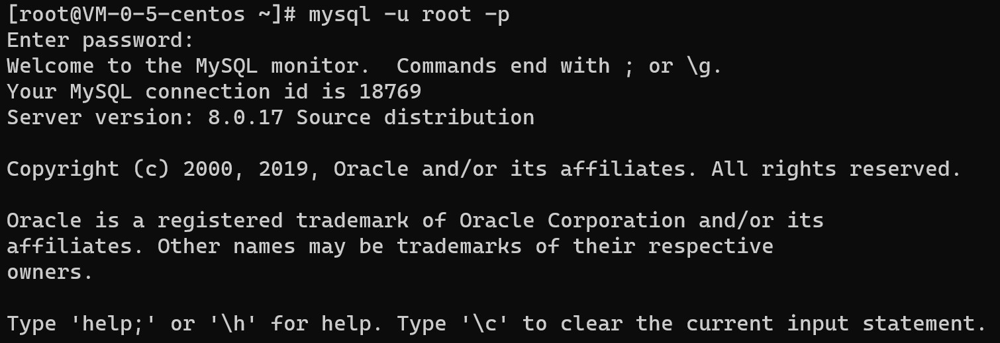
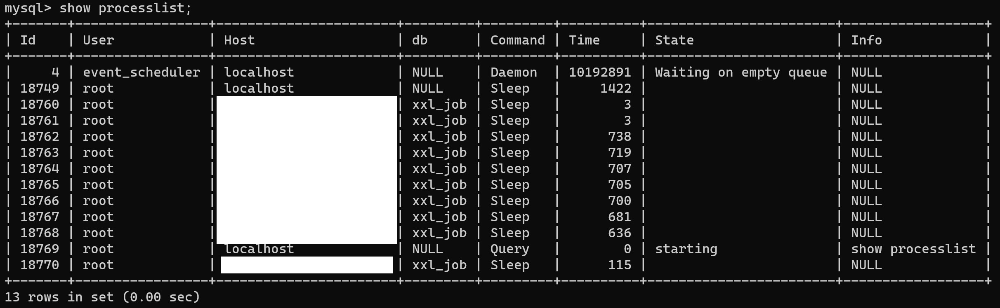

## 连接MySQL

登录到Linux系统之后，输入：`mysql -u -root -p`，再输入密码即可登录。



查看MySQL连接数

```sql
show processlist;		-- 显示100个连接
show full processlistl  -- 显示全部的连接
```



查看连接空闲时间

```sql
show variables like '%timeout%';
```


