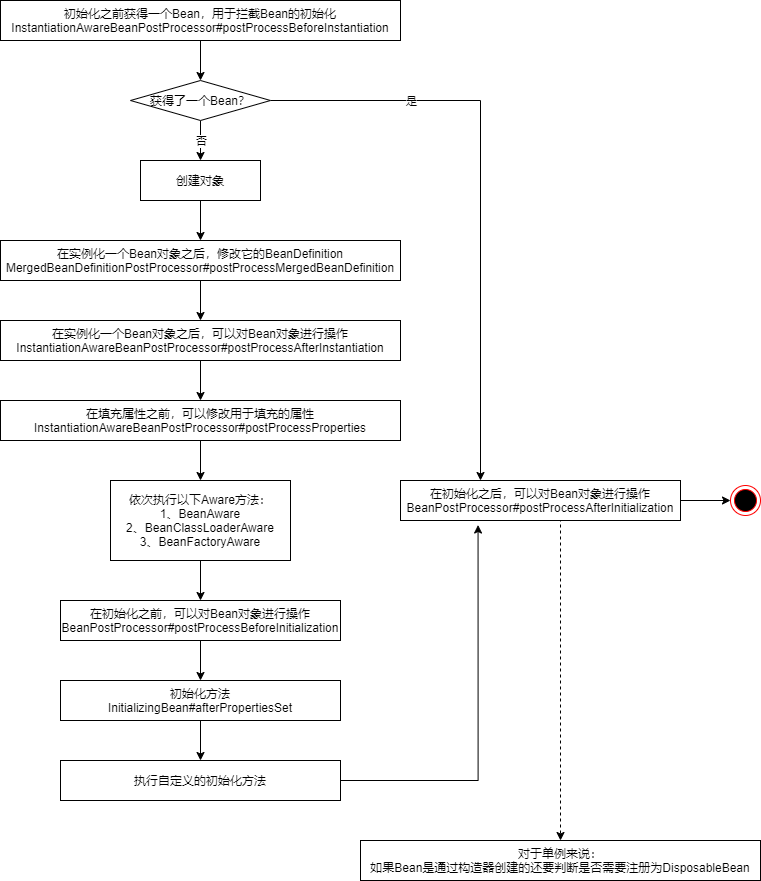

## Spring IOC入门

Spring IOC的目的就是管理Bean，所以本节的目的就是学习如何运用Spring完成依赖查找和依赖注入。

- 基于ApplicationContext的依赖查找
- 基于ApplicationContext的依赖注入
- 基于BeanFactory的依赖查找
- 基于注解的依赖注入


### ApplicationContext Dependency Lookup

spring配置文件：dependency-lookup-context.xml

```xml
<?xml version="1.0" encoding="UTF-8"?>
<beans xmlns="http://www.springframework.org/schema/beans"
       xmlns:xsi="http://www.w3.org/2001/XMLSchema-instance"
       xsi:schemaLocation="http://www.springframework.org/schema/beans
        https://www.springframework.org/schema/beans/spring-beans.xsd">

    <bean id="user" class="ico.domain.User">
        <property name="id" value="1" />
        <property name="name" value="isjinhao" />
    </bean>

    <!-- 不加primary="true"在按类型查找时会报错，因为SuperUser也是User类型，
		加上primary="true"后Spring就知道同类型有多个时寻找这个 -->
    <bean id="superUser" class="ico.domain.SuperUser" parent="user" primary="true">
        <property name="address" value="深圳" />
    </bean>

    <bean id="objectFactoryUser" 
          class="org.springframework.beans.factory.config.ObjectFactoryCreatingFactoryBean">
        <property name="targetBeanName" value="user"/>
    </bean>
</beans>
```

测试用的注解

```java
@Target(ElementType.TYPE)
@Retention(RetentionPolicy.RUNTIME)
public @interface SuperUserAnnotation {

}
```

实体类

```java
@Setter
@Getter
@ToString
public class User {
    private Long id;
    private String name;
    private City city;
    private City[] workCities;
    private List<City> lifeCities;
    private Resource configFileLocation;
}

public enum City {
    HANGZHOU,
    BEIJING,
    SHANGHAI,
}

@SuperUserAnnotation
public class SuperUser extends User {
    private String address;
    // getter and setter
}
```

依赖查找Demo

```java
public class DependencyLookupDemo {
    public static void main(String[] args) {
        BeanFactory beanFactory = 
        	new ClassPathXmlApplicationContext("META-INF/dependency-lookup-context.xml");
        lookupRealTimeByName(beanFactory);
        System.out.println("-----------------------");
        lookupLazyByName(beanFactory);
        System.out.println("-----------------------");
        lookupByType(beanFactory);
        System.out.println("-----------------------");
        lookupCollectionByType(beanFactory);
        System.out.println("-----------------------");
        lookupByAnnotation(beanFactory);
    }

    private static void lookupByAnnotation(BeanFactory beanFactory) {
        // ApplicationContext继承了ListableBeanFactory和HierarchicalBeanFactory
        // 所以我们这里可以直接强转
        if (beanFactory instanceof ListableBeanFactory) {
            ListableBeanFactory listableBeanFactory = (ListableBeanFactory) beanFactory;
            Map<String, User> users = 
                (Map) listableBeanFactory.getBeansWithAnnotation(SuperUserAnnotation.class);
            System.out.println("查找标注 @SuperUserAnnotation 所有的 User 集合对象：" + users);
        }
    }
    private static void lookupCollectionByType(BeanFactory beanFactory) {
        if (beanFactory instanceof ListableBeanFactory) {
            ListableBeanFactory listableBeanFactory = (ListableBeanFactory) beanFactory;
            Map<String, User> users = listableBeanFactory.getBeansOfType(User.class);
            System.out.println("查找到的所有的 User 集合对象：" + users);
        }
    }
    private static void lookupByType(BeanFactory beanFactory) {
        User user = beanFactory.getBean(User.class);
        System.out.println("loadByType: " + user);
    }
    private static void lookupLazyByName(BeanFactory beanFactory) {
        ObjectFactory<User> userObjectFactory = 
            (ObjectFactory<User>) beanFactory.getBean("objectFactoryUser");
        User user = userObjectFactory.getObject();
        System.out.println("lazyLoadByName: " + user);
    }
    private static void lookupRealTimeByName(BeanFactory beanFactory) {
        User user = (User) beanFactory.getBean("user");
        System.out.println("realTimeLoadByName: " + user);
    }
}
```


### ApplicationContext Dependency Injection

spring配置文件

```xml
<?xml version="1.0" encoding="UTF-8"?>
<beans xmlns="http://www.springframework.org/schema/beans"
       xmlns:xsi="http://www.w3.org/2001/XMLSchema-instance"
       xmlns:util="http://www.springframework.org/schema/util"
       xsi:schemaLocation="
        http://www.springframework.org/schema/beans
        https://www.springframework.org/schema/beans/spring-beans.xsd
        http://www.springframework.org/schema/util
        https://www.springframework.org/schema/util/spring-util.xsd">

    <import resource="dependency-lookup-context.xml"/>

    <!-- 使用autowire就是开启注入了 -->
    <bean id="userRepository" class="ico.repository.UserRepository" autowire="byType">
        <!-- 手动依赖注入的写法如下 -->
<!--        <property name="userList">-->
<!--            <util:list>-->
<!--                <ref bean="user"/>-->
<!--                <ref bean="superUser"/>-->
<!--            </util:list>-->
<!--        </property>-->
    </bean>
</beans>
```

被注入的bean

```java
@Getter
@Setter
@ToString
public class UserRepository {
    private List<User> userList;
    private BeanFactory beanFactory;
    private ApplicationContext applicationContext;
    private ObjectFactory<User> objectFactory;
    private Environment environment;
}
```

依赖注入Demo

```java
public class DependencyInjectionDemo {
    public static void main(String[] args) {
        BeanFactory beanFactory = 
            new ClassPathXmlApplicationContext("META-INF/dependency-injection-context.xml");
        UserRepository userRepository = beanFactory.getBean("userRepository", UserRepository.class);

        // 注入集合类型（用户自定义的spring bean）
        System.out.println(userRepository.getUserList());
        // 注入spring内置的bean
        System.out.println(userRepository.getEnvironment());
        // 注入非bean类型的依赖
        System.out.println(userRepository.getBeanFactory());
        // 延迟加载对象
        System.out.println(userRepository.getObjectFactory().getObject());
    }
}
```


### BeanFactory和ApplicationContext

<div align="center"></div>

从类图上看，ApplicationContext是BeanFactory的子接口，那么Demo里的ApplicationContext和BeanFactory就是同一个对象吗？我们测试一下：

```java
public class DifferenceBetweenBeanFactoryAndApplicationContext {
    public static void main(String[] args) {
        ClassPathXmlApplicationContext classPathXmlApplicationContext = 
        	new ClassPathXmlApplicationContext("META-INF/dependency-injection-context.xml");
        UserRepository userRepository = 
        	classPathXmlApplicationContext.getBean("userRepository", UserRepository.class);

        System.out.println("classPathXmlApplicationContext：" + classPathXmlApplicationContext);
        // 底层的IOC容器
        System.out.println("beanFactory" + userRepository.getBeanFactory());
        // 注入的ApplicationContext
        System.out.println(userRepository.getApplicationContext());
        System.out.println(classPathXmlApplicationContext.getBeanFactory());
        // 两者并不是同一个对象
    }
}
```

实际上是，AbstractRefreshableApplicationContext里组合一个beanFactory。这个beanFactory是注入到UserRepository里的beanFactory。

```java
public abstract class AbstractRefreshableApplicationContext extends AbstractApplicationContext {
    private DefaultListableBeanFactory beanFactory;
    public final ConfigurableListableBeanFactory getBeanFactory() {
        synchronized (this.beanFactoryMonitor) {
            if (this.beanFactory == null) {
                throw new IllegalStateException("BeanFactory not initialized or already closed - " +
                	"call 'refresh' before accessing beans via the ApplicationContext");
            }
            return this.beanFactory;
        }
    }
}
```

ApplicationContext里一系列的getBean()方法都是调用组合的beanFactory获得的。

```java
public abstract class AbstractApplicationContext extends DefaultResourceLoader
		implements ConfigurableApplicationContext {
    // 这些getBean方法都是从BeanFactory继承下来的。
    @Override
	public Object getBean(String name) throws BeansException {
		assertBeanFactoryActive();
		return getBeanFactory().getBean(name);
	}

	@Override
	public <T> T getBean(String name, Class<T> requiredType) throws BeansException {
		assertBeanFactoryActive();
		return getBeanFactory().getBean(name, requiredType);
	}
}
```


### 使用BeanFactory作为IOC容器

之前看到的都是采用ApplicationContext作为IOC容器，所以写一个使用BeanFactory作为IOC容器的Demo。

```java
public class BeanFactoryAsIoCContainerDemo {
    public static void main(String[] args) {
        // 创建 BeanFactory 容器
        DefaultListableBeanFactory beanFactory = new DefaultListableBeanFactory();
        XmlBeanDefinitionReader reader = new XmlBeanDefinitionReader(beanFactory);
        // XML 配置文件 ClassPath 路径
        String location = "META-INF/dependency-injection-context.xml";
        // 加载配置
        int beanDefinitionsCount = reader.loadBeanDefinitions(location);
        System.out.println("Bean 定义加载的数量：" + beanDefinitionsCount);
        // 依赖查找集合对象
        lookupCollectionByType(beanFactory);
    }
    private static void lookupCollectionByType(BeanFactory beanFactory) {
        if (beanFactory instanceof ListableBeanFactory) {
            ListableBeanFactory listableBeanFactory = (ListableBeanFactory) beanFactory;
            Map<String, User> users = listableBeanFactory.getBeansOfType(User.class);
            System.out.println("查找到的所有的 User 集合对象：" + users);
        }
    }
}
```


### 使用注解配置Bean

强大的Spring自然是提供了使用注解配置bean的功能，下面是一个Demo。

```java
@Configuration
public class AnnotationApplicationContextAsIoCContainerDemo {
    public static void main(String[] args) {
        // 创建 BeanFactory 容器
        AnnotationConfigApplicationContext applicationContext = 
            new AnnotationConfigApplicationContext();
        // 将当前类 AnnotationApplicationContextAsIoCContainerDemo 作为配置类
//        applicationContext.register(AnnotationApplicationContextAsIoCContainerDemo.class);
        // scan() 需要和@Configuration共同使用
        applicationContext.scan("sio.dependency.beansource");
        // 启动应用上下文
        applicationContext.refresh();
        // 依赖查找集合对象
        lookupCollectionByType(applicationContext);
        // 关闭应用上下文
        applicationContext.close();
    }
    /**
     * 通过 Java 注解的方式，定义了一个 Bean
     */
    @Bean
    public User user() {
        User user = new User();
        user.setId(1L);
        user.setName("小马哥");
        return user;
    }
    private static void lookupCollectionByType(BeanFactory beanFactory) {
        if (beanFactory instanceof ListableBeanFactory) {
            ListableBeanFactory listableBeanFactory = (ListableBeanFactory) beanFactory;
            Map<String, User> users = listableBeanFactory.getBeansOfType(User.class);
            System.out.println("查找到的所有的 User 集合对象：" + users);
        }
    }
}
```


## BeanFactory Bean

本节主要通过使用BeanFactory通过注册Bean，已经拦截Bean的创建销毁过程。但是对ApplicationContext也有一些涉及。

### BeanDefiniton

Spring定义bean是通过类BeanDefiniton完成的，下面演示的时Java API的Demo。

```java
public class BeanDefinitionDemo {
    public static void main(String[] args) {
        // 1、通过BeanDefinitionBuilder
        BeanDefinitionBuilder beanDefinitionBuilder = 
            BeanDefinitionBuilder.genericBeanDefinition(User.class);
        beanDefinitionBuilder.addPropertyValue("id", 1);
        beanDefinitionBuilder.addPropertyValue("name", "isjinhao");
        AbstractBeanDefinition beanDefinition = beanDefinitionBuilder.getBeanDefinition();
        System.out.println(beanDefinition.getClass());
        System.out.println(beanDefinition);

        // 2、通过 AbstractBeanDefinition 以及派生类实现
        //    实际上 BeanDefinitionBuilder 底层也是使用的 AbstractBeanDefinition
        GenericBeanDefinition genericBeanDefinition = new GenericBeanDefinition();
        MutablePropertyValues propertyValues = new MutablePropertyValues();
//        propertyValues.add("id", 1);
//        propertyValues.add("name", "isjinhao");
        propertyValues = propertyValues.add("id", 1).add("name", "isjinhao");
        genericBeanDefinition.setPropertyValues(propertyValues);
        System.out.println(genericBeanDefinition);
    }
}
```


### BeanDefinition的注册

#### BeanFactory注册BeanDefinition

```java
public class BeanFactoryRegisterBeanDefinitionDemo {
    public static void main(String[] args) {
        DefaultListableBeanFactory beanFactory = new DefaultListableBeanFactory();
        registerBeanDefinition(beanFactory, "isjinhao");
        registerBeanDefinition(beanFactory);
        Map<String, User> beansOfType = beanFactory.getBeansOfType(User.class);
        System.out.println(beansOfType);
    }

    /**
     * @Description 将 User 注册到指定的 BeanRegistry 中
     */
    public static void registerBeanDefinition(BeanDefinitionRegistry registry, String beanName) {
        BeanDefinitionBuilder beanDefinitionBuilder = 
            BeanDefinitionBuilder.genericBeanDefinition(User.class);
        beanDefinitionBuilder.addPropertyValue("id", 1);
        beanDefinitionBuilder.addPropertyValue("name", "isjinhao");
        AbstractBeanDefinition beanDefinition = beanDefinitionBuilder.getBeanDefinition();
        // 没有BeanName的时候也可以使用BeanDefinitionReaderUtils.registerWithGeneratedName方法。
        // 这个方法底层还是调用的BeanDefinitionReaderUtils.generateBeanName
        if (!StringUtils.hasText(beanName)) {
            beanName = BeanDefinitionReaderUtils.generateBeanName(beanDefinition, registry, false);
        }
        registry.registerBeanDefinition(beanName, beanDefinition);
    }

    public static void registerBeanDefinition(BeanDefinitionRegistry registry) {
        registerBeanDefinition(registry, null);
    }
}
```

#### BeanFactory注册BeanDefinition的过程分析

断点进去可以发现，真正执行注册的是DefaultListableBeanFactory#registerBeanDefinition方法。

```java
public void registerBeanDefinition(String beanName, BeanDefinition beanDefinition)
    throws BeanDefinitionStoreException {
    Assert.hasText(beanName, "Bean name must not be empty");
    Assert.notNull(beanDefinition, "BeanDefinition must not be null");

    if (beanDefinition instanceof AbstractBeanDefinition) {
        try {
            ((AbstractBeanDefinition) beanDefinition).validate();
        }
        catch (BeanDefinitionValidationException ex) {
            throw new BeanDefinitionStoreException(beanDefinition.getResourceDescription(), beanName,
                                                   "Validation of bean definition failed", ex);
        }
    }

    BeanDefinition existingDefinition = this.beanDefinitionMap.get(beanName);
    if (existingDefinition != null) {
        // 处理已经存在相同beanName的情况，略过...
    }
    else {
        // 这一个判断是在判断是否已经启动过了。
        // 但是无论是否启动过，都是调用this.beanDefinitionMap.put将BeanDefinition存起来
        if (hasBeanCreationStarted()) {
            // Cannot modify startup-time collection elements anymore (for stable iteration)
            synchronized (this.beanDefinitionMap) {
                this.beanDefinitionMap.put(beanName, beanDefinition);
                List<String> updatedDefinitions = new ArrayList<>(this.beanDefinitionNames.size() + 1);
                updatedDefinitions.addAll(this.beanDefinitionNames);
                updatedDefinitions.add(beanName);
                this.beanDefinitionNames = updatedDefinitions;
                removeManualSingletonName(beanName);
            }
        }
        else {
            // Still in startup registration phase
            this.beanDefinitionMap.put(beanName, beanDefinition);
            this.beanDefinitionNames.add(beanName);
            removeManualSingletonName(beanName);
        }
        this.frozenBeanDefinitionNames = null;
    }

    if (existingDefinition != null || containsSingleton(beanName)) {
        resetBeanDefinition(beanName);
    }
}
```

从上面的分析可以看见，实际上注册BeanDefinition阶段只存储了BeanDefinition，实际上由BeanDefinition实例化Bean是在获取Bean的时候进行的。

#### ApplicationContext注册BeanDefinition

```java
public class ApplicationContextBeanDefinitionDemo {
    public static void main(String[] args) {
        // 创建 ApplicationContext 容器，GenericApplicationContext实现了BeanDefinitionRegistry
        GenericApplicationContext applicationContext = new GenericApplicationContext();
        registerBeanDefinition(applicationContext, "isjinhao");
        registerBeanDefinition(applicationContext);

        // 启动应用上下文
        applicationContext.refresh();
        // 依赖查找集合对象
        Map<String, User> beansOfType = applicationContext.getBeansOfType(User.class);
        System.out.println(beansOfType);
        // 关闭应用上下文
        applicationContext.close();
    }

    /**
     * @Description 将 User 注册到指定的 BeanRegistry 中
     */
    public static void registerBeanDefinition(BeanDefinitionRegistry registry, String beanName) {
        BeanDefinitionBuilder beanDefinitionBuilder = 
            BeanDefinitionBuilder.genericBeanDefinition(User.class);
        beanDefinitionBuilder.addPropertyValue("id", 1);
        beanDefinitionBuilder.addPropertyValue("name", "isjinhao");
        AbstractBeanDefinition beanDefinition = beanDefinitionBuilder.getBeanDefinition();
        // 没有BeanName的时候也可以使用BeanDefinitionReaderUtils.registerWithGeneratedName方法。
        // 这个方法底层还是调用的BeanDefinitionReaderUtils.generateBeanName
        if (!StringUtils.hasText(beanName)) {
            beanName = BeanDefinitionReaderUtils.generateBeanName(beanDefinition, registry, false);
        }
        registry.registerBeanDefinition(beanName, beanDefinition);
    }

    public static void registerBeanDefinition(BeanDefinitionRegistry registry) {
        registerBeanDefinition(registry, null);
    }
}
```

#### ApplicationContext注册BeanDefinition过程分析

ApplicationContext有一个直接接口ConfigurableApplicationContext，这个接口有一个直接子类：AbstractApplicationContext。而AbstractApplicationContext有两个直接子类，GenericApplicationContext和AbstractRefreshableApplicationContext。

上面的代码是使用GenericApplicationContext为例演示的，GenericApplicationContext实现了BeanDefinitionRegistry接口。它的registerBeanDefinition如下。

```java
public void registerBeanDefinition(String beanName, BeanDefinition beanDefinition)
    	throws BeanDefinitionStoreException {
    this.beanFactory.registerBeanDefinition(beanName, beanDefinition);
}
```

很明显GenericApplicationContext对BeanDefinition的注册是交给其组合的beanFactory来做的。

而对于AbstractRefreshableApplicationContext，它并没有实现BeanDefinitionRegistry，所以我们不能直接调用registerBeanDefinition方法来注册。不过在refresh()方法执行的时候，它仍然会调用其组合的BeanFactory来注册BeanDefinition。

```java
// AbstractApplicationContext.java
public void refresh() throws BeansException, IllegalStateException {
    synchronized (this.startupShutdownMonitor) {
        // Prepare this context for refreshing.
        prepareRefresh();

        // Tell the subclass to refresh the internal bean factory.
        ConfigurableListableBeanFactory beanFactory = obtainFreshBeanFactory();

        // ...
    }

    protected ConfigurableListableBeanFactory obtainFreshBeanFactory() {
        refreshBeanFactory();
        return getBeanFactory();
    }
    
    protected abstract void refreshBeanFactory() throws BeansException, IllegalStateException;
}
```

```java
// AbstractRefreshableApplicationContext.java
protected final void refreshBeanFactory() throws BeansException {
    if (hasBeanFactory()) {
        destroyBeans();
        closeBeanFactory();
    }
    try {
        DefaultListableBeanFactory beanFactory = createBeanFactory();
        beanFactory.setSerializationId(getId());
        customizeBeanFactory(beanFactory);
        // 在这里加载BeanDefinition
        loadBeanDefinitions(beanFactory);
        synchronized (this.beanFactoryMonitor) {
            this.beanFactory = beanFactory;
        }
    }
    catch (IOException ex) {
        throw new ApplicationContextException("I/O error parsing bean definition source for " 
                                              + getDisplayName(), ex);
    }
    protected abstract void loadBeanDefinitions(DefaultListableBeanFactory beanFactory)
        throws BeansException, IOException;
}
```

```java
// AbstractXmlApplicationContext.java
protected void loadBeanDefinitions(DefaultListableBeanFactory beanFactory) 
    throws BeansException, IOException {
    // Create a new XmlBeanDefinitionReader for the given BeanFactory.
    XmlBeanDefinitionReader beanDefinitionReader = new XmlBeanDefinitionReader(beanFactory);

    // Configure the bean definition reader with this context's
    // resource loading environment.
    beanDefinitionReader.setEnvironment(this.getEnvironment());
    beanDefinitionReader.setResourceLoader(this);
    beanDefinitionReader.setEntityResolver(new ResourceEntityResolver(this));

    // Allow a subclass to provide custom initialization of the reader,
    // then proceed with actually loading the bean definitions.
    initBeanDefinitionReader(beanDefinitionReader);
    loadBeanDefinitions(beanDefinitionReader);
}
protected void loadBeanDefinitions(XmlBeanDefinitionReader reader) 
    	throws BeansException, IOException {
    // 跟到这个地方我们可以发现，最终是调用XmlBeanDefinitionReader的API完成BeanDefinition的构建
    // 在XmlBeanDefinitionReader里存储了当前ApplicationContext的BeanFactory
    Resource[] configResources = getConfigResources();
    if (configResources != null) {
        reader.loadBeanDefinitions(configResources);
    }
    String[] configLocations = getConfigLocations();
    if (configLocations != null) {
        reader.loadBeanDefinitions(configLocations);
    }
}
```

后面的代码就不一一跟踪了，最终会调到XmlBeanDefinitionReader的registerBeanDefinitions。

```java
// XmlBeanDefinitionReader.java
protected int doLoadBeanDefinitions(InputSource inputSource, Resource resource)
    throws BeanDefinitionStoreException {

    try {
        Document doc = doLoadDocument(inputSource, resource);
        int count = registerBeanDefinitions(doc, resource);
        if (logger.isDebugEnabled()) {
            logger.debug("Loaded " + count + " bean definitions from " + resource);
        }
        return count;
    }
    // 捕捉异常
}
public int registerBeanDefinitions(Document doc, Resource resource) 
    throws BeanDefinitionStoreException {
    BeanDefinitionDocumentReader documentReader = createBeanDefinitionDocumentReader();
    int countBefore = getRegistry().getBeanDefinitionCount();
    documentReader.registerBeanDefinitions(doc, createReaderContext(resource));
    return getRegistry().getBeanDefinitionCount() - countBefore;
}
```

后面就是解析XML文件，最终调用BeanDefinitionReaderUtils的registerBeanDefinition注册BeanDefinition。

```java
// DefaultBeanDefinitionDocumentReader.java
protected void processBeanDefinition(Element ele, BeanDefinitionParserDelegate delegate) {
    BeanDefinitionHolder bdHolder = delegate.parseBeanDefinitionElement(ele);
    if (bdHolder != null) {
        bdHolder = delegate.decorateBeanDefinitionIfRequired(ele, bdHolder);
        try {
            // Register the final decorated instance.
            BeanDefinitionReaderUtils.registerBeanDefinition(bdHolder, 
                                                             getReaderContext().getRegistry());
        }
        catch (BeanDefinitionStoreException ex) {
            getReaderContext().error("Failed to register bean definition with name '" +
                                     bdHolder.getBeanName() + "'", ele, ex);
        }
        // Send registration event.
        getReaderContext().fireComponentRegistered(new BeanComponentDefinition(bdHolder));
    }
}
```

```java
// BeanDefinitionReaderUtils.java
public static void registerBeanDefinition(
    BeanDefinitionHolder definitionHolder, BeanDefinitionRegistry registry)
    throws BeanDefinitionStoreException {

    // Register bean definition under primary name.
    String beanName = definitionHolder.getBeanName();
    registry.registerBeanDefinition(beanName, definitionHolder.getBeanDefinition());

    // Register aliases for bean name, if any.
    String[] aliases = definitionHolder.getAliases();
    if (aliases != null) {
        for (String alias : aliases) {
            registry.registerAlias(beanName, alias);
        }
    }
}
```


### BeanFactory作为容器的Bean创建过程

BeanFactory作为容器时的使用步骤是，解析出BeanDefinition，注册BeanDefinition，获取Bean。前两步刚才都已经分析过了，现在我们来分析一下Bean的获取过程。获取过程也是Bean由BeanDefinition到Bean对象的过程。

```java
// DefaultListableBeanFactory.java
public <T> Map<String, T> getBeansOfType(@Nullable Class<T> type) throws BeansException {
    return getBeansOfType(type, true, true);
}
public <T> Map<String, T> getBeansOfType(@Nullable Class<T> type, 
	    boolean includeNonSingletons, boolean allowEagerInit) throws BeansException {
    String[] beanNames = getBeanNamesForType(type, includeNonSingletons, allowEagerInit);
    Map<String, T> result = new LinkedHashMap<>(beanNames.length);
    for (String beanName : beanNames) {
        try {
            Object beanInstance = getBean(beanName);
            if (!(beanInstance instanceof NullBean)) {
                result.put(beanName, (T) beanInstance);
            }
        }
        catch (BeanCreationException ex) {
            // 异常处理
        }
    }
    return result;
}
```

AbstractBeanFactory是DefaultListableBeanFactory的父类，getBean()方法是在AbstractBeanFactory种定义的。

```java
// AbstractBeanFactory.java
public Object getBean(String name) throws BeansException {
    return doGetBean(name, null, null, false);
}
protected <T> T doGetBean(final String name, @Nullable final Class<T> requiredType,
    	@Nullable final Object[] args, boolean typeCheckOnly) throws BeansException {

    final String beanName = transformedBeanName(name);
    Object bean;

    // Eagerly check singleton cache for manually registered singletons.
    // 判断当前的Bean是不是单例。如果是单例且已经存储一份对象了，就可以直接范围。
    // FactoryBean和之前注册过的单例Bean都可能被查出来。
    Object sharedInstance = getSingleton(beanName);
    if (sharedInstance != null && args == null) {
        if (logger.isTraceEnabled()) {
            if (isSingletonCurrentlyInCreation(beanName)) {
                logger.trace("Returning eagerly cached instance of singleton bean '" + beanName +
                             "' that is not fully initialized yet - a consequence of a circular reference");
            }
            else {
                logger.trace("Returning cached instance of singleton bean '" + beanName + "'");
            }
        }
        bean = getObjectForBeanInstance(sharedInstance, name, beanName, null);
    }

    // 我们的代码第一次进入这个方法，自然是不会从getSingleton()获取到对象的，所以会进入下面的else
    else {
        // Fail if we're already creating this bean instance:
        // We're assumably within a circular reference.
        if (isPrototypeCurrentlyInCreation(beanName)) {
            throw new BeanCurrentlyInCreationException(beanName);
        }

        // Check if bean definition exists in this factory.
        // 没有父BeanFactory，所以这里不会进入
        BeanFactory parentBeanFactory = getParentBeanFactory();
        if (parentBeanFactory != null && !containsBeanDefinition(beanName)) {
            // Not found -> check parent.
            String nameToLookup = originalBeanName(name);
            if (parentBeanFactory instanceof AbstractBeanFactory) {
                return ((AbstractBeanFactory) parentBeanFactory).doGetBean(
                    nameToLookup, requiredType, args, typeCheckOnly);
            }
            else if (args != null) {
                // Delegation to parent with explicit args.
                return (T) parentBeanFactory.getBean(nameToLookup, args);
            }
            else if (requiredType != null) {
                // No args -> delegate to standard getBean method.
                return parentBeanFactory.getBean(nameToLookup, requiredType);
            }
            else {
                return (T) parentBeanFactory.getBean(nameToLookup);
            }
        }

        if (!typeCheckOnly) {
            markBeanAsCreated(beanName);
        }

        try {
            // bean的合并后面会看，现在先略过
            final RootBeanDefinition mbd = getMergedLocalBeanDefinition(beanName);
            checkMergedBeanDefinition(mbd, beanName, args);

            // Guarantee initialization of beans that the current bean depends on.
            String[] dependsOn = mbd.getDependsOn();
            // 如果此Bean依赖了其他Bean，会先初始化被依赖的Bean。开发时可以使用@DependsOn注解
            if (dependsOn != null) {
                for (String dep : dependsOn) {
                    // 循环依赖
                    if (isDependent(beanName, dep)) {
                        throw new BeanCreationException(mbd.getResourceDescription(), beanName,
                                                        "Circular depends-on relationship between '" 
                                                        + beanName + "' and '" + dep + "'");
                    }
                    registerDependentBean(dep, beanName);
                    try {
                        getBean(dep);
                    }
                    // 异常处理...
                }
            }

            // Create bean instance.
            if (mbd.isSingleton()) {
                // 创建完单例后会将对象存在DefaultSingletonBeanRegistry#singletonObjects这个Map中
                // 之后这个方法DefaultSingletonBeanRegistry#getSingleton就能获取实例
                sharedInstance = getSingleton(beanName, () -> {
                    try {
                        // 真正的单例创建方法。
                        return createBean(beanName, mbd, args);
                    }
                    catch (BeansException ex) {
                        destroySingleton(beanName);
                        throw ex;
                    }
                });
                bean = getObjectForBeanInstance(sharedInstance, name, beanName, mbd);
            }
			// 原型的获取
            else if (mbd.isPrototype()) {
                // It's a prototype -> create a new instance.
                Object prototypeInstance = null;
                try {
                    beforePrototypeCreation(beanName);
                    prototypeInstance = createBean(beanName, mbd, args);
                }
                finally {
                    afterPrototypeCreation(beanName);
                }
                bean = getObjectForBeanInstance(prototypeInstance, name, beanName, mbd);
            }
			// 其他作用域的Bean的获取
            else {
                String scopeName = mbd.getScope();
                final Scope scope = this.scopes.get(scopeName);
                if (scope == null) {
                    throw new IllegalStateException("No Scope registered for scope name '" 
                                                    + scopeName + "'");
                }
                try {
                    Object scopedInstance = scope.get(beanName, () -> {
                        beforePrototypeCreation(beanName);
                        try {
                            return createBean(beanName, mbd, args);
                        }
                        finally {
                            afterPrototypeCreation(beanName);
                        }
                    });
                    bean = getObjectForBeanInstance(scopedInstance, name, beanName, mbd);
                }
                // 异常处理...
            }
        }
        // 异常处理...
    }
	// 进行一次类型的校验
    // Check if required type matches the type of the actual bean instance.
    if (requiredType != null && !requiredType.isInstance(bean)) {
        try {
            T convertedBean = getTypeConverter().convertIfNecessary(bean, requiredType);
            if (convertedBean == null) {
                throw new BeanNotOfRequiredTypeException(name, requiredType, bean.getClass());
            }
            return convertedBean;
        }
        // 异常处理...
    }
    return (T) bean;
}
```

不论是单例还是多礼最终都是调用createBean方法创建的对象。

```java
protected Object createBean(String beanName, RootBeanDefinition mbd, @Nullable Object[] args)
    throws BeanCreationException {

    if (logger.isTraceEnabled()) {
        logger.trace("Creating instance of bean '" + beanName + "'");
    }
    RootBeanDefinition mbdToUse = mbd;

    // Make sure bean class is actually resolved at this point, and
    // clone the bean definition in case of a dynamically resolved Class
    // which cannot be stored in the shared merged bean definition.
    Class<?> resolvedClass = resolveBeanClass(mbd, beanName);
    if (resolvedClass != null && !mbd.hasBeanClass() && mbd.getBeanClassName() != null) {
        mbdToUse = new RootBeanDefinition(mbd);
        mbdToUse.setBeanClass(resolvedClass);
    }

    // Prepare method overrides.
    try {
        mbdToUse.prepareMethodOverrides();
    }
    // 异常处理...
    try {
        // 可以通过BeanPostProcessor拦截bean的创建
        // Give BeanPostProcessors a chance to return a proxy instead of the target bean instance.
        Object bean = resolveBeforeInstantiation(beanName, mbdToUse);
        if (bean != null) {
            return bean;
        }
    }
    // 异常处理...
    try {
        Object beanInstance = doCreateBean(beanName, mbdToUse, args);
        if (logger.isTraceEnabled()) {
            logger.trace("Finished creating instance of bean '" + beanName + "'");
        }
        return beanInstance;
    }
    // 异常处理...
}
protected Object doCreateBean(final String beanName, final RootBeanDefinition mbd, 
                              final @Nullable Object[] args)
    throws BeanCreationException {

    // Instantiate the bean.
    BeanWrapper instanceWrapper = null;
    if (mbd.isSingleton()) {
        // 如果当前获取的Bean是FactoryBean，就从FacctoryBean的Cache里面获取
        instanceWrapper = this.factoryBeanInstanceCache.remove(beanName);
    }
    if (instanceWrapper == null) {
        // 如果不是FactoryBean就创建Bean
        instanceWrapper = createBeanInstance(beanName, mbd, args);
    }
    final Object bean = instanceWrapper.getWrappedInstance();
    Class<?> beanType = instanceWrapper.getWrappedClass();
    if (beanType != NullBean.class) {
        mbd.resolvedTargetType = beanType;
    }

    // Allow post-processors to modify the merged bean definition.
    synchronized (mbd.postProcessingLock) {
        if (!mbd.postProcessed) {
            try {
                applyMergedBeanDefinitionPostProcessors(mbd, beanType, beanName);
            }
            // 异常处理...
            mbd.postProcessed = true;
        }
    }

    // 解决循环依赖问题
    // Eagerly cache singletons to be able to resolve circular references
    // even when triggered by lifecycle interfaces like BeanFactoryAware.
    boolean earlySingletonExposure = (mbd.isSingleton() && this.allowCircularReferences &&
                                      isSingletonCurrentlyInCreation(beanName));
    if (earlySingletonExposure) {
        if (logger.isTraceEnabled()) {
            logger.trace("Eagerly caching bean '" + beanName +
                         "' to allow for resolving potential circular references");
        }
        addSingletonFactory(beanName, () -> getEarlyBeanReference(beanName, mbd, bean));
    }

    // Initialize the bean instance.
    Object exposedObject = bean;
    try {
        // 之前创建的Bean只是调用构造函数创建的对象，现在要填充属性
        populateBean(beanName, mbd, instanceWrapper);
        // 对Bean进行初始化，这是一个重点，这里会调用BeanPostProcessor，Aware接口等
        exposedObject = initializeBean(beanName, exposedObject, mbd);
    }
    // 异常处理...

    // 与上面解决循环依赖是对应的
    if (earlySingletonExposure) {
        Object earlySingletonReference = getSingleton(beanName, false);
        if (earlySingletonReference != null) {
            if (exposedObject == bean) {
                exposedObject = earlySingletonReference;
            }
            else if (!this.allowRawInjectionDespiteWrapping && hasDependentBean(beanName)) {
                String[] dependentBeans = getDependentBeans(beanName);
                Set<String> actualDependentBeans = new LinkedHashSet<>(dependentBeans.length);
                for (String dependentBean : dependentBeans) {
                    if (!removeSingletonIfCreatedForTypeCheckOnly(dependentBean)) {
                        actualDependentBeans.add(dependentBean);
                    }
                }
                if (!actualDependentBeans.isEmpty()) {
                    // 异常处理...
                }
            }
        }
    }

    // Register bean as disposable.
    try {
        registerDisposableBeanIfNecessary(beanName, bean, mbd);
    }
    catch (BeanDefinitionValidationException ex) {
        throw new BeanCreationException(
            mbd.getResourceDescription(), beanName, "Invalid destruction signature", ex);
    }

    return exposedObject;
}
protected Object initializeBean(final String beanName, final Object bean, 
                                @Nullable RootBeanDefinition mbd) {
    if (System.getSecurityManager() != null) {
        // 调用Aware对象的方法
        AccessController.doPrivileged((PrivilegedAction<Object>) () -> {
            invokeAwareMethods(beanName, bean);
            return null;
        }, getAccessControlContext());
    }
    else {
        invokeAwareMethods(beanName, bean);
    }

    Object wrappedBean = bean;
    if (mbd == null || !mbd.isSynthetic()) {
        wrappedBean = applyBeanPostProcessorsBeforeInitialization(wrappedBean, beanName);
    }

    try {
        // 看当前的Bean有没有继承InitializingBean
        invokeInitMethods(beanName, wrappedBean, mbd);
    }
    catch (Throwable ex) {
        throw new BeanCreationException(
            (mbd != null ? mbd.getResourceDescription() : null),
            beanName, "Invocation of init method failed", ex);
    }
    if (mbd == null || !mbd.isSynthetic()) {
        wrappedBean = applyBeanPostProcessorsAfterInitialization(wrappedBean, beanName);
    }

    return wrappedBean;
}
// InitializingBean允许我们在设置完属性后对Bean进行操作
protected void invokeInitMethods(String beanName, final Object bean, 
    	@Nullable RootBeanDefinition mbd) throws Throwable {
    boolean isInitializingBean = (bean instanceof InitializingBean);
    if (isInitializingBean && (mbd == null || 
                               !mbd.isExternallyManagedInitMethod("afterPropertiesSet"))) {
        if (logger.isTraceEnabled()) {
            logger.trace("Invoking afterPropertiesSet() on bean with name '" + beanName + "'");
        }
        if (System.getSecurityManager() != null) {
            try {
                AccessController.doPrivileged((PrivilegedExceptionAction<Object>) () -> {
                    ((InitializingBean) bean).afterPropertiesSet();
                    return null;
                }, getAccessControlContext());
            }
            // 异常处理...
        }
        else {
            ((InitializingBean) bean).afterPropertiesSet();
        }
    }

    if (mbd != null && bean.getClass() != NullBean.class) {
        String initMethodName = mbd.getInitMethodName();
        if (StringUtils.hasLength(initMethodName) &&
            !(isInitializingBean && "afterPropertiesSet".equals(initMethodName)) &&
            !mbd.isExternallyManagedInitMethod(initMethodName)) {
            // 执行我们自定义的方法
            invokeCustomInitMethod(beanName, bean, mbd);
        }
    }
}
```

上面Bean的创建过程整理后就是下图：




### 别名

```java
public class BeanAliasDemo {
    public static void main(String[] args) {
        BeanFactory beanFactory = 
            new ClassPathXmlApplicationContext("META-INF/bean-definitions-context.xml");

        User isjinhao = beanFactory.getBean("isjinhao-user", User.class);
        User user = beanFactory.getBean("user", User.class);
        System.out.println(isjinhao);
        System.out.println(user);
    }
}
```

```xml
<?xml version="1.0" encoding="UTF-8"?>
<beans xmlns="http://www.springframework.org/schema/beans"
       xmlns:xsi="http://www.w3.org/2001/XMLSchema-instance"
       xsi:schemaLocation="http://www.springframework.org/schema/beans
                           https://www.springframework.org/schema/beans/spring-beans.xsd">

    <!-- 导入第三方 Spring XML 配置文件 -->
    <!-- 跨项目时这里必须要加classpath前缀   -->
    <import resource="classpath:/META-INF/dependency-lookup-context.xml" />

    <!-- 将 Spring 容器中 "user" Bean 关联/建立别名 - "isjinhao-user" -->
    <!-- 已经有名称还定义别名的作用是： -->
    <alias name="user" alias="isjinhao-user" />

</beans>
```


