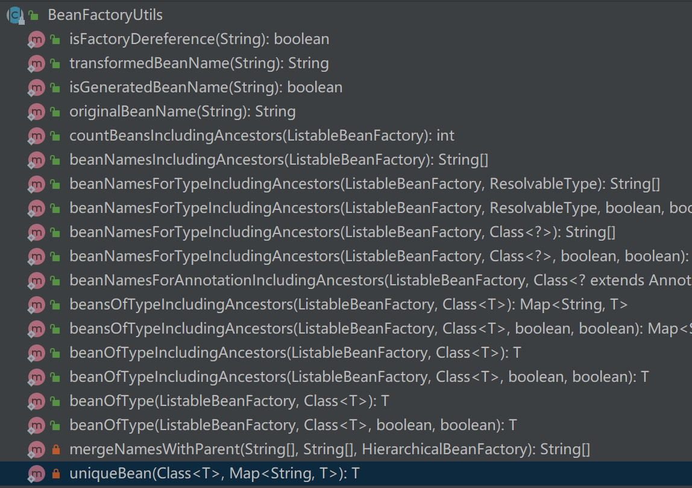

## BeanFactory Bean

### BeanFactory作为容器的Bean销毁过程

DefaultListableBeanFactory.destroySingleton是删除Bean的方法。下面从这进行Debug。

```java
// DefaultListableBeanFactory.java
public void destroySingleton(String beanName) {
    // DefaultSingletonBeanRegistry#destroySingleton
    super.destroySingleton(beanName);
    // 删除对应的手动注册的Bean
    removeManualSingletonName(beanName);
    // 删除所有的ByType缓存。缓存的内容是：
    // Class<?> -> beanNames
    clearByTypeCache();
}
private void removeManualSingletonName(String beanName) {
    updateManualSingletonNames(set -> set.remove(beanName), set -> set.contains(beanName));
}
private void updateManualSingletonNames(Consumer<Set<String>> action, 
                                        Predicate<Set<String>> condition) {
    if (hasBeanCreationStarted()) {
        // Cannot modify startup-time collection elements anymore (for stable iteration)
        synchronized (this.beanDefinitionMap) {
            if (condition.test(this.manualSingletonNames)) {
                Set<String> updatedSingletons = new LinkedHashSet<>(this.manualSingletonNames);
                action.accept(updatedSingletons);
                this.manualSingletonNames = updatedSingletons;
            }
        }
    }
    else {
        // Still in startup registration phase
        if (condition.test(this.manualSingletonNames)) {
            action.accept(this.manualSingletonNames);
        }
    }
}
private void clearByTypeCache() {
    this.allBeanNamesByType.clear();
    this.singletonBeanNamesByType.clear();
}
```

删除Bean在IOC容器中的缓存。

```java
public void destroySingleton(String beanName) {
    // Remove a registered singleton of the given name, if any.
    removeSingleton(beanName);

    // Destroy the corresponding DisposableBean instance.
    DisposableBean disposableBean;
    synchronized (this.disposableBeans) {
        // 如果Bean实现了DisposableBean接口或者自定义了关闭方法，disposableBean不为空
        disposableBean = (DisposableBean) this.disposableBeans.remove(beanName);
    }
    destroyBean(beanName, disposableBean);
}
// 从IOC容器中删除缓存
protected void removeSingleton(String beanName) {
    synchronized (this.singletonObjects) {
        this.singletonObjects.remove(beanName);
        this.singletonFactories.remove(beanName);
        this.earlySingletonObjects.remove(beanName);
        this.registeredSingletons.remove(beanName);
    }
}
protected void destroyBean(String beanName, @Nullable DisposableBean bean) {
    // Trigger destruction of dependent beans first...
    Set<String> dependencies;
    synchronized (this.dependentBeanMap) {
        // Within full synchronization in order to guarantee a disconnected Set
        dependencies = this.dependentBeanMap.remove(beanName);
    }
    if (dependencies != null) {
        if (logger.isTraceEnabled()) {
            logger.trace("Retrieved dependent beans for bean '" + beanName + "': " + dependencies);
        }
        // 删除那些依赖了这个Bean的Bean
        for (String dependentBeanName : dependencies) {
            destroySingleton(dependentBeanName);
        }
    }
    // Actually destroy the bean now...
    if (bean != null) {
        try {
            // 如果Bean实现了DisposableBean接口或者自定义了关闭方法，这里会调用。
            bean.destroy();
        }
        catch (Throwable ex) {
            if (logger.isWarnEnabled()) {
                logger.warn("Destruction of bean with name '" + beanName + "' threw an exception", ex);
            }
        }
    }

    // Trigger destruction of contained beans...
    Set<String> containedBeans;
    synchronized (this.containedBeanMap) {
        // Within full synchronization in order to guarantee a disconnected Set
        containedBeans = this.containedBeanMap.remove(beanName);
    }
    if (containedBeans != null) {
        for (String containedBeanName : containedBeans) {
            destroySingleton(containedBeanName);
        }
    }

    // Remove destroyed bean from other beans' dependencies.
    synchronized (this.dependentBeanMap) {
        for (Iterator<Map.Entry<String, Set<String>>> it = 
             	this.dependentBeanMap.entrySet().iterator(); it.hasNext();) {
            Map.Entry<String, Set<String>> entry = it.next();
            Set<String> dependenciesToClean = entry.getValue();
            dependenciesToClean.remove(beanName);
            if (dependenciesToClean.isEmpty()) {
                it.remove();
            }
        }
    }
    // Remove destroyed bean's prepared dependency information.
    this.dependenciesForBeanMap.remove(beanName);
}
```

在AbstractAutowireCapableBeanFactory#doCreateBean方法中会调用AbstractBeanFactory#registerDisposableBeanIfNecessary来注册Bean销毁方法。

```java
protected void registerDisposableBeanIfNecessary(String beanName, 
                                                 Object bean, RootBeanDefinition mbd) {
    AccessControlContext acc = (System.getSecurityManager() != null ? getAccessControlContext() : null);
    if (!mbd.isPrototype() && requiresDestruction(bean, mbd)) {
        if (mbd.isSingleton()) {
            // Register a DisposableBean implementation that performs all destruction
            // work for the given bean: DestructionAwareBeanPostProcessors,
            // DisposableBean interface, custom destroy method.
            registerDisposableBean(beanName, new DisposableBeanAdapter(bean, 
                                            		beanName, mbd, getBeanPostProcessors(), acc));
        }
        else {
            // A bean with a custom scope...
            Scope scope = this.scopes.get(mbd.getScope());
            if (scope == null) {
                throw new IllegalStateException("No Scope registered for scope name '" 
                                                + mbd.getScope() + "'");
            }
            scope.registerDestructionCallback(beanName, new DisposableBeanAdapter(bean, 
                                            			beanName, mbd, getBeanPostProcessors(), acc));
        }
    }
}
```

DisposableBeanAdapter是Disposable的实现类，它的构造方法就是确定我们有哪些销毁方法。我们直接看对destroy的实现。

```java
public void destroy() {
    // 执行DestructionAwareBeanPostProcessor#postProcessBeforeDestruction
    if (!CollectionUtils.isEmpty(this.beanPostProcessors)) {
        for (DestructionAwareBeanPostProcessor processor : this.beanPostProcessors) {
            processor.postProcessBeforeDestruction(this.bean, this.beanName);
        }
    }

    if (this.invokeDisposableBean) {
        if (logger.isTraceEnabled()) {
            logger.trace("Invoking destroy() on bean with name '" + this.beanName + "'");
        }
        // 如果Bean实现了DisposableBean，执行实现的destroy()方法。
        try {
            if (System.getSecurityManager() != null) {
                AccessController.doPrivileged((PrivilegedExceptionAction<Object>) () -> {
                    ((DisposableBean) this.bean).destroy();
                    return null;
                }, this.acc);
            }
            else {
                ((DisposableBean) this.bean).destroy();
            }
        }
        catch (Throwable ex) {
            String msg = "Invocation of destroy method failed on bean with name '" 
                						+ this.beanName + "'";
            if (logger.isDebugEnabled()) {
                logger.warn(msg, ex);
            }
            else {
                logger.warn(msg + ": " + ex);
            }
        }
    }

    if (this.destroyMethod != null) {
        // 执行自定义的销毁方法
        invokeCustomDestroyMethod(this.destroyMethod);
    }
    else if (this.destroyMethodName != null) {
        Method methodToInvoke = determineDestroyMethod(this.destroyMethodName);
        if (methodToInvoke != null) {
            invokeCustomDestroyMethod(ClassUtils.getInterfaceMethodIfPossible(methodToInvoke));
        }
    }
}
```


### 实例化Bean

#### ApplicationContext实例化对象

在Bean的创建过程中有一步是Bean的实例化，Bean的实例化有很多种方式，下面演示四种：

1. 构造器实例化
2. 静态方法实例化
3. 实例方法实例化
4. FactoryBean实例化

```java
public class BeanInstantiationDemo {
    public static void main(String[] args) {
        ClassPathXmlApplicationContext applicationContext = 
            new ClassPathXmlApplicationContext("META-INF/bean-instantiation-context.xml");
        applicationContext.refresh();
        Map<String, User> beansOfType = applicationContext.getBeansOfType(User.class);
        beansOfType.values().stream().forEach(System.out::println);
        applicationContext.close();
    }
}
```

```xml
<?xml version="1.0" encoding="UTF-8"?>
<beans xmlns="http://www.springframework.org/schema/beans"
  xmlns:xsi="http://www.w3.org/2001/XMLSchema-instance"
  xsi:schemaLocation="http://www.springframework.org/schema/beans
https://www.springframework.org/schema/beans/spring-beans.xsd">

  <!-- 构造方法实例化 -->
  <bean class="fsc.domain.User" id="create-by-constructor">
    <constructor-arg name="id" value="1"/>
    <constructor-arg name="name" value="JACK MA"/>
    <constructor-arg name="city" value="HANGZHOU"/>
  </bean>

  <!-- 静态方法实例化 Bean -->
  <bean id="create-by-static-method" class="sb.holder.UserFactory" 
        factory-method="createUserByStaticMethod"/>

  <!-- 实例（Bean）方法实例化 Bean -->
  <bean id="create-by-instance-method" class="fsc.domain.User" 
        factory-bean="userFactory" factory-method="createUserByInstanceMethod"/>
  <bean id="userFactory" class="sb.holder.UserFactory"/>

  <!-- Factory Bean实例化 -->
  <bean id="create-by-factory-bean" class="sb.holder.UserFactoryBean"/>
</beans>
```

```java
public class UserFactory {
    @Override
    public User createUserByInstanceMethod() {
        User user = new User();
        user.setId(1L);
        user.setName("isjinhao");
        return user;
    }

    public static User createUserByStaticMethod() {
        User user = new User();
        user.setId(1L);
        user.setName("isjinhao");
        return user;
    }
}
```

```java
@Setter
@Getter
@ToString
public class User {
    private Long id;
    private String name;
    private City city;
    private City[] workCities;
    private List<City> lifeCities;
    private Resource configFileLocation;
    public User(Long id, String name, City city) {
        this.id = id;
        this.name = name;
        this.city = city;
    }
    public User() { }
}
```

```java
public class UserFactoryBean implements FactoryBean<User> {
    @Override
    public User getObject() throws Exception {
        User user = new User();
        user.setId(1L);
        user.setName("isjinhao");
        return user;
    }

    @Override
    public Class<?> getObjectType() {
        return User.class;
    }
}
```

#### BeanFactory注册BeanDefinition实例化对象

```java
public class BeanFactoryBeanInstantiationDemo {
    
    public static void main(String[] args) {
        DefaultListableBeanFactory beanFactory = new DefaultListableBeanFactory();
        createByFactoryBean(beanFactory);
        createByInstanceMethod(beanFactory);
        createByStaticMethod(beanFactory);
        Map<String, User> beansOfType = beanFactory.getBeansOfType(User.class);
        beansOfType.values().stream().forEach(System.out::println);
        //         我们一共注册了四个Bean：create-by-factory-bean, userFactory, 
        //				create-by-instance-method, create-by-static-method
        System.out.println(Arrays.deepToString(beanFactory.getSingletonNames()));
        // 可以获取FactoryBean本身，他是一个singleton，但是去取它本身的时候需要使用&+beanName
        System.out.println(beanFactory.getBean("&create-by-factory-bean"));
        System.out.println(beanFactory.getSingleton("create-by-factory-bean"));
        // 对于FactoryBean来说，直接取它本身，会去除getObject()返回的值。
        System.out.println(beanFactory.getBean("create-by-factory-bean"));
        // 所以存储的四个Bean是：
        //  create-by-factory-bean -> UserFactoryBean.class
        //  userFactory -> UserFactory.class
        //  create-by-instance-method -> User.class
        //  create-by-static-method -> User.class
    }
    private static void createByFactoryBean(DefaultListableBeanFactory beanFactory) {
        BeanDefinitionBuilder beanDefinitionBuilder = 
            BeanDefinitionBuilder.genericBeanDefinition(UserFactoryBean.class);
        beanFactory.registerBeanDefinition("create-by-factory-bean", 
                                           beanDefinitionBuilder.getBeanDefinition());
    }
    private static void createByStaticMethod(DefaultListableBeanFactory beanFactory) {
        BeanDefinitionBuilder beanDefinitionBuilder = 
            BeanDefinitionBuilder.genericBeanDefinition(UserFactory.class);
        beanDefinitionBuilder.setFactoryMethod("createUserByStaticMethod");
        beanFactory.registerBeanDefinition("create-by-static-method", 
                                           beanDefinitionBuilder.getBeanDefinition());
    }
    private static void createByInstanceMethod(DefaultListableBeanFactory beanFactory) {
        BeanDefinitionBuilder beanDefinitionBuilder1 = 
            BeanDefinitionBuilder.genericBeanDefinition(UserFactory.class);
        beanFactory.registerBeanDefinition("userFactory", beanDefinitionBuilder1.getBeanDefinition());
        BeanDefinitionBuilder beanDefinitionBuilder2 = 
            BeanDefinitionBuilder.genericBeanDefinition(User.class);
        beanDefinitionBuilder2.setFactoryMethodOnBean("createUserByInstanceMethod", "userFactory");
        beanFactory.registerBeanDefinition("create-by-instance-method", 
                                           beanDefinitionBuilder2.getBeanDefinition());
    }
    
}
```

#### SPI接口实现

UserFactory继承此接口：

```java
public interface UserFactoryInterface {
    User createUserByInstanceMethod();
}
```

在src/main/resources/META-INF/services目录下创建文件：sb.holder.UserFactoryInterface，文件内容：

```
sb.holder.UserFactory
```

然后就可以使用SPI接口生成一个Bean。

```java
public class SpecialBeanInstantiationDemo {

    public static void main(String[] args) {
        ApplicationContext applicationContext = 
            new ClassPathXmlApplicationContext("META-INF/special-bean-instantiation-context.xml");
        AutowireCapableBeanFactory capableBeanFactory = 
            applicationContext.getAutowireCapableBeanFactory();
        UserFactory userFactory = capableBeanFactory.createBean(UserFactory.class);
        System.out.println(userFactory.createUser());
        ServiceLoader serviceLoader = 
            applicationContext.getBean("userFactoryServiceLoader", ServiceLoader.class);
        displayServiceLoader(serviceLoader);
        System.out.println("---------------------------");
        demoServiceLoader();
    }

    public static void demoServiceLoader() {
        ServiceLoader<UserFactoryInterface> serviceLoader = 
            ServiceLoader.load(UserFactoryInterface.class, 
                               Thread.currentThread().getContextClassLoader());
        displayServiceLoader(serviceLoader);
    }

    public static void displayServiceLoader(ServiceLoader serviceLoader) {
        Iterator<UserFactoryInterface> iterator = serviceLoader.iterator();
        while (iterator.hasNext()) {
            UserFactoryInterface userFactoryInterface = iterator.next();
            System.out.println(userFactoryInterface.createUser());
        }
    }
}
```

```xml
<?xml version="1.0" encoding="UTF-8"?>
<beans xmlns="http://www.springframework.org/schema/beans"
       xmlns:xsi="http://www.w3.org/2001/XMLSchema-instance"
       xsi:schemaLocation="http://www.springframework.org/schema/beans
        https://www.springframework.org/schema/beans/spring-beans.xsd">

    <bean id="userFactoryServiceLoader" 
          class="org.springframework.beans.factory.serviceloader.ServiceLoaderFactoryBean">
        <property name="serviceType" value="sb.holder.UserFactory" />
    </bean>
</beans>
```


### 在BeanFactory容器中拦截Bean的初始化和销毁

```xml
<!-- bean-lifecycle-context.xml -->
<?xml version="1.0" encoding="UTF-8"?>
<beans xmlns="http://www.springframework.org/schema/beans"
  xmlns:xsi="http://www.w3.org/2001/XMLSchema-instance"
  xsi:schemaLocation="http://www.springframework.org/schema/beans
https://www.springframework.org/schema/beans/spring-beans.xsd">

  <bean class="bb.lifecycle.BeanFactoryDomain" id="create-by-constructor" init-method="myInitMethod" destroy-method="myDestroyMethod">
    <constructor-arg name="age" value="10"></constructor-arg>
    <constructor-arg name="name" value="create-by-constructor"></constructor-arg>
  </bean>

  <bean id="create-by-factory-bean" class="bb.lifecycle.BeanFactoryDomainFactoryBean"/>
</beans>
```

```java
@Getter
@Setter
@ToString
public class BeanFactoryDomain implements DisposableBean, InitializingBean, BeanFactoryAware, BeanNameAware, BeanClassLoaderAware {
    private Integer age;
    private String name;
    public BeanFactoryDomain(Integer age, String name) {
        this.age = age;
        this.name = name;
    }
    @Override
    public void destroy() throws Exception {
        System.out.println("12、DisposableBean#destroy");
    }
    @Override
    public void afterPropertiesSet() throws Exception {
        System.out.println("8、InitializingBean#afterPropertiesSet");
    }
    @Override
    public void setBeanClassLoader(ClassLoader classLoader) {
        System.out.println("5、BeanClassLoaderAware#setBeanClassLoader");
    }
    @Override
    public void setBeanFactory(BeanFactory beanFactory) throws BeansException {
        System.out.println("6、BeanFactoryAware#setBeanFactory");
    }
    @Override
    public void setBeanName(String name) {
        System.out.println("4、BeanNameAware#setBeanName");
    }
    public void myInitMethod() {
        System.out.println("9、myInitMethod");
    }
    public void myDestroyMethod () {
        System.out.println("13、myDestroyMethod");
    }
}
```

```java
public class BeanFactoryDomainFactoryBean implements FactoryBean<BeanFactoryDomain> {
    @Override
    public BeanFactoryDomain getObject() throws Exception {
        return new BeanFactoryDomain(20, "create-by-factory-bean");
    }
    @Override
    public Class<?> getObjectType() {
        return BeanFactoryDomain.class;
    }
}
```

```java
public class BeanFactoryLifeCycleDemo {
    static class TestMergedBeanDefinitionPostProcessor implements MergedBeanDefinitionPostProcessor {
        @Override
        public void postProcessMergedBeanDefinition(RootBeanDefinition beanDefinition, Class<?> beanType, String beanName) {
            System.out.println("2、MergedBeanDefinitionPostProcessor#postProcessMergedBeanDefinition：" + 
                               beanDefinition.getBeanClass());
        }
    }
    static class TestInstantiationAwareBeanPostProcessor implements InstantiationAwareBeanPostProcessor {
        @Override
        public boolean postProcessAfterInstantiation(Object bean, String beanName) throws BeansException {
            System.out.println("3、InstantiationAwareBeanPostProcessor#postProcessAfterInstantiation：" + bean.getClass());
            return false;
        }
        @Override
        public Object postProcessBeforeInstantiation(Class<?> beanClass, String beanName) throws BeansException {
            System.out.println("1、InstantiationAwareBeanPostProcessor#postProcessBeforeInstantiation：" + beanClass);
            return null;
        }
        @Override
        public PropertyValues postProcessProperties(PropertyValues pvs, Object bean, String beanName) throws BeansException {
            System.out.println("InstantiationAwareBeanPostProcessor#postProcessProperties");
            return null;
        }
    }
    static class TestBeanPostProcessor implements BeanPostProcessor {
        @Override
        public Object postProcessBeforeInitialization(Object bean, String beanName) throws BeansException {
            System.out.println("7、BeanPostProcessor#postProcessBeforeInitialization：" + bean.getClass());
            return null;
        }
        @Override
        public Object postProcessAfterInitialization(Object bean, String beanName) throws BeansException {
            System.out.println("10、BeanPostProcessor#postProcessAfterInitialization：" + bean.getClass());
            return null;
        }
    }
    static class MyDestructionAwareBeanPostProcessor implements DestructionAwareBeanPostProcessor {
        @Override
        public void postProcessBeforeDestruction(Object bean, String beanName) throws BeansException {
            System.out.println("11、DestructionAwareBeanPostProcessor#postProcessBeforeDestruction：" + bean.getClass());
        }
    }
    public static void main(String[] args) {
        DefaultListableBeanFactory beanFactory = new DefaultListableBeanFactory();
        XmlBeanDefinitionReader reader = new XmlBeanDefinitionReader(beanFactory);
        // XML 配置文件 ClassPath 路径
        String location = "META-INF/bean-lifecycle-context.xml";
        // 加载配置
        int beanDefinitionsCount = reader.loadBeanDefinitions(location);
        System.out.println("Bean 定义加载的数量：" + beanDefinitionsCount);
        beanFactory.addBeanPostProcessor(new TestMergedBeanDefinitionPostProcessor());
        beanFactory.addBeanPostProcessor(new TestInstantiationAwareBeanPostProcessor());
        beanFactory.addBeanPostProcessor(new TestBeanPostProcessor());
        beanFactory.addBeanPostProcessor(new MyDestructionAwareBeanPostProcessor());
        // 依赖查找集合对象
        beanFactory.getBean("create-by-constructor");
        beanFactory.destroySingleton("create-by-constructor");
        System.out.println("----------------------------------");
        beanFactory.getBean("create-by-factory-bean");
        beanFactory.destroySingleton("create-by-factory-bean");
    }
}
```

结果如下：

```
Bean 定义加载的数量：2
1、InstantiationAwareBeanPostProcessor#postProcessBeforeInstantiation：class bb.lifecycle.BeanFactoryDomain
2、MergedBeanDefinitionPostProcessor#postProcessMergedBeanDefinition：class bb.lifecycle.BeanFactoryDomain
3、InstantiationAwareBeanPostProcessor#postProcessAfterInstantiation：class bb.lifecycle.BeanFactoryDomain
4、BeanNameAware#setBeanName
5、BeanClassLoaderAware#setBeanClassLoader
6、BeanFactoryAware#setBeanFactory
7、BeanPostProcessor#postProcessBeforeInitialization：class bb.lifecycle.BeanFactoryDomain
8、InitializingBean#afterPropertiesSet
9、myInitMethod
10、BeanPostProcessor#postProcessAfterInitialization：class bb.lifecycle.BeanFactoryDomain
11、DestructionAwareBeanPostProcessor#postProcessBeforeDestruction：class bb.lifecycle.BeanFactoryDomain
12、DisposableBean#destroy
13、myDestroyMethod
----------------------------------
1、InstantiationAwareBeanPostProcessor#postProcessBeforeInstantiation：class bb.lifecycle.BeanFactoryDomainFactoryBean
2、MergedBeanDefinitionPostProcessor#postProcessMergedBeanDefinition：class bb.lifecycle.BeanFactoryDomainFactoryBean
3、InstantiationAwareBeanPostProcessor#postProcessAfterInstantiation：class bb.lifecycle.BeanFactoryDomainFactoryBean
7、BeanPostProcessor#postProcessBeforeInitialization：class bb.lifecycle.BeanFactoryDomainFactoryBean
10、BeanPostProcessor#postProcessAfterInitialization：class bb.lifecycle.BeanFactoryDomainFactoryBean
10、BeanPostProcessor#postProcessAfterInitialization：class bb.lifecycle.BeanFactoryDomain
11、DestructionAwareBeanPostProcessor#postProcessBeforeDestruction：class bb.lifecycle.BeanFactoryDomainFactoryBean
```

在构造器构造的Bean中，一共有13个步骤可以拦截User的初始化，但是在FactoryBean构造的Bean中，虽然有7个步骤，但是真正能对User进行操作的只有第10步，其他的都是对BeanFactoryDomainFactoryBean本身操作。


### BeanDefinition的合并

如果B类继承了A类，那么在实例化B类的时候，父类的BeanDefinition的数据可以子类被使用。完成这一功能的步骤是BeanDefinition的合并。

```xml
<?xml version="1.0" encoding="UTF-8"?>
<beans xmlns="http://www.springframework.org/schema/beans"
  xmlns:xsi="http://www.w3.org/2001/XMLSchema-instance"
  xsi:schemaLocation="http://www.springframework.org/schema/beans
https://www.springframework.org/schema/beans/spring-beans.xsd">

  <bean class="bb.lifecycle.BeanFactoryDomain" id="create-by-constructor" 
        init-method="myInitMethod" destroy-method="myDestroyMethod">
    <constructor-arg name="age" value="10"></constructor-arg>
    <constructor-arg name="name" value="create-by-constructor"></constructor-arg>
  </bean>

  <bean class="bb.lifecycle.BeanFactoryDomainExtended" id="child-bean" parent="create-by-constructor" />

</beans>
```

```java
public class BeanDefinitionMergeDemo {
    public static void main(String[] args) {
        DefaultListableBeanFactory beanFactory = new DefaultListableBeanFactory();
        XmlBeanDefinitionReader reader = new XmlBeanDefinitionReader(beanFactory);
        String location = "META-INF/bean-merge-context.xml";
        // 加载配置
        int beanDefinitionsCount = reader.loadBeanDefinitions(location);
        System.out.println("Bean 定义的数量：" + beanDefinitionsCount);
        System.out.println(beanFactory.getBean("child-bean"));
        System.out.println("Bean 加载的数量：" + beanFactory.getSingletonCount());
        beanFactory.destroySingleton("child-bean");
    }
}
```

#### BeanDefiniton合并的源码Debug

AbstractBeanFactory#doGetBean会调用AbstractBeanFactory#getMergedLocalBeanDefinition，这个方法会合并BeanDefinition。

```java
// AbstractBeanFactory.java
protected RootBeanDefinition getMergedLocalBeanDefinition(String beanName) throws BeansException {
    // Quick check on the concurrent map first, with minimal locking.
    RootBeanDefinition mbd = this.mergedBeanDefinitions.get(beanName);
    if (mbd != null && !mbd.stale) {
        return mbd;
    }
    // getBeanDefinition方法就是从beanDefinitionMap里面查找
    return getMergedBeanDefinition(beanName, getBeanDefinition(beanName));
}
protected RootBeanDefinition getMergedBeanDefinition(String beanName, BeanDefinition bd)
    throws BeanDefinitionStoreException {
    return getMergedBeanDefinition(beanName, bd, null);
}
protected RootBeanDefinition getMergedBeanDefinition(
    String beanName, BeanDefinition bd, @Nullable BeanDefinition containingBd)
    throws BeanDefinitionStoreException {

    synchronized (this.mergedBeanDefinitions) {
        RootBeanDefinition mbd = null;
        RootBeanDefinition previous = null;

        // Check with full lock now in order to enforce the same merged instance.
        if (containingBd == null) {
            mbd = this.mergedBeanDefinitions.get(beanName);
        }
        if (mbd == null || mbd.stale) {
            previous = mbd;
            if (bd.getParentName() == null) {
                // Use copy of given root bean definition.
                if (bd instanceof RootBeanDefinition) {
                    mbd = ((RootBeanDefinition) bd).cloneBeanDefinition();
                }
                else {
                    mbd = new RootBeanDefinition(bd);
                }
            }
            else {
                // Child bean definition: needs to be merged with parent.
                BeanDefinition pbd;
                try {
                    String parentBeanName = transformedBeanName(bd.getParentName());
                    if (!beanName.equals(parentBeanName)) {
                        // 递归调用，用于获取父亲的BeanDefinition
                        pbd = getMergedBeanDefinition(parentBeanName);
                    }
                    else {
                        BeanFactory parent = getParentBeanFactory();
                        if (parent instanceof ConfigurableBeanFactory) {
                            pbd = ((ConfigurableBeanFactory) parent).
                                getMergedBeanDefinition(parentBeanName);
                        }
                        else {
                            // 异常处理...
                        }
                    }
                }
                // 异常处理...
                // pbd是父亲的BeanDefinition，这是一次深拷贝。
                mbd = new RootBeanDefinition(pbd);
                // bd是当前Bean的BeanDefinition，用当前的值覆盖之前的值
                mbd.overrideFrom(bd);
            }
            // Set default singleton scope, if not configured before.
            if (!StringUtils.hasLength(mbd.getScope())) {
                mbd.setScope(SCOPE_SINGLETON);
            }
            // A bean contained in a non-singleton bean cannot be a singleton itself.
            // Let's correct this on the fly here, since this might be the result of
            // parent-child merging for the outer bean, in which case the original inner bean
            // definition will not have inherited the merged outer bean's singleton status.
            if (containingBd != null && !containingBd.isSingleton() && mbd.isSingleton()) {
                mbd.setScope(containingBd.getScope());
            }
            // Cache the merged bean definition for the time being
            // (it might still get re-merged later on in order to pick up metadata changes)
            if (containingBd == null && isCacheBeanMetadata()) {
                this.mergedBeanDefinitions.put(beanName, mbd);
            }
        }
        if (previous != null) {
            copyRelevantMergedBeanDefinitionCaches(previous, mbd);
        }
        return mbd;
    }
}
```


### ObjectProvider

Spring依赖注入时有一个ObjectProvider拓展点，虽然现在没有用到，但是我们先看看BeanFactory如何获取一个ObjectProvider。

```java
public class ObjectProviderDemo {
    public static void main(String[] args) {
        BeanDefinitionBuilder beanDefinitionBuilder = 
            BeanDefinitionBuilder.genericBeanDefinition(User.class);
        beanDefinitionBuilder.addPropertyValue("id", 1);
        beanDefinitionBuilder.addPropertyValue("name", "isjinhao");
        beanDefinitionBuilder.setLazyInit(true);
        // 创建 BeanFactory 容器
        DefaultListableBeanFactory beanFactory = new DefaultListableBeanFactory();
        beanFactory.registerBeanDefinition("aha", beanDefinitionBuilder.getBeanDefinition());
        ObjectProvider<User> objectProvider = beanFactory.getBeanProvider(User.class);
        System.out.println(objectProvider.getObject());
        System.out.println("获得了 ObjectProvider 对象，接下来获得 User 对象");
        System.out.println(objectProvider.getObject());
    }
}
```

```java
// DefaultListableBeanFactory.java	
public <T> ObjectProvider<T> getBeanProvider(Class<T> requiredType) throws BeansException {
    Assert.notNull(requiredType, "Required type must not be null");
    return getBeanProvider(ResolvableType.forRawClass(requiredType));
}
public <T> ObjectProvider<T> getBeanProvider(ResolvableType requiredType) {
    return new BeanObjectProvider<T>() {
        @Override
        public T getObject() throws BeansException {
            T resolved = resolveBean(requiredType, null, false);
            if (resolved == null) {
                throw new NoSuchBeanDefinitionException(requiredType);
            }
            return resolved;
        }
        @Override
        public T getObject(Object... args) throws BeansException {
            T resolved = resolveBean(requiredType, args, false);
            if (resolved == null) {
                throw new NoSuchBeanDefinitionException(requiredType);
            }
            return resolved;
        }
        @Override
        @Nullable
        public T getIfAvailable() throws BeansException {
            return resolveBean(requiredType, null, false);
        }
        @Override
        @Nullable
        public T getIfUnique() throws BeansException {
            return resolveBean(requiredType, null, true);
        }
        @Override
        public Stream<T> stream() {
            return Arrays.stream(getBeanNamesForTypedStream(requiredType))
                .map(name -> (T) getBean(name))
                .filter(bean -> !(bean instanceof NullBean));
        }
        @Override
        public Stream<T> orderedStream() {
            String[] beanNames = getBeanNamesForTypedStream(requiredType);
            Map<String, T> matchingBeans = new LinkedHashMap<>(beanNames.length);
            for (String beanName : beanNames) {
                Object beanInstance = getBean(beanName);
                if (!(beanInstance instanceof NullBean)) {
                    matchingBeans.put(beanName, (T) beanInstance);
                }
            }
            Stream<T> stream = matchingBeans.values().stream();
            return stream.sorted(adaptOrderComparator(matchingBeans));
        }
    };
}
```

BeanObjectProvider是ObjectProvider子接口。它只返回一个代理，真正的Bean在getObject()方法执行的时候才获取。

```java
// DefaultListableBeanFactory.BeanObjectProvider.class
public T getObject() throws BeansException {
    T resolved = resolveBean(requiredType, null, false);
    if (resolved == null) {
        throw new NoSuchBeanDefinitionException(requiredType);
    }
    return resolved;
}
```

```java
// DefaultListableBeanFactory.java
private <T> T resolveBean(ResolvableType requiredType, 
                          @Nullable Object[] args, boolean nonUniqueAsNull) {
    // 这里返回的是个包装类，内部有两个属性：beanName和beanInstance
    NamedBeanHolder<T> namedBean = resolveNamedBean(requiredType, args, nonUniqueAsNull);
    if (namedBean != null) {
        return namedBean.getBeanInstance();
    }
    BeanFactory parent = getParentBeanFactory();
    if (parent instanceof DefaultListableBeanFactory) {
        return ((DefaultListableBeanFactory) parent).resolveBean(requiredType, args, nonUniqueAsNull);
    }
    else if (parent != null) {
        ObjectProvider<T> parentProvider = parent.getBeanProvider(requiredType);
        if (args != null) {
            return parentProvider.getObject(args);
        }
        else {
            return (nonUniqueAsNull ? parentProvider.getIfUnique() : parentProvider.getIfAvailable());
        }
    }
    return null;
}
private <T> NamedBeanHolder<T> resolveNamedBean(ResolvableType requiredType, 
    	@Nullable Object[] args, boolean nonUniqueAsNull) throws BeansException {
    Assert.notNull(requiredType, "Required type must not be null");
    String[] candidateNames = getBeanNamesForType(requiredType);

    if (candidateNames.length > 1) {
        List<String> autowireCandidates = new ArrayList<>(candidateNames.length);
        for (String beanName : candidateNames) {
            if (!containsBeanDefinition(beanName) || 
                	getBeanDefinition(beanName).isAutowireCandidate()) {
                autowireCandidates.add(beanName);
            }
        }
        if (!autowireCandidates.isEmpty()) {
            candidateNames = StringUtils.toStringArray(autowireCandidates);
        }
    }
	// 当此类型的对象只有一个的时候，直接取出来
    if (candidateNames.length == 1) {
        String beanName = candidateNames[0];
        return new NamedBeanHolder<>(beanName, (T) getBean(beanName, requiredType.toClass(), args));
    }
    else if (candidateNames.length > 1) {
        Map<String, Object> candidates = new LinkedHashMap<>(candidateNames.length);
        for (String beanName : candidateNames) {
            if (containsSingleton(beanName) && args == null) {
                Object beanInstance = getBean(beanName);
                candidates.put(beanName, (beanInstance instanceof NullBean ? null : beanInstance));
            }
            else {
                candidates.put(beanName, getType(beanName));
            }
        }
        // 如果有多个的话，优先去Primary的实例
        String candidateName = determinePrimaryCandidate(candidates, requiredType.toClass());
        if (candidateName == null) {
            // 没有实例被标记为Primary的时候，取Order最高的
            candidateName = determineHighestPriorityCandidate(candidates, requiredType.toClass());
        }
        if (candidateName != null) {
            Object beanInstance = candidates.get(candidateName);
            if (beanInstance == null || beanInstance instanceof Class) {
                beanInstance = getBean(candidateName, requiredType.toClass(), args);
            }
            return new NamedBeanHolder<>(candidateName, (T) beanInstance);
        }
        if (!nonUniqueAsNull) {
            throw new NoUniqueBeanDefinitionException(requiredType, candidates.keySet());
        }
    }
    return null;
}
```


### BeanFactory的继承

之前代码Debug，遇到了工厂继承的实现，所以这里就演示一下。

```java
public class HierarchicalDemo {

    public static void main(String[] args) {
        DefaultListableBeanFactory parentFactory = new DefaultListableBeanFactory();
        DefaultListableBeanFactory childFactory = new DefaultListableBeanFactory();
        childFactory.setParentBeanFactory(parentFactory);

        // 在父工厂中定义一个parentBean
        BeanDefinitionBuilder beanDefinitionBuilder1 = BeanDefinitionBuilder.genericBeanDefinition(User.class);
        beanDefinitionBuilder1.addPropertyValue("id", 1);
        beanDefinitionBuilder1.addPropertyValue("name", "isjinhao");
        AbstractBeanDefinition beanDefinition1 = beanDefinitionBuilder1.getBeanDefinition();
        parentFactory.registerBeanDefinition("parentBean", beanDefinition1);
        // 在子工厂中定义一个childBean
        BeanDefinitionBuilder beanDefinitionBuilder2 = BeanDefinitionBuilder.genericBeanDefinition(User.class);
        beanDefinitionBuilder2.addPropertyValue("id", 2);
        beanDefinitionBuilder2.addPropertyValue("name", "zhanjinhao");
        AbstractBeanDefinition beanDefinition2 = beanDefinitionBuilder2.getBeanDefinition();
        childFactory.registerBeanDefinition("childBean", beanDefinition2);

        // 子工厂获取父亲的Bean，可以获取到
        System.out.println(childFactory.getBean("parentBean"));
        // 父工厂获取孩子的Bean，抛异常
        System.out.println(parentFactory.getBean("childBean"));
    }

}
```


## 依赖查找

BeanFactory只提供了依赖查找的功能。依赖注入是ApplicationContext提供的功能。下面演示一下依赖查找找不到的情况，以及常见的异常。


### 类型安全的依赖查找

在开发时，很可能某个Bean是无法查找的情况，Spring在实现的时候有些情况抛出异常，有些情况返回null。所以下面就演示一下常用的依赖查找对应的处理方式。

- 按BeanName查找Bean
- 按Bean的类型查找
- 查找ObjectFactory
- 查找ObjectProvider
- 查找ObjectProvider的Stream

```java
public class TypeSafetyDependencyLookupDemo {

    public static void main(String[] args) {
        // 创建 BeanFactory 容器
        DefaultListableBeanFactory beanFactory = new DefaultListableBeanFactory();

        // 演示按名称查找Bean的安全性
        displayBeanFactoryGetBeanByName(beanFactory, "isjinhao");

        // 演示 BeanFactory#getBean 方法的安全性
        displayBeanFactoryGetBean(beanFactory);

        // 演示 ObjectFactory#getObject 方法的安全性
        displayObjectFactoryGetObject(beanFactory);

        // 演示 ObjectProvider#getIfAvaiable 方法的安全性
        displayObjectProviderIfAvailable(beanFactory);

        // 演示 ListableBeanFactory#getBeansOfType 方法的安全性
        displayListableBeanFactoryGetBeansOfType(beanFactory);

        // 演示 ObjectProvider Stream 操作的安全性
        displayObjectProviderStreamOps(beanFactory);

    }

    private static void displayBeanFactoryGetBeanByName(BeanFactory beanFactory, String beanName) {
        printBeansException("displayBeanFactoryGetBean", () -> beanFactory.getBean(beanName));
    }

    public static void displayBeanFactoryGetBean(BeanFactory beanFactory) {
        printBeansException("displayBeanFactoryGetBean", () -> beanFactory.getBean(User.class));
    }

    private static void displayObjectFactoryGetObject(DefaultListableBeanFactory beanFactory) {
        // ObjectProvider is ObjectFactory
        ObjectFactory<User> userObjectFactory = beanFactory.getBeanProvider(User.class);
        printBeansException("displayObjectFactoryGetObject", () -> userObjectFactory.getObject());
    }

    private static void displayObjectProviderIfAvailable(DefaultListableBeanFactory beanFactory) {
        ObjectProvider<User> userObjectProvider = beanFactory.getBeanProvider(User.class);
        printBeansException("displayObjectProviderIfAvailable", () -> userObjectProvider.getIfAvailable());
    }

    private static void displayListableBeanFactoryGetBeansOfType(ListableBeanFactory beanFactory) {
        printBeansException("displayListableBeanFactoryGetBeansOfType", () -> beanFactory.getBeansOfType(User.class));
    }

    private static void displayObjectProviderStreamOps(BeanFactory beanFactory) {
        ObjectProvider<User> userObjectProvider = beanFactory.getBeanProvider(User.class);
        printBeansException("displayObjectProviderStreamOps", () -> userObjectProvider.forEach(System.out::println));
    }

    private static void printBeansException(String source, Runnable runnable) {
        System.err.println("Source from :" + source);
        try {
            runnable.run();
            System.out.println("");
        } catch (BeansException exception) {
            exception.printStackTrace();
        }
        System.err.println("==========================================\n\n\n");
    }

}
```


### 依赖查找最可能出现的三种异常

**BeanCreationException**

```java
public class BeanCreationExceptionDemo {
    public static void main(String[] args) {
        // 创建 BeanFactory 容器
        DefaultListableBeanFactory beanFactory = new DefaultListableBeanFactory();

        // 注册 BeanDefinition Bean Class 是一个 POJO 普通类，不过初始化方法回调时抛出异常
        BeanDefinitionBuilder beanDefinitionBuilder = 
            BeanDefinitionBuilder.genericBeanDefinition(POJO.class);
        beanFactory.registerBeanDefinition("errorBean", beanDefinitionBuilder.getBeanDefinition());
        System.out.println(beanFactory.getBean(POJO.class));
    }

    static class POJO implements InitializingBean {
        @Override
        public void afterPropertiesSet() throws Exception {
            throw new Exception("afterPropertiesSet() : exception ...");
        }
    }
}
```

**BeanInstantiationException**

```java
public class BeanInstantiationExceptionDemo 
    public static void main(String[] args) {
        // 创建 BeanFactory 容器
        DefaultListableBeanFactory beanFactory = new DefaultListableBeanFactory();

        // 注册 Bean。CharSequence 是一个接口
        BeanDefinitionBuilder beanDefinitionBuilder = 
        	BeanDefinitionBuilder.genericBeanDefinition(CharSequence.class);
        beanFactory.registerBeanDefinition("errorBean", beanDefinitionBuilder.getBeanDefinition());
        System.out.println(beanFactory.getBean("errorBean"));
    }
}
```

**NoUniqueBeanDefinitionException**

```java
public class NoUniqueBeanDefinitionExceptionDemo {
    public static void main(String[] args) {

        // 这里偷个懒，使用了注解，但是getBean()方法底层还是调用了DefaultListableBeanFactory的getBean()

        // 创建 BeanFactory 容器
        AnnotationConfigApplicationContext applicationContext = 
            new AnnotationConfigApplicationContext();
        // 将当前类 NoUniqueBeanDefinitionExceptionDemo 作为配置类（Configuration Class）
        applicationContext.register(NoUniqueBeanDefinitionExceptionDemo.class);
        // 启动应用上下文
        applicationContext.refresh();

        try {
            // 由于 Spring 应用上下文存在两个 String 类型的 Bean，通过单一类型查找会抛出异常
            applicationContext.getBean(String.class);
        } catch (NoUniqueBeanDefinitionException e) {
            System.err.printf(" Spring 应用上下文存在%d个 %s 类型的 Bean，具体原因：%s%n",
                    e.getNumberOfBeansFound(),
                    String.class.getName(),
                    e.getMessage());
        }
        // 关闭应用上下文
        applicationContext.close();
    }

    @Bean
    public String bean1() {
        return "1";
    }

    @Bean
    public String bean2() {
        return "2";
    }

    @Bean
    public String bean3() {
        return "3";
    }
}
```


### BeanFactoryUtils

BeanFactoryUtils是beans包提供的一个操作Spring的工具类，我们之前见过他的一个方法：transformedBeanName，它的目的是去除FactoryBean本身Bean的&前缀。



相关的方法都在上面，不再一一演示。


