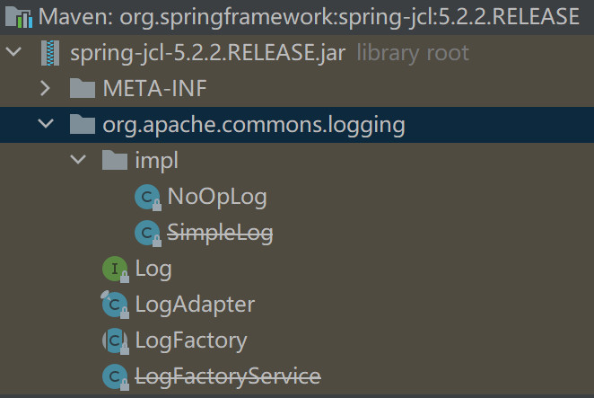

## IOC

### IOC容器

假如有这么一个需要，查询并展示指定导演拍摄的电影。设计流程如下：

1、首先有一个类是提供给客户的，这个类是一个UI类，为了简便，Demo里使用控制台。

```java
public class MovieLister {
    private MovieFinder finder = new ColonDelimitedMovieFinder();
    public void showMoviesDirectedBy(String director) {
        List allMovies = finder.findAll();
        for (Iterator it = allMovies.iterator(); it.hasNext(); ) {
            Movie movie = (Movie) it.next();
            if (!movie.getDirector().equals(director)) {
                it.remove();
            }
        }
        System.out.println(allMovies.toArray());
    }
}
```

2、第二个类是一个实体类，代表电影。

```java
public class Movie {
    public String getDirector(){
        // 具体实现略
        return "";
    }
}
```

3、第三个类就是查询类，它应当是一个接口，这样的话我们才可以从不同的存储介质里获取电影的信息。

```java
public interface MovieFinder {
    List findAll();
}
```

4、我们给出一个实现类，假设电影信息保存在逗号分隔的文本文件中。

```java
public class ColonDelimitedMovieFinder implements MovieFinder {
    @Override
    public List findAll() {
        return null;
    }
}
```

这样的话，当我们在使用这个功能的时候客户端可以这么编写。

```java
public class Client {
    public static void main(String[] args) {
        MovieLister movieLister = new MovieLister();
        movieLister.ShowMoviesDirectedBy("wangwu");
    }
}
```

我们可以看见，在整个功能的实现中，`MovieLister` 类依赖了 `MovieFinder` 接口，这时候符合依赖倒置的原则。此时我们分析一下三者之间的依赖关系。

<div align="center"></div>

从图中可以看见，依赖关系非常的复杂，如果所有的类都是同一个人编写，那么没有什么问题，但是如果是由两个并不认识的人写这个功能，比如王五写了主要的结构，赵六写了一个通过爬虫来获取电影的 `CrawlerFinder`，`CrawlerFinder` 和其他模块该怎么工作呢？有人会说直接new一个 `CrawlerFinder` 的实例赋值给finder不就行了吗？注意，请不要站在上帝视角看待问题，假设王五已经使用`ColonDelimitedMovieFinder` 完成了这个功能，然后才发现了赵六的 `CrawlerFinder`。此时用 `new CrawlerFinder()` 替换代码里的`new ColonDelimitedMovieFinder()` 会违反开闭原则。

**控制反转中反转的是依赖的获取过程。**对于Demo来说，目前是高层模块通过new一个低层模块的实现得到的。这样就会引发一个问题：对于你不知道的实现就无法处理。所以我们要留下一个拓展点，并能通过修改拓展点的实现来更换低层模块的实现。很容易想到的方法就是通过构造器或setter方法设置依赖。此时 `MovieLister` 的设计如下。

```java
public class MovieLister {
    private MovieFinder finder = new ColonDelimitedMovieFinder();
    public MovieLister() { }
    public MovieLister(MovieFinder finder) {
        this.finder = finder;
    }
    public void setFinder(MovieFinder finder) {
        this.finder = finder;
    }
}
```

但是我们客户端不能向下面这样修改。因为这样违反了最小知道原则，即客户端不应该知道 `MovieFinder` 的实现，所以此时需要一个第三方组件来实现这个调用构造器或者setter方法的功能。这个第三方组件就是IOC容器。

```java
public class Client {
    public static void main(String[] args) {
        MovieLister movieLister = new MovieLister(new CrawlerFinder());
        movieLister.ShowMoviesDirectedBy("wangwu");
    }
}
```

引入IOC容器之后的依赖图：

<div align="center"></div>

引入IOC容器之后就会有两种获取依赖的方式，一种是模块向IOC容器要依赖；一种是IOC容器给模块注入依赖，当然，这种方式需要给模块编写一个配置文件，文件会规定注入什么依赖。前者就是依赖查找（Dependency Lookup），后者是依赖注入（Dependency Injection）。

对于使用Spring的人来说，经常编写bean的配置文件：

```xml
<beans>
    <bean id="MovieLister" class="spring.MovieLister">
        <!-- 依赖注入 -->
        <property name="finder" ref="MovieFinder" />
    </bean>
    <bean id="MovieFinder" class="spring.ColonDelimitedMovieFinder" />
</beans>
```

或者使用@Autowired：

```java
@Autowired
private MovieFinder finder = new ColonDelimitedMovieFinder();
```

这两种都是依赖注入。

当然Spring也提供了对依赖查找的支持。下面便是一个拓展ApplicationContextAware接口实现的查找bean的工具类。

```java
@Component
public class SpringUtils implements ApplicationContextAware {
    private static ApplicationContext applicationContext; 
    public void setApplicationContext(ApplicationContext applicationContext) throws BeansException {
        SpringUtils.applicationContext = applicationContext;
    }
    public static <T> T getBean(String beanName) {
        if(applicationContext.containsBean(beanName)){
            return (T) applicationContext.getBean(beanName);
        }else{
            return null;
        }
    }
    public static <T> Map<String, T> getBeansOfType(Class<T> baseType){
        return applicationContext.getBeansOfType(baseType);
    }
}
```

MartinFowler关于IOC和DI的解释：https://martinfowler.com/articles/injection.html


### DIP

依赖倒置原则的定义是：

1. 高层模块不应该依赖底层模块，两者都应该依赖抽象接口。
2. 抽象接口不应该依赖具体实现，而具体实现需要依赖抽象接口。

但是这个定义没有说出来依赖倒置的根本思想。我们设想一下，如果两个模块有两个团队进行开发，那么势必会有高低之分，依赖倒置的重心是在讨论接口由谁来定义，是两个模块中的低层模块定义还是高层模块定义？按照传统的开发思维，自然是低层模块定义，因为低层模块是实现这些接口，而依赖倒置原则倒置的便是接口的定义，其将接口的定义交给了高层模块。

为什么要这么做呢？因为底层模块并不知道高层模块的需求，如果让低层模块定义接口，势必会造成定义的接口很难被高层模块使用的问题。所以高层模块定义完接口后，底层模块去实现才是好的开发模式。

<div align="center"></div>

那么，引入IOC容器之后，接口是谁定义呢？自然是IOC容器定义，因为引入IOC容器之后，IOC容器便是系统的高级模块，其他的都是底层模块。比如在Spring和Mybatis的整合中，Mybatis为了接入Spring，需要引入mybatis-spring项目才可以。


#### DIP、DI、IOC、Spring的关系

DIP和IOC都是设计的基本思想，也是软件系统需要达到的目标。DI是IOC的实现手段。Spring是一个IOC Container，也就是它是一个代码上的具体体现。

<div align="center"></div>


## Spring5的包

Spring的包很多，我们下面列举一下Web系统常用的spring包。

- spring-jcl：这个包是Spring5引入的日志桥接器，严格来说不算是Spring的组件之一，它的目的是给slf4j、log4j、jcl等创建一个统一的入口。
- spring-core：这是Spring最核心的包，所有的包都要依赖这个包，它仅有一个子包，就是spring-jcl。此包提供了很多的基础组件。包括对反射的支持（ReflectUtils），对注解的支持（AnnotationUtils）。业务开发时常用的StringUtils和CollectionUtils都是这个包的类。

- spring-beans：这个包实现了对Bean的操作。如在基于Spring二次开发时候的BeanFactory、FactoryBean、BeanFactoryAware、BeanPostProcessor等，还有业务开发时常用的BeanUtils、@Autowired、@Qualifier和@Value等。它有个直接子包spring-core。
- spring-expression：这个包实现了对表达式的解析。包括加减乘除和在文本中调用方法等。我们在spring.xml文件里配置的东西都是通过这个包的类解析的。它有个直接子包spring-core。
- spring-aop：这个包实现了面向切面开发的功能。它有两个直接子包spring-core和spring-beans。
- spring-context：这个包实现了Spring应用，也就是说一个应用想使用Spring的功能需要依赖这个包。常用的类包括@Bean、ApplicationContext、@Configuraion、@Component、@Controller、@ApplicationListener等。它有四个直接子包spring-aop、spring-beans、spring-core、spring-expression。在开发时通过Maven引入这个包就可以拥有Spring两个核心功能IOC和AOP。
- spring-tx：这个包实现了事务的操作，如PlatformTransactionManager和@Transactional等。它有两个直接子包spring-core和spring-beans。
- spring-jdbc：这个包核心是提供了对jdbc的增强，也就是JdbcTemplate。同时提供了DataSourceTransactionManager类，这个类是管理事务的常用类。此包也提供了一个简单的DataSource实现：DriverManagerDataSource，但是不怎么用。它有三个直接子包：spring-core、spring-beans和spring-tx。
- spring-web：这个包提供对基础web功能的功能支撑。比如@RequestParam、@ResponseBody、WebApplicationContext等。它有五个直接子包：spring-aop、spring-beans、spring-context、spring-core、spring-expression、spring-web。
- spring-webmvc：这个包是对Servlet的封装。实现了比如DispatcherServlet、HandlerInterceptor、ModelAndView等。
- spring-websocket：这个包提供了对服务器主动推送的支持，但它的实现是阻塞式IO。它包含了三个直接子包：spring-context、spring-core、spring-web。
- spring-webflux：这个包提供了对响应式编程的支持，它底层的实现是非阻塞IO。它包含四个直接子包：spring-beans、spring-core、spring-web和reactor-core。reactor-core不是Spring的项目。

总结的来说：

- 如果需要使用Spring的IOC和AOP功能，只需要引入spring-context；
- 如果需要操作数据库，需要引入spring-jdbc；
- 如果需要提供http接口，需要引入spring-webmvc；
- 如果需要主动推送客户端，需要spring-websocket；
- 如果需要性能更高的非阻塞IO，需要引入spring-webflux。

结构图：


本节的剩下部分会简单分析一下spring-jcl和spring-expression。


### spring-jcl



这个包很简单，就是两个类LogAdapter和LogFactory。从名字就可以看出LogAdapter是对其他日志实现的桥接，LogFactory是用来创建日志对象的。

LogAdapter就是桥接了一下其他日志系统。

```java
final class LogAdapter {
	private static final String LOG4J_SPI = "org.apache.logging.log4j.spi.ExtendedLogger";
	private static final String LOG4J_SLF4J_PROVIDER = "org.apache.logging.slf4j.SLF4JProvider";
	private static final String SLF4J_SPI = "org.slf4j.spi.LocationAwareLogger";
	private static final String SLF4J_API = "org.slf4j.Logger";
    // 系统中的日志实现
	private static final LogApi logApi;
	static {
		if (isPresent(LOG4J_SPI)) {
			if (isPresent(LOG4J_SLF4J_PROVIDER) && isPresent(SLF4J_SPI)) {
				// log4j-to-slf4j bridge -> we'll rather go with the SLF4J SPI;
				// however, we still prefer Log4j over the plain SLF4J API since
				// the latter does not have location awareness support.
				logApi = LogApi.SLF4J_LAL;
			}
			else {
				// Use Log4j 2.x directly, including location awareness support
				logApi = LogApi.LOG4J;
			}
		}
		else if (isPresent(SLF4J_SPI)) {
			// Full SLF4J SPI including location awareness support
			logApi = LogApi.SLF4J_LAL;
		}
		else if (isPresent(SLF4J_API)) {
			// Minimal SLF4J API without location awareness support
			logApi = LogApi.SLF4J;
		}
		else {
			// java.util.logging as default
			logApi = LogApi.JUL;
		}
	}
    // ...
}
```

LogFactory就是一个静态工厂，目的是创建Log对象。

```java
public abstract class LogFactory {
	public static Log getLog(Class<?> clazz) {
		return getLog(clazz.getName());
	}
	public static Log getLog(String name) {
		return LogAdapter.createLog(name);
	}
    public static Log getLog(String name) {
		return LogAdapter.createLog(name);
	}
}
```

LogAdapter有很多的静态内部类，这些静态内部类就是用适配器模式将日志系统的实现适配到org.apache.commons.logging.Log上。比如下面截取了一段对Slf4j适配代码的截取。

```java
final class LogAdapter {
    public static Log createLog(String name) {
        switch (logApi) {
            case LOG4J:
                return Log4jAdapter.createLog(name);
            case SLF4J_LAL:
                return Slf4jAdapter.createLocationAwareLog(name);
            case SLF4J:
                return Slf4jAdapter.createLog(name);
            default:
                return JavaUtilAdapter.createLog(name);
        }
    }
    private static class Slf4jAdapter {
        public static Log createLocationAwareLog(String name) {
            Logger logger = LoggerFactory.getLogger(name);
            return (logger instanceof LocationAwareLogger ?
                    new Slf4jLocationAwareLog((LocationAwareLogger) logger) : new Slf4jLog<>(logger));
        }
        public static Log createLog(String name) {
            return new Slf4jLog<>(LoggerFactory.getLogger(name));
        }
    }
    private static class Slf4jLog<T extends Logger> implements Log, Serializable {
        protected final String name;

        public Slf4jLog(T logger) {
            this.name = logger.getName();
            this.logger = logger;
        }
        @Override
        public void error(Object message) {
            if (message instanceof String || this.logger.isErrorEnabled()) {
                this.logger.error(String.valueOf(message));
            }
        }
        // ...
    }
}
```


### spring-expression

#### SpelExpressionParser

这个包主要就是一些API的使用，这里对这位博主的文章进行了一下整理：[链接]([(4条消息) 使用Spring Expression Language (SpEL)解析表达式_neweastsun的专栏-CSDN博客](https://blog.csdn.net/neweastsun/article/details/104533662))。直接看代码就可以明白API的使用。

```java
public class ExpressionTest {
    private static ExpressionParser parser = new SpelExpressionParser();
    public static void main(String[] args) {
        evaluateLiteralExpression();
        methodInvocationOnLiterals();
        accessingObjectProperties();
        operators();
        variables();
    }
    private static void evaluateLiteralExpression() {
        Expression exp = parser.parseExpression("'Hello World'");
        System.out.println(exp.getValue(String.class));

        exp = parser.parseExpression("6");
        System.out.println(exp.getValue(Integer.class));
    }
    private static void methodInvocationOnLiterals() {
        Expression exp = parser.parseExpression("'Hello World'.concat('!')");
        System.out.println(exp.getValue(String.class));

        exp = parser.parseExpression("'Hello World'.length()");
        System.out.println(exp.getValue(Integer.class));

        exp = parser.parseExpression("'Hello World'.split(' ')");
        System.out.println(Arrays.deepToString(exp.getValue(String[].class)));
    }
    private static void accessingObjectProperties() {
        User user = new User("John", "Doe", true, "john.doe@acme.com", 30);
        Expression exp = parser.parseExpression("firstName");
        System.out.println(exp.getValue(user, String.class));

        exp = parser.parseExpression("getAdmin()==false");
        System.out.println(exp.getValue(user, Boolean.class));

        exp = parser.parseExpression("email.split('@')[0]");
        System.out.println(exp.getValue(user, String.class));

        exp = parser.parseExpression("age");
        System.out.println(exp.getValue(user, Integer.class));
    }
    private static void operators() {
        User user = new User("John", "Doe", true, "john.doe@acme.com", 30);
        Expression exp = parser.parseExpression("age > 18");
        System.out.println(exp.getValue(user, Boolean.class));

        exp = parser.parseExpression("age < 18 and getAdmin()");
        System.out.println((exp.getValue(user, Boolean.class)));
    }
    private static void variables() {
        User user = new User("John", "Doe", true, "john.doe@acme.com", 30);
        Map<String, Boolean> map = new HashMap<>();
        map.put("ahaha", true);
        StandardEvaluationContext context = new StandardEvaluationContext();
        context.setVariable("user", user);
        context.setVariable("map", map);

        Expression exp = parser.parseExpression("#user.getAdmin() and #map.get('ahaha')");
        // 解析context里的数据
        System.out.println(exp.getValue(context, Boolean.class));
    }
    private static class User {
        private String firstName;
        private String secondName;
        private String email;
        private Boolean isAdmin;
        private Integer age;
        public User(String firstName, String secondName, Boolean isAdmin, String email, Integer age) {
            this.firstName = firstName;
            this.secondName = secondName;
            this.isAdmin = isAdmin;
            this.email = email;
            this.age = age;
        }
		// gettet and setter
    }
}
```

#### StandardBeanExpressionResolver

