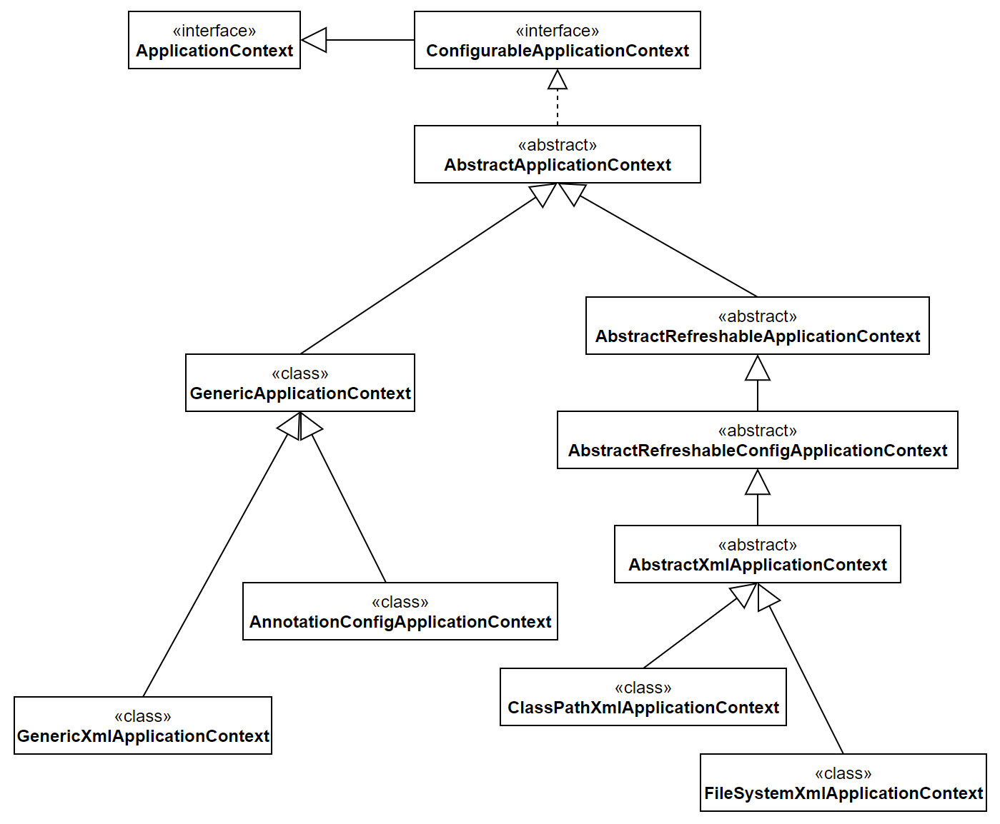

## ApplicationContext Bean

BeanFactory是Spring IOC的的底层容器，提供了依赖查找的功能，但是我们常用的还是ApplictionContext，因为它提供了依赖注入的功能，依赖注入才是Spring IOC的核心。


### ApplicationContext的类图

在仅仅引入spring-context的Maven坐标下，下面就是ApplicationContext的全部子接口及子类。



我们可以看到，整个类图从AbstractApplicationContext分为了两个系列，但不论是GenericApplication还是AbstractRefreshApplicationContext，内部都是组合了一个DefaultListableBeanFactory，区别是前者支持对其刷新容器，而后者只能在启动时刷新一次。


### ApplicationContext启动

ApplicationContext具有非常多的功能，但是我们目前只关心Bean的实例化以及Bean的生命周期，至于事件、Message等后面再一一分析。下面从refresh()开始Debug。

```java
public void refresh() throws BeansException, IllegalStateException {
    synchronized (this.startupShutdownMonitor) {
        // Prepare this context for refreshing.
        prepareRefresh();

        // Tell the subclass to refresh the internal bean factory.
        ConfigurableListableBeanFactory beanFactory = obtainFreshBeanFactory();

        // Prepare the bean factory for use in this context.
        prepareBeanFactory(beanFactory);

        try {
            // Allows post-processing of the bean factory in context subclasses.
            postProcessBeanFactory(beanFactory);

            // Invoke factory processors registered as beans in the context.
            invokeBeanFactoryPostProcessors(beanFactory);

            // Register bean processors that intercept bean creation.
            registerBeanPostProcessors(beanFactory);

            // Initialize message source for this context.
            initMessageSource();

            // Initialize event multicaster for this context.
            initApplicationEventMulticaster();

            // Initialize other special beans in specific context subclasses.
            onRefresh();

            // Check for listener beans and register them.
            registerListeners();

            // Instantiate all remaining (non-lazy-init) singletons.
            finishBeanFactoryInitialization(beanFactory);

            // Last step: publish corresponding event.
            finishRefresh();
        }
		// 异常处理...
    }
}
```

整个refresh()方法非常的精炼，但是内部的细节却很不简单。我们一点一点的分析。

#### prepareRefresh()

prepareRefresh的目的就是设置一些初始化的设置。这里面有一个经常用到的就是我们可以通过ApplicationContext添加监听器，这些监听器在Spring里面被存储在earlyApplicationListeners和applicationListeners中。

```java
protected void prepareRefresh() {
    // Switch to active.
    this.startupDate = System.currentTimeMillis();
    this.closed.set(false);
    this.active.set(true);

    if (logger.isDebugEnabled()) {
        if (logger.isTraceEnabled()) {
            logger.trace("Refreshing " + this);
        }
        else {
            logger.debug("Refreshing " + getDisplayName());
        }
    }

    // Initialize any placeholder property sources in the context environment.
    initPropertySources();

    // Validate that all properties marked as required are resolvable:
    // see ConfigurablePropertyResolver#setRequiredProperties
    getEnvironment().validateRequiredProperties();

    // Store pre-refresh ApplicationListeners...
    if (this.earlyApplicationListeners == null) {
        this.earlyApplicationListeners = new LinkedHashSet<>(this.applicationListeners);
    }
    else {
        // Reset local application listeners to pre-refresh state.
        this.applicationListeners.clear();
        this.applicationListeners.addAll(this.earlyApplicationListeners);
    }

    // Allow for the collection of early ApplicationEvents,
    // to be published once the multicaster is available...
    this.earlyApplicationEvents = new LinkedHashSet<>();
}
```

#### obtainFreshBeanFactory()

```java
// ApplicationContext.java
protected ConfigurableListableBeanFactory obtainFreshBeanFactory() {
    refreshBeanFactory();
    return getBeanFactory();
}
protected abstract void refreshBeanFactory() throws BeansException, IllegalStateException;
public abstract ConfigurableListableBeanFactory getBeanFactory() throws IllegalStateException;
```

##### GenericApplicationContext

```java
// GenericApplicationContext.java
private final DefaultListableBeanFactory beanFactory;
private final AtomicBoolean refreshed = new AtomicBoolean();
public GenericApplicationContext() {
    this.beanFactory = new DefaultListableBeanFactory();
}
// 从这里可以看出，GenericApplicationContext只能refresh一次。
protected final void refreshBeanFactory() throws IllegalStateException {
    if (!this.refreshed.compareAndSet(false, true)) {
        throw new IllegalStateException(
            "GenericApplicationContext does not support multiple refresh attempts: " 
            + "just call 'refresh' once");
    }
    this.beanFactory.setSerializationId(getId());
}
public final ConfigurableListableBeanFactory getBeanFactory() {
    return this.beanFactory;
}
```

可以看出，整个GenericApplicationContext的obtainFreshBeanFactory非常简单，就是将内部组合的DefaultListableBeanFactory返回回去。

##### AbstractRefreshableApplicationContext

AbstractRefreshableApplicationContext的getBeanFactory()也是将内部的DefaultListableBeanFactory返回回去，但是对于另一个方法refreshBeanFactory()，就做了很多的工作。

```java
protected final void refreshBeanFactory() throws BeansException {
    // 如果之前有BeanFactory就销毁
    if (hasBeanFactory()) {
        destroyBeans();
        closeBeanFactory();
    }
    try {
        DefaultListableBeanFactory beanFactory = createBeanFactory();
        beanFactory.setSerializationId(getId());
        customizeBeanFactory(beanFactory);
        loadBeanDefinitions(beanFactory);
        synchronized (this.beanFactoryMonitor) {
            this.beanFactory = beanFactory;
        }
    }
    catch (IOException ex) {
        throw new ApplicationContextException(
            "I/O error parsing bean definition source for " + getDisplayName(), ex);
    }
}
```

refreshBeanFactory()可以分为如下几步：

**创建新的DefaultListableBeanFactory**

但是由于之前可能存在父BeanFactory，所以这里的新DefaultListableBeanFactory也会继承原有的父BeanFactory。

```java
// AbstractRefreshableApplicationContext.java
protected DefaultListableBeanFactory createBeanFactory() {
    return new DefaultListableBeanFactory(getInternalParentBeanFactory());
}
protected BeanFactory getInternalParentBeanFactory() {
    return (getParent() instanceof ConfigurableApplicationContext ?
            ((ConfigurableApplicationContext) getParent()).getBeanFactory() : getParent());
}
```

**配置BeanFactory**

下面的两个BeanFactory属性，在之前的BeanFactory环节已经见过，一个控制是否允许BeanDefinition的合并，一个控制是否允许循环引用。

```java
protected void customizeBeanFactory(DefaultListableBeanFactory beanFactory) {
    if (this.allowBeanDefinitionOverriding != null) {
        beanFactory.setAllowBeanDefinitionOverriding(this.allowBeanDefinitionOverriding);
    }
    if (this.allowCircularReferences != null) {
        beanFactory.setAllowCircularReferences(this.allowCircularReferences);
    }
}
```

**加载BeanDefinition**

loadBeanDefinitions的实现是在AbstractXmlApplicationContext里面。

```java
// AbstractXmlApplicationContext.java
protected void loadBeanDefinitions(DefaultListableBeanFactory beanFactory) 
    throws BeansException, IOException {
    // Create a new XmlBeanDefinitionReader for the given BeanFactory.
    XmlBeanDefinitionReader beanDefinitionReader = new XmlBeanDefinitionReader(beanFactory);

    // Configure the bean definition reader with this context's
    // resource loading environment.
    beanDefinitionReader.setEnvironment(this.getEnvironment());
    beanDefinitionReader.setResourceLoader(this);
    beanDefinitionReader.setEntityResolver(new ResourceEntityResolver(this));

    // Allow a subclass to provide custom initialization of the reader,
    // then proceed with actually loading the bean definitions.
    initBeanDefinitionReader(beanDefinitionReader);
    loadBeanDefinitions(beanDefinitionReader);
}
protected void loadBeanDefinitions(XmlBeanDefinitionReader reader) 
    	throws BeansException, IOException {
    Resource[] configResources = getConfigResources();
    if (configResources != null) {
        reader.loadBeanDefinitions(configResources);
    }
    String[] configLocations = getConfigLocations();
    if (configLocations != null) {
        reader.loadBeanDefinitions(configLocations);
    }
}
```

之前我们使用过loadBeanDefinitions的一个重载形式，loadBeanDefinitions(java.lang.String)，当时直接传入的xml文件地址，现在使用的是Resource数组。

```java
// ClassPathXmlApplicationContext.java
public ClassPathXmlApplicationContext(String configLocation) throws BeansException {
    this(new String[] {configLocation}, true, null);
}
public ClassPathXmlApplicationContext(String[] configLocations, boolean refresh, 
   		@Nullable ApplicationContext parent) throws BeansException {
    super(parent);
    setConfigLocations(configLocations);
    if (refresh) {
        refresh();
    }
}
public void setConfigLocations(@Nullable String... locations) {
    if (locations != null) {
        Assert.noNullElements(locations, "Config locations must not be null");
        this.configLocations = new String[locations.length];
        for (int i = 0; i < locations.length; i++) {
            this.configLocations[i] = resolvePath(locations[i]).trim();
        }
    }
    else {
        this.configLocations = null;
    }
}
protected String[] getConfigLocations() {
    return (this.configLocations != null ? this.configLocations : getDefaultConfigLocations());
}
```

上面的代码就是从ClassPathXmlApplicationContext构造方法传入xml文件到被XmlBeanDefinitionReader调用的全过程。可以看出，对于AbstractRefreshableApplicationContext来说，执行完obtainFreshBeanFactory()方法，BeanDefinition就被加载到BeanFactory中了。

对GenericApplicationContext来说，它没有加载BeanDefinition，所以加载的工作交给了子类完成，对GenericXmlApplicationContext来说：他是将加载BeanDefinition放在了refresh之前。

```java
private final XmlBeanDefinitionReader reader = new XmlBeanDefinitionReader(this);
public GenericXmlApplicationContext(Resource... resources) {
    load(resources);
    refresh();
}
public void load(Resource... resources) {
    this.reader.loadBeanDefinitions(resources);
}
```

对AnnotationConfigApplicationContext来说，他是将注册配置类放在了refresh之前。

```java
private final AnnotatedBeanDefinitionReader reader;	
public AnnotationConfigApplicationContext(Class<?>... componentClasses) {
    this();
    register(componentClasses);
    refresh();
}
public void register(Class<?>... componentClasses) {
    Assert.notEmpty(componentClasses, "At least one component class must be specified");
    this.reader.register(componentClasses);
}
```

至此，obtainFreshBeanFactory()方法的分析就结束了。

#### prepareBeanFactory()

```java
protected void prepareBeanFactory(ConfigurableListableBeanFactory beanFactory) {
    // Tell the internal bean factory to use the context's class loader etc.
    beanFactory.setBeanClassLoader(getClassLoader());
    beanFactory.setBeanExpressionResolver(
        new StandardBeanExpressionResolver(beanFactory.getBeanClassLoader()));
    beanFactory.addPropertyEditorRegistrar(new ResourceEditorRegistrar(this, getEnvironment()));

    // Configure the bean factory with context callbacks.
    beanFactory.addBeanPostProcessor(new ApplicationContextAwareProcessor(this));
    beanFactory.ignoreDependencyInterface(EnvironmentAware.class);
    beanFactory.ignoreDependencyInterface(EmbeddedValueResolverAware.class);
    beanFactory.ignoreDependencyInterface(ResourceLoaderAware.class);
    beanFactory.ignoreDependencyInterface(ApplicationEventPublisherAware.class);
    beanFactory.ignoreDependencyInterface(MessageSourceAware.class);
    beanFactory.ignoreDependencyInterface(ApplicationContextAware.class);

    // BeanFactory interface not registered as resolvable type in a plain factory.
    // MessageSource registered (and found for autowiring) as a bean.
    beanFactory.registerResolvableDependency(BeanFactory.class, beanFactory);
    beanFactory.registerResolvableDependency(ResourceLoader.class, this);
    beanFactory.registerResolvableDependency(ApplicationEventPublisher.class, this);
    beanFactory.registerResolvableDependency(ApplicationContext.class, this);

    // Register early post-processor for detecting inner beans as ApplicationListeners.
    beanFactory.addBeanPostProcessor(new ApplicationListenerDetector(this));

    // Detect a LoadTimeWeaver and prepare for weaving, if found.
    if (beanFactory.containsBean(LOAD_TIME_WEAVER_BEAN_NAME)) {
        beanFactory.addBeanPostProcessor(new LoadTimeWeaverAwareProcessor(beanFactory));
        // Set a temporary ClassLoader for type matching.
        beanFactory.setTempClassLoader(
            new ContextTypeMatchClassLoader(beanFactory.getBeanClassLoader()));
    }

    // Register default environment beans.
    if (!beanFactory.containsLocalBean(ENVIRONMENT_BEAN_NAME)) {
        beanFactory.registerSingleton(ENVIRONMENT_BEAN_NAME, getEnvironment());
    }
    if (!beanFactory.containsLocalBean(SYSTEM_PROPERTIES_BEAN_NAME)) {
        beanFactory.registerSingleton(SYSTEM_PROPERTIES_BEAN_NAME, 
                                      getEnvironment().getSystemProperties());
    }
    if (!beanFactory.containsLocalBean(SYSTEM_ENVIRONMENT_BEAN_NAME)) {
        beanFactory.registerSingleton(SYSTEM_ENVIRONMENT_BEAN_NAME, 
                                      getEnvironment().getSystemEnvironment());
    }
}
```

prepareBeanFactory做了很多的工作，本节分析下面四点：

1. ApplicationContextAwareProcessor
2. ignoreDependencyInterface
3. registerResolvableDependency
4. 注册ApplicationContext内置的Bean

**ApplicationContextAwareProcessor**

```java
class ApplicationContextAwareProcessor implements BeanPostProcessor {
    private final ConfigurableApplicationContext applicationContext;
    private final StringValueResolver embeddedValueResolver;

    /**
	 * Create a new ApplicationContextAwareProcessor for the given context.
	 */
    public ApplicationContextAwareProcessor(ConfigurableApplicationContext applicationContext) {
        this.applicationContext = applicationContext;
        this.embeddedValueResolver = new EmbeddedValueResolver(applicationContext.getBeanFactory());
    }

    @Override
    @Nullable
    public Object postProcessBeforeInitialization(Object bean, String beanName) throws BeansException {
        if (!(bean instanceof EnvironmentAware || bean instanceof EmbeddedValueResolverAware ||
              bean instanceof ResourceLoaderAware || bean instanceof ApplicationEventPublisherAware ||
              bean instanceof MessageSourceAware || bean instanceof ApplicationContextAware)){
            return bean;
        }
        AccessControlContext acc = null;
        if (System.getSecurityManager() != null) {
            acc = this.applicationContext.getBeanFactory().getAccessControlContext();
        }
        if (acc != null) {
            AccessController.doPrivileged((PrivilegedAction<Object>) () -> {
                invokeAwareInterfaces(bean);
                return null;
            }, acc);
        }
        else {
            invokeAwareInterfaces(bean);
        }
        return bean;
    }
    private void invokeAwareInterfaces(Object bean) {
        if (bean instanceof EnvironmentAware) {
            ((EnvironmentAware) bean).setEnvironment(this.applicationContext.getEnvironment());
        }
        if (bean instanceof EmbeddedValueResolverAware) {
            ((EmbeddedValueResolverAware) bean).setEmbeddedValueResolver(this.embeddedValueResolver);
        }
        if (bean instanceof ResourceLoaderAware) {
            ((ResourceLoaderAware) bean).setResourceLoader(this.applicationContext);
        }
        if (bean instanceof ApplicationEventPublisherAware) {
            ((ApplicationEventPublisherAware) bean).
                setApplicationEventPublisher(this.applicationContext);
        }
        if (bean instanceof MessageSourceAware) {
            ((MessageSourceAware) bean).setMessageSource(this.applicationContext);
        }
        if (bean instanceof ApplicationContextAware) {
            ((ApplicationContextAware) bean).setApplicationContext(this.applicationContext);
        }
    }
}
```

我们都知道，在Spring中，如果一个Bean实现了ApplicationContextAware接口就可以获取ApplicationContext。但是这个Aware接口并没有在BeanFactory创建Bean时被判断。BeanFactory创建Bean时只判断了BeanFactoryAware、BeanClassLoaderAware、BeanNameAware。

对于ApplicationContextAware这六个接口，设置到Bean中的方式就是通过BeanPostProcessor#postProcessBeforeInitialization的后置调用，这个方法是在BeanFactoryAware、BeanClassLoaderAware、BeanNameAware被调用之后调用的。这样Bean就可以获取到

Environment、ApplicationContext等这六个对象了。

**ignoreDependencyInterface**

与ignoreDependencyInterface关联的还有一个ignoreDependencyType。从名字就知道他俩都是忽略依赖注入。前者是忽略此接口中的setter方法，后者是忽略类型。

```java
public interface IgnoreInterface {
    void setUser(User user);
}
```

```java
@ToString
public class IgnoreInterfaceImpl implements IgnoreInterface {
    private User user;
    private User anotherUser;
    @Override
    public void setUser(User user) {
        this.user = user;
    }
    public void setAnotherUser(User anotherUser) {
        this.anotherUser = anotherUser;
    }
    public User getUser() {
        return user;
    }
    public User getAnotherUser() {
        return anotherUser;
    }
}
```

```xml
<?xml version="1.0" encoding="UTF-8"?>
<beans xmlns="http://www.springframework.org/schema/beans"
       xmlns:xsi="http://www.w3.org/2001/XMLSchema-instance"
       xsi:schemaLocation="http://www.springframework.org/schema/beans
        https://www.springframework.org/schema/beans/spring-beans.xsd">
    
    <bean id="user-bean" class="fsc.domain.User" lazy-init="true" autowire="byType"></bean>
    <bean id="ignore-test-bean" class="ab.holder.IgnoreInterfaceImpl" 
          lazy-init="true" autowire="byType"></bean>
</beans>
```

```java
public class IgnoreDependencyInterfaceDemo {
    public static void main(String[] args) {
        ClassPathXmlApplicationContext applicationContext =
                new ClassPathXmlApplicationContext("META-INF/bean-ignore-context.xml");
        applicationContext.refresh();
        applicationContext.getBeanFactory().ignoreDependencyInterface(IgnoreInterface.class);
        System.out.println(applicationContext.getBean("ignore-test-bean"));
        applicationContext.close();
    }
}
```

由于refresh方法会初始化Bean，所以上面的代码将Bean设置为延迟初始化。此时由于忽略了接口IgnoreInterface，所以IgnoreInterfaceImpl的user属性将不会被设置。

如果代码

```java
applicationContext.getBeanFactory().ignoreDependencyInterface(IgnoreInterface.class);
```

改为下面这个：

```java
 applicationContext.getBeanFactory().ignoreDependencyType(User.class);
```

则user和anotherUser两个属性都不会被设置。

我们可以看到，prepareBeanFactory方法里面忽略了六个接口EnvironmentAware、EmbeddedValueResolverAware、
ResourceLoaderAware、ApplicationEventPublisherAware、MessageSourceAware、ApplicationContextAware。这六个接口恰好是ApplicationContextAwareProcessor里的六个接口，这么做的好处是什么呢？

我的理解是，属性的填充如果设置了自动注入为按类型注入，假如有一个属性是ApplicationContext，那么就会在属性注入的时候填充这个属性，但是这不能保证正确性，系统中很可能存在多个ApplicationContextAware的实现类。这样自动注入时就会找到多个此类型的Bean。所以这里直接设置为忽略，不注入此属性，而是在注入属性完成后通过BeanPostProcessor设置ApplicationContext。

下面分析忽略功能的实现。

```java
// AbstractAutowireCapableBeanFactory.java
protected void populateBean(String beanName, RootBeanDefinition mbd, @Nullable BeanWrapper bw) {
    // ...
    PropertyValues pvs = (mbd.hasPropertyValues() ? mbd.getPropertyValues() : null);
    int resolvedAutowireMode = mbd.getResolvedAutowireMode();
    if (resolvedAutowireMode == AUTOWIRE_BY_NAME || resolvedAutowireMode == AUTOWIRE_BY_TYPE) {
        MutablePropertyValues newPvs = new MutablePropertyValues(pvs);
        // Add property values based on autowire by name if applicable.
        if (resolvedAutowireMode == AUTOWIRE_BY_NAME) {
            autowireByName(beanName, mbd, bw, newPvs);
        }
        // Add property values based on autowire by type if applicable.
        if (resolvedAutowireMode == AUTOWIRE_BY_TYPE) {
            autowireByType(beanName, mbd, bw, newPvs);
        }
        pvs = newPvs;
    }
    // ...
}
protected void autowireByType(
    String beanName, AbstractBeanDefinition mbd, BeanWrapper bw, MutablePropertyValues pvs) {

    TypeConverter converter = getCustomTypeConverter();
    if (converter == null) {
        converter = bw;
    }

    Set<String> autowiredBeanNames = new LinkedHashSet<>(4);
    // 被注入的属性
    String[] propertyNames = unsatisfiedNonSimpleProperties(mbd, bw);
    // ...
}
protected String[] unsatisfiedNonSimpleProperties(AbstractBeanDefinition mbd, BeanWrapper bw) {
    Set<String> result = new TreeSet<>();
    PropertyValues pvs = mbd.getPropertyValues();
    PropertyDescriptor[] pds = bw.getPropertyDescriptors();
    for (PropertyDescriptor pd : pds) {
        if (pd.getWriteMethod() != null && 
            !isExcludedFromDependencyCheck(pd) && !pvs.contains(pd.getName()) &&
            !BeanUtils.isSimpleProperty(pd.getPropertyType())) {
            result.add(pd.getName());
        }
    }
    return StringUtils.toStringArray(result);
}
private final Set<Class<?>> ignoredDependencyTypes = new HashSet<>();
private final Set<Class<?>> ignoredDependencyInterfaces = new HashSet<>();
protected boolean isExcludedFromDependencyCheck(PropertyDescriptor pd) {
    return (AutowireUtils.isExcludedFromDependencyCheck(pd) ||
            this.ignoredDependencyTypes.contains(pd.getPropertyType()) ||
            AutowireUtils.isSetterDefinedInInterface(pd, this.ignoredDependencyInterfaces));
}
```

从上面的代码可以看出来，在填充属性的时候回去判断当前属性的类型是不是在忽略的类型中，当前属性的setter方法是不是在忽略接口中被定义过。

**registerResolvableDependency**

```java
@Setter
@Getter
@ToString
public class ACDomain {
    private BeanFactory beanFactory;
    private ApplicationContext applicationContext;
}
```

```xml
<beans xmlns="http://www.springframework.org/schema/beans"
       xmlns:xsi="http://www.w3.org/2001/XMLSchema-instance"
       xsi:schemaLocation="http://www.springframework.org/schema/beans
        https://www.springframework.org/schema/beans/spring-beans.xsd" default-autowire="byType">

    <bean id="acDomain" class="ab.holder.ACDomain"></bean>
</beans>
```

```java
public class RegisterResolvableDependencyDemo {
    public static void main(String[] args) {
        ClassPathXmlApplicationContext applicationContext =
                new ClassPathXmlApplicationContext("META-INF/bean-acdomain-context.xml");
        applicationContext.refresh();
        applicationContext.getBeanFactory().ignoreDependencyType(User.class);
        ACDomain acDomain = applicationContext.getBean("acDomain", ACDomain.class);
        System.out.println(acDomain.getApplicationContext());
        System.out.println(acDomain.getBeanFactory());
        applicationContext.close();
    }
}
```

上面的代码我们注入了两个属性，BeanFactory和ApplicationContext。我们知道，按类型查找的时候如果同类型有多个Bean会报异常，两种解决方法设置某个Bean为Primary或者使用ObjectProvider。但是这里没有使用ObjectProvider，还能精准的识别出BeanFactory和ApplicationContext。本质原因就是registerResolvableDependency这个方法，它表明：如果查找BeanFactory类型，就使用内部组合的beanFactory，如果查找ApplicationContext类型，就使用当前对象。所以这样就可以解决依赖问题。

上面在分析ignoreDependencyInterface时我们知道了AbstractAutowireCapableBeanFactory#autowireByType会赋予属性。

```java
protected void autowireByType(
    String beanName, AbstractBeanDefinition mbd, BeanWrapper bw, MutablePropertyValues pvs) {
	
    // ...
    // 需要被注入的属性
    String[] propertyNames = unsatisfiedNonSimpleProperties(mbd, bw);
    for (String propertyName : propertyNames) {
        try {
            PropertyDescriptor pd = bw.getPropertyDescriptor(propertyName);
            // Don't try autowiring by type for type Object: never makes sense,
            // even if it technically is a unsatisfied, non-simple property.
            if (Object.class != pd.getPropertyType()) {
                MethodParameter methodParam = BeanUtils.getWriteMethodParameter(pd);
                // Do not allow eager init for type matching in case of a prioritized post-processor.
                boolean eager = !(bw.getWrappedInstance() instanceof PriorityOrdered);
                DependencyDescriptor desc = new AutowireByTypeDependencyDescriptor(methodParam, eager);
                // 获取对应的Bean
                Object autowiredArgument = 
                    resolveDependency(desc, beanName, autowiredBeanNames, converter);
                // 设置属性，这个API之前见过
                if (autowiredArgument != null) {
                    pvs.add(propertyName, autowiredArgument);
                }
                for (String autowiredBeanName : autowiredBeanNames) {
                    registerDependentBean(autowiredBeanName, beanName);
                }
                autowiredBeanNames.clear();
            }
        }
        // 异常处理...
    }
}
```

resolveDependency的实现是在DefalutListableBeanFactory中。

```java
// DefalutListableBeanFactory.java
public Object resolveDependency(DependencyDescriptor descriptor, @Nullable String requestingBeanName,
		@Nullable Set<String> autowiredBeanNames, @Nullable TypeConverter typeConverter) 
    		throws BeansException {
    descriptor.initParameterNameDiscovery(getParameterNameDiscoverer());
    if (Optional.class == descriptor.getDependencyType()) {
        return createOptionalDependency(descriptor, requestingBeanName);
    }
    else if (ObjectFactory.class == descriptor.getDependencyType() ||
             ObjectProvider.class == descriptor.getDependencyType()) {
        return new DependencyObjectProvider(descriptor, requestingBeanName);
    }
    else if (javaxInjectProviderClass == descriptor.getDependencyType()) {
        return new Jsr330Factory().createDependencyProvider(descriptor, requestingBeanName);
    }
    // 很显然，我们现在不是Optional、ObjectFactory、ObjectProvider和javaxInjectProviderClass类型
    else {
        Object result = getAutowireCandidateResolver().getLazyResolutionProxyIfNecessary(
            descriptor, requestingBeanName);
        if (result == null) {
            result = 
                doResolveDependency(descriptor, requestingBeanName, autowiredBeanNames, typeConverter);
        }
        return result;
    }
}
public Object doResolveDependency(DependencyDescriptor descriptor, @Nullable String beanName,
		@Nullable Set<String> autowiredBeanNames, @Nullable TypeConverter typeConverter) 
    		throws BeansException {

    InjectionPoint previousInjectionPoint = ConstructorResolver.setCurrentInjectionPoint(descriptor);
    try {
        // ...
        // 这个方法会处理resolvableDependencies集合
        Map<String, Object> matchingBeans = findAutowireCandidates(beanName, type, descriptor);
        // 后面的代码就不再展示了
        // matchingBeans返回的键是identityStr（类名+对象哈希值的十六进制表示），值是查找到的依赖
    }
    finally {
        ConstructorResolver.setCurrentInjectionPoint(previousInjectionPoint);
    }
}
protected Map<String, Object> findAutowireCandidates(
    @Nullable String beanName, Class<?> requiredType, DependencyDescriptor descriptor) {

    String[] candidateNames = BeanFactoryUtils.beanNamesForTypeIncludingAncestors(
        this, requiredType, true, descriptor.isEager());
    Map<String, Object> result = new LinkedHashMap<>(candidateNames.length);
    for (Map.Entry<Class<?>, Object> classObjectEntry : this.resolvableDependencies.entrySet()) {
        Class<?> autowiringType = classObjectEntry.getKey();
        // 当requiredType为BeanFactory.class时，ClassPathXmlApplicationContext不满足条件
        // 但是DefaultListableBeanFactory满足条件，所以可以进入，获取到DefaultListableBeanFactory
        // 此时requiredType.isInstance(autowiringValue)也为真，就获取了依赖的对象。
        if (autowiringType.isAssignableFrom(requiredType)) {
            Object autowiringValue = classObjectEntry.getValue();
            autowiringValue = AutowireUtils.resolveAutowiringValue(autowiringValue, requiredType);
            if (requiredType.isInstance(autowiringValue)) {
                result.put(ObjectUtils.identityToString(autowiringValue), autowiringValue);
                break;
            }
        }
    }
    // ...
}
```

最终findAutowireCandidates返回的Map的值会被设置到属性中，还会返回键是因为后面会将其注册为Bean，需要键作为BeanName。

**注册ApplicationContext内置的Bean**

我们可以看见，在prepareBeanFactory方法中会设置多个内置的Bean。这些Bean被称为Spring的内置依赖。他们不会有正常Bean的生命周期。这些Bean可以被依赖注入和依赖查找使用。

至此，我们可以发现。Spring可以进行依赖注入的Bean的来源有多个，包括：用户注册的Bean、Spring内置的Bean、注册的依赖。但是依赖查找的依赖来源只有之前两类。

关于依赖查找和依赖注入的区别，后面会有更加详细的解释，这里只是源码分析到了就简单的提一下。

#### postProcessBeanFactory

在我们目前的环境中（只包含spring-context包），postProcessBeanFactory方法并没有含义。

> Modify the application context's internal bean factory after its standard initialization. All bean definitions will have been loaded, but no beans will have been instantiated yet. This allows for registering special BeanPostProcessors etc in certain ApplicationContext implementations.

但从它的API doc中可以知道，这个方法的目的是对一个仅仅进行过初始化的BeanFactory进行Modify，此时所有的Bean都没有被初始化。API中说可以在这里注入一些特殊的BeanPostProcessors。

#### invokeBeanFactoryPostProcessors

```java
protected void invokeBeanFactoryPostProcessors(ConfigurableListableBeanFactory beanFactory) {
    PostProcessorRegistrationDelegate.
        invokeBeanFactoryPostProcessors(beanFactory, getBeanFactoryPostProcessors());

    // Detect a LoadTimeWeaver and prepare for weaving, if found in the meantime
    // (e.g. through an @Bean method registered by ConfigurationClassPostProcessor)
    if (beanFactory.getTempClassLoader() == null && 
        	beanFactory.containsBean(LOAD_TIME_WEAVER_BEAN_NAME)) {
        beanFactory.addBeanPostProcessor(new LoadTimeWeaverAwareProcessor(beanFactory));
        beanFactory.setTempClassLoader(
            new ContextTypeMatchClassLoader(beanFactory.getBeanClassLoader()));
    }
}
```

LOAD_TIME_WEAVER_BEAN_NAME在prepareBeanFactory方法中已经见过，他是用于AOP织入的，这里不多说。后面引入aop模块后再分析。

```java
public static void invokeBeanFactoryPostProcessors(ConfigurableListableBeanFactory beanFactory,
    	List<BeanFactoryPostProcessor> beanFactoryPostProcessors) {

    // Invoke BeanDefinitionRegistryPostProcessors first, if any.
    Set<String> processedBeans = new HashSet<>();

    if (beanFactory instanceof BeanDefinitionRegistry) {
        BeanDefinitionRegistry registry = (BeanDefinitionRegistry) beanFactory;
        List<BeanFactoryPostProcessor> regularPostProcessors = new ArrayList<>();
        List<BeanDefinitionRegistryPostProcessor> registryProcessors = new ArrayList<>();

        for (BeanFactoryPostProcessor postProcessor : beanFactoryPostProcessors) {
            if (postProcessor instanceof BeanDefinitionRegistryPostProcessor) {
                BeanDefinitionRegistryPostProcessor registryProcessor =
                    (BeanDefinitionRegistryPostProcessor) postProcessor;
                registryProcessor.postProcessBeanDefinitionRegistry(registry);
                registryProcessors.add(registryProcessor);
            }
            else {
                regularPostProcessors.add(postProcessor);
            }
        }

        List<BeanDefinitionRegistryPostProcessor> currentRegistryProcessors = new ArrayList<>();

        String[] postProcessorNames =
            beanFactory.getBeanNamesForType(BeanDefinitionRegistryPostProcessor.class, true, false);
        for (String ppName : postProcessorNames) {
            if (beanFactory.isTypeMatch(ppName, PriorityOrdered.class)) {
                currentRegistryProcessors.
                    add(beanFactory.getBean(ppName, BeanDefinitionRegistryPostProcessor.class));
                processedBeans.add(ppName);
            }
        }
        sortPostProcessors(currentRegistryProcessors, beanFactory);
        registryProcessors.addAll(currentRegistryProcessors);
        invokeBeanDefinitionRegistryPostProcessors(currentRegistryProcessors, registry);
        currentRegistryProcessors.clear();

        // Next, invoke the BeanDefinitionRegistryPostProcessors that implement Ordered.
        postProcessorNames = 
            beanFactory.getBeanNamesForType(BeanDefinitionRegistryPostProcessor.class, true, false);
        for (String ppName : postProcessorNames) {
            if (!processedBeans.contains(ppName) && beanFactory.isTypeMatch(ppName, Ordered.class)) {
                currentRegistryProcessors.
                    add(beanFactory.getBean(ppName, BeanDefinitionRegistryPostProcessor.class));
                processedBeans.add(ppName);
            }
        }
        sortPostProcessors(currentRegistryProcessors, beanFactory);
        registryProcessors.addAll(currentRegistryProcessors);
        invokeBeanDefinitionRegistryPostProcessors(currentRegistryProcessors, registry);
        currentRegistryProcessors.clear();

        // Finally, invoke all other BeanDefinitionRegistryPostProcessors until no further ones appear.
        boolean reiterate = true;
        while (reiterate) {
            reiterate = false;
            postProcessorNames = beanFactory.
                getBeanNamesForType(BeanDefinitionRegistryPostProcessor.class, true, false);
            for (String ppName : postProcessorNames) {
                if (!processedBeans.contains(ppName)) {
                    currentRegistryProcessors.
                        add(beanFactory.getBean(ppName, BeanDefinitionRegistryPostProcessor.class));
                    processedBeans.add(ppName);
                    reiterate = true;
                }
            }
            sortPostProcessors(currentRegistryProcessors, beanFactory);
            registryProcessors.addAll(currentRegistryProcessors);
            invokeBeanDefinitionRegistryPostProcessors(currentRegistryProcessors, registry);
            currentRegistryProcessors.clear();
        }
        invokeBeanFactoryPostProcessors(registryProcessors, beanFactory);
        invokeBeanFactoryPostProcessors(regularPostProcessors, beanFactory);
    }
    else {
        invokeBeanFactoryPostProcessors(beanFactoryPostProcessors, beanFactory);
    }

    // Do not initialize FactoryBeans here: We need to leave all regular beans
    // uninitialized to let the bean factory post-processors apply to them!
    String[] postProcessorNames =
        beanFactory.getBeanNamesForType(BeanFactoryPostProcessor.class, true, false);

    // Separate between BeanFactoryPostProcessors that implement PriorityOrdered,
    // Ordered, and the rest.
    List<BeanFactoryPostProcessor> priorityOrderedPostProcessors = new ArrayList<>();
    List<String> orderedPostProcessorNames = new ArrayList<>();
    List<String> nonOrderedPostProcessorNames = new ArrayList<>();
    for (String ppName : postProcessorNames) {
        if (processedBeans.contains(ppName)) {
            // skip - already processed in first phase above
        }
        else if (beanFactory.isTypeMatch(ppName, PriorityOrdered.class)) {
            priorityOrderedPostProcessors.
                add(beanFactory.getBean(ppName, BeanFactoryPostProcessor.class));
        }
        else if (beanFactory.isTypeMatch(ppName, Ordered.class)) {
            orderedPostProcessorNames.add(ppName);
        }
        else {
            nonOrderedPostProcessorNames.add(ppName);
        }
    }

    // First, invoke the BeanFactoryPostProcessors that implement PriorityOrdered.
    sortPostProcessors(priorityOrderedPostProcessors, beanFactory);
    invokeBeanFactoryPostProcessors(priorityOrderedPostProcessors, beanFactory);

    // Next, invoke the BeanFactoryPostProcessors that implement Ordered.
    List<BeanFactoryPostProcessor> orderedPostProcessors = 
        new ArrayList<>(orderedPostProcessorNames.size());
    for (String postProcessorName : orderedPostProcessorNames) {
        orderedPostProcessors.
            add(beanFactory.getBean(postProcessorName, BeanFactoryPostProcessor.class));
    }
    sortPostProcessors(orderedPostProcessors, beanFactory);
    invokeBeanFactoryPostProcessors(orderedPostProcessors, beanFactory);

    // Finally, invoke all other BeanFactoryPostProcessors.
    List<BeanFactoryPostProcessor> nonOrderedPostProcessors = 
        new ArrayList<>(nonOrderedPostProcessorNames.size());
    for (String postProcessorName : nonOrderedPostProcessorNames) {
        nonOrderedPostProcessors.
            add(beanFactory.getBean(postProcessorName, BeanFactoryPostProcessor.class));
    }
    invokeBeanFactoryPostProcessors(nonOrderedPostProcessors, beanFactory);

    // Clear cached merged bean definitions since the post-processors might have
    // modified the original metadata, e.g. replacing placeholders in values...
    beanFactory.clearMetadataCache();
}
```

个人感觉整个这段代码写的很乱，但是核心就是两个问题，执行BeanFactoryPostProcessor#postProcessBeanFactory和在beanFactory是BeanDefinitionRegistry实例对象时执行BeanDefinitionRegistryPostProcessor#postProcessBeanDefinitionRegistry。下面先介绍一个知识点：Ordered。

**Ordered**

Ordered是Spring提供的一个对Bean排序的接口。值越低优先级越高，支持负数。BeanFactoryPostProcessor在执行的时候便是按照Ordered的顺序执行的。当然这个顺序是可以被DefaultListableBeanFactory设置的，默认是OrderComparator.INSTANCE。Ordered有一个子类PriorityOrdered，它的优先级比一定Ordered高。下面是一个BeanDefinitionRegistryPostProcessor按顺序执行的例子。

```xml
<?xml version="1.0" encoding="UTF-8"?>
<beans xmlns="http://www.springframework.org/schema/beans"
       xmlns:xsi="http://www.w3.org/2001/XMLSchema-instance"
       xsi:schemaLocation="http://www.springframework.org/schema/beans
        https://www.springframework.org/schema/beans/spring-beans.xsd" default-autowire="byType">

    <bean class="ab.order.OrderedDemo.MyBeanFactoryPostProcessor1"></bean>
    <bean class="ab.order.OrderedDemo.MyBeanFactoryPostProcessor2"></bean>
    <bean class="ab.order.OrderedDemo.MyBeanFactoryPostProcessor3"></bean>
    <bean class="ab.order.OrderedDemo.MyBeanFactoryPostProcessor4"></bean>
    <bean class="ab.order.OrderedDemo.MyBeanFactoryPostProcessor5"></bean>

</beans>
```

```java
public class OrderedDemo {
    public static void main(String[] args) {
        ClassPathXmlApplicationContext applicationContext =
                new ClassPathXmlApplicationContext(
            		new String[]{"META-INF/bean-order-context.xml"}, false, null);
        applicationContext.refresh();
        applicationContext.close();
    }
    static class MyBeanFactoryPostProcessor1 
        	implements BeanDefinitionRegistryPostProcessor, Ordered {
        @Override
        public void postProcessBeanFactory(ConfigurableListableBeanFactory beanFactory) 
            	throws BeansException {
            System.out.println("BeanFactoryPostProcessor order 0");
        }
        @Override
        public int getOrder() {
            return 0;
        }
        @Override
        public void postProcessBeanDefinitionRegistry(BeanDefinitionRegistry registry) 
            	throws BeansException {
            System.out.println("BeanDefinitionRegistryPostProcessor order 0");
        }
    }
    static class MyBeanFactoryPostProcessor2 
        	implements BeanDefinitionRegistryPostProcessor, Ordered {
        @Override
        public void postProcessBeanFactory(ConfigurableListableBeanFactory beanFactory) 
            	throws BeansException {
            System.out.println("BeanFactoryPostProcessor order 1");
        }
        @Override
        public int getOrder() {
            return 1;
        }
        @Override
        public void postProcessBeanDefinitionRegistry(BeanDefinitionRegistry registry) 
            	throws BeansException {
            System.out.println("BeanDefinitionRegistryPostProcessor order 1");
        }
    }
    static class MyBeanFactoryPostProcessor3 
        	implements BeanDefinitionRegistryPostProcessor, PriorityOrdered {
        @Override
        public void postProcessBeanFactory(ConfigurableListableBeanFactory beanFactory) 
            	throws BeansException {
            System.out.println("BeanFactoryPostProcessor priority 0");
        }
        @Override
        public int getOrder() {
            return 0;
        }
        @Override
        public void postProcessBeanDefinitionRegistry(BeanDefinitionRegistry registry) 
            	throws BeansException {
            System.out.println("BeanDefinitionRegistryPostProcessor priority 0");
        }
    }
    static class MyBeanFactoryPostProcessor4 
        	implements BeanDefinitionRegistryPostProcessor, PriorityOrdered {
        @Override
        public void postProcessBeanFactory(ConfigurableListableBeanFactory beanFactory)
            	throws BeansException {
            System.out.println("BeanFactoryPostProcessor priority 1");
        }
        @Override
        public int getOrder() {
            return 1;
        }
        @Override
        public void postProcessBeanDefinitionRegistry(BeanDefinitionRegistry registry) 
            	throws BeansException {
            System.out.println("BeanDefinitionRegistryPostProcessor priority 1");
        }
    }
    static class MyBeanFactoryPostProcessor5 implements BeanDefinitionRegistryPostProcessor {
        @Override
        public void postProcessBeanFactory(ConfigurableListableBeanFactory beanFactory) 
            	throws BeansException {
            System.out.println("BeanFactoryPostProcessor no order");
        }
        @Override
        public void postProcessBeanDefinitionRegistry(BeanDefinitionRegistry registry) 
            	throws BeansException {
            System.out.println("BeanDefinitionRegistryPostProcessor no order");
        }
    }
}
```

BeanFactoryPostProcessor就是一个在BeanFactory初始化之后的拦截点。


