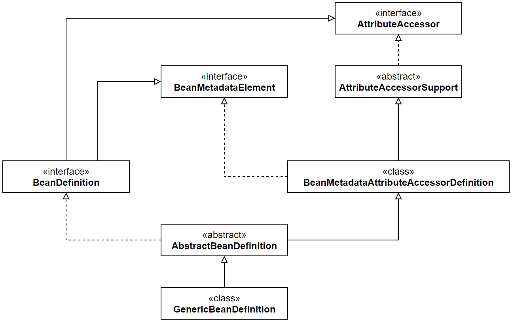
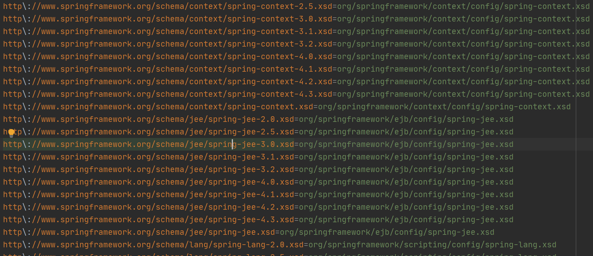

## 外部化配置案例

### XML

#### XML定义Bean

context:property-placeholder标签就是配置一个PropertySourcesPlaceholderConfigurer，我们也可以直接配置这个Bean。

```java
public class XmlElementExternalizedConfigurationDemo {
    @Value("${user.id}")
    private Long userId;

    public static void main(String[] args) {
        ClassPathXmlApplicationContext applicationContext =
                new ClassPathXmlApplicationContext("META-INF/xml-element-ec-context.xml");

        applicationContext.refresh();
        User user = applicationContext.getBean("user", User.class);
        XmlElementExternalizedConfigurationDemo demo = 
            applicationContext.getBean("xmlElementExternalizedConfigurationDemo", 
                                       XmlElementExternalizedConfigurationDemo.class);
        System.out.println(demo.userId);
        System.out.println(user);
        applicationContext.close();

    }
}
```

```xml
<?xml version="1.0" encoding="UTF-8"?>
<beans xmlns="http://www.springframework.org/schema/beans"
       xmlns:xsi="http://www.w3.org/2001/XMLSchema-instance"
       xmlns:context="http://www.springframework.org/schema/context"
       xsi:schemaLocation="http://www.springframework.org/schema/beans
        https://www.springframework.org/schema/beans/spring-beans.xsd
        http://www.springframework.org/schema/context
        https://www.springframework.org/schema/context/spring-context.xsd">

  <context:annotation-config />

  <bean class="org.springframework.context.support.PropertySourcesPlaceholderConfigurer" >
    <property name="location" value="META-INF/user.properties" />
  </bean>

  <bean id="user" class="fsc.domain.User">
    <property name="id" value="${user.id}"/>
    <property name="name" value="${user.localName}"/>
    <property name="city" value="${user.city}"/>
    <property name="workCities" value="${user.workCities}"/>
    <property name="lifeCities">
      <list>
        <value>BEIJING</value>
        <value>SHANGHAI</value>
      </list>
    </property>
    <property name="configFileLocation" value="${user.configFileLocation}"/>
  </bean>

  <bean class="ex.properties.xml.XmlBeanExternalizedConfigurationDemo" 
					id="xmlBeanExternalizedConfigurationDemo" />

</beans>
```

#### 使用BeanDefinition

```java
public class XmlApiExternalizedConfigurationDemo {
    @Value("${user.id}")
    private Long userId;

    public static void main(String[] args) {

        GenericApplicationContext applicationContext = new GenericApplicationContext();

        XmlBeanDefinitionReader xmlBeanDefinitionReader = 
            							new XmlBeanDefinitionReader(applicationContext);
        xmlBeanDefinitionReader.loadBeanDefinitions("META-INF/xml-api-ec-context.xml");

        BeanDefinitionBuilder beanDefinitionBuilder = 
            BeanDefinitionBuilder.genericBeanDefinition(PropertySourcesPlaceholderConfigurer.class);
        beanDefinitionBuilder.addPropertyValue("location", "META-INF/user.properties");
        AbstractBeanDefinition beanDefinition = beanDefinitionBuilder.getBeanDefinition();
        String beanName = 
            DefaultBeanNameGenerator.INSTANCE.generateBeanName(beanDefinition, applicationContext);
        applicationContext.registerBeanDefinition(beanName, beanDefinition);

        applicationContext.refresh();
        User user = applicationContext.getBean("user", User.class);
        XmlApiExternalizedConfigurationDemo demo = applicationContext
            .getBean("xmlApiExternalizedConfigurationDemo", XmlApiExternalizedConfigurationDemo.class);
        System.out.println(demo.userId);
        System.out.println(user);
        applicationContext.close();
    }
}
```

```xml
<?xml version="1.0" encoding="UTF-8"?>
<beans xmlns="http://www.springframework.org/schema/beans"
       xmlns:xsi="http://www.w3.org/2001/XMLSchema-instance"
       xmlns:context="http://www.springframework.org/schema/context"
       xsi:schemaLocation="http://www.springframework.org/schema/beans
        https://www.springframework.org/schema/beans/spring-beans.xsd
        http://www.springframework.org/schema/context
        https://www.springframework.org/schema/context/spring-context.xsd">

  <context:annotation-config />

  <bean id="user" class="fsc.domain.User">
    <property name="id" value="${user.id}"/>
    <property name="name" value="${user.localName}"/>
    <property name="city" value="${user.city}"/>
    <property name="workCities" value="${user.workCities}"/>
    <property name="lifeCities">
      <list>
        <value>BEIJING</value>
        <value>SHANGHAI</value>
      </list>
    </property>
    <property name="configFileLocation" value="${user.configFileLocation}"/>
  </bean>

  <bean class="ex.properties.api.XmlApiExternalizedConfigurationDemo" 
        id="xmlApiExternalizedConfigurationDemo" />

</beans>
```


### 注解

#### 构建PropertySource

```java
public class AnnotationApiExternalizedConfigurationDemo {

    @Value("${user.id}")
    private Long userId;

    @Bean(value = "user")
    public User createAnnotationUser(@Value("${user.id}") Long id, 
        	@Value("${user.localName}") String userName, @Value("${user.workCities}") City[] cities) {
        User user = new User();
        user.setName(userName);
        user.setId(id);
        user.setWorkCities(cities);
        return user;
    }

    public static void main(String[] args) throws Exception {
        AnnotationConfigApplicationContext applicationContext = 
            										new AnnotationConfigApplicationContext();
        applicationContext.register(AnnotationApiExternalizedConfigurationDemo.class);

        InputStream resourceAsStream = AnnotationApiExternalizedConfigurationDemo
                .class.getResourceAsStream("/META-INF/user.properties");
        Properties properties = new Properties();
        properties.load(resourceAsStream);
        PropertiesPropertySource propertiesPropertySource =
                new PropertiesPropertySource("customized-property-source", properties);
        applicationContext.getEnvironment().getPropertySources().addFirst(propertiesPropertySource);

        applicationContext.refresh();
        User user = applicationContext.getBean(User.class);
        AnnotationApiExternalizedConfigurationDemo demo = 
            			applicationContext.getBean(AnnotationApiExternalizedConfigurationDemo.class);
        System.out.println(demo.userId);
        System.out.println(user);
        applicationContext.close();

    }
}
```

一定需要注意一点，在BeanFactory里面没有PropertySourcesPlaceholderConfigurer这个Bean的时候，不能在XML配置文件里面使用占位符。而引入了PropertySourcesPlaceholderConfigurer这个Bean之后，在doProcessProperties方法里面会使用BeanDefinitionVisitor解析占位符。

```java
protected void doProcessProperties(ConfigurableListableBeanFactory beanFactoryToProcess,
                                   StringValueResolver valueResolver) {

    BeanDefinitionVisitor visitor = new BeanDefinitionVisitor(valueResolver);

    String[] beanNames = beanFactoryToProcess.getBeanDefinitionNames();
    for (String curName : beanNames) {
        // Check that we're not parsing our own bean definition,
        // to avoid failing on unresolvable placeholders in properties file locations.
        if (!(curName.equals(this.beanName) && beanFactoryToProcess.equals(this.beanFactory))) {
            BeanDefinition bd = beanFactoryToProcess.getBeanDefinition(curName);
            try {
                visitor.visitBeanDefinition(bd);
            }
            // 抛出异常 ...
        }
    }

    // New in Spring 2.5: resolve placeholders in alias target names and aliases as well.
    beanFactoryToProcess.resolveAliases(valueResolver);

    // New in Spring 3.0: resolve placeholders in embedded values such as annotation attributes.
    beanFactoryToProcess.addEmbeddedValueResolver(valueResolver);
}
```

BeanDefinitionVisitor的目的就是处理BeanDefinition里面的占位符。

```java
public class BeanDefinitionVisitor {
    
    @Nullable
    private StringValueResolver valueResolver;
	public BeanDefinitionVisitor(StringValueResolver valueResolver) {
		Assert.notNull(valueResolver, "StringValueResolver must not be null");
		this.valueResolver = valueResolver;
	}

    public void visitBeanDefinition(BeanDefinition beanDefinition) {
        visitParentName(beanDefinition);
        visitBeanClassName(beanDefinition);
        visitFactoryBeanName(beanDefinition);
        visitFactoryMethodName(beanDefinition);
        visitScope(beanDefinition);
        if (beanDefinition.hasPropertyValues()) {
            visitPropertyValues(beanDefinition.getPropertyValues());
        }
        if (beanDefinition.hasConstructorArgumentValues()) {
            ConstructorArgumentValues cas = beanDefinition.getConstructorArgumentValues();
            visitIndexedArgumentValues(cas.getIndexedArgumentValues());
            visitGenericArgumentValues(cas.getGenericArgumentValues());
        }
    }
    
    protected void visitPropertyValues(MutablePropertyValues pvs) {
        PropertyValue[] pvArray = pvs.getPropertyValues();
        for (PropertyValue pv : pvArray) {
            Object newVal = resolveValue(pv.getValue());
            if (!ObjectUtils.nullSafeEquals(newVal, pv.getValue())) {
                pvs.add(pv.getName(), newVal);
            }
        }
    }

    protected Object resolveValue(@Nullable Object value) {
        if (value instanceof BeanDefinition) {
            visitBeanDefinition((BeanDefinition) value);
        } else if (value instanceof BeanDefinitionHolder) {
            visitBeanDefinition(((BeanDefinitionHolder) value).getBeanDefinition());
        } else if (value instanceof RuntimeBeanReference) {
            RuntimeBeanReference ref = (RuntimeBeanReference) value;
            String newBeanName = resolveStringValue(ref.getBeanName());
            if (newBeanName == null) {
                return null;
            }
            if (!newBeanName.equals(ref.getBeanName())) {
                return new RuntimeBeanReference(newBeanName);
            }
        } else if (value instanceof RuntimeBeanNameReference) {
            RuntimeBeanNameReference ref = (RuntimeBeanNameReference) value;
            String newBeanName = resolveStringValue(ref.getBeanName());
            if (newBeanName == null) {
                return null;
            }
            if (!newBeanName.equals(ref.getBeanName())) {
                return new RuntimeBeanNameReference(newBeanName);
            }
        } else if (value instanceof Object[]) {
            visitArray((Object[]) value);
        } else if (value instanceof List) {
            visitList((List) value);
        } else if (value instanceof Set) {
            visitSet((Set) value);
        } else if (value instanceof Map) {
            visitMap((Map) value);
        } else if (value instanceof TypedStringValue) {
            TypedStringValue typedStringValue = (TypedStringValue) value;
            String stringValue = typedStringValue.getValue();
            if (stringValue != null) {
                String visitedString = resolveStringValue(stringValue);
                typedStringValue.setValue(visitedString);
            }
        } else if (value instanceof String) {
            return resolveStringValue((String) value);
        }
        return value;
    }
    // 最终调用StringValueResolver解析占位符。
    protected String resolveStringValue(String strVal) {
		if (this.valueResolver == null) {
			throw new IllegalStateException("No StringValueResolver specified - pass a resolver " +
					"object into the constructor or override the 'resolveStringValue' method");
		}
		String resolvedValue = this.valueResolver.resolveStringValue(strVal);
		// Return original String if not modified.
		return (strVal.equals(resolvedValue) ? strVal : resolvedValue);
	}
}
```

所以没有PropertySourcesPlaceholderConfigurer也就不会调用BeanDefinitionVisitor处理占位符。而@Value会被处理依赖的时候被解析，即在方法DefaultListableBeanFactory#doResolveDependency里面处理占位符。

```java
public Object doResolveDependency(DependencyDescriptor descriptor, @Nullable String beanName,
			@Nullable Set<String> autowiredBeanNames, @Nullable TypeConverter typeConverter) 
    			throws BeansException {

        Class<?> type = descriptor.getDependencyType();
        Object value = getAutowireCandidateResolver().getSuggestedValue(descriptor);
        if (value != null) {
            if (value instanceof String) {
                // 处理占位符 ...
                String strVal = resolveEmbeddedValue((String) value);
                BeanDefinition bd = (beanName != null && containsBean(beanName) ?
                                     getMergedBeanDefinition(beanName) : null);
                value = evaluateBeanDefinitionString(strVal, bd);
            }
            TypeConverter converter = (typeConverter != null ? typeConverter : getTypeConverter());
            try {
                return converter.convertIfNecessary(value, type, descriptor.getTypeDescriptor());
            }
            // 异常处理 ...
        }
    }
    // 处理其他情况 ...
}
```


## Yaml

SpringBoot里面最常用的配置文件是Yaml，Spring在4.0的时候基于snakeYaml提供了对Yaml配置文件的解析。处理Yaml文件的抽象类是YamlProcessor，它有两个子类YamlMapFactoryBean和YamlPropertiesFactoryBean。

```java
public class YamlMapFactoryBean extends YamlProcessor 
    implements FactoryBean<Map<String, Object>>, InitializingBean {}
```

```java
public class YamlPropertiesFactoryBean extends YamlProcessor 
    implements FactoryBean<Properties>, InitializingBean {}
```

这两个类都实现了FactoryBean接口，所以配置后就可以通过Bean的方法读取Yaml文件。

```yaml
user:
  id: 88888
  localName: aha
  city: SHENZHEN
  workCities: BEIJING, HANGZHOU
  configFileLocation: classpath:META-INF/user.properties
```

```xml
<?xml version="1.0" encoding="UTF-8"?>
<beans
        xmlns="http://www.springframework.org/schema/beans"
        xmlns:xsi="http://www.w3.org/2001/XMLSchema-instance"
        xsi:schemaLocation="http://www.springframework.org/schema/beans
        https://www.springframework.org/schema/beans/spring-beans.xsd">

   <bean id="yamlMap" class="org.springframework.beans.factory.config.YamlMapFactoryBean" >
       <!-- 关联 user.yaml 配置 -->
       <property name="resources" value="classpath:/META-INF/user.yaml" />
   </bean>

</beans>
```

```java
public class XmlBasedYamlPropertySourceDemo {
    public static void main(String[] args) {
        // 创建 IoC 底层容器
        DefaultListableBeanFactory beanFactory = new DefaultListableBeanFactory();
        // 创建 XML 资源的 BeanDefinitionReader
        XmlBeanDefinitionReader reader = new XmlBeanDefinitionReader(beanFactory);
        // 记载 XML 资源
        reader.loadBeanDefinitions("META-INF/yaml-property-source-context.xml");
        // 获取 Map YAML 对象
        Map<String, Object> yamlMap = beanFactory.getBean("yamlMap", Map.class);

        System.out.println(yamlMap);
    }
}
```

但是这样读取的Bean自然是不能被用于解析占位符，所以下面我们介绍一下如何让他们成为PropertySource。


### 注解

在处理注解@PropertySource的时候我们可以看见注解可以配置一个PropertySourceFactory，我们可以自定义PropertySourceFactory来创建PropertySource。

```java
private void processPropertySource(AnnotationAttributes propertySource) throws IOException {
    // ...
    PropertySourceFactory factory = (factoryClass == PropertySourceFactory.class ?
				DEFAULT_PROPERTY_SOURCE_FACTORY : BeanUtils.instantiateClass(factoryClass));
    for (String location : locations) {
        try {
            String resolvedLocation = this.environment.resolveRequiredPlaceholders(location);
            Resource resource = this.resourceLoader.getResource(resolvedLocation);
            addPropertySource(factory
                              .createPropertySource(name, new EncodedResource(resource, encoding)));
        }
        // 处理异常
    }
}
```

**demo**

```java
public class YamlPropertySourceFactory implements PropertySourceFactory {
    @Override
    public PropertySource<?> createPropertySource(String name, EncodedResource resource) {
        YamlPropertiesFactoryBean yamlPropertiesFactoryBean = new YamlPropertiesFactoryBean();
        yamlPropertiesFactoryBean.setResources(resource.getResource());
        Properties yamlProperties = yamlPropertiesFactoryBean.getObject();
        return new PropertiesPropertySource(name, yamlProperties);
    }
}
```

```java
@PropertySource(
        name = "yamlPropertySource",
        value = "classpath:/META-INF/user.yaml",
        factory = YamlPropertySourceFactory.class)
public class AnnotationYamlExternalizedConfigurationDemo {
    @Bean
    public User user(@Value("${user.id}") Long id, @Value("${user.localName}") String name, 
                     @Value("${user.workCities}") City[] cities) {
        User user = new User();
        user.setId(id);
        user.setName(name);
        user.setWorkCities(cities);
        return user;
    }

    public static void main(String[] args) {
        AnnotationConfigApplicationContext context = new AnnotationConfigApplicationContext();
        // 注册当前类作为 Configuration Class
        context.register(AnnotationYamlExternalizedConfigurationDemo.class);
        // 启动 Spring 应用上下文
        context.refresh();
        // 获取 Map YAML 对象
        User user = context.getBean("user", User.class);
        System.out.println(user);
        // 关闭 Spring 应用上下文
        context.close();
    }
}
```


### XML

我们之前分析代码的时候看到一点，直接读取Properties文件的是DefaultPropertiesPersister。

```java
public class DefaultPropertiesPersister implements PropertiesPersister {
	@Override
	public void load(Properties props, InputStream is) throws IOException {
		props.load(is);
	}
	// ...
}
```

DefaultPropertiesPersister并没有读取yaml文件的方式，即Spring并没有提供直接的xml文件里配置yaml文件的方式。所以想读取yaml文件，一个方式就是替换掉PropertySourcesPlaceholderConfigurer里的DefaultPropertiesPersister。PropertySourcesPlaceholderConfigurer实现了BeanFactoryPostProcessor，所以想要拦截它的实现，必须在执行BeanDefinitionRegistryPostProcessor的时候将BeanPostProcessor设置进入。

至于我们的BeanPostProcessor，自然就是拦截PropertySourcesPlaceholderConfigurer这个Bean的创建。

```java
public class BDRPostProcessorForHandleYamlInXmlContext implements BeanDefinitionRegistryPostProcessor {
    @Override
    public void postProcessBeanFactory(ConfigurableListableBeanFactory beanFactory) 
        	throws BeansException {
        // do nothing
    }

    @Override
    public void postProcessBeanDefinitionRegistry(BeanDefinitionRegistry registry) 
        	throws BeansException {
        DefaultListableBeanFactory beanFactory = (DefaultListableBeanFactory) registry;
        beanFactory.addBeanPostProcessor(new XmlYamlBeanPostProcessor());
    }
}

class XmlYamlBeanPostProcessor implements BeanPostProcessor {
    @Override
    public Object postProcessAfterInitialization(Object bean, String beanName) throws BeansException {
        if(bean.getClass().equals(PropertySourcesPlaceholderConfigurer.class)) {
            PropertySourcesPlaceholderConfigurer placeholderConfigurer = 
                					(PropertySourcesPlaceholderConfigurer) bean;
            placeholderConfigurer.setPropertiesPersister(new XmlYamlPropertiesPersister());
        }
        return bean;
    }
}

class XmlYamlPropertiesPersister extends DefaultPropertiesPersister {

    @Override
    public void load(Properties props, Reader reader) throws IOException {
        InputStreamReader inputStreamReader = (InputStreamReader)reader;

        char buf[] = new char[10];
        inputStreamReader.read(buf, 0, 10);
        if(!"yaml: true".equals(new String(buf))){
            super.load(props, reader);
            return;
        }

        StringBuffer propertiesBuffer = new StringBuffer();
        BufferedReader bufferedreader = new BufferedReader(inputStreamReader);
        String line ;
        while((line = bufferedreader.readLine()) != null) {
            propertiesBuffer.append(line + "\n");
        }

        ByteArrayInputStream byteArrayInputStream = 
            		new ByteArrayInputStream(propertiesBuffer.toString().getBytes("UTF-8"));
        InputStreamResource inputStreamResource = new InputStreamResource(byteArrayInputStream);
        YamlPropertiesFactoryBean yamlPropertiesFactoryBean = new YamlPropertiesFactoryBean();
        yamlPropertiesFactoryBean.setResources(inputStreamResource);
        Properties yamlProperties = yamlPropertiesFactoryBean.getObject();
        propertiesBuffer.setLength(0);
        yamlProperties.forEach(
            (o, o2) -> propertiesBuffer.append(o.toString() + "=" + o2.toString() + "\n"));

        props.load(new ByteArrayInputStream(propertiesBuffer.toString().getBytes("UTF-8")));
    }
}
```

```yaml
yaml: true
user:
  id: 88888
  localName: aha
  city: SHENZHEN
  workCities: BEIJING, HANGZHOU
  configFileLocation: classpath:META-INF/user.properties
```


## 元数据配置

### BeanDefinition



BeanDefinition会保存Bean的配置元信息。它继承了接口BeanMetadataElement和和AttributeAccessor。

**AttributeAccessor**

```java
public interface AttributeAccessor {
	void setAttribute(String name, @Nullable Object value);

	@Nullable
	Object getAttribute(String name);

	@Nullable
	Object removeAttribute(String name);

	boolean hasAttribute(String name);

	String[] attributeNames();
}
```

AttributeAccessor是用于存储属性的，当BeanDefinition里面无法去除数据时，Spring很多时候会检查属性配置里面是否有数据。比如我们之前遇到过的一个方法QualifierAnnotationAutowireCandidateResolver#checkQualifier

```java
// QualifierAnnotationAutowireCandidateResolver.java
protected boolean checkQualifier(
	    BeanDefinitionHolder bdHolder, Annotation annotation, TypeConverter typeConverter) {
	// ...
    
    Map<String, Object> attributes = AnnotationUtils.getAnnotationAttributes(annotation);
    if (attributes.isEmpty() && qualifier == null) {
        // If no attributes, the qualifier must be present
        return false;
    }
    for (Map.Entry<String, Object> entry : attributes.entrySet()) {
        String attributeName = entry.getKey();
        Object expectedValue = entry.getValue();
        Object actualValue = null;
        // Check qualifier first
        if (qualifier != null) {
            actualValue = qualifier.getAttribute(attributeName);
        }
        if (actualValue == null) {
            // Fall back on bean definition attribute
            // 去BeanDefinition里面寻找属性的信息
            actualValue = bd.getAttribute(attributeName);
        }
    }
}
```

这个接口是的实现是在类AttributeAccessorSupport中。

```java
public abstract class AttributeAccessorSupport implements AttributeAccessor, Serializable {
    // 用一个键值对保存属性
	private final Map<String, Object> attributes = new LinkedHashMap<>();

	@Override
	public void setAttribute(String name, @Nullable Object value) {
		Assert.notNull(name, "Name must not be null");
		if (value != null) {
			this.attributes.put(name, value);
		}
		else {
			removeAttribute(name);
		}
	}

	@Override
	@Nullable
	public Object getAttribute(String name) {
		Assert.notNull(name, "Name must not be null");
		return this.attributes.get(name);
	}
}
```

**BeanMetadataElement**

BeanMetadataElement是用于存储Bean配置元信息来至哪里的接口。

```java
// Interface to be implemented by bean metadata elements that carry a configuration source object.
public interface BeanMetadataElement {
	@Nullable
	default Object getSource() {
		return null;
	}
}
```

它的实现是在类BeanMetadataAttributeAccessor中，BeanMetadataAttributeAccessor继承了AttributeAccessorSupport，对其提供的接口进行了一层包装。

```java
public class BeanMetadataAttributeAccessor 
    	extends AttributeAccessorSupport implements BeanMetadataElement {

	@Nullable
	private Object source;
	public void setSource(@Nullable Object source) {
		this.source = source;
	}
	@Override
	@Nullable
	public Object getSource() {
		return this.source;
	}

	public void addMetadataAttribute(BeanMetadataAttribute attribute) {
		super.setAttribute(attribute.getName(), attribute);
	}

	@Nullable
	public BeanMetadataAttribute getMetadataAttribute(String name) {
		return (BeanMetadataAttribute) super.getAttribute(name);
	}

	@Override
	public void setAttribute(String name, @Nullable Object value) {
		super.setAttribute(name, new BeanMetadataAttribute(name, value));
	}

	@Override
	@Nullable
	public Object getAttribute(String name) {
		BeanMetadataAttribute attribute = (BeanMetadataAttribute) super.getAttribute(name);
		return (attribute != null ? attribute.getValue() : null);
	}

	@Override
	@Nullable
	public Object removeAttribute(String name) {
		BeanMetadataAttribute attribute = (BeanMetadataAttribute) super.removeAttribute(name);
		return (attribute != null ? attribute.getValue() : null);
	}
}
```

**Demo**

```java
public class BeanConfigurationMetaDemo {
    public static void main(String[] args) {
        // BeanDefinition 的定义（声明）
        BeanDefinitionBuilder beanDefinitionBuilder = 
            						BeanDefinitionBuilder.genericBeanDefinition(User.class);
        beanDefinitionBuilder.addPropertyValue("name", "isjinhao");
        // 获取 AbstractBeanDefinition
        AbstractBeanDefinition beanDefinition = beanDefinitionBuilder.getBeanDefinition();
        // 附加属性（不影响 Bean populate、initialize）
        beanDefinition.setAttribute("name", "阿浩");
        // 当前 BeanDefinition 来自于何方（辅助作用）
        beanDefinition.setSource(BeanConfigurationMetaDemo.class);

        DefaultListableBeanFactory beanFactory = new DefaultListableBeanFactory();

        beanFactory.addBeanPostProcessor(new BeanPostProcessor() {
            @Override
            public Object postProcessAfterInitialization(Object bean, String beanName) 
                	throws BeansException {
                if (ObjectUtils.nullSafeEquals("user", beanName) 
                    	&& User.class.equals(bean.getClass())) {
                    BeanDefinition bd = beanFactory.getBeanDefinition(beanName);
                    if (BeanConfigurationMetaDemo.class.equals(bd.getSource())) {
                        // 属性（存储）上下文
                        String name = (String) bd.getAttribute("name");
                        User user = (User) bean;
                        user.setName(name);
                    }
                }
                return bean;
            }
        });

        // 注册 User 的 BeanDefinition
        beanFactory.registerBeanDefinition("user", beanDefinition);
        User user = beanFactory.getBean("user", User.class);
        System.out.println(user);
    }
}
```


## 自定义XML元素

Spring作为一个强大的容器，自然是提供了自定义XML元素的拓展点。

之前我们已经见过，真正解析标签的方法是DefaultBeanDefinitionDocumentReader的parseBeanDefinitions。

```java
// DefaultBeanDefinitionDocumentReader.java
protected void parseBeanDefinitions(Element root, BeanDefinitionParserDelegate delegate) {
    if (delegate.isDefaultNamespace(root)) {
        NodeList nl = root.getChildNodes();
        for (int i = 0; i < nl.getLength(); i++) {
            Node node = nl.item(i);
            if (node instanceof Element) {
                Element ele = (Element) node;
                if (delegate.isDefaultNamespace(ele)) {
                    parseDefaultElement(ele, delegate);
                }
                else {
                    delegate.parseCustomElement(ele);
                }
            }
        }
    } else {
        delegate.parseCustomElement(root);
    }
}
```

如果xml文件里的根元素是beans，就会被作为默认命名空间进行解析。

```java
// DefaultBeanDefinitionDocumentReader.java
public BeanDefinition parseCustomElement(Element ele, @Nullable BeanDefinition containingBd) {
    String namespaceUri = getNamespaceURI(ele);
    if (namespaceUri == null) {
        return null;
    }
    NamespaceHandler handler = this.readerContext.getNamespaceHandlerResolver().resolve(namespaceUri);
    if (handler == null) {
        error("Unable to locate Spring NamespaceHandler for XML schema namespace [" 
              + namespaceUri + "]", ele);
        return null;
    }
    return handler.parse(ele, new ParserContext(this.readerContext, this, containingBd));
}
```

NamespaceHandlerResolver就是获取命名空间对应的处理器的，每个命名空间处理器会向容器里面注入此命名空间标签元素所需的BeanDefinitionParser。这个接口只有唯一一个实现类：DefaultNamespaceHandlerResolver。

```java
// DefaultNamespaceHandlerResolver.java
public NamespaceHandler resolve(String namespaceUri) {
    Map<String, Object> handlerMappings = getHandlerMappings();
    Object handlerOrClassName = handlerMappings.get(namespaceUri);
    if (handlerOrClassName == null) {
        return null;
    } else if (handlerOrClassName instanceof NamespaceHandler) {
        return (NamespaceHandler) handlerOrClassName;
    } else {
        String className = (String) handlerOrClassName;
        try {
            Class<?> handlerClass = ClassUtils.forName(className, this.classLoader);
            if (!NamespaceHandler.class.isAssignableFrom(handlerClass)) {
                // 抛出异常...
            }
            NamespaceHandler namespaceHandler = 
                (NamespaceHandler) BeanUtils.instantiateClass(handlerClass);
            namespaceHandler.init();
            handlerMappings.put(namespaceUri, namespaceHandler);
            return namespaceHandler;
        }
        // 处理异常 ...
    }
}
```

getHandlerMappings的目的是从外部配置里面加载全部的命名空间处理器。这个实际是保存在文件META-INF/spring.handler中。

```java
// DefaultNamespaceHandlerResolver.java
/**
 * The location to look for the mapping files. Can be present in multiple JAR files.
 */
public static final String DEFAULT_HANDLER_MAPPINGS_LOCATION = "META-INF/spring.handlers";
private final String handlerMappingsLocation;
public DefaultNamespaceHandlerResolver(@Nullable ClassLoader classLoader) {
    this(classLoader, DEFAULT_HANDLER_MAPPINGS_LOCATION);
}
public DefaultNamespaceHandlerResolver(
    	@Nullable ClassLoader classLoader, String handlerMappingsLocation) {
    Assert.notNull(handlerMappingsLocation, "Handler mappings location must not be null");
    this.classLoader = (classLoader != null ? classLoader : ClassUtils.getDefaultClassLoader());
    this.handlerMappingsLocation = handlerMappingsLocation;
}

private Map<String, Object> getHandlerMappings() {
    Map<String, Object> handlerMappings = this.handlerMappings;
    if (handlerMappings == null) {
        synchronized (this) {
            handlerMappings = this.handlerMappings;
            if (handlerMappings == null) {
                try {
                    Properties mappings = PropertiesLoaderUtils.
                        			loadAllProperties(this.handlerMappingsLocation, this.classLoader);
                    handlerMappings = new ConcurrentHashMap<>(mappings.size());
                    CollectionUtils.mergePropertiesIntoMap(mappings, handlerMappings);
                    this.handlerMappings = handlerMappings;
                }
                // 异常处理 ...
            }
        }
    }
    return handlerMappings;
}
```

在Spring的很多包里面都存在META-INF/spring.handlers这个文件，属性上也写了，它可以放在很多的包中。比如我们看之前常见的context:annotation-config和context:component-scan就是在context包下面的META-INF/spring.handlers里面。

```properties
http\://www.springframework.org/schema/context=org.springframework.context.config.ContextNamespaceHandler
http\://www.springframework.org/schema/jee=org.springframework.ejb.config.JeeNamespaceHandler
http\://www.springframework.org/schema/lang=org.springframework.scripting.config.LangNamespaceHandler
http\://www.springframework.org/schema/task=org.springframework.scheduling.config.TaskNamespaceHandler
http\://www.springframework.org/schema/cache=org.springframework.cache.config.CacheNamespaceHandler
```

这个配置就是一个键值对。我们可以看见，键是命名空间，值是命名空间处理器。这些处理器都是NamespaceHandlerSupport的子类。


可以看到，一个命名空间对应一个NamespaceHandler，每个命名空间负责在初始化的时候设置对应的BeanDefinitionParser。比如之前见过很多的ContextNamespaceHandler。

```java
public class ContextNamespaceHandler extends NamespaceHandlerSupport {
	@Override
	public void init() {
		registerBeanDefinitionParser("property-placeholder", 
                                     new PropertyPlaceholderBeanDefinitionParser());
		registerBeanDefinitionParser("property-override", new PropertyOverrideBeanDefinitionParser());
		registerBeanDefinitionParser("annotation-config", new AnnotationConfigBeanDefinitionParser());
		registerBeanDefinitionParser("component-scan", new ComponentScanBeanDefinitionParser());
		registerBeanDefinitionParser("load-time-weaver", new LoadTimeWeaverBeanDefinitionParser());
		registerBeanDefinitionParser("spring-configured", new SpringConfiguredBeanDefinitionParser());
		registerBeanDefinitionParser("mbean-export", new MBeanExportBeanDefinitionParser());
		registerBeanDefinitionParser("mbean-server", new MBeanServerBeanDefinitionParser());
	}
}
```

```java
public class AopNamespaceHandler extends NamespaceHandlerSupport {
	@Override
	public void init() {
		// In 2.0 XSD as well as in 2.1 XSD.
		registerBeanDefinitionParser("config", new ConfigBeanDefinitionParser());
		registerBeanDefinitionParser("aspectj-autoproxy", new AspectJAutoProxyBeanDefinitionParser());
		registerBeanDefinitionDecorator("scoped-proxy", new ScopedProxyBeanDefinitionDecorator());

		// Only in 2.0 XSD: moved to context namespace as of 2.1
		registerBeanDefinitionParser("spring-configured", new SpringConfiguredBeanDefinitionParser());
	}
}
```

官方提供的BeanDefinitionParser有很多实现类，为了处理不同的情况。处理XML文件里的标签，可以继承AbstractSingleBeanDefinitionParser并实现它的protected方法。但是getParentName和getBeanClassName并不是必须，所以在我们实现自己的BeanDefinitionParser时只需要实现getBeanClass方法和doParse方法就行。

```java
public abstract class AbstractSingleBeanDefinitionParser extends AbstractBeanDefinitionParser {

	@Override
	protected final AbstractBeanDefinition parseInternal(Element element, 
                                                         	ParserContext parserContext) {
		BeanDefinitionBuilder builder = BeanDefinitionBuilder.genericBeanDefinition();
		String parentName = getParentName(element);
		if (parentName != null) {
			builder.getRawBeanDefinition().setParentName(parentName);
		}
		Class<?> beanClass = getBeanClass(element);
		if (beanClass != null) {
			builder.getRawBeanDefinition().setBeanClass(beanClass);
		}
		else {
			String beanClassName = getBeanClassName(element);
			if (beanClassName != null) {
				builder.getRawBeanDefinition().setBeanClassName(beanClassName);
			}
		}
		builder.getRawBeanDefinition().setSource(parserContext.extractSource(element));
		BeanDefinition containingBd = parserContext.getContainingBeanDefinition();
		if (containingBd != null) {
			// Inner bean definition must receive same scope as containing bean.
			builder.setScope(containingBd.getScope());
		}
		if (parserContext.isDefaultLazyInit()) {
			// Default-lazy-init applies to custom bean definitions as well.
			builder.setLazyInit(true);
		}
		doParse(element, parserContext, builder);
		return builder.getBeanDefinition();
	}

	@Nullable
	protected String getParentName(Element element) {
		return null;
	}

	@Nullable
	protected Class<?> getBeanClass(Element element) {
		return null;
	}

	@Nullable
	protected String getBeanClassName(Element element) {
		return null;
	}

	protected void doParse(Element element, ParserContext parserContext, 
                           BeanDefinitionBuilder builder) {
		doParse(element, builder);
	}

	protected void doParse(Element element, BeanDefinitionBuilder builder) {
	}
}
```

除了NamespaceHandler和BeanDefinitionParser这两个Spring提供的接口需要实现，按照w3c的规范，解析XML文件还需要xsd文件。Spring在解析XML文件的时候使用的是JDK提供的API。入口就是XmlBeanDefinitionReader的doLoadBeanDefinitions。

```java
// XmlBeanDefinitionReader.java
protected int doLoadBeanDefinitions(InputSource inputSource, Resource resource)
    throws BeanDefinitionStoreException {

    try {
        Document doc = doLoadDocument(inputSource, resource);
        int count = registerBeanDefinitions(doc, resource);
        if (logger.isDebugEnabled()) {
            logger.debug("Loaded " + count + " bean definitions from " + resource);
        }
        return count;
    }
    // 异常处理 ...
}
```

同时JDK提供的定义XML元素的XSD文件也是在此类中被加载。

```java
// XmlBeanDefinitionReader.java
protected EntityResolver getEntityResolver() {
    if (this.entityResolver == null) {
        // Determine default EntityResolver to use.
        ResourceLoader resourceLoader = getResourceLoader();
        if (resourceLoader != null) {
            this.entityResolver = new ResourceEntityResolver(resourceLoader);
        }
        else {
            this.entityResolver = new DelegatingEntityResolver(getBeanClassLoader());
        }
    }
    return this.entityResolver;
}
```

```java
public class DelegatingEntityResolver implements EntityResolver {
    public DelegatingEntityResolver(@Nullable ClassLoader classLoader) {
        this.dtdResolver = new BeansDtdResolver();
        this.schemaResolver = new PluggableSchemaResolver(classLoader);
    }
}
```

DelegatingEntityResolver将真正的EntityResolver实现委托给PluggableSchemaResolver。

```java
public class PluggableSchemaResolver implements EntityResolver {
    public static final String DEFAULT_SCHEMA_MAPPINGS_LOCATION = "META-INF/spring.schemas";

    private static final Log logger = LogFactory.getLog(PluggableSchemaResolver.class);

    @Nullable
    private final ClassLoader classLoader;

    private final String schemaMappingsLocation;

    @Nullable
    private volatile Map<String, String> schemaMappings;

    public PluggableSchemaResolver(@Nullable ClassLoader classLoader) {
        this.classLoader = classLoader;
        this.schemaMappingsLocation = DEFAULT_SCHEMA_MAPPINGS_LOCATION;
    }

    public PluggableSchemaResolver(@Nullable ClassLoader classLoader, String schemaMappingsLocation) {
        Assert.hasText(schemaMappingsLocation, "'schemaMappingsLocation' must not be empty");
        this.classLoader = classLoader;
        this.schemaMappingsLocation = schemaMappingsLocation;
    }

    @Override
    @Nullable
    public InputSource resolveEntity(@Nullable String publicId, @Nullable String systemId) 
        	throws IOException {
        if (systemId != null) {
            String resourceLocation = getSchemaMappings().get(systemId);
            if (resourceLocation == null && systemId.startsWith("https:")) {
                // Retrieve canonical http schema mapping even for https declaration
                resourceLocation = getSchemaMappings().get("http:" + systemId.substring(6));
            }
            if (resourceLocation != null) {
                Resource resource = new ClassPathResource(resourceLocation, this.classLoader);
                try {
                    InputSource source = new InputSource(resource.getInputStream());
                    source.setPublicId(publicId);
                    source.setSystemId(systemId);
                    return source;
                }
                // 处理异常
            }
        }
        // Fall back to the parser's default behavior.
        return null;
    }
    
    private Map<String, String> getSchemaMappings() {
		Map<String, String> schemaMappings = this.schemaMappings;
		if (schemaMappings == null) {
			synchronized (this) {
				schemaMappings = this.schemaMappings;
				if (schemaMappings == null) {
					try {
						Properties mappings = PropertiesLoaderUtils
                            		.loadAllProperties(this.schemaMappingsLocation, this.classLoader);
						schemaMappings = new ConcurrentHashMap<>(mappings.size());
						CollectionUtils.mergePropertiesIntoMap(mappings, schemaMappings);
						this.schemaMappings = schemaMappings;
					}
					// 异常处理 ...
				}
			}
		}
		return schemaMappings;
	}
}
```

可以看出PluggableSchemaResolver就是从META-INF/spring.schemas文件加载schema的映射关系，前者时网络地址，后者是本地地址。



所以我们只需要将自定义的XSD文件放在META-INF/spring.schemas文件中就可以了。

**demo**

```xml
<!-- user.xsd -->
<?xml version="1.0" encoding="UTF-8" standalone="no"?>
<xsd:schema xmlns="http://www.isjinhao.site/schema/user"
            xmlns:xsd="http://www.w3.org/2001/XMLSchema"
            targetNamespace="http://www.isjinhao.site/schema/user">

    <xsd:import namespace="http://www.w3.org/XML/1998/namespace"/>

    <!-- 定义 City 类型（简单类型，枚举） -->
    <xsd:simpleType name="City">
        <xsd:restriction base="xsd:string">
            <xsd:enumeration value="BEIJING"/>
            <xsd:enumeration value="HANGZHOU"/>
            <xsd:enumeration value="SHANGHAI"/>
            <xsd:enumeration value="SHENZHEN"/>
        </xsd:restriction>
    </xsd:simpleType>

    <xsd:complexType name="User">
        <xsd:attribute name="id" type="xsd:long" use="required" />
        <xsd:attribute name="name" type="xsd:string" use="required" />
        <xsd:attribute name="city" type="City"/>
    </xsd:complexType>

    <!-- 定义 user 元素 -->
    <xsd:element name="user" type="User"/>

</xsd:schema>
```

```properties
## spring.handlers
## 定义 namespace 与 NamespaceHandler 的映射
http\://www.isjinhao.site/schema/user=ec.extendsxml.UsersNamespaceHandler
```

```properties
## spring.schemas
http\://www.isjinhao.site/schema/user.xsd = META-INF/user.xsd
```

```xml
<?xml version="1.0" encoding="UTF-8"?>
<beans
        xmlns="http://www.springframework.org/schema/beans"
        xmlns:xsi="http://www.w3.org/2001/XMLSchema-instance"
        xmlns:user="http://www.isjinhao.site/schema/user"
        xsi:schemaLocation="http://www.springframework.org/schema/beans
        https://www.springframework.org/schema/beans/spring-beans.xsd
        http://www.isjinhao.site/schema/user
        http://www.isjinhao.site/schema/user.xsd ">

    <user:user id="1" name="ahao" city="SHENZHEN"/>

</beans>
```

```java
public class UserBeanDefinitionParser extends AbstractSingleBeanDefinitionParser {
    @Override
    protected Class<?> getBeanClass(Element element) {
        return User.class;
    }

    @Override
    protected void doParse(Element element, ParserContext parserContext, 
                           BeanDefinitionBuilder builder) {
        setPropertyValue("id", element, builder);
        setPropertyValue("name", element, builder);
        setPropertyValue("city", element, builder);
    }

    private void setPropertyValue(String attributeName, Element element, 
                                  BeanDefinitionBuilder builder) {
        String attributeValue = element.getAttribute(attributeName);
        if (StringUtils.hasText(attributeValue)) {
            builder.addPropertyValue(attributeName, attributeValue);
        }
    }
}
```

```java
public class UsersNamespaceHandler extends NamespaceHandlerSupport {
    @Override
    public void init() {
        // 将 "user" 元素注册对应的 BeanDefinitionParser 实现
        registerBeanDefinitionParser("user", new UserBeanDefinitionParser());
    }
}
```

```java
public class ExtensibleXmlAuthoringDemo {
    public static void main(String[] args) {
        // 创建 IoC 底层容器
        DefaultListableBeanFactory beanFactory = new DefaultListableBeanFactory();
        // 创建 XML 资源的 BeanDefinitionReader
        XmlBeanDefinitionReader reader = new XmlBeanDefinitionReader(beanFactory);
        // 记载 XML 资源
        reader.loadBeanDefinitions("META-INF/user-context.xml");
        // 获取 User Bean 对象
        User user = beanFactory.getBean(User.class);
        System.out.println(user);
    }
}
```

