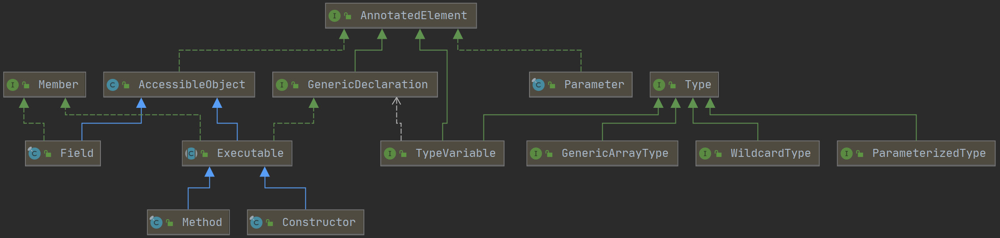

## 泛型

Java内置了 `Type` 接口，JDK对它的解释是：

> Type is the common superinterface for all types in the Java programming language. These include raw types, parameterized types, array types, type variables and primitive types.

JDK内置了一个它的实现类（Class）和四个接口（ParameterizedType、GenericArrayType、WildcardType和TypeVariable）。

- Class：类类型、接口类型、注解类型、枚举类型、数组类型、原生类型都用此类表示。
- ParameterizedType：表示一个参数化的类型，如 `List<String>`。
- TypeVariable：类型变量，如 `class A<T>` 里的T或 `public void <T> setXxx(T t);`  里的T。
- GenericArrayType：表示一种数组类型，这种数组类型的元素的类型为参数化类型（`List<String>`）或类型变量（T）。
- WildcardType：通配符类型，如 `?`、`? extends Number`、`? super Integer`。

下面是一个完整的Demo。

```java
public class GenericReflectDemoTest {

    public static <T, K extends Comparable<Number> & Cloneable> Map<T, K[]> test(
            GenericReflectDemoTest p1,
            List<GenericReflectDemoTest> p2,
            Map<String, GenericReflectDemoTest> p3,
            List<String>[] p4,
            Map<String, GenericReflectDemoTest>[] p5,
            List<? extends Comparable> p6,
            Map<? extends Number, ? super GenericReflectDemoTest> p7,
            T p8,
            K p9 ) {
        return null;
    }

    private static void showUsingOriginal(Method testMethod) {

        System.out.println("\n以下是第一个参数：----------------------------------");

        Type[] types = testMethod.getGenericParameterTypes();
        // 第一个参数，TestReflect
        Class type0 = (Class) types[0];
        // class jdkclass.reflect.TestReflect
        System.out.println("type0: " + type0.getName());

        System.out.println("\n以下是第二个参数：----------------------------------");
        // 第二个参数，List<TestReflect>
        Type type1 = types[1];
        Type rawType1 = ((ParameterizedType) type1).getRawType();    // 原始类型
        Type ownerType = ((ParameterizedType) type1).getOwnerType();
        // 返回类型所属的类型，例如A<T>里定义了内部类InnerA<T>，则InnerA<T>所属的类型是A<T>，如果是顶层则返回null。
        System.out.println(ownerType);    // null

        System.out.println("rawType  " + rawType1);        // interface java.util.List
        Type[] parameterizedType1 = ((ParameterizedType) type1).getActualTypeArguments();
        Class parameterizedType1_0 = (Class) parameterizedType1[0];    // 泛型类型
        // class jdkclass.reflect.TestReflect
        System.out.println("parameterizedType1_0: " + parameterizedType1_0); 

        System.out.println("\n以下是第三个参数：----------------------------------");
        // 第三个参数，Map<String, TestReflect>
        Type type2 = types[2];
        Type rawType = ((ParameterizedType) type2).getRawType();    // 原始类型
        System.out.println("rawType    " + rawType);
        Type[] parameterizedType2 = ((ParameterizedType) type2).getActualTypeArguments();
        Class parameterizedType2_0 = (Class) parameterizedType2[0];
        System.out.println("parameterizedType2_0: " + parameterizedType2_0); // class java.lang.String
        Class parameterizedType2_1 = (Class) parameterizedType2[1];
        // class jdkclass.reflect.TestReflect
        System.out.println("parameterizedType2_1: " + parameterizedType2_1); 

        System.out.println("\n以下是第四个参数：----------------------------------");
        // 第四个参数，List<String>[]
        Type type3 = types[3];
        // 获得数组的元素类型
        Type genericArrayType3 = ((GenericArrayType) type3).getGenericComponentType();
        ParameterizedType parameterizedType3 = (ParameterizedType) genericArrayType3;
        Type[] parameterizedType3Arr = parameterizedType3.getActualTypeArguments();
        Class class3 = (Class) parameterizedType3Arr[0];
        System.out.println("class3:" + class3); // java.lang.String

        System.out.println("\n以下是第五个参数：----------------------------------");
        // 第五个参数，Map<String, TestReflect>[]
        Type type4 = types[4];
        // 获得数组的元素类型
        Type genericArrayType4 = ((GenericArrayType) type4).getGenericComponentType();
        ParameterizedType parameterizedType4 = (ParameterizedType) genericArrayType4;
        Type[] parameterizedType4Arr = parameterizedType4.getActualTypeArguments();
        Class class4_0 = (Class) parameterizedType4Arr[0];
        System.out.println("class4_0:" + class4_0);  // class java.lang.String
        Class class4_1 = (Class) parameterizedType4Arr[1];
        System.out.println("class4_1:" + class4_1);  // class jdkclass.reflect.TestReflect

        System.out.println("\n以下是第六个参数：----------------------------------");
        // 第六个参数，List<? extends Comparable>
        Type type5 = types[5];
        Type[] parameterizedType5 = ((ParameterizedType) type5).getActualTypeArguments();
        // 上界
        Type[] parameterizedType5_0_upper = ((WildcardType) parameterizedType5[0]).getUpperBounds();
        // 下界
        Type[] parameterizedType5_0_lower = ((WildcardType) parameterizedType5[0]).getLowerBounds();
        for (Type type : parameterizedType5_0_upper) {
            System.out.println(type);    // interface java.lang.Comparable
        }
        System.out.println("*******************");
        for (Type type : parameterizedType5_0_lower) {
            System.out.println(type);    // 不输出任何信息
        }

        System.out.println("\n以下是第七个参数：----------------------------------");
        // 第七个参数，Map<? extends Number, ? super TestReflect> p6
        Type type6 = types[6];
        Type[] parameterizedType6 = ((ParameterizedType) type6).getActualTypeArguments();
        Type[] parameterizedType6_0_upper = ((WildcardType) parameterizedType6[0]).getUpperBounds();
        Type[] parameterizedType6_0_lower = ((WildcardType) parameterizedType6[0]).getLowerBounds();
        Type[] parameterizedType6_1_upper = ((WildcardType) parameterizedType6[1]).getUpperBounds();
        Type[] parameterizedType6_1_lower = ((WildcardType) parameterizedType6[1]).getLowerBounds();
        for (Type type : parameterizedType6_0_upper) {
            System.out.println(type);    // class java.lang.Number
        }
        System.out.println("*******************");
        for (Type type : parameterizedType6_0_lower) {
            System.out.println(type);    // 不输出任何信息
        }
        System.out.println("*******************");
        for (Type type : parameterizedType6_1_upper) {
            System.out.println(type);    // class java.lang.Object
        }
        System.out.println("*******************");
        for (Type type : parameterizedType6_1_lower) {
            System.out.println(type);    // class jdkclass.reflect.TestReflect
        }

        System.out.println("\n以下是第八个参数：----------------------------------");
        TypeVariable type7 = (TypeVariable) types[7];
        System.out.println(type7);    // T
        System.out.println(type7.getGenericDeclaration());
        // public static void jdkclass.reflect.TestReflect
        // 			.test(jdkclass.reflect.TestReflect,java.util.List,java.util.Map,
        // java.util.List[],java.util.Map[],java.util.List,java.util.Map,java.lang.Object,java.lang.Comparable)

        System.out.println("\n以下是第九个参数：----------------------------------");
        TypeVariable type8 = (TypeVariable) types[8];
        System.out.println(type8);    // K
        Type[] bounds = type8.getBounds();
        for (Type t : bounds) {
            System.out.println(t);
            // java.lang.Comparable<java.lang.Number>
            // interface java.lang.Cloneable
        }

        System.out.println("\n以下是返回值类型：----------------------------------");
        Type genericReturnType = testMethod.getGenericReturnType();

        Type[] actualReturnTypeArguments = 
            ((ParameterizedType) genericReturnType).getActualTypeArguments();

        System.out.println(actualReturnTypeArguments[0]);   // T
        System.out.println(actualReturnTypeArguments[1]);   // K[]

        Type bounds1 = ((GenericArrayTypeImpl) actualReturnTypeArguments[1]).getGenericComponentType();
        System.out.println(bounds1);    // K

        Type[] bounds2 = ((TypeVariable) bounds1).getBounds();
        for (Type t : bounds2) {
            System.out.println(t);
            // java.lang.Comparable<java.lang.Number>
            // interface java.lang.Cloneable
        }

        ParameterizedType type9 = (ParameterizedType) bounds2[0];
        System.out.println(type9.getRawType()); // interface java.lang.Comparable
        System.out.println(type9.getActualTypeArguments()[0]);  // class java.lang.Number
    }

    public static void main(String[] args) {
        Method[] methods = GenericReflectDemoTest.class.getMethods();
        for (int i = 0; i < methods.length; i++) {
            Method testMethod = methods[i];
            if (testMethod.getName().equals("test")) {
                showUsingSpring(testMethod);
                showUsingOriginal(testMethod);
            }
        }
    }
}
```

如果我们使用Spring，就会简化开发，但是Spring也没有提供绝对完整的API，遇到复杂情况还要调用原始的API。

```java
public class GenericReflectDemoTest {
    private static void showUsingSpring(Method method) {

        // 简化开发
        ResolvableType resolvableTypeMethod = ResolvableType.forMethodParameter(method, 2);
        ResolvableType resolvableType1 = resolvableTypeMethod.asMap();
        System.out.println(resolvableType1.resolveGeneric(0));
        System.out.println(resolvableType1.resolveGeneric(1));

        // 复杂情景还是得调用JDK的方法
        ResolvableType resolvableTypeReturn = ResolvableType.forMethodReturnType(method);
        System.out.println(resolvableTypeReturn.getRawClass());

        ResolvableType generic1 = resolvableTypeReturn.getGenerics()[0];  // T
        ResolvableType generic2 = resolvableTypeReturn.getGenerics()[1];  // K[]

        TypeVariable type = (TypeVariable) generic1.getType();   // 获取原始的T
        System.out.println(type);

        ResolvableType componentType = generic2.getComponentType();  // 获取数组的组件类型
        TypeVariable parameterizedType = (TypeVariable) componentType.getType();	// 获取原始的K
        System.out.println(parameterizedType);
        for (Type bound : parameterizedType.getBounds()) {
            System.out.println(bound);
        }

    }
}
```


## 注解

在学注解的其他作用时，我们先来看看几个注解的注解，也就是写在注解上的注解。注解和类、接口处在同一层次，自然也可以自定义，自定义的时候对注解也可以加上注解，这些能加在注解上的注解被叫做元注解。

以上的元注解便是这个注解是源码级别的。JDK提供的元注解共有四个，如下：

- @Retention()：确定被修饰的自定义注解的生命周期。

- @Target()：确定被被修饰的自定义注解的使用位置。

- @Documented：使用javadoc生成文档需要包含此注解。

- @Inherited：被修饰的子类继承父类的注解。

属性就是我们在圆括号里加入的说明语句，用来说明这个注解的某些性质。

| 元注解       | 属性                                                         |
| ------------ | ------------------------------------------------------------ |
| @Retention() | RetentionPolicy.XXX：SOURCE、CLASS、RUNTIME                  |
| @Target()    | ElementType.XXX：TYPE、FIELD、METHOD、PARAMETER、PACKAGE、 LOCAL_VARIABLE、ANNOTATION_TYPE、CONSTRUCTOR、TYPE_USET、YPE_PARAMETER |


### @Inherited

@Inherited指示一个被注在类上的注解能被子类继承。

```java
@Inherited
@Target({ElementType.TYPE, ElementType.METHOD})
@Retention(RetentionPolicy.RUNTIME)
public @interface TestedMetaAnnotation {

}
```

如果注解上没有@Inherited，子类上是无法获取到的。但是 Spring 提供了工具类让我们可以获取子类上没有@Inherited元注解的注解。下面是一个演示Demo。

```java
public class MetaAnnotationDemo {

    public static void main(String[] args) throws Exception {
        Class<SubDomain> subDomainClass = SubDomain.class;

        System.out.println("JDK获取子类上的注解 ------------------------------");
        Annotation[] subClassAnnotations = subDomainClass.getAnnotations();
        for (Annotation annotation : subClassAnnotations) {
            System.out.println(annotation);
        }


        System.out.println("\nSpring AnnotationUtils获取子类上的注解 ------------------------------");
        TestedMetaAnnotation springFindClassAnnotation = 
            		AnnotationUtils.findAnnotation(subDomainClass, TestedMetaAnnotation.class);
        System.out.println(springFindClassAnnotation);


        System.out.println("\nJDK获取子类方法上的注解------------------------------");
        Method test = subDomainClass.getMethod("test");
        Annotation[] subClassMethodAnnotations = test.getAnnotations();
        for (Annotation annotation : subClassMethodAnnotations) {
            System.out.println(annotation);
        }


        System.out.println("\nSpring AnnotationUtils获取子类方法上的注解 ------------------------------");
        TestedMetaAnnotation springFindMethodAnnotation = 
            		AnnotationUtils.findAnnotation(test, TestedMetaAnnotation.class);
        System.out.println(springFindMethodAnnotation);


        System.out.println("\nJDK获取获取子类属性上的注解 ------------------------------");
        Field testFiled = subDomainClass.getField("test");
        Annotation[] subClassFiledAnnotations = testFiled.getAnnotations();
        for (Annotation annotation : subClassFiledAnnotations) {
            System.out.println(annotation);
        }


        System.out.println("\nSpring AnnotationUtils获取子类属性上的注解 ------------------------------");
        System.out.println("Spring没有提供获取子类属性注解的方式 ------------------------------");
    }

    @TestedMetaAnnotation
    static class Domain {
        @TestedMetaAnnotation
        public String test;

        @TestedMetaAnnotation
        public void test() {}
    }

    static class SubDomain extends Domain {
        public String test;

        @Override
        public void test() {}
    }
}
```


### @AliasFor

1. **Implicit Overrides**: given attribute `A` in annotation `@One` and attribute `A` in annotation `@Two`, if `@One` is meta-annotated with `@Two`, then attribute `A` in annotation `@One` is an *implicit override* for attribute `A` in annotation `@Two` based solely on a naming convention (i.e., both attributes are named `A`).
2. **Explicit Overrides**: if attribute `A` is declared as an alias for attribute `B` in a meta-annotation via `@AliasFor`, then `A` is an *explicit override* for `B`.
3. **Transitive Explicit Overrides**: if attribute `A` in annotation `@One` is an explicit override for attribute `B` in annotation `@Two` and `B` is an explicit override for attribute `C` in annotation `@Three`, then `A` is a *transitive explicit override* for `C` following the [law of transitivity](https://en.wikipedia.org/wiki/Transitive_relation).

下面是一个Demo。

```java
@Target(ElementType.TYPE)
@Retention(RetentionPolicy.RUNTIME)
@Documented
@ComponentScan
public @interface MyComponentScanImplicit {

    @AliasFor(annotation = ComponentScan.class, attribute = "basePackages") // 隐性别名
    String[] scanBasePackages() default {};

}
```

```java
@Target(ElementType.TYPE)
@Retention(RetentionPolicy.RUNTIME)
@Documented
@MyComponentScanImplicit
public @interface MyComponentScanExplicit {

    // 属性继承
    String[] scanBasePackages() default {};

    @AliasFor("scanBasePackages")   // 显性别名
    String[] packages() default {};

}
```

```java
@Component
public class TestClass {
}
```

```java
//@MyComponentScanImplicit(scanBasePackages = "resolver.annotation.aliasfor")
@MyComponentScanExplicit(packages = "resolver.annotation.aliasfor")
public class ComponentScanDemo {

    public static void main(String[] args) {
        AnnotationConfigApplicationContext context = new AnnotationConfigApplicationContext();
        // 注册 Configuration Class
        context.register(ComponentScanDemo.class);

        context.refresh();

        TestClass testClass = context.getBean(TestClass.class);

        System.out.println(testClass);

        context.close();
    }
}
```


### AnnotatedElementUtils

JDK有一个接口叫AnnotatedElement，此接口的子类都具有被Annotate的能力。我们可以看到，Filed、Member、Constructor、Class等都是此接口的子类。



AnnotatedElementUtils的目的是处理AnnotatedElement对象上的注解。同时它提供了对@AliasFor注解的处理，而AnnotationUtils不会处理@AliasFor注解，而且AnnotationUtils没有提供对字段的处理。

```java
public class AnnotationTest {
    public static void main(String[] args) {
        print("Parent getAnnotation @Request:         " 
              + AnnotationUtils.getAnnotation(Parent.class, Request.class));
        print("Child  getAnnotation @Request:         " 
              + AnnotationUtils.getAnnotation(Child.class, Request.class));
        print();

        print("Parent findAnnotation @Request:        " 
              + AnnotationUtils.findAnnotation(Parent.class, Request.class));
        print("Child  findAnnotation @Request:        " 
              + AnnotationUtils.findAnnotation(Child.class, Request.class));
        print();

        print("Parent isAnnotated @Request:           " 
              + AnnotatedElementUtils.isAnnotated(Parent.class, Request.class));
        print("Parent getMergedAnnotation @Request:   " 
              + AnnotatedElementUtils.getMergedAnnotation(Parent.class, Request.class));
        print("Child  isAnnotated @Request:           " 
              + AnnotatedElementUtils.isAnnotated(Child.class, Request.class));
        print("Child  getMergedAnnotation @Request:   " 
              + AnnotatedElementUtils.getMergedAnnotation(Child.class, Request.class));
        print();

        print("Parent hasAnnotation @Request:         "
              + AnnotatedElementUtils.hasAnnotation(Parent.class, Request.class));
        print("Parent findMergedAnnotation @Request:  " 
              + AnnotatedElementUtils.findMergedAnnotation(Parent.class, Request.class));
        print("Child  hasAnnotation @Request:         "
              + AnnotatedElementUtils.hasAnnotation(Child.class, Request.class));
        print("Child  findMergedAnnotation @Request:  "
              + AnnotatedElementUtils.findMergedAnnotation(Child.class, Request.class));
    }

    static void print(String ...str) {
        if(str != null && str.length != 0) {
            System.out.println(str[0]);
        } else {
            System.out.println();
        }
    }
}

@Post(value = "parent", name = "parent controller")
class Parent {
}

//@Request(path = "child", name = "child controller")
class Child extends Parent {
}
```

```java
@Target({ElementType.METHOD, ElementType.TYPE})
@Retention(RetentionPolicy.RUNTIME)
@Documented
@Request
@interface Post {

    @AliasFor(annotation = Request.class)
    String name() default "";

    @AliasFor(annotation = Request.class)
    String[] value() default {};

    @AliasFor(annotation = Request.class)
    String[] path() default {};
}
```

```java
@Target({ElementType.METHOD, ElementType.TYPE})
@Retention(RetentionPolicy.RUNTIME)
@Documented
@interface Request {

    String name() default "";

    @AliasFor("path")
    String[] value() default {};


    @AliasFor("value")
    String[] path() default {};
}
```

详细请见：[spring注解工具类AnnotatedElementUtils和AnnotationUtils - 胡峻峥 - 博客园 (cnblogs.com)](https://www.cnblogs.com/hujunzheng/p/9790588.html)


