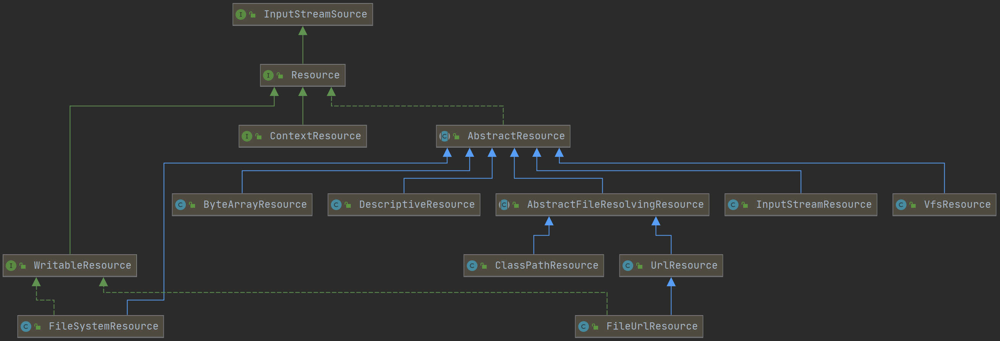
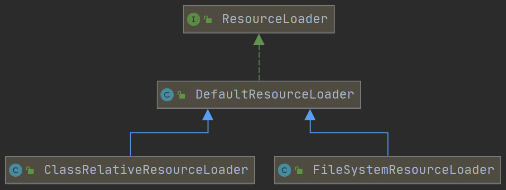
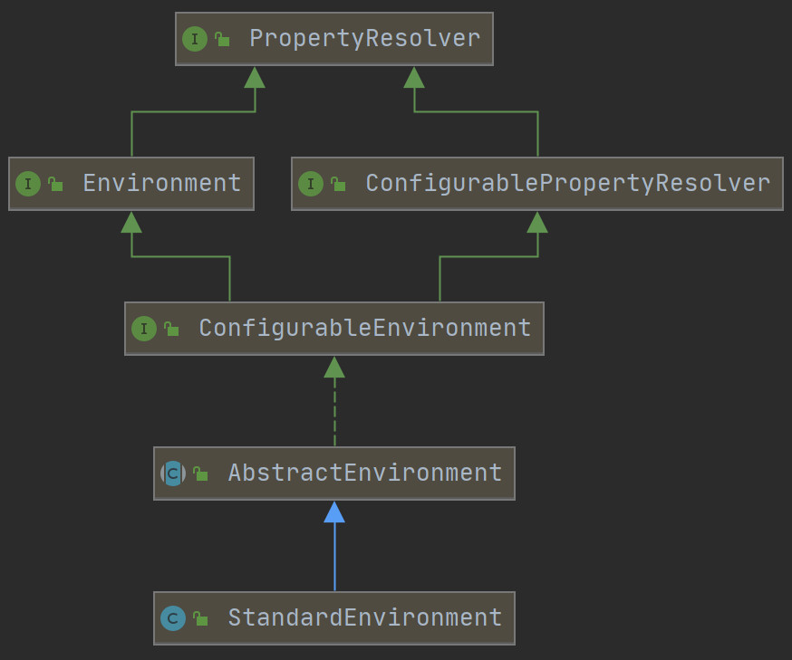

## 资源抽象

### Resource

Spring提供了对资源的抽象。由于Spring对资源主要是读取，所以顶层接口设计为InputStreamSource，它其中只有一个方法：getInputStream。WritableResource是可写接口的根类，含有三个方法：

- default boolean isWritable()
- OutputStream getOutputStream()
- default WritableByteChannel writableChannel()

但是两个方法都是default方法，只有一个getOutputStream需要实现。



**demo**

```java
public class EncodedFileSystemResourceDemo {
    
    public static void main(String[] args) throws Exception {
        String currentJavaFilePath = System.getProperty("user.dir") + 
            "\\resource-abstraction\\src\\main\\java\\ra\\EncodedFileSystemResourceLoaderDemo.java";
        System.out.println(currentJavaFilePath);
        // FileSystemResource => WritableResource => Resource
        FileSystemResource fileSystemResource = new FileSystemResource(currentJavaFilePath);
        EncodedResource encodedResource = new EncodedResource(fileSystemResource, "UTF-8");
        try (Reader reader = encodedResource.getReader()) {
            System.out.println(IOUtils.toString(reader));
        }
    }
    
}
```

#### Resource注入

Resource是可以直接注入的。

```java
public class InjectingResourceDemo {

    @Value("classpath:/META-INF/default.properties")
    private Resource defaultPropertiesResource;

    @Value("classpath*:/META-INF/*.properties")
    private Resource[] propertiesResources;

    @Value("${user.dir}")
    private String currentProjectRootPath;

    @PostConstruct
    public void init() {
        System.out.println(ResourceUtils.getContent(defaultPropertiesResource));
        System.out.println("================");
        Stream.of(propertiesResources).map(ResourceUtils::getContent).forEach(System.out::println);
        System.out.println("================");
        System.out.println(currentProjectRootPath);
    }

    public static void main(String[] args) {
        AnnotationConfigApplicationContext context = new AnnotationConfigApplicationContext();
        // 注册当前类作为 Configuration Class
        context.register(InjectingResourceDemo.class);
        // 启动 Spring 应用上下文
        context.refresh();
        // 关闭 Spring 应用上下文
        context.close();
    }
}
```


### ResourceLoader

ResourceLoader是用于加载Resource的。它只有两个方法：

1. Resource getResource(String location);
2. ClassLoader getClassLoader();

通常我们使用getResource获取资源。



ResourceLoader有三个实现类

- DefaultResourceLoader是相对于classpath路径的 
- FileSystemResourceLoader是相对于文件系统的
- ClassRelativeResourceLoader是相对于类的

**demo**

```java
package ra;

public class EncodedFileSystemResourceLoaderDemo {
    private static String classpathFileLocation = "ra\\EncodedFileSystemResourceLoaderDemo";

    public static void main(String[] args) throws IOException {
        String currentJavaFilePath = "/" + System.getProperty("user.dir") +
                "\\resource-abstraction\\src\\main\\java\\" + classpathFileLocation + ".java";
        FileSystemResourceLoader fsResourceLoader = new FileSystemResourceLoader();
        Resource resource = fsResourceLoader.getResource(currentJavaFilePath);
        EncodedResource encodedResource = new EncodedResource(resource, "UTF-8");
        // 字符输入流
        try (Reader reader = encodedResource.getReader()) {
            System.out.println(IOUtils.toString(reader));
        }


        DefaultResourceLoader cpResourceLoader = new DefaultResourceLoader();
        Resource resource1 = cpResourceLoader.getResource(classpathFileLocation + ".class");
        try (InputStream reader = resource1.getInputStream()) {
            System.out.println(IOUtils.toString(reader, Charset.forName("UTF-8")));
        }
    }
}
```

#### ResourceLoader注入

AbstractApplicationContext继承了DefaultResourceLoader。在Spring中，我们通过ResourceLoaderAware回调注入的，@Autowired注入的ResourceLoader都是ApplicationContext。

```java
public class InjectingResourceLoaderDemo implements ResourceLoaderAware {
    private ResourceLoader resourceLoader;

    @Autowired
    private ResourceLoader autowiredResourceLoader;

    @Autowired
    private AbstractApplicationContext applicationContext;

    @PostConstruct
    public void init() {
        System.out.println("resourceLoader == autowiredResourceLoader : " 
                           + (resourceLoader == autowiredResourceLoader));
        System.out.println("resourceLoader == applicationContext : " 
                           + (resourceLoader == applicationContext));
    }

    @Override
    public void setResourceLoader(ResourceLoader resourceLoader) {
        this.resourceLoader = resourceLoader;
    }

    public static void main(String[] args) {
        AnnotationConfigApplicationContext context = new AnnotationConfigApplicationContext();
        // 注册当前类作为 Configuration Class
        context.register(InjectingResourceLoaderDemo.class);

        context.refresh();
        InjectingResourceLoaderDemo demo = context.getBean(InjectingResourceLoaderDemo.class);

        System.out.println(demo.resourceLoader);
        System.out.println(demo.autowiredResourceLoader);
        System.out.println(demo.applicationContext);
        context.close();
    }
    
}
```


### ResourcePatternResolver

ResourcePatternResolver是ResourceLoader的子接口。它在查找资源的时候可以进行模糊匹配。模糊匹配的接口是PathMatcher，它只有一个实现类AntPathMatcher。

```java
public class PathMatchingResourcePatternResolverDemo {

    public static void main(String[] args) throws Exception {
        DefaultResourceLoader defaultResourceLoader = new DefaultResourceLoader();

        PathMatchingResourcePatternResolver resourcePatternResolver = 
                new PathMatchingResourcePatternResolver(defaultResourceLoader);

        // classpath 表示本项目的classpath
        // classpath* 表示本项目以及其所依赖的项目的classpath
        Resource[] resources = resourcePatternResolver.getResources("classpath*:ra/**/*.class");
        for (Resource resource : resources) {
            System.out.println(resource.getURL());
        }
        System.out.println(resources.length);
    }

}
```


## 环境抽象



Spring环境的类图是比较简单的，唯一需要说的就是环境继承了PropertyResolver，这个在之前的案例中已经看见了，我们可以调用Environment的getProperty()方法进行占位符替换。


### Bean的获取

#### 依赖查找

Spring环境Bean的名称三十固定的，可以通过名称的方式进行查找，同时可以通过EnvironmentAware进行Aware回调注入。

```java
public class LookupEnvironmentDemo implements EnvironmentAware {
    private Environment environment;

    public static void main(String[] args) {
        AnnotationConfigApplicationContext context = new AnnotationConfigApplicationContext();
        // 注册 Configuration Class
        context.register(LookupEnvironmentDemo.class);

        // 启动 Spring 应用上下文
        context.refresh();

        LookupEnvironmentDemo lookupEnvironmentDemo = context.getBean(LookupEnvironmentDemo.class);

        // 通过 Environment Bean 名称 依赖查找
        Environment environment = 
            context.getBean(ConfigurableApplicationContext.ENVIRONMENT_BEAN_NAME, Environment.class);

        System.out.println(lookupEnvironmentDemo.environment);

        System.out.println(lookupEnvironmentDemo.environment == environment);

        // 关闭 Spring 应用上下文
        context.close();
    }

    @Override
    public void setEnvironment(Environment environment) {
        this.environment = environment;
    }
}
```

#### 依赖注入

```java
public class InjectingEnvironmentDemo implements EnvironmentAware, ApplicationContextAware {
    private Environment environment;

    @Autowired
    private Environment environment2;

    private ApplicationContext applicationContext;

    @Autowired
    private ApplicationContext applicationContext2;

    public static void main(String[] args) {
        AnnotationConfigApplicationContext context = new AnnotationConfigApplicationContext();
        // 注册 Configuration Class
        context.register(InjectingEnvironmentDemo.class);

        // 启动 Spring 应用上下文
        context.refresh();

        InjectingEnvironmentDemo injectingEnvironmentDemo = 
            					context.getBean(InjectingEnvironmentDemo.class);

        System.out.println(injectingEnvironmentDemo.environment);

        System.out.println(injectingEnvironmentDemo.environment == 
                           		injectingEnvironmentDemo.environment2);

        System.out.println(injectingEnvironmentDemo.environment == context.getEnvironment());

        System.out.println(injectingEnvironmentDemo.environment == 
                           		injectingEnvironmentDemo.applicationContext.getEnvironment());

        System.out.println(injectingEnvironmentDemo.applicationContext == 
                           		injectingEnvironmentDemo.applicationContext2);

        System.out.println(injectingEnvironmentDemo.applicationContext == context);

        // 关闭 Spring 应用上下文
        context.close();
    }

    @Override
    public void setEnvironment(Environment environment) {
        this.environment = environment;
    }

    @Override
    public void setApplicationContext(ApplicationContext applicationContext) throws BeansException {
        this.applicationContext = applicationContext;
    }
}
```


### Profile

#### Condition

```java
@Target({ElementType.METHOD})
@Retention(RetentionPolicy.RUNTIME)
@Documented
public @interface Attachment {
    String value();
}
```

```java
public class EvenProfileCondition implements Condition {
    @Override
    public boolean matches(ConditionContext context, AnnotatedTypeMetadata metadata) {
        MergedAnnotations annotations = metadata.getAnnotations();

        for (MergedAnnotation<Annotation> annotation : annotations) {
            System.out.println(annotation);
            if(annotation.getType().equals(Attachment.class)) {
                String value = annotation.getString("value");
                if(value.equals("even")) {
                    return true;
                }
            }
        }

        // 条件上下文
        return false;
    }
}
```

```java
public class ConditionalDemo {

    public static void main(String[] args) {
        AnnotationConfigApplicationContext context = new AnnotationConfigApplicationContext();
        context.register(ConditionalDemo.class);
        ConfigurableEnvironment environment = context.getEnvironment();
        environment.setDefaultProfiles("odd");
        context.refresh();

        Integer number = context.getBean("number", Integer.class);
        System.out.println(number);
        context.close();
    }

    @Conditional(EvenProfileCondition.class)
    @Bean(name = "number")
    @Attachment(value = "odd")
    public Integer odd() {
        return 1;
    }

    @Conditional(EvenProfileCondition.class)
    @Bean(name = "number")
    @Attachment(value = "even")
    public Integer even() {
        return 2;
    }
}
```

> Indicates that a component is only eligible for registration when all specified conditions match.
>
> A condition is any state that can be determined programmatically before the bean definition is due to be registered (see Condition for details).
>
> The @Conditional annotation may be used in any of the following ways:
>
> - as a type-level annotation on any class directly or indirectly annotated with @Component, including @Configuration classes
> - as a meta-annotation, for the purpose of composing custom stereotype annotations
> - as a method-level annotation on any @Bean method
>
> If a @Configuration class is marked with @Conditional, all of the @Bean methods, @Import annotations, and @ComponentScan annotations associated with that class will be subject to the conditions.

#### Profile

Profile表示环境所需要使用的文件。它就是使用Condition实现的。Spring对其的注释。

> If a @Configuration class is marked with @Profile, all of the @Bean methods and @Import annotations associated with that class will be bypassed unless one or more of the specified profiles are active. A profile string may contain a simple profile name (for example "p1") or a profile expression. A profile expression allows for more complicated profile logic to be expressed, for example "p1 & p2". See Profiles.of(String...) for more details about supported formats.
>
> This is analogous to the behavior in Spring XML: if the profile attribute of the beans element is supplied e.g., `<beans profile="p1,p2">`, the beans element will not be parsed unless at least profile 'p1' or 'p2' has been activated. Likewise, if a @Component or @Configuration class is marked with @Profile({"p1", "p2"}), that class will not be registered or processed unless at least profile 'p1' or 'p2' has been activated.
>
> If a given profile is prefixed with the NOT operator (!), the annotated component will be registered if the profile is not active — for example, given @Profile({"p1", "!p2"}), registration will occur if profile 'p1' is active or if profile 'p2' is not active.

```java
public class ProfileDemo {
    public static void main(String[] args) {
        AnnotationConfigApplicationContext context = new AnnotationConfigApplicationContext();
        context.register(ProfileDemo.class);

        ConfigurableEnvironment environment = context.getEnvironment();
        environment.setDefaultProfiles("odd");
        context.refresh();

        Integer number = context.getBean("number", Integer.class);
        System.out.println(number);
        context.close();
    }

    @Bean(name = "number")
    @Profile("odd") // 奇数
    public Integer odd() {
        return 1;
    }

    @Bean(name = "number")
    @Profile("even") // 偶数
    public Integer even() {
        return 2;
    }
}
```

##### 源码分析

```java
@Target({ElementType.TYPE, ElementType.METHOD})
@Retention(RetentionPolicy.RUNTIME)
@Documented
@Conditional(ProfileCondition.class)
public @interface Profile {
   String[] value();
}
```

```java
class ProfileCondition implements Condition {
   @Override
   public boolean matches(ConditionContext context, AnnotatedTypeMetadata metadata) {
      MultiValueMap<String, Object> attrs = 
          	metadata.getAllAnnotationAttributes(Profile.class.getName());
      if (attrs != null) {
         for (Object value : attrs.get("value")) {
            if (context.getEnvironment().acceptsProfiles(Profiles.of((String[]) value))) {
               return true;
            }
         }
         return false;
      }
      return true;
   }
}
```

源码很简单，就是使用Condition对Profile进行判断。


## LifeCycle

容器启动之后Bean就是可用状态了，此时容器会发布一个ContextRefreshedEvent事件。

```java
// AbstractApplicationContext.java
protected void finishRefresh() {
    // Clear context-level resource caches (such as ASM metadata from scanning).
    clearResourceCaches();

    // Initialize lifecycle processor for this context.
    initLifecycleProcessor();

    // Propagate refresh to lifecycle processor first.
    getLifecycleProcessor().onRefresh();

    // Publish the final event.
    publishEvent(new ContextRefreshedEvent(this));

    // Participate in LiveBeansView MBean, if active.
    LiveBeansView.registerApplicationContext(this);
}

```

这里需要注意一个LifeCycle接口。这个接口的目的是在Bean初始化之后表示Bean的生命周期。

```java
public interface Lifecycle {
   void start();
   void stop();
   boolean isRunning();
}
```

还有一个Phased接口，目的是控制Bean的start顺序，即phase越小，越早start。

```java
public interface Phased {
   int getPhase();
}
```

SmartLifecycle是Lifecycle和Phased的子接口。

```java
public interface SmartLifecycle extends Lifecycle, Phased {
   int DEFAULT_PHASE = Integer.MAX_VALUE;
   default boolean isAutoStartup() {
      return true;
   }
   default void stop(Runnable callback) {
      stop();
      callback.run();
   }
   @Override
   default int getPhase() {
      return DEFAULT_PHASE;
   }
}
```

在finishRefresh阶段，会初始化一个LifecycleProcessor。这个LifecycleProcessor会处理所有的Bean的生命周期。默认的实现类就是DefaultLifecycleProcessor。

```java
protected void initLifecycleProcessor() {
    ConfigurableListableBeanFactory beanFactory = getBeanFactory();
    if (beanFactory.containsLocalBean(LIFECYCLE_PROCESSOR_BEAN_NAME)) {
        this.lifecycleProcessor =
            beanFactory.getBean(LIFECYCLE_PROCESSOR_BEAN_NAME, LifecycleProcessor.class);
    } else {
        DefaultLifecycleProcessor defaultProcessor = new DefaultLifecycleProcessor();
        defaultProcessor.setBeanFactory(beanFactory);
        this.lifecycleProcessor = defaultProcessor;
        beanFactory.registerSingleton(LIFECYCLE_PROCESSOR_BEAN_NAME, this.lifecycleProcessor);
    }
}
```

LifecycleProcessor也是Lifecycle的子接口。

```java
public interface LifecycleProcessor extends Lifecycle {
   void onRefresh();
   void onClose();
}
```

Application默认的四个事件refresh、start、stop、close。

refresh事件在初始化LifecycleProcessor之后就会被发布。`getLifecycleProcessor().onRefresh();`这行代码就是start Beans的。

```java
public class DefaultLifecycleProcessor implements LifecycleProcessor, BeanFactoryAware {
    @Override
    public void start() {
        startBeans(false);
        this.running = true;
    }
    @Override
    public void stop() {
        stopBeans();
        this.running = false;
    }
    @Override
    public void onRefresh() {
        // 只有
        startBeans(true);
        this.running = true;
    }
    @Override
    public void onClose() {
        stopBeans();
        this.running = false;
    }
}
```

ContextClosedEvent事件在close方法里面的doClose方法里面被发布。close的时候会调用LifecycleProcessor的onClose()方法。

```java
// AbstractApplicationContext.java
public void close() {
    synchronized (this.startupShutdownMonitor) {
        doClose();
        // If we registered a JVM shutdown hook, we don't need it anymore now:
        // We've already explicitly closed the context.
        if (this.shutdownHook != null) {
            try {
                Runtime.getRuntime().removeShutdownHook(this.shutdownHook);
            }
            catch (IllegalStateException ex) {
                // ignore - VM is already shutting down
            }
        }
    }
}
protected void doClose() {
    // Check whether an actual close attempt is necessary...
    if (this.active.get() && this.closed.compareAndSet(false, true)) {
        LiveBeansView.unregisterApplicationContext(this);

        try {
            // Publish shutdown event.
            publishEvent(new ContextClosedEvent(this));
        }
		// 异常处理 ...

        // Stop all Lifecycle beans, to avoid delays during individual destruction.
        if (this.lifecycleProcessor != null) {
            try {
                this.lifecycleProcessor.onClose();
            }
			// 异常处理 ...
        }

        // Destroy all cached singletons in the context's BeanFactory.
        destroyBeans();

        // Close the state of this context itself.
        closeBeanFactory();

        // Let subclasses do some final clean-up if they wish...
        onClose();

        // Reset local application listeners to pre-refresh state.
        if (this.earlyApplicationListeners != null) {
            this.applicationListeners.clear();
            this.applicationListeners.addAll(this.earlyApplicationListeners);
        }

        // Switch to inactive.
        this.active.set(false);
    }
}
```

ContextStoppedEvent事件在stop方法里面被发布。stop的时候会调用LifecycleProcessor的stop()方法。

```java
public void stop() {
   getLifecycleProcessor().stop();
   publishEvent(new ContextStoppedEvent(this));
}
```

ContextStartEvent事件在start方法里面被发布。start的时候会调用LifecycleProcessor的start()方法。

```java
public void start() {
    getLifecycleProcessor().start();
    publishEvent(new ContextStartedEvent(this));
}
```

refresh()方法和start()方法会调用DefaultLifecycleProcessor#startBeans()方法。

```java
private void startBeans(boolean autoStartupOnly) {
    Map<String, Lifecycle> lifecycleBeans = getLifecycleBeans();
    Map<Integer, LifecycleGroup> phases = new HashMap<>();
    lifecycleBeans.forEach((beanName, bean) -> {
        if (!autoStartupOnly || (bean instanceof SmartLifecycle 
                                 && ((SmartLifecycle) bean).isAutoStartup())) {
            int phase = getPhase(bean);
            LifecycleGroup group = phases.get(phase);
            if (group == null) {
                group = new LifecycleGroup
                    (phase, this.timeoutPerShutdownPhase, lifecycleBeans, autoStartupOnly);
                phases.put(phase, group);
            }
            group.add(beanName, bean);
        }
    });
    if (!phases.isEmpty()) {
        List<Integer> keys = new ArrayList<>(phases.keySet());
        Collections.sort(keys);
        for (Integer key : keys) {
            phases.get(key).start();
        }
    }
}
private void doStart(Map<String, ? extends Lifecycle> lifecycleBeans, 
                     				String beanName, boolean autoStartupOnly) {
    Lifecycle bean = lifecycleBeans.remove(beanName);
    if (bean != null && bean != this) {
        String[] dependenciesForBean = getBeanFactory().getDependenciesForBean(beanName);
        for (String dependency : dependenciesForBean) {
            doStart(lifecycleBeans, dependency, autoStartupOnly);
        }
        if (!bean.isRunning() &&
            (!autoStartupOnly || 
             	!(bean instanceof SmartLifecycle) || ((SmartLifecycle) bean).isAutoStartup())) {
            try {
                bean.start();
            }
			// 异常处理 ...
        }
    }
}
```

从代码中可以看出来如果一个Bean实现了Lifecycle且不在运行中，就会被调用Bean的start方法。

```java
private void stopBeans() {
    Map<String, Lifecycle> lifecycleBeans = getLifecycleBeans();
    Map<Integer, LifecycleGroup> phases = new HashMap<>();
    lifecycleBeans.forEach((beanName, bean) -> {
        int shutdownPhase = getPhase(bean);
        LifecycleGroup group = phases.get(shutdownPhase);
        if (group == null) {
            group = new LifecycleGroup
                (shutdownPhase, this.timeoutPerShutdownPhase, lifecycleBeans, false);
            phases.put(shutdownPhase, group);
        }
        group.add(beanName, bean);
    });
    if (!phases.isEmpty()) {
        List<Integer> keys = new ArrayList<>(phases.keySet());
        keys.sort(Collections.reverseOrder());
        for (Integer key : keys) {
            phases.get(key).stop();
        }
    }
}
private void doStop(Map<String, ? extends Lifecycle> lifecycleBeans, final String beanName,
                    final CountDownLatch latch, final Set<String> countDownBeanNames) {
    Lifecycle bean = lifecycleBeans.remove(beanName);
    if (bean != null) {
        String[] dependentBeans = getBeanFactory().getDependentBeans(beanName);
        for (String dependentBean : dependentBeans) {
            doStop(lifecycleBeans, dependentBean, latch, countDownBeanNames);
        }
        try {
            if (bean.isRunning()) {
                if (bean instanceof SmartLifecycle) {
                    countDownBeanNames.add(beanName);
                    ((SmartLifecycle) bean).stop(() -> {
                        latch.countDown();
                        countDownBeanNames.remove(beanName);
                    });
                }
                else {
                    bean.stop();
                }
            }
            else if (bean instanceof SmartLifecycle) {
                // Don't wait for beans that aren't running...
                latch.countDown();
            }
        }
        // 异常处理 ...
    }
}
```

如果一个Bean实现了Lifecycle且在运行中，就会被调用Bean的stop方法。

**Demo**

```java
public class TestLifeCycleBean implements SmartLifecycle {
    private boolean running = false;
    @Override
    public void start() {
        System.out.println("bean start");
        running = true;
    }
    @Override
    public void stop() {
        System.out.println("bean stop");
        running = false;
    }
    @Override
    public boolean isRunning() {
        return running;
    }
}
```

```java
public class TestLifeCycleBeanDemo {
    public static void main(String[] args) {
        AnnotationConfigApplicationContext context = new AnnotationConfigApplicationContext();
        context.register(TestLifeCycleBeanDemo.class);
        context.registerShutdownHook();
        context.refresh();
        context.start();;
        context.close();
    }
    @Bean
    public TestLifeCycleBean testLifeCycleBean() {
        return new TestLifeCycleBean();
    }

```