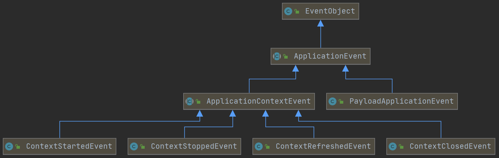

## JDK的事件监听接口

JDK提供了一个经典的监听者模型。Observable接口是可被监听的对象，Observer是监听的对象。

```java
public class JDKObserverDemo {
    public static void main(String[] args) {
        EventObservable observable = new EventObservable();
        // 注册观察者（监听者）
        observable.addObserver(new EventObserver());
        // 发布消息（事件）
        observable.notifyObservers("Hello,World");
    }
    static class EventObservable extends Observable {
        @Override
        public void notifyObservers(Object arg) {
            setChanged();
            super.notifyObservers(arg);
            clearChanged();
        }
    }
    static class EventObserver implements Observer {
        @Override
        public void update(Observable o, Object arg) {
            System.out.println("收到事件 ：" + arg);
        }
    }
}
```

同时JDK提供了EventListener接口和EventObject接口。前者是事件监听器的标识接口，后者封装了事件。

```java
public interface EventListener {
}
```

```java
public class EventObject implements java.io.Serializable {
    private static final long serialVersionUID = 5516075349620653480L;
    protected transient Object  source;
    public EventObject(Object source) {
        if (source == null)
            throw new IllegalArgumentException("null source");
        this.source = source;
    }
    public Object getSource() {M,
        return source;
    }
    public String toString() {
        return getClass().getName() + "[source=" + source + "]";
    }
}
```

两个类都很简单，不再解释了。一般来说，Java里面的事件都继承EventObject，监听器都继承EventListener。

```java
public class JDKObserverEventListenerDemo {

    public static void main(String[] args) {
        EventObservable observable = new EventObservable();
        // 注册观察者（监听者）
        observable.addObserver(new EventObserver());
        // 发布消息（事件）
        observable.notifyObservers("Hello,World");
    }

    static class EventObservable extends Observable {
        @Override
        public void setChanged() {
            super.setChanged();
        }

        @Override
        public void notifyObservers(Object arg) {
            setChanged();
            // 将事件封装为EventObject再发布
            super.notifyObservers(new EventObject(arg));
            clearChanged();
        }
    }

    static class EventObserver implements Observer, EventListener {
        @Override
        public void update(Observable o, Object event) {
            EventObject eventObject = (EventObject) event;
            System.out.println("收到事件 ：" + eventObject);
        }
    }
}
```

我们刚才演示的都是单事件监听，也就是说一个监听器只能处理一个类型的事件。Spring采用的也是单事件监听。


## 监听ApplicationContext

在Spring的context模块中只有ApplicationContext这一个事件源。事件的底层抽象类是ApplicationEvent，具体的类图如下。



ApplicationEvent事件对应的监听器就是ApplicationListener。

```java
public interface ApplicationListener<E extends ApplicationEvent> extends EventListener {
	void onApplicationEvent(E event);
}
```

当我们向ApplicationContext注册一个具体类型的ApplicationListener，就会监听一个具体类型的事件。


### 接口监听

#### 内置的监听器

Spring内置了对ApplicationContext状态的四个监听器：refresh、start、stop、close。

```java
public class InterfaceApplicationListenerDemo {

    public static void main(String[] args) {
        ConfigurableApplicationContext applicationContext = new GenericApplicationContext();

        applicationContext.addApplicationListener(new ApplicationListener<ContextRefreshedEvent>() {
            @Override
            public void onApplicationEvent(ContextRefreshedEvent event) {
                System.out.println(event);
            }
        });

        applicationContext.addApplicationListener(new ApplicationListener<ContextStartedEvent>() {
            @Override
            public void onApplicationEvent(ContextStartedEvent event) {
                System.out.println(event);
            }
        });

        applicationContext.addApplicationListener(new ApplicationListener<ContextStoppedEvent>() {
            @Override
            public void onApplicationEvent(ContextStoppedEvent event) {
                System.out.println(event);
            }
        });

        applicationContext.addApplicationListener(new ApplicationListener<ContextClosedEvent>() {
            @Override
            public void onApplicationEvent(ContextClosedEvent event) {
                System.out.println(event);
            }
        });

        applicationContext.refresh();
        applicationContext.start();
        applicationContext.stop();
        applicationContext.close();
    }

}
```

#### 自定义监听器

我们可以通过继承ApplicationEvent自定义ApplicationContext事件；通过实现ApplicationListener对自定义的事件进行监听。

```java
public class CustomizedSpringEventDemo {
    public static void main(String[] args) {
        GenericApplicationContext context = new GenericApplicationContext();
        context.addApplicationListener(new MySpringEventListener());

        context.addApplicationListener(
        		event -> System.out.println("监听ApplicationContext的全部事件 : " + event.getSource()));

        context.refresh();
        context.publishEvent(new MySpringEvent1("MySpringEvent1 Hello,World"));
        context.publishEvent(new MySpringEvent2("MySpringEvent2 Hello,World"));
        context.close();
    }

    static public class MySpringEvent1 extends ApplicationEvent {
        public MySpringEvent1(String message) {
            super(message);
        }
        @Override
        public String getSource() {
            return (String) super.getSource();
        }
    }

    static public class MySpringEvent2 extends ApplicationEvent {
        public MySpringEvent2(String message) {
            super(message);
        }
        @Override
        public String getSource() {
            return (String) super.getSource();
        }
    }

    static public class MySpringEventListener implements ApplicationListener<MySpringEvent1> {
        @Override
        public void onApplicationEvent(MySpringEvent1 event) {
            System.out.printf("自定义监听器监听到 : %s\n", event.getSource());
        }
    }
}
```

#### Event在父子Context中的传播

如果ApplicationContext具有父子关系，那么子ApplicationContext的事件会被传播到父ApplicaionContext中，如果父子都都注册有此类型事件的监听器，那么就会造成事件的重复处理，所以需要进行控制。

```java
public class EventPropagateInContextDemo {

    public static void main(String[] args) {
        // 1. 创建 parent Spring 应用上下文
        AnnotationConfigApplicationContext parentContext = new AnnotationConfigApplicationContext();
        parentContext.setId("parent-context");
        // 注册 MyListener 到 parent Spring 应用上下文
        parentContext.register(MyListener.class);

        // 2. 创建 current Spring 应用上下文
        AnnotationConfigApplicationContext currentContext = new AnnotationConfigApplicationContext();
        currentContext.setId("current-context");
        // 3. current -> parent
        currentContext.setParent(parentContext);
        // 注册 MyListener 到 current Spring 应用上下文
        currentContext.register(MyListener.class);

        // 4.启动 parent Spring 应用上下文
        parentContext.refresh();

        // 5.启动 current Spring 应用上下文
        currentContext.refresh();

        // 关闭所有 Spring 应用上下文
        currentContext.close();
        parentContext.close();
    }

    static class MyListener implements ApplicationListener<ApplicationContextEvent> {
        private static Set<ApplicationContextEvent> processedEvents = new LinkedHashSet<>();

        @Override
        public void onApplicationEvent(ApplicationContextEvent event) {
            /**
             * 子ApplicationContext事件发布的时候，父ApplicationContext也会发布此事件，
             * 所以这里对时间进行记录，防止事件被重复处理
             */
            if (processedEvents.add(event)) {
                System.out.printf("监听到 Spring 应用上下文[ ID : %s ] 事件 :%s\n", 
                	event.getApplicationContext().getId(), event.getClass().getSimpleName());
            }
        }
    }
}
```

#### Payload事件

PayloadApplicationEvent可以承载一个具体类型的参数，不过Spring源码里注释了这是个Spring内部使用的事件，所以使用的时候能不能就不用。

```java
public class PayloadApplicationEventDemo {

    public static void main(String[] args) {
        GenericApplicationContext context = new GenericXmlApplicationContext();
        context.registerBean(MyPayloadApplicationListener.class);
        context.refresh();

        context.publishEvent(new PayloadApplicationEvent(context, "hello world"));
        context.close();
    }

    static class MyPayloadApplicationListener implements ApplicationListener<PayloadApplicationEvent> {
        @Override
        public void onApplicationEvent(PayloadApplicationEvent event) {
            System.out.println(event.getSource() + " " + event.getPayload());
        }
    }

}
```

#### earlyApplicationEvents

事件的发布需要在ApplicationEventMulticaster初始化之后才能进行，但是如果BeanPostProcessor或者BeanFactoryPostProcessor在初始化的时候发布了事件，由于ApplicationEventMulticaster还没有被初始化，所以这些事件会被先存储起来，等初始化之后再回放。

```java
public class EarlyApplicationEventReplay implements ApplicationEventPublisherAware, BeanPostProcessor {

    @Autowired
    private ApplicationEventPublisher applicationEventPublisher;

    @Autowired
    private ApplicationContext applicationContext;

    public static void main(String[] args) {

        // 创建注解驱动 Spring 应用上下文
        AnnotationConfigApplicationContext context = new AnnotationConfigApplicationContext();

        // 注册 Configuration Class
        context.register(EarlyApplicationEventReplay.class);

        // 增加 Spring 事件监听器
        context.addApplicationListener(new CustomizedSpringEventDemo.MySpringEventListener());

        // 启动 Spring 应用上下文
        context.refresh();

        // 关闭 Spring 应用上下文
        context.close();
    }

    @Override
    public void setApplicationEventPublisher(ApplicationEventPublisher applicationEventPublisher) {
        applicationEventPublisher.publishEvent(new CustomizedSpringEventDemo.MySpringEvent1
        				("The event from ApplicationEventPublisherAware"));
    }

}
```

#### Event publish

ApplicationContext继承了ApplicationEventPublisher，但此接口只是发布事件的优雅接口，真正完成事件发布功能的是ApplicationEventMulticaster，它有一个实现类：SimpleApplicationEventMulticaster。

```java
public class ApplicationEventPublisherDemo 
    		implements ApplicationEventPublisherAware, ApplicationContextAware {

    @Autowired
    private ApplicationEventPublisher eventPublisherByAutowired;

    @Autowired
    private ApplicationContext applicationContext;

    private ApplicationEventPublisher getEventPublisherByAware;

    @PostConstruct
    public void init() {
        //# 3
        eventPublisherByAutowired.publishEvent(new CustomizedSpringEventDemo.MySpringEvent1
                                               ("The event from @Autowired ApplicationEventPublisher"));
        // #4
        applicationContext.publishEvent(new CustomizedSpringEventDemo.MySpringEvent1
                                        ("The event from @Autowired ApplicationContext"));
    }

    public static void main(String[] args) {

        // 创建注解驱动 Spring 应用上下文
        AnnotationConfigApplicationContext context = new AnnotationConfigApplicationContext();

        // 注册 Configuration Class
        context.register(ApplicationEventPublisherDemo.class);

        // 增加 Spring 事件监听器
        context.addApplicationListener(new CustomizedSpringEventDemo.MySpringEventListener());

        // 启动 Spring 应用上下文
        context.refresh();

        // 无法依赖查找，因为BeanFactory里面没有ApplicationEventPublisher的实现类
//        ApplicationEventPublisher eventPublisher = context.getBean(ApplicationEventPublisher.class);

        // ApplicationEventMulticaster是事件发布的底层接口
        ApplicationEventMulticaster eventMulticaster = 
            				context.getBean(ApplicationEventMulticaster.class);
        System.out.println(eventMulticaster);
        ApplicationEventPublisherDemo demo = context.getBean(ApplicationEventPublisherDemo.class);

        System.out.println(demo.applicationContext == demo.eventPublisherByAutowired);
        System.out.println(demo.applicationContext == demo.getEventPublisherByAware);

        // 关闭 Spring 应用上下文
        context.close();
    }

    @Override
    public void setApplicationEventPublisher(ApplicationEventPublisher applicationEventPublisher) {
        this.getEventPublisherByAware = applicationEventPublisher;
        applicationEventPublisher.publishEvent(new CustomizedSpringEventDemo.MySpringEvent1
                                               ("The event from ApplicationEventPublisherAware"));
    }

    @Override
    public void setApplicationContext(ApplicationContext applicationContext) throws BeansException {
        eventPublisherByAutowired.publishEvent(new CustomizedSpringEventDemo.MySpringEvent1
                                               ("The event from ApplicationContextAware"));
    }
}
```

#### 监听器执行顺序

多个监听器可以监听同一个事件，这些监听器之间的执行是可以通过@Order控制的。

```java
public class ApplicationListenerOrderDemo {

    public static void main(String[] args) {
        AnnotationConfigApplicationContext applicationContext = 
            	new AnnotationConfigApplicationContext();
        applicationContext.register(ApplicationListenerOrderDemo.class);
        applicationContext.refresh();
        applicationContext.close();
    }

    @Order(4)
    @EventListener
    public void onApplicationRefresh4(ContextRefreshedEvent event) {
        System.out.println("onApplicationRefresh4  " + event.getSource());
    }
    @Order(2)
    @EventListener
    public void onApplicationRefresh2(ContextRefreshedEvent event) {
        System.out.println("onApplicationRefresh2  " + event.getSource());
    }
    @Order(1)
    @EventListener
    public void onApplicationRefresh1(ContextRefreshedEvent event) {
        System.out.println("onApplicationRefresh1  " + event.getSource());
    }
    @Order(3)
    @EventListener
    public void onApplicationRefresh3(ContextRefreshedEvent event) {
        System.out.println("onApplicationRefresh3  " + event.getSource());
    }
}
```

#### 事件异常处理

```java
public class EventListenerErrorHandlerDemo {
    public static void main(String[] args) {
        ClassPathXmlApplicationContext context = 
            		new ClassPathXmlApplicationContext("META-INF/error-handler-event-context.xml");

        context.refresh();

        context.addApplicationListener(new ApplicationListener<ApplicationEvent>() {
            @Override
            public void onApplicationEvent(ApplicationEvent event) {
                throw new RuntimeException("故意抛出异常");
            }
        });
        context.close();
    }

    static class EventMulticasterPostProcessor implements BeanPostProcessor {
        @Override
        public Object postProcessAfterInitialization(Object bean, String beanName) 
            			throws BeansException {
            if(bean instanceof SimpleApplicationEventMulticaster) {
                SimpleApplicationEventMulticaster eventMulticaster = 
                    		(SimpleApplicationEventMulticaster) bean;
                eventMulticaster.setErrorHandler(e -> {
                    System.err.println("Spring 事件监听发生异常，原因:  " + e.getMessage());
                });
            }
            return bean;
        }
    }
}
```

```xml
<?xml version="1.0" encoding="UTF-8"?>
<beans xmlns="http://www.springframework.org/schema/beans"
       xmlns:xsi="http://www.w3.org/2001/XMLSchema-instance"
       xmlns:context="http://www.springframework.org/schema/context"
       xsi:schemaLocation="http://www.springframework.org/schema/beans
        https://www.springframework.org/schema/beans/spring-beans.xsd
        http://www.springframework.org/schema/context
        https://www.springframework.org/schema/context/spring-context.xsd">

    <bean class="org.springframework.context.event.SimpleApplicationEventMulticaster" 
          id="applicationEventMulticaster" />

    <bean class=
          "ce.spring.define._annotation.EventListenerErrorHandlerDemo.EventMulticasterPostProcessor" />

</beans>
```

#### 源码分析

再ApplicationContext中有三个和事件相关的集合，applicationListeners、earlyApplicationListeners和earlyApplicationEvents。applicationListeners存储的是Application全部的监听器，earlyApplicationEvents存储的是refresh之前我们设置到Application中的监听器。earlyApplicationEvents存储multicaster被创建之前发布的事件。

```java
// AbstractApplicationContext.java
/** Helper class used in event publishing. */
@Nullable
private ApplicationEventMulticaster applicationEventMulticaster;

/** Statically specified listeners. */
private final Set<ApplicationListener<?>> applicationListeners = new LinkedHashSet<>();

/** Local listeners registered before refresh. */
@Nullable
private Set<ApplicationListener<?>> earlyApplicationListeners;

/** ApplicationEvents published before the multicaster setup. */
@Nullable
private Set<ApplicationEvent> earlyApplicationEvents;
protected void prepareRefresh() {
    
    // Store pre-refresh ApplicationListeners...
    if (this.earlyApplicationListeners == null) {
        this.earlyApplicationListeners = new LinkedHashSet<>(this.applicationListeners);
    }
    else {
        // Reset local application listeners to pre-refresh state.
        this.applicationListeners.clear();
        this.applicationListeners.addAll(this.earlyApplicationListeners);
    }

    // Allow for the collection of early ApplicationEvents,
    // to be published once the multicaster is available...
    this.earlyApplicationEvents = new LinkedHashSet<>();
}
```

在prepareRefresh阶段，refresh之前添加Application里的监听器都会加入earlyApplicationListeners中。

在obtainFreshBeanFactory阶段，并没有做和事件相关的操作。

在prepareBeanFactory阶段，会将ApplicationListenerDetector这个BeanPostProcessor添加到BeanFactory里面。这个Processor的目的就是检测ApplicationListener。

```java
private final transient Map<String, Boolean> singletonNames = new ConcurrentHashMap<>(256);
public void postProcessMergedBeanDefinition
    					(RootBeanDefinition beanDefinition, Class<?> beanType, String beanName) {
    if (ApplicationListener.class.isAssignableFrom(beanType)) {
        this.singletonNames.put(beanName, beanDefinition.isSingleton());
    }
}
public Object postProcessAfterInitialization(Object bean, String beanName) {
   if (bean instanceof ApplicationListener) {
      // potentially not detected as a listener by getBeanNamesForType retrieval
      // 只有singleton才能被作为监听器
      Boolean flag = this.singletonNames.get(beanName);
      if (Boolean.TRUE.equals(flag)) {
         // singleton bean (top-level or inner): register on the fly
         this.applicationContext.addApplicationListener((ApplicationListener<?>) bean);
      }
      else if (Boolean.FALSE.equals(flag)) {
         this.singletonNames.remove(beanName);
      }
   }
   return bean;
}
public void postProcessBeforeDestruction(Object bean, String beanName) {
    if (bean instanceof ApplicationListener) {
        try {
            ApplicationEventMulticaster multicaster = 
                		this.applicationContext.getApplicationEventMulticaster();
            multicaster.removeApplicationListener((ApplicationListener<?>) bean);
            multicaster.removeApplicationListenerBean(beanName);
        }
        // 异常处理 ... 
    }
}
```

在postProcessBeanFactory、invokeBeanFactoryPostProcessors和registerBeanPostProcessors阶段，如果有Bean是Listener，会被ApplicationListenerDetector检测到。

在initMessageSource阶段，没有对事件的操作。

在initApplicationEventMulticaster阶段，会初始化ApplicationEventMulticaster的Bean，初始化完成之后Application才真正有事件发布监听的能力。

在registerListeners阶段，会将ApplicationListener添加到ApplicationEventMulticaster中。

```java
protected void registerListeners() {
   // Register statically specified listeners first.
   for (ApplicationListener<?> listener : getApplicationListeners()) {
      getApplicationEventMulticaster().addApplicationListener(listener);
   }

   // Do not initialize FactoryBeans here: We need to leave all regular beans
   // uninitialized to let post-processors apply to them!
   String[] listenerBeanNames = getBeanNamesForType(ApplicationListener.class, true, false);
   for (String listenerBeanName : listenerBeanNames) {
      getApplicationEventMulticaster().addApplicationListenerBean(listenerBeanName);
   }

   // Publish early application events now that we finally have a multicaster...
   Set<ApplicationEvent> earlyEventsToProcess = this.earlyApplicationEvents;
   this.earlyApplicationEvents = null;
   if (earlyEventsToProcess != null) {
      for (ApplicationEvent earlyEvent : earlyEventsToProcess) {
         getApplicationEventMulticaster().multicastEvent(earlyEvent);
      }
   }
}
```

需要注意一下，在prepareRefresh阶段，earlyApplicationEvents会被赋一个LinkedHashSet。发布事件的时候，如果earlyApplicationEvents不为空，就将事件放在这个集合中，在registerListeners阶段，再将事件重放。

```java
// AbstractApplicationContext.java
protected void publishEvent(Object event, @Nullable ResolvableType eventType) {
   Assert.notNull(event, "Event must not be null");

   // Decorate event as an ApplicationEvent if necessary
   ApplicationEvent applicationEvent;
   if (event instanceof ApplicationEvent) {
      applicationEvent = (ApplicationEvent) event;
   }
   else {
      applicationEvent = new PayloadApplicationEvent<>(this, event);
      if (eventType == null) {
         eventType = ((PayloadApplicationEvent<?>) applicationEvent).getResolvableType();
      }
   }

   // Multicast right now if possible - or lazily once the multicaster is initialized
   if (this.earlyApplicationEvents != null) {
      this.earlyApplicationEvents.add(applicationEvent);
   }
   else {
      getApplicationEventMulticaster().multicastEvent(applicationEvent, eventType);
   }

   // Publish event via parent context as well...
   if (this.parent != null) {
      if (this.parent instanceof AbstractApplicationContext) {
         ((AbstractApplicationContext) this.parent).publishEvent(event, eventType);
      }
      else {
         this.parent.publishEvent(event);
      }
   }
}
```

SimpleApplicationEventMulticaster是真正在发布事件的实现类。

```java
// SimpleApplicationEventMulticaster.java
@Override
public void multicastEvent(ApplicationEvent event) {
   multicastEvent(event, resolveDefaultEventType(event));
}

@Override
public void multicastEvent(final ApplicationEvent event, @Nullable ResolvableType eventType) {
   ResolvableType type = (eventType != null ? eventType : resolveDefaultEventType(event));
   Executor executor = getTaskExecutor();
   // getApplicationListeners() 会根据事件对监听器进行筛选
   for (ApplicationListener<?> listener : getApplicationListeners(event, type)) {
      if (executor != null) {
         executor.execute(() -> invokeListener(listener, event));
      }
      else {
         invokeListener(listener, event);
      }
   }
}

private ResolvableType resolveDefaultEventType(ApplicationEvent event) {
   return ResolvableType.forInstance(event);
}
protected Executor getTaskExecutor() {
    return this.taskExecutor;
}
protected void invokeListener(ApplicationListener<?> listener, ApplicationEvent event) {
    ErrorHandler errorHandler = getErrorHandler();
    if (errorHandler != null) {
        try {
            doInvokeListener(listener, event);
        }
        catch (Throwable err) {
            errorHandler.handleError(err);
        }
    }
    else {
        doInvokeListener(listener, event);
    }
}
```

### 注解监听

#### @EventListener注册监听器

```java
public class AnnotationApplicationListenerDemo {

    public static void main(String[] args) {
        AnnotationConfigApplicationContext applicationContext = 
            						new AnnotationConfigApplicationContext();
        applicationContext.register(AnnotationApplicationListenerDemo.class);
        applicationContext.refresh();
        applicationContext.start();
        applicationContext.stop();
        applicationContext.close();
    }

    @EventListener
    public void onApplicationRefresh(ContextRefreshedEvent event) {
        System.out.println(event);
    }

    @EventListener
    public void onApplicationStart(ContextStartedEvent event) {
        System.out.println(event);
    }

    @EventListener
    public void onApplicationStop(ContextStoppedEvent event) {
        System.out.println(event);
    }

    @EventListener
    public void onApplicationClose(ContextClosedEvent event) {
        System.out.println(event);
    }
}
```

#### 方法返回值作为事件被发布

```java
public class ReturnedValueAsApplicationEventDemo {
    public static void main(String[] args) {
        AnnotationConfigApplicationContext applicationContext = 
            			new AnnotationConfigApplicationContext();
        applicationContext.register(ReturnedValueAsApplicationEventDemo.class);
        applicationContext.refresh();
        applicationContext.close();
    }

    @EventListener
    public MyApplicationEvent onApplicationRefresh(ContextRefreshedEvent event) {
        System.out.println(event.getSource());
        return new MyApplicationEvent("hello world");
    }

    @EventListener
    public void onMyApplicationEvent(MyApplicationEvent event) {
        System.out.println("传播下来的事件:  " + event.getSource());
    }

    static class MyApplicationEvent extends ApplicationEvent {
        public MyApplicationEvent(Object source) {
            super(source);
        }
    }
}
```

#### 源码分析

AnnotationConfigUtils#registerAnnotationConfigProcessors会向Application中注入EventListenerMethodProcessor和DefaultEventListenerFactory。

```java
public static Set<BeanDefinitionHolder> registerAnnotationConfigProcessors(
      BeanDefinitionRegistry registry, @Nullable Object source) {

   if (!registry.containsBeanDefinition(EVENT_LISTENER_PROCESSOR_BEAN_NAME)) {
      RootBeanDefinition def = new RootBeanDefinition(EventListenerMethodProcessor.class);
      def.setSource(source);
      beanDefs.add(registerPostProcessor(registry, def, EVENT_LISTENER_PROCESSOR_BEAN_NAME));
   }

   if (!registry.containsBeanDefinition(EVENT_LISTENER_FACTORY_BEAN_NAME)) {
      RootBeanDefinition def = new RootBeanDefinition(DefaultEventListenerFactory.class);
      def.setSource(source);
      beanDefs.add(registerPostProcessor(registry, def, EVENT_LISTENER_FACTORY_BEAN_NAME));
   }

   return beanDefs;
}
```

DefaultEventListenerFactory的目的就是创建@EventListener对应的方法的ApplicationListener。

```java
public class DefaultEventListenerFactory implements EventListenerFactory, Ordered {
   private int order = LOWEST_PRECEDENCE;
   public void setOrder(int order) {
      this.order = order;
   }
   @Override
   public int getOrder() {
      return this.order;
   }
   @Override
   public boolean supportsMethod(Method method) {
      return true;
   }
   @Override
   public ApplicationListener<?> createApplicationListener
       				(String beanName, Class<?> type, Method method) {
      return new ApplicationListenerMethodAdapter(beanName, type, method);
   }
}
```

EventListenerMethodProcessor实现了BeanFactoryPostProcessor，在BeanFactory初始化完成之后，将eventListenerFactories设置到当前的BeanFactoryPostProcessor中。

```java
public class EventListenerMethodProcessor
      implements SmartInitializingSingleton, ApplicationContextAware, BeanFactoryPostProcessor {

   protected final Log logger = LogFactory.getLog(getClass());

   @Nullable
   private ConfigurableApplicationContext applicationContext;

   @Nullable
   private ConfigurableListableBeanFactory beanFactory;

   @Nullable
   private List<EventListenerFactory> eventListenerFactories;

   private final EventExpressionEvaluator evaluator = new EventExpressionEvaluator();

   private final Set<Class<?>> nonAnnotatedClasses = 
       					Collections.newSetFromMap(new ConcurrentHashMap<>(64));

   @Override
   public void setApplicationContext(ApplicationContext applicationContext) {
      Assert.isTrue(applicationContext instanceof ConfigurableApplicationContext,
            "ApplicationContext does not implement ConfigurableApplicationContext");
      this.applicationContext = (ConfigurableApplicationContext) applicationContext;
   }

   @Override
   public void postProcessBeanFactory(ConfigurableListableBeanFactory beanFactory) {
      this.beanFactory = beanFactory;

      Map<String, EventListenerFactory> beans = 
          beanFactory.getBeansOfType(EventListenerFactory.class, false, false);
      List<EventListenerFactory> factories = new ArrayList<>(beans.values());
      AnnotationAwareOrderComparator.sort(factories);
      this.eventListenerFactories = factories;
   }
}
```

EventListenerMethodProcessor实现了SmartInitializingSingleton，在所有的Bean都被实例化之后，对每个监听器方法封装成类。

```java
public class EventListenerMethodProcessor
      implements SmartInitializingSingleton, ApplicationContextAware, BeanFactoryPostProcessor {

   protected final Log logger = LogFactory.getLog(getClass());

   @Nullable
   private ConfigurableApplicationContext applicationContext;

   @Nullable
   private ConfigurableListableBeanFactory beanFactory;

   @Nullable
   private List<EventListenerFactory> eventListenerFactories;

   private final EventExpressionEvaluator evaluator = new EventExpressionEvaluator();

   private final Set<Class<?>> nonAnnotatedClasses = 
       					Collections.newSetFromMap(new ConcurrentHashMap<>(64));

   @Override
   public void afterSingletonsInstantiated() {
      ConfigurableListableBeanFactory beanFactory = this.beanFactory;
      Assert.state(this.beanFactory != null, "No ConfigurableListableBeanFactory set");
      String[] beanNames = beanFactory.getBeanNamesForType(Object.class);
      for (String beanName : beanNames) {
         if (!ScopedProxyUtils.isScopedTarget(beanName)) {
            Class<?> type = null;
            try {
               type = AutoProxyUtils.determineTargetClass(beanFactory, beanName);
            }
            // 异常处理...
            if (type != null) {
               if (ScopedObject.class.isAssignableFrom(type)) {
                  try {
                     Class<?> targetClass = AutoProxyUtils.determineTargetClass(
                           beanFactory, ScopedProxyUtils.getTargetBeanName(beanName));
                     if (targetClass != null) {
                        type = targetClass;
                     }
                  }
                  // 异常处理...
               }
               try {
                  processBean(beanName, type);
               }
               // 异常处理...
            }
         }
      }
   }

   private void processBean(final String beanName, final Class<?> targetType) {
      if (!this.nonAnnotatedClasses.contains(targetType) &&
            AnnotationUtils.isCandidateClass(targetType, EventListener.class) &&
            !isSpringContainerClass(targetType)) {

         Map<Method, EventListener> annotatedMethods = null;
         try {
            annotatedMethods = MethodIntrospector.selectMethods(targetType,
                  (MethodIntrospector.MetadataLookup<EventListener>) method ->
                        AnnotatedElementUtils.findMergedAnnotation(method, EventListener.class));
         }
         // 异常处理...

         if (CollectionUtils.isEmpty(annotatedMethods)) {
            this.nonAnnotatedClasses.add(targetType);
         }
         else {
            // Non-empty set of methods
            ConfigurableApplicationContext context = this.applicationContext;
            Assert.state(context != null, "No ApplicationContext set");
            List<EventListenerFactory> factories = this.eventListenerFactories;
            Assert.state(factories != null, "EventListenerFactory List not initialized");
            for (Method method : annotatedMethods.keySet()) {
               for (EventListenerFactory factory : factories) {
                  if (factory.supportsMethod(method)) {
                     Method methodToUse = AopUtils.
                         					selectInvocableMethod(method, context.getType(beanName));
                     ApplicationListener<?> applicationListener =
                           factory.createApplicationListener(beanName, targetType, methodToUse);
                     if (applicationListener instanceof ApplicationListenerMethodAdapter) {
                        ((ApplicationListenerMethodAdapter) applicationListener).
                            								init(context, this.evaluator);
                     }
                     context.addApplicationListener(applicationListener);
                     break;
                  }
               }
            }
         }
      }
   }

   private static boolean isSpringContainerClass(Class<?> clazz) {
      return (clazz.getName().startsWith("org.springframework.") &&
            !AnnotatedElementUtils.isAnnotated(ClassUtils.getUserClass(clazz), Component.class));
   }
}
```


### 异步支持

#### API设置

从刚才的源码分析中可以看出来，可以向SimpleApplicationEventMulticaster设置一个ExecutorService进行异步操作。

```java
public class ApiAsyncApplicationListenerDemo {

    public static void main(String[] args) {

        ClassPathXmlApplicationContext context = 
            	new ClassPathXmlApplicationContext("META-INF/define-bean-async-event-context.xml");

        context.refresh();

        context.addApplicationListener(new ApplicationListener<ApplicationEvent>() {
            @Override
            public void onApplicationEvent(ApplicationEvent event) {
                System.out.println(Thread.currentThread().getName() + " " + event.getSource());
            }
        });

        context.close();
    }

    static class EventMulticasterPostProcessor implements BeanPostProcessor {
        @Override
        public Object postProcessAfterInitialization(Object bean, String beanName) 
            		throws BeansException {
            if(bean instanceof SimpleApplicationEventMulticaster) {
                SimpleApplicationEventMulticaster eventMulticaster = 
                    								(SimpleApplicationEventMulticaster) bean;
                ExecutorService taskExecutor = Executors.newSingleThreadExecutor(
                    				new CustomizableThreadFactory("my-spring-event-thread-pool-"));
                eventMulticaster.setTaskExecutor(taskExecutor);
                eventMulticaster.addApplicationListener(new ApplicationListener<ContextClosedEvent>() {
                    @Override
                    public void onApplicationEvent(ContextClosedEvent event) {
                        if (!taskExecutor.isShutdown()) {
                            taskExecutor.shutdown();
                        }
                    }
                });
            }
            return bean;
        }
    }
}
```

#### 注解注入Bean

```java
@EnableAsync
public class InjectBeanAsyncApplicationListenerDemo {
    public static void main(String[] args) {
        AnnotationConfigApplicationContext applicationContext = 
            					new AnnotationConfigApplicationContext();

        applicationContext.register(MyApplicationListener.class);
        applicationContext.register(InjectBeanAsyncApplicationListenerDemo.class);

        applicationContext.refresh();
        applicationContext.close();
    }

    static class MyApplicationListener implements ApplicationListener<ContextRefreshedEvent> {
        @Async
        @Override
        public void onApplicationEvent(ContextRefreshedEvent event) {
            System.out.println(Thread.currentThread() + "   " + event.getSource());
        }
    }

    @Bean
    public Executor taskExecutor() {
        ExecutorService taskExecutor = Executors.newSingleThreadExecutor(
            			new CustomizableThreadFactory("my-spring-event-thread-pool-"));
        return taskExecutor;
    }
}
```

通过注入taskExecutor可以对监听器进行代理，此功能需要开启@EnableAsync。所以需要注意的是这两种异步的实现不同。


