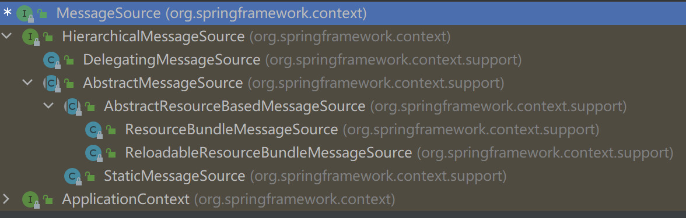

## i18n

### MessageFormat

#### 使用MessageSource进行格式化

JDK提供了Format抽象类处理那些和时区有关系的对象，比如日期、数字和文本。SimpleDateFormat就是Format的实现类。格式化文本的实现类是MessageFormat。

```java
public class MessageFormatInJDK {

    public static void main(String[] args) throws Exception{

        // 普通的格式化
        int planet = 7;
        String event = "a disturbance in the Force";

        String result = MessageFormat.format(
            "At {1,time} on {1,date}, there was {2} on planet {0,number,integer}.",
            planet, new Date(), event);
        System.out.println(result);

        // 输出引号
        int fileCount = 1273;
        String diskName = "MyDisk";
        Object[] testArgs = {new Long(fileCount), diskName};
        MessageFormat form = new MessageFormat("The disk \"{1}\" contains {0} file(s).");
        System.out.println(form.format(testArgs));

        // ChoiceFormat
        form = new MessageFormat("The disk \"{1}\" contains {0}.");
        double[] filelimits = {0, 1, 2};
        String[] filepart = {"no files","one file","{0,number} files"};
        ChoiceFormat fileform = new ChoiceFormat(filelimits, filepart);
        form.setFormatByArgumentIndex(0, fileform);
        System.out.println(form.format(testArgs));

        // 小数的输出
        MessageFormat mf = new MessageFormat("{0,number,#.##}, {0,number,#.###}");
        Object[] objs = {new Double(3.1415), new Double(4.1123)};
        result = mf.format(objs);
        System.out.println(result);     // "3.14, 3.1"

    }

}
```

#### 使用Message进行国际化

MessageFormat可以设置Locale。

```java
public class I18nFeatureWithMessageFormat {

    public static void main(String[] args) {

        int planet = 7;
        String event = "a disturbance in the Force";

        String messageFormatPattern = 
            "At {1,time,long} on {1,date,full}, there was {2} on planet {0,number,integer}.";
        MessageFormat messageFormat = new MessageFormat(messageFormatPattern);
        String result = messageFormat.format(new Object[]{planet, new Date(), event});
        System.out.println(result);

        // 重置 MessageFormatPattern
        // applyPattern
        messageFormatPattern = "This is a text : {0}, {1}, {2}";
        messageFormat.applyPattern(messageFormatPattern);
        result = messageFormat.format(new Object[]{"Hello,World", "666"});
        System.out.println(result);

        // 重置 Locale
        messageFormat.setLocale(Locale.ENGLISH);
        messageFormatPattern = 
            "At {1,time,long} on {1,date,full}, there was {2} on planet {0,number,integer}.";
        messageFormat.applyPattern(messageFormatPattern);
        result = messageFormat.format(new Object[]{planet, new Date(), event});
        System.out.println(result);

        // 重置 Format
        // 根据参数索引来设置 Pattern
        messageFormat.setFormat(1, new SimpleDateFormat("YYYY-MM-dd HH:mm:ss"));
        result = messageFormat.format(new Object[]{planet, new Date(), event});
        System.out.println(result);
    }
}
```


### ResourceBundle

ResourceBundle是JDK提供的国际化API，Spring的国际化也是基于ResourceBundle开发的，使用ResourceBundle加载的资源文件需要放在classpath下，文件名格式为`${name}_${language}_${region}`。这个命名方式正好能对应ResourceBundle#getBundle方法中的参数，例如：`ResourceBundle.getBundle("i18n", new Locale("zh", "CN"))`。"i18n"对应​`${name}`，"zh"定位`${language}`，而“CN”对应`${region}`。这样我们就可以通过传导参数来使用不同的资源。如果不指定`${language}`和`${region}`，该文件就是一个默认文件。

* Locale类预设了很多资源类型，比如Locale.SIMPLIFIED_CHINESE、Locale.US，实际上他们就等价于new Locale("zh", "CN")和new Locale("en", "US")。只是Java的开发人员做了一些静态的预设。
* 除了预设内容的Locale，我们还可以像Locale locale = new Locale("web", "BASE64")这样添加自定义的内容，他对应名为i18n_web_BASE64.properties的资源文件。

```java
public class I18nWithResourceBundleDemo {

    public static void main(String[] args) {

        // 使用当前操作系统的语言环境
        ResourceBundle rb = ResourceBundle.getBundle("i18n/i18ntest", Locale.getDefault());
        System.out.println(rb.getString("say"));

        // 指定简体中文环境
        rb = ResourceBundle.getBundle("i18n/i18ntest", new Locale("zh", "CN"));
        System.out.println(rb.getString("say"));

        // 通过预设指定简体英文环境
        rb = ResourceBundle.getBundle("i18n/i18ntest", Locale.SIMPLIFIED_CHINESE);
        System.out.println(rb.getString("say"));

        // 指定美国英语
        rb = ResourceBundle.getBundle("i18n/i18ntest", Locale.US);
        System.out.println(rb.getString("say"));

        // 使用自定义的语言环境
        Locale locale = new Locale("web", "BASE64");
        rb = ResourceBundle.getBundle("i18n/i18ntest", locale);
        System.out.println(rb.getString("say"));

        // 采用默认的配置，默认的配置优先级是当前Locale的配置高于没有Locale的配置
        rb = ResourceBundle.getBundle("i18n/i18ntest", Locale.JAPAN);
        System.out.println(rb.getString("say"));

    }
}
```


### Spring

Spring提供了MessageSource接口进行国际化。



它有两个实现类，ResourceBundleMessageSource和ReloadableResourceBundleMessaageSource。如果Bean被命名为messageSource，它就会被用于作为ApplicationContext的MessageSource。

```java
@Configuration
public class I18nWithSpringDemo {
    @Bean("messageSource")
    ResourceBundleMessageSource resourceBundleMessageSource() {
        ResourceBundleMessageSource messageSource = new ResourceBundleMessageSource();
        // 添加资源名称
        messageSource.setBasenames(new String[]{"i18n/i18ntest", "i18n/extend"});
        return messageSource;
    }

    public static void main(String[] args) {
        ApplicationContext context = new AnnotationConfigApplicationContext(I18nWithSpringDemo.class);
        System.out.println("Spring Default 1:" + context.getMessage("say", null, Locale.getDefault()));
        System.out.println("Spring Default 2:" + context.getMessage("say", null, null));
        System.out.println("Spring Chinese:" 
                           + context.getMessage("say", null, Locale.SIMPLIFIED_CHINESE));
        System.out.println("Spring Us English:" + context.getMessage("say", null, Locale.US));
        System.out.println("Spring Custom:" 
                           + context.getMessage("say", null, new Locale("web", "BASE64")));
        // 第二个参数可以使用MessageFormat格式
        System.out.println("Spring Argument:" 
                           + context.getMessage("info", new String[]{"chkui"}, null));
        // locale为空，取得是默认的Locale
        System.out.println("Spring Info:" + context.getMessage("say", null, null));
        // 找不到时找默认的Message
        System.out.println("Spring Info:" + context.getMessage("say", null, Locale.JAPAN));

    }

}
```

#### 注入MessageSource

```xml
<?xml version="1.0" encoding="UTF-8"?>
<beans xmlns="http://www.springframework.org/schema/beans"
       xmlns:xsi="http://www.w3.org/2001/XMLSchema-instance"
       xmlns:context="http://www.springframework.org/schema/context"
       xsi:schemaLocation="http://www.springframework.org/schema/beans
        https://www.springframework.org/schema/beans/spring-beans.xsd
        http://www.springframework.org/schema/context
        https://www.springframework.org/schema/context/spring-context.xsd">

    <context:annotation-config />

    <bean id="messageSource" class="org.springframework.context.support.ResourceBundleMessageSource">
        <property name="basenames">
            <list>
                <value>i18n/i18ntest</value>
                <value>i18n/extend</value>
            </list>
        </property>
    </bean>

    <bean id="msDomain" class="i18n.MessageSourceAwareDomain" />

    <bean class="i18n.ResourceBundleMessageSourceInject" />

</beans>
```

```java
public class ResourceBundleMessageSourceInject {

    @Autowired
    private ResourceBundleMessageSource rbMessageSource;

    public static void main(String[] args) {
        GenericApplicationContext context = new GenericXmlApplicationContext("META-INF/ms-context.xml");

        ResourceBundleMessageSourceInject rbMessageSourceInject = 
            context.getBean(ResourceBundleMessageSourceInject.class);

        System.out.println("依赖注入的ms： " + rbMessageSourceInject.rbMessageSource);
        System.out.println("依赖查找的ms： " + context.getBean("messageSource"));
        System.out.println("Aware注入的ms： " 
                           + ((MessageSourceAwareDomain)context.getBean("msDomain")).messageSource);
        System.out.println("ApplicationContext作为ms： " + context);
        System.out.println(context.getMessage("say", null, Locale.getDefault()));
    }

}

class MessageSourceAwareDomain implements MessageSourceAware {
    public MessageSource messageSource;
    @Override
    public void setMessageSource(MessageSource messageSource) {
        this.messageSource = messageSource;
    }
}
```

我们可以用四种方式获取MessageSource，依赖注入和依赖查找的MessageSource就是我们定义的那个Bean。Aware接口注入的MessageSource是ApplicationContext。但是ApplicationContext里组合了一个Bean名字为messageSource的MessageSource。

#### initMessageSource

在AbstractApplicationContext里的refresh方法里面会进行MessageSource的初始化。

```java
protected void initMessageSource() {
   ConfigurableListableBeanFactory beanFactory = getBeanFactory();
    
   // 如果当前的环境里面有名字为messageSource的Bean，就将其赋值给当前ApplicationContext的属性
   if (beanFactory.containsLocalBean(MESSAGE_SOURCE_BEAN_NAME)) {
      this.messageSource = beanFactory.getBean(MESSAGE_SOURCE_BEAN_NAME, MessageSource.class);
      // Make MessageSource aware of parent MessageSource.
      if (this.parent != null && this.messageSource instanceof HierarchicalMessageSource) {
         HierarchicalMessageSource hms = (HierarchicalMessageSource) this.messageSource;
         if (hms.getParentMessageSource() == null) {
            // Only set parent context as parent MessageSource if no parent MessageSource
            // registered already.
            hms.setParentMessageSource(getInternalParentMessageSource());
         }
      }
   } else {
      // Use empty MessageSource to be able to accept getMessage calls.
      DelegatingMessageSource dms = new DelegatingMessageSource();
      dms.setParentMessageSource(getInternalParentMessageSource());
      this.messageSource = dms;
      beanFactory.registerSingleton(MESSAGE_SOURCE_BEAN_NAME, this.messageSource);
   }
}
protected MessageSource getInternalParentMessageSource() {
    return (getParent() instanceof AbstractApplicationContext ?
            ((AbstractApplicationContext) getParent()).messageSource : getParent());
}
/** Parent context. */
@Nullable
private ApplicationContext parent;
public ApplicationContext getParent() {
    return this.parent;
}
```

如果没有messageSource这个Bean，会创建一个DelegatingMessageSource。DelegatingMessageSource就是一个accept message的代理，它将请求转交至父ApplicationContext的MessageSource。

```java
public class DelegatingMessageSource extends MessageSourceSupport implements HierarchicalMessageSource {
    private MessageSource parentMessageSource;

    @Override
    public void setParentMessageSource(@Nullable MessageSource parent) {
        this.parentMessageSource = parent;
    }

    @Override
    @Nullable
    public MessageSource getParentMessageSource() {
        return this.parentMessageSource;
    }

    @Override
    @Nullable
    public String getMessage
        	(String code, @Nullable Object[] args, @Nullable String defaultMessage, Locale locale) {
        if (this.parentMessageSource != null) {
            return this.parentMessageSource.getMessage(code, args, defaultMessage, locale);
        }
        else if (defaultMessage != null) {
            return renderDefaultMessage(defaultMessage, args, locale);
        }
        else {
            return null;
        }
    }

    @Override
    public String getMessage
        	(String code, @Nullable Object[] args, Locale locale) throws NoSuchMessageException {
        if (this.parentMessageSource != null) {
            return this.parentMessageSource.getMessage(code, args, locale);
        }
        else {
            throw new NoSuchMessageException(code, locale);
        }
    }

    @Override
    public String getMessage
        	(MessageSourceResolvable resolvable, Locale locale) throws NoSuchMessageException {
        if (this.parentMessageSource != null) {
            return this.parentMessageSource.getMessage(resolvable, locale);
        }
        else {
            if (resolvable.getDefaultMessage() != null) {
                return renderDefaultMessage
                    (resolvable.getDefaultMessage(), resolvable.getArguments(), locale);
            }
            String[] codes = resolvable.getCodes();
            String code = (codes != null && codes.length > 0 ? codes[0] : "");
            throw new NoSuchMessageException(code, locale);
        }
    }


    @Override
    public String toString() {
        return this.parentMessageSource != null ? 
            this.parentMessageSource.toString() : "Empty MessageSource";
    }

}
```

#### ReloadableResourceBundleMessageSource

```java
public class ReloadableResourceBundleMessageSourceDemo {
    
    public static void main(String[] args) throws Exception {
        GenericApplicationContext context = 
            new GenericXmlApplicationContext("META-INF/reload-ms-context.xml");

        ReloadableResourceBundleMessageSource messageSource = 
            (ReloadableResourceBundleMessageSource)context.getBean("messageSource");

        while(true) {
            System.out.println(messageSource.getMessage("say", null, Locale.getDefault()));
            try {
                // 暂停的时候需要修改target目录里的文件，不是修改源目录的文件
                Thread.sleep(5000);
            } catch (InterruptedException e) {
                e.printStackTrace();
            }
        }
    }
    
}
```

```xml
<?xml version="1.0" encoding="UTF-8"?>
<beans xmlns="http://www.springframework.org/schema/beans"
       xmlns:xsi="http://www.w3.org/2001/XMLSchema-instance"
       xsi:schemaLocation="http://www.springframework.org/schema/beans
        https://www.springframework.org/schema/beans/spring-beans.xsd">

    <bean id="messageSource" 
          class="org.springframework.context.support.ReloadableResourceBundleMessageSource">
        <property name="basenames">
            <list>
                <value>i18n/i18ntest</value>
                <value>i18n/extend</value>
            </list>
        </property>
        <property name="cacheSeconds" value="5"/>
    </bean>

</beans>
```


### 文件系统文件作为MessageSource

Spring提供的国际化是基于ResourceBundle进行的，只能加载classpath下的文件。我们可以自己写一个动态刷新文件系统文件的类。


### 自动刷新的文件系统文件作为MessageSource


