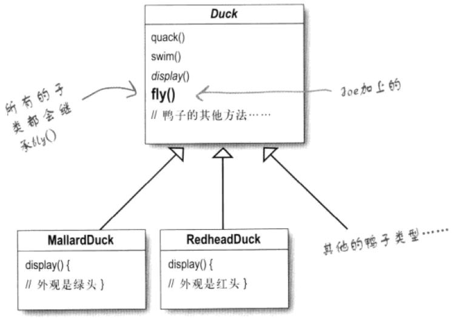
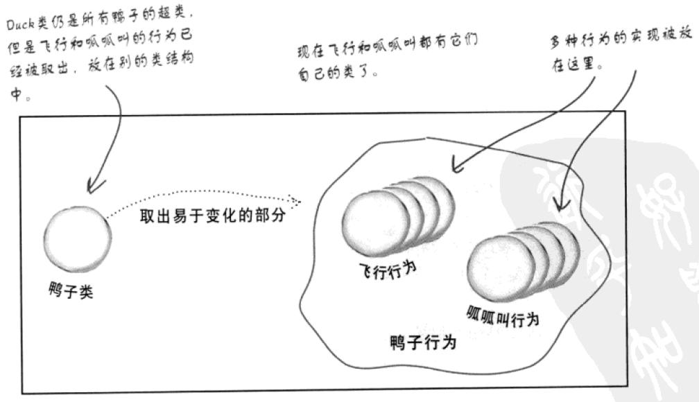
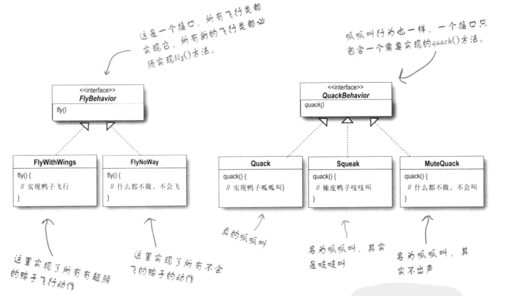
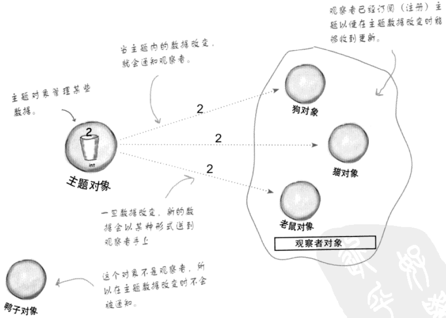
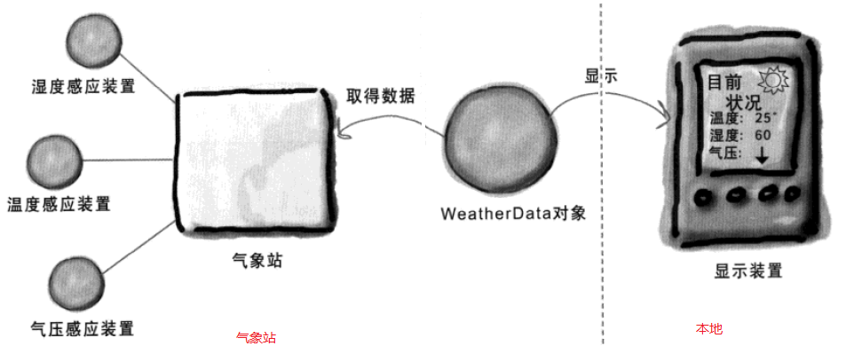
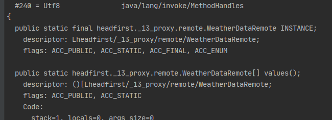
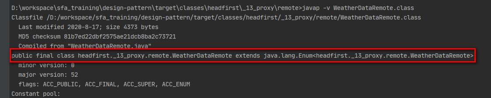

## 策略模式

Joe开发了一个模拟鸭子游戏（SimUDuck），游戏里的鸭子有一些通用行为，比如 `swim()`和`quack()`，但还有一些不通用的行为，比如`display()`。由于鸭子有很多种，所以在设计类的时候采用了继承，将通用行为的实现放在父类中，子类继承父类后就可以具有这些行为。在某个迭代版本中，用户希望增加一个鸭子飞的功能，所以Joe在父类里加了一个 `fly()` 方法并进行了实现，此时类图如下：

<div align="center"></div>

增加了这个方法后出了大问题，竟然有有一些橡皮鸭（RubberDuck）在天上飞来飞去，因为虽然橡皮鸭不会飞，但是他们也继承了 `fly()` 方法。为了解决这个问题，Joe想出了两种方法，一种是在橡皮鸭里覆盖 `fly()` 方法，一种是和 `display()` 一样不再在父类中定义 `fly()` 的实现，而是将实现定义在子类中。但此时两种方式都有问题，按照第一种方式，所有不能飞的鸭子（橡皮鸭，诱饵鸭等）都需要覆盖 `fly()` 方法，按照第二种方式，所有能飞的鸭子（红头鸭、绿头鸭等）都要重复的实现 `fly()`。

此时Joe想到了一个设计原则：**找出应用中可能需要变化指出，把它们独立出来，不要和那些不需要变化的代码混合在一起**。此时我们思考一下，什么是会变的？什么是不会变的？会变的是鸭子的行为，不会变的是鸭子本身。所以对于鸭子类的设计，应该继续采用继承来实现，但是对于鸭子行为类的设计，应当抽取出来封装为新的一簇类。但是对于 `swim()` 这个行为，就不必再提取出来了，因为在这个游戏中，这个行为就是不变的，所有的鸭子都会游泳。

<div align="center"></div>

新的一簇类应该如何设计呢？实际上这个答案已经在鸭子类中给出了，就是针对接口编程。这也是一个设计原则：**针对接口编程而不是针对实现编程**。这里的接口不应该是语法上的接口，比如 `interface` 定义的接口。它泛指超类型（supertype），所以抽象类和父类都可以被称为设计模式里的接口。当行为被分离出来之后，我们可以将原有的模拟鸭子游戏进一步扩展，比如以前的鸭子都是"呱呱叫"，即不同种鸭子的行为都是都继承了父类里的实现，而现在可以让有些鸭子发出“吱吱叫”，让有些鸭子不叫。

<div align="center"></div>

**代码**

鸭子叫行为

```java
public interface QuackBehavior {
    void quack();
}

public class MuteQuack implements QuackBehavior {
    @Override
    public void quack() {
        System.out.println("<< Silence >>");
    }
}

public class Quack implements QuackBehavior {
    @Override
    public void quack() {
        System.out.println("Quack");
    }
}

public class Squeak implements QuackBehavior {
    @Override
    public void quack() {
        System.out.println("Squeak");
    }
}
```

鸭子飞行为

```java
public interface FlyBehavior {
    void fly();
}

public class FlyWithWings implements FlyBehavior {
    @Override
    public void fly() {
        System.out.print("I'm flying!!");
    }
}

public class FlyNoWay implements FlyBehavior {
    @Override
    public void fly() {
        System.out.println("I can't fly");
    }
}
```

鸭子

```java
public abstract class Duck {
    protected FlyBehavior flyBehavior;
    protected QuackBehavior quackBehavior;
    public abstract void display();
    public void swim() {
        System.out.println("所有鸭子都能游泳");
    }
    public void performFly() {
        flyBehavior.fly();
    }
    public void performQuack() {
        quackBehavior.quack();
    }
    public void setFlyBehavior(FlyBehavior fb) {
        flyBehavior = fb;
    }
    public void setQuackBehavior(QuackBehavior qb) {
        quackBehavior = qb;
    }
}

// 绿头鸭
public class MallardDuck extends Duck {
    public MallardDuck() {
        quackBehavior = new Quack();
        flyBehavior = new FlyWithWings();
    }
    @Override
    public void display() {
        System.out.println("I'm a real Mallard duck");
    }
}

// 红头鸭
public class RedHeadDuck extends Duck {
    public RedHeadDuck() {
        flyBehavior = new FlyWithWings();
        quackBehavior = new Quack();
    }
    @Override
    public void display() {
        System.out.println("I'm a real Red Headed duck");
    }
}

// 橡皮鸭
public class RubberDuck extends Duck {
    public RubberDuck() {
        flyBehavior = new FlyNoWay();
        quackBehavior = new Squeak();
    }
    @Override
    public void display() {
        System.out.println("I'm a rubber duckie");
    }
}

// 诱饵鸭
public class DecoyDuck extends Duck {
    public DecoyDuck() {
        setFlyBehavior(new FlyNoWay());
        setQuackBehavior(new MuteQuack());
    }
    @Override
    public void display() {
        System.out.print("I'm a duck Decoy");
    }
}
```

模拟鸭子尤其启动类

```java
public class DuckSimulatorBootstrap {
    public static void main(String[] args) {
        Duck mallard = new MallardDuck();
        mallard.performQuack();
        mallard.performFly();

        Duck decoy = new DecoyDuck();
        decoy.performFly();
        decoy.performFly();
    }
}
```

可以看出来，相比较于仅仅使用继承，我们设计了很多的类，对Joe来说，开发的难度肯定比之前要大，但是此时没有冗余的代码。同时，当前的设计很容易给程序引入新的功能，比如客户需要一个采用火箭推动器进行飞行的模型鸭，Joe可以很轻松的完成。

```java
public class FlyRocketPowered implements FlyBehavior {
    @Override
    public void fly() {
        System.out.println("I'm flying with a rocket");
    }
}

public class ModelDuck extends Duck {
    public ModelDuck() {
        flyBehavior = new FlyRocketPowered();
        quackBehavior = new Quack();
    }
    @Override
    public void display() {
        System.out.println("I'm a model duck");
    }
}

public class MiniDuckSimulator {
    public static void main(String[] args) {
        Duck model = new ModelDuck();
        model.performQuack();
        model.performFly();
    }
}
```

由于Joe在设计程序的时候使用组合替换之前的继承，所以程序具备了运行时修改类的行为的能力。比如，假设模型鸭的燃料只够飞行一次，那么在飞行一次之后就不可以飞行了，此时Joe可以将模拟器类设计成这样：

```java
public class MiniDuckSimulator {
    public static void main(String[] args){
        Duck model = new ModelDuck();
        model.performFly();
        model.setFlyBehavior(new FlyNoWay());
        model.performFly();
    }
}
```

也就是说此时Joe可以在运行时修改类（模型鸭）的行为。

这个例子就是策略模式，它的定义如下：**策略模式定义了算法簇、并分别封装起来，让它们之间可以互相替换，此模式让算法的变化独立于使用算法的客户。**


## 观察者模式

Joe接到了一个任务，在三个面板（current conditions、statistics和forecast）实时显示气象信息，包括湿度、温度和气压，其中气象信息来自气象站。所以为了得到气象数据，Joe首先创建了一个类用于从对气象站获取数据，使用 `WeatherData` 表示，之后就可以从这个类里面获取气象数据。

<div align="center"></div>

在案例里，我们简化这个模型，不考虑如何从气象站获取信息，但是每当气象信息更新的时候，`WeatherData` 的方法 `measurementsChanged()` 会被调用。

```java
public class WeatherData {
    private float temperature;
    private float humidity;
    private float pressure;
	
    public void measurementsChanged(){
        // ...
    }
}
```

由于知道了每当气象信息更新，`measurementsChanged()` 就会被调用，所以Joe想到了这么一种实现：

```java
public void measurementsChanged(){
	float temp = getTemperature();
	float humidity = getHumidity();
	float pressure = getPressure();
	currentConditionDisplay.update(temp, humidity, pressure);
    statisticsDisplay.update(temp, humidity, pressure);
    forecastDisplay.update(temp, humidity, pressure);
}
```

但是这种实现有一个很大的问题，就是 `WeatherData` 和 `XxxDisplay` 深深的耦合在了一起，无论Joe想增加一个还是去除一个显示板，都需要修改 `WeatherData` 的代码。对于这种“一个对象提供多个对象所需数据”的情景，可以使用观察者模式进行对两类对象进行解耦。

在观察者模式中，将存在数据的对象称为主题（Subject），将需要获得数据的对象称为观察者（Observer）。主题中会暴露一些方法给客户端，客户端可以通过这些方法增加和删除与主题关联的观察者对象。

<div align="center"></div>

**实现**

主题

```java
public interface Subject {
    void registerObserver(Observer o);
    void removeObserver(Observer o);
    void notifyObservers();
}

public class WeatherData implements Subject {
    private ArrayList<Observer> observers;
    
    private float temperature;
    private float humidity;
    private float pressure;

	// getter and setter ...
	
    public WeatherData() {
        observers = new ArrayList<>();
    }

    @Override
    public void registerObserver(Observer o) {
        observers.add(o);
    }
    @Override
    public void removeObserver(Observer o) {
        int i = observers.indexOf(o);
        if (i >= 0) {
            observers.remove(i);
        }
    }
    @Override
    public void notifyObservers() {
        for (Observer observer : observers) {
            observer.update(temperature, humidity, pressure);
        }
    }
    public void measurementsChanged(){
        notifyObservers();
    }
    public void setMeasurements(float temperature, float humidity, float pressure){
        this.temperature = temperature;
        this.humidity = humidity;
        this.pressure = pressure;
        measurementsChanged();
    }
}
```

观察者

```java
public interface Observer {
    void update(float temp, float humidity, float pressure);
}

// 这个类不是观察者，但为了定义Display这个行为，Joe将其抽离了一个接口出来
public interface DisplayElement {
    void display();
    void close();
}

public class CurrentConditionsDisplay implements Observer, DisplayElement {
    private float temperature;
    private float humidity;
    private Subject weatherData;

    public CurrentConditionsDisplay(Subject weatherData) {
        this.weatherData = weatherData;
        weatherData.registerObserver(this);
    }

    @Override
    public void update(float temperature, float humidity, float pressure) {
        this.temperature = temperature;
        this.humidity = humidity;
        display();
    }
    @Override
    public void display() {
        System.out.println("Current conditions: " + temperature
                + "F degrees and " + humidity + "% humidity");
    }
    @Override
    public void close() {
        weatherData.registerObserver(this);
    }
}

public class ForecastDisplay implements Observer, DisplayElement {
    private float currentPressure = 29.92f;
    private float lastPressure;
    private Subject weatherData;

    public ForecastDisplay(Subject weatherData) {
        this.weatherData = weatherData;
        weatherData.registerObserver(this);
    }

    @Override
    public void update(float temp, float humidity, float pressure) {
        lastPressure = currentPressure;
        currentPressure = pressure;
        display();
    }
    @Override
    public void display() {
        System.out.print("Forecast: ");
        if (currentPressure > lastPressure) {
            System.out.println("Improving weather on the way!");
        } else if (currentPressure == lastPressure) {
            System.out.println("More of the same");
        } else if (currentPressure < lastPressure) {
            System.out.println("Watch out for cooler, rainy weather");
        }
    }
    @Override
    public void close() {
        weatherData.removeObserver(this);
    }
}

public class StatisticsDisplay implements Observer, DisplayElement {
    private float maxTemp = 0.0f;
    private float minTemp = 200;
    private float tempSum = 0.0f;
    private int numReadings;
    private Subject weatherData;

    public StatisticsDisplay(Subject weatherData) {
        this.weatherData = weatherData;
        weatherData.registerObserver(this);
    }

    @Override
    public void update(float temp, float humidity, float pressure) {
        tempSum += temp;
        numReadings++;
        if (temp > maxTemp) {
            maxTemp = temp;
        }
        if (temp < minTemp) {
            minTemp = temp;
        }
        display();
    }
    @Override
    public void display() {
        System.out.println("Avg/Max/Min temperature = " + (tempSum / numReadings)
                + "/" + maxTemp + "/" + minTemp);
    }
    @Override
    public void close() {
        weatherData.removeObserver(this);
    }
}
```

气象站客户端

```java
public class WeatherStationClient {
    public static void main(String[] args) throws Exception {
        WeatherData weatherData = new WeatherData();

        CurrentConditionsDisplay currentConditionsDisplay = new CurrentConditionsDisplay(weatherData);
        StatisticsDisplay statisticsDisplay = new StatisticsDisplay(weatherData);
        ForecastDisplay forecastDisplay = new ForecastDisplay(weatherData);

        Thread.sleep(3000);
        weatherData.setMeasurements(80, 65, 30.4f);
        Thread.sleep(1000);
        weatherData.setMeasurements(82, 70, 29.2f);
        Thread.sleep(1000);
        weatherData.setMeasurements(78, 90, 29.2f);

        currentConditionsDisplay.close();
        statisticsDisplay.close();
        forecastDisplay.close();

    }
}
```

没使用观察者模式时的问题是 `WeatherData` 和 `XxxDisplay` 深深的耦合在了一起，对 `XxxDisplay` 的操作都可能需要修改 `WeatherData` 的代码。引入观察者模式之后，想增加一个或删除一个面板不需要修改 `WeatherData` 类。

增加面板

```java
public class HeatIndexDisplay implements Observer, DisplayElement {
    private float heatIndex = 0.0f;
    private Subject weatherData;

    public HeatIndexDisplay(Subject weatherData) {
        this.weatherData = weatherData;
        weatherData.registerObserver(this);
    }

    @Override
    public void update(float temp, float humidity, float pressure) {
        heatIndex = computeHeatIndex(temp, humidity);
        display();
    }
    private float computeHeatIndex(float t, float rh) {
        float index = (float) ((16.923 + (0.185212 * t) + (5.37941 * rh) - (0.100254 * t * rh)
                + (0.00941695 * (t * t)) + (0.00728898 * (rh * rh))
                + (0.000345372 * (t * t * rh)) - (0.000814971 * (t * rh * rh)) +
                (0.0000102102 * (t * t * rh * rh)) - (0.000038646 * (t * t * t)) + (0.0000291583 *
                (rh * rh * rh)) + (0.00000142721 * (t * t * t * rh)) +
                (0.000000197483 * (t * rh * rh * rh)) - (0.0000000218429 * (t * t * t * rh * rh)) +
                0.000000000843296 * (t * t * rh * rh * rh)) -
                (0.0000000000481975 * (t * t * t * rh * rh * rh)));
        return index;
    }
    @Override
    public void display() {
        System.out.println("Heat index is " + heatIndex);
    }
    @Override
    public void close() {
        weatherData.removeObserver(this);
    }
}
```

修改客户端

```java
public class WeatherStationClient {

    public static void main(String[] args) throws Exception {
        WeatherData weatherData = new WeatherData();

        CurrentConditionsDisplay currentConditionsDisplay = new CurrentConditionsDisplay(weatherData);
        StatisticsDisplay statisticsDisplay = new StatisticsDisplay(weatherData);
        ForecastDisplay forecastDisplay = new ForecastDisplay(weatherData);
        HeatIndexDisplay heatIndexDisplay = new HeatIndexDisplay(weatherData);


        Thread.sleep(3000);
        weatherData.setMeasurements(80, 65, 30.4f);
        System.out.println("-------------------------------------------");
        Thread.sleep(1000);
        weatherData.setMeasurements(82, 70, 29.2f);
        System.out.println("-------------------------------------------");
        Thread.sleep(1000);
        weatherData.setMeasurements(78, 90, 29.2f);

        currentConditionsDisplay.close();
        statisticsDisplay.close();
        forecastDisplay.close();
        heatIndexDisplay.close();

    }
}
```

观察者模式：**定义了对象之间一对多依赖，这样一来，当一个对象改变时，它的所有依赖者都可以收到通知并自动更新**。这个模式最大的优势就是增强了对象之间松耦合的能力。开发者在开发代码的时候需要明白以下一个原则：**为了交互对象之间的松耦合设计而努力**。


## 代理模式

### 远程代理

在观察者模式的案例中，Joe认为 `WeatherData` 对象在本地，但实际上，此对象应该在气象站那里，毕竟这样气象站才能在气象数据更新的时候调用方法`measurementsChanged()`。

<div align="center"></div>

Joe想到了一个最直接的方式，让所有的面板都通过网络注册到 `WeatherData` 上，`WeatherData` 一旦有数据更新，`notifyObservers()` 方法也通过网络通知所有的面板。这样虽然可以完成功能，但是Joe在开发的时候会很头疼，因为他无时无刻都要考虑到网络请求的处理，而且面板所在的主机会和 `WeatherData` 对象建立多个连接。

这时，Joe想到如果在本地有一个类，专门处理与 `WeatherData` 的交互，同时像本地 `WeatherData` 一样接受注册面板的注册和通知面板不就行了吗？多聪明的孩子呐！

**实现**

远程 `WeatherData` 对象

```java
public class WeatherDataRemote {

    ServerSocket serverSocket;
    List<Socket> socketList = new ArrayList<>();
    ExecutorService executorService = Executors.newSingleThreadExecutor();

    public void startServer() throws IOException {
        serverSocket = new ServerSocket(11000);
        executorService.submit(() -> {
            while (true) {
                socketList.add(serverSocket.accept());
            }
        });
        System.out.println("Server start");
    }

    private float temperature;
    private float humidity;
    private float pressure;

    public void setMeasurements(float temperature, float humidity, float pressure) throws IOException {
        this.temperature = temperature;
        this.humidity = humidity;
        this.pressure = pressure;
        for (Socket socket : socketList) {
            OutputStream outputStream = socket.getOutputStream();
            outputStream.write((temperature + "," + humidity + "," + pressure).getBytes());
        }
    }
    public float getTemperature() {
        return temperature;
    }
    public float getHumidity() {
        return humidity;
    }
    public float getPressure() {
        return pressure;
    }
    public static void main(String[] args) throws Exception {
        WeatherDataRemote weatherDataRemote = new WeatherDataRemote();
        weatherDataRemote.startServer();
        Thread.sleep(10000);
        weatherDataRemote.setMeasurements(80, 65, 30.4f);
        Thread.sleep(1000);
        weatherDataRemote.setMeasurements(82, 70, 29.2f);
        Thread.sleep(1000);
        weatherDataRemote.setMeasurements(78, 90, 29.2f);
    }
}
```

本地代理对象

```java
public class WeatherDataProxy implements Subject {

    private ArrayList<Observer> observers;
    Socket socket;
    private float temperature;
    private float humidity;
    private float pressure;

    public WeatherDataProxy() throws IOException {
        observers = new ArrayList<>();
        socket = new Socket("127.0.0.1", 11000);
        System.out.println("Successfully connected to the server");
    }
    @Override
    public void registerObserver(Observer o) {
        observers.add(o);
    }
    @Override
    public void removeObserver(Observer o) {
        int i = observers.indexOf(o);
        if (i >= 0) {
            observers.remove(i);
        }
    }
    @Override
    public void notifyObservers() {
        for (Observer observer : observers) {
            observer.update(temperature, humidity, pressure);
        }
    }
    public void measurementsChanged() {
        notifyObservers();
    }
    public void listen() throws IOException {
        byte[] bytes = new byte[1024 * 1024];
        while (true) {
            InputStream inputStream = socket.getInputStream();
            int read = inputStream.read(bytes);
            String s = new String(bytes, Charset.forName("UTF-8"));
            String[] split = s.split(",");
            this.temperature = Float.valueOf(split[0]);
            this.humidity =  Float.valueOf(split[1]);
            this.pressure =  Float.valueOf(split[2]);
            measurementsChanged();
        }
    }
    public float getTemperature() {
        return temperature;
    }
    public float getHumidity() {
        return humidity;
    }
    public float getPressure() {
        return pressure;
    }
}
```

客户端

```java
public class WeatherStationLocalClient {

    public static void main(String[] args) throws Exception {

        WeatherDataProxy weatherDataProxy = new WeatherDataProxy();

        new CurrentConditionsDisplay(weatherDataProxy);
        new StatisticsDisplay(weatherDataProxy);
        new ForecastDisplay(weatherDataProxy);
        new HeatIndexDisplay(weatherDataProxy);

        weatherDataProxy.listen();

    }
}
```

我们上面的实现体现了远程代理的思想，即在本地实现一个对象并让这个本地对象处理与远程对象的交互，同时此对象也能与其他本地对象进行交互。


### 本地代理

本地代理和远程代理的区别就是被代理的对象也在本地。这时候Joe就要迷茫了，为什么被代理对象在本地也需要再创建一个类呢？其实本地代理和远程代理的功能并不相同，远程代理的目的是将业务逻辑与网络操作分离开来，避免业务逻辑里嵌入具体的网络操作。而本地代理一般是为了增强被代理对象功能，同时这部分增强的功能往往不是业务逻辑的一部分，而是一些监控、统计、鉴权、限流、事务、幂等、日志等操作。下面是一个统计接口操作耗时的例子。

假设有两个接口，分别为登录和注册，Joe想统计两个接口的耗时情况。

```java
public class UserVo {
    private String telephone;
    private String password;
	// getter and setter
}

public interface IUserController {
    UserVo login(String telephone, String password);
    UserVo register(String telephone, String password);
}

public class UserController implements IUserController {

    // private XxxService sxxService;

    @Override
    public UserVo login(String telephone, String password) {
        //...省略login逻辑...
        //...返回UserVo数据...
        return null;
    }
    @Override
    public UserVo register(String telephone, String password) {
        //...省略register逻辑...
        //...返回UserVo数据...
        return null;
    }
}
```

如果按照传统的模式进行开发，就是将在两个方法的第一句和最后一句分别记录时间，然后做个减法就能统计出来消耗的时间。但是这样不符合面向对象的设计，在面向对象的设计中，开发者永远需要**代码对修改关闭，对拓展开放**。这时候本地代理就可以派上用场。

在下面的代码中，定义了一个 `UserController` 的代理类 `UserControllerProxy`，代理类和被代理类实现了相同的接口，但是代理类的业务逻辑处理是通过委托给被代理类实现的，代理类中仅实现统计功能。

```java
public class MetricsCollector {
    public void recordRequest(RequestInfo requestInfo) {
        System.out.println(requestInfo);
    }
}

public class RequestInfo {

    private String action;
    private Long responseTime;
    private Long startTimestamp;
    private Long endTimeStamp;

    public RequestInfo(String action, Long responseTime, Long startTimestamp, Long endTimeStamp) {
        this.action = action;
        this.responseTime = responseTime;
        this.startTimestamp = startTimestamp;
        this.endTimeStamp = endTimeStamp;
    }

	// getter and setter
}

public class UserControllerProxy implements IUserController {

    private MetricsCollector metricsCollector;
    private UserController userController;

    public UserControllerProxy(UserController userController) {
        this.userController = userController;
        this.metricsCollector = new MetricsCollector();
    }

    @Override
    public UserVo login(String telephone, String password) {
        long startTimestamp = System.currentTimeMillis();
        UserVo userVo = userController.login(telephone, password);
        long endTimeStamp = System.currentTimeMillis();
        long responseTime = endTimeStamp - startTimestamp;
        RequestInfo requestInfo = new RequestInfo("login", responseTime, startTimestamp, endTimeStamp);
        metricsCollector.recordRequest(requestInfo);
        return userVo;
    }
    @Override
    public UserVo register(String telephone, String password) {
        long startTimestamp = System.currentTimeMillis();
        UserVo userVo = userController.register(telephone, password);
        long endTimeStamp = System.currentTimeMillis();
        long responseTime = endTimeStamp - startTimestamp;
        RequestInfo requestInfo = new RequestInfo("register", responseTime, startTimestamp, endTimeStamp);
        metricsCollector.recordRequest(requestInfo);
        return userVo;
    }
}
```

对于有接口的类，可以选择通过实现相同的接口来完成本地代理，但是对于没有接口的类，只能通过继承完成本地代理。

```java
public class UserControllerProxy extends UserController {

    private MetricsCollector metricsCollector;

    public UserControllerProxy() {
        this.metricsCollector = new MetricsCollector();
    }

    @Override
    public UserVo login(String telephone, String password) {
        long startTimestamp = System.currentTimeMillis();
        UserVo userVo = super.login(telephone, password);
        long endTimeStamp = System.currentTimeMillis();
        long responseTime = endTimeStamp - startTimestamp;
        RequestInfo requestInfo = new RequestInfo("login", responseTime, startTimestamp, endTimeStamp);
        metricsCollector.recordRequest(requestInfo);
        return userVo;
    }

    @Override
    public UserVo register(String telephone, String password) {
        long startTimestamp = System.currentTimeMillis();
        UserVo userVo = super.register(telephone, password);
        long endTimeStamp = System.currentTimeMillis();
        long responseTime = endTimeStamp - startTimestamp;
        RequestInfo requestInfo = new RequestInfo("register", responseTime, startTimestamp, endTimeStamp);
        metricsCollector.recordRequest(requestInfo);
        return userVo;
    }
}
```

无论哪种方式，生成代理对象之后，再使用代理对象替换原来的对象就可以增强原有的功能。


### 动态代理

前面演示的远程代理和本地代理都是静态代理，开发者手动创建一个类来建立与另外一个类的联系，这样做往往太复杂，比如如果Joe需要统计所有接口的耗时情况，那么需要为所有的接口都写一个代理类，但是每个代理类的逻辑其实是一致的。

```java
public class UserControllerProxy implements IXxxController {

    private MetricsCollector metricsCollector;
    private XxxController xxxController;

    public UserControllerProxy(XxxController xxxController) {
        this.xxxController = xxxController;
        this.metricsCollector = new MetricsCollector();
    }

    @Override
    public UserVo login(String telephone, String password) {
        long startTimestamp = System.currentTimeMillis();
        // xxxController.xxx();
        long endTimeStamp = System.currentTimeMillis();
        long responseTime = endTimeStamp - startTimestamp;
        RequestInfo requestInfo = new RequestInfo("login", responseTime, startTimestamp, endTimeStamp);
        metricsCollector.recordRequest(requestInfo);
        return userVo;
    }
    @Override
    public UserVo register(String telephone, String password) {
        long startTimestamp = System.currentTimeMillis();
        // xxxController.xxx();
        long endTimeStamp = System.currentTimeMillis();
        long responseTime = endTimeStamp - startTimestamp;
        RequestInfo requestInfo = new RequestInfo("register", responseTime, startTimestamp, endTimeStamp);
        metricsCollector.recordRequest(requestInfo);
        return userVo;
    }
}
```

而动态代理就是写一套代码能表示这个逻辑。动态代理分为两类，一类是jdk内置的动态代理，它有一个缺陷是只能对存在接口的类实现代理；一类是cglib，它可以直接对类进行代理，唯一的要求是类不能用 `final` 修饰。

#### jdk动态代理

```java
public class MetricsCollectorProxy {

    private MetricsCollector metricsCollector;
    
    public MetricsCollectorProxy() {
        this.metricsCollector = new MetricsCollector();
    }
    
    public Object createProxy(Object proxiedObject) {
        Class<?>[] interfaces = proxiedObject.getClass().getInterfaces();
        DynamicProxyHandler handler = new DynamicProxyHandler(proxiedObject);
        return Proxy.newProxyInstance(proxiedObject.getClass().getClassLoader(), interfaces, handler);
    }

    private class DynamicProxyHandler implements InvocationHandler {

        private Object proxiedObject;
        
        public DynamicProxyHandler(Object proxiedObject) {
            this.proxiedObject = proxiedObject;
        }
        
        @Override
        public Object invoke(Object proxy, Method method, Object[] args) throws Throwable {
            long startTimestamp = System.currentTimeMillis();
            Object result = method.invoke(proxiedObject, args);
            long endTimeStamp = System.currentTimeMillis();
            long responseTime = endTimeStamp - startTimestamp;
            String apiName = proxiedObject.getClass().getName() + ":" + method.getName();
            RequestInfo requestInfo = new RequestInfo(apiName, responseTime, startTimestamp, endTimeStamp);
            metricsCollector.recordRequest(requestInfo);
            return result;
        }
    }
}
```

#### cglib动态代理

```java
public class CglibMetricsCollectorProxy {

    private MetricsCollector metricsCollector;
    private Enhancer enhancer = new Enhancer();
    Object object;

    public CglibMetricsCollectorProxy() {
        this.metricsCollector = new MetricsCollector();
    }

    public Object createProxy(Object proxiedObject) {
        object = proxiedObject;
        enhancer.setSuperclass(proxiedObject.getClass());
        enhancer.setCallback(new MetricsCollectorMethodInterceptor());
        return enhancer.create();
    }

    class MetricsCollectorMethodInterceptor implements MethodInterceptor {
        @Override
        public Object intercept(Object o, Method method, Object[] objects, MethodProxy methodProxy) throws Throwable {
            long startTimestamp = System.currentTimeMillis();
            Object result = method.invoke(object, objects);
            long endTimeStamp = System.currentTimeMillis();
            long responseTime = endTimeStamp - startTimestamp;
            String apiName = o.getClass().getName() + ":" + method.getName();
            RequestInfo requestInfo = new RequestInfo(apiName, responseTime, startTimestamp, endTimeStamp);
            metricsCollector.recordRequest(requestInfo);
            return result;
        }
    }
}
```


## 单例模式

**枚举**

顾名思义，单例的意思就是说类的对象只存在一份。比如远程代理案例里的 `WeatherDataRemote`，这个类由于在监听一个端口，所以必须是一个单例，否则会报异常 `BindException`。如何实现单例实际上有很多种方法，但是这里只介绍两种，因为其他的都没有用。

第一种就是枚举，这也是“efficient java”里推荐的方式，使用枚举改造之前的 `WeatherDataRemote`。

```java
public enum WeatherDataRemote {

    INSTANCE;
    private ServerSocket serverSocket;
    private List<Socket> socketList = new ArrayList<>();
    private ExecutorService executorService = Executors.newSingleThreadExecutor();
    private boolean started = false;

    public void startServer() throws IOException {
        synchronized (started) {
            if (!started) {
                serverSocket = new ServerSocket(11000);
                executorService.submit(() -> {
                    while (true) {
                        socketList.add(serverSocket.accept());
                    }
                });
                System.out.println("Server start");
                started = true;
            } else {
                System.out.println("server has started !");
            }
        }
    }

    private float temperature;
    private float humidity;
    private float pressure;

    public void setMeasurements(float temperature, float humidity, float pressure) throws IOException {
        this.temperature = temperature;
        this.humidity = humidity;
        this.pressure = pressure;
        for (Socket socket : socketList) {
            OutputStream outputStream = socket.getOutputStream();
            outputStream.write((temperature + "," + humidity + "," + pressure).getBytes());
        }
    }
    
    public static void main(String[] args) throws Exception {
        WeatherDataRemote weatherDataRemote = WeatherDataRemote.INSTANCE;
        weatherDataRemote.startServer();
        Thread.sleep(10000);
        weatherDataRemote.setMeasurements(80, 65, 30.4f);
        Thread.sleep(1000);
        weatherDataRemote.setMeasurements(82, 70, 29.2f);
        Thread.sleep(1000);
        weatherDataRemote.setMeasurements(78, 90, 29.2f);
    }
}
```

上面便是使用枚举实现的单例，下面分析一下枚举单例的底层原理。进行一下反编译：`javap -v class文件名`。

<div align="center"></div>

反编译的结果可以明显看出来 `INSTANCE` 是一个 `static` 的变量，所以自然是一个线程安全的单例。同时，由于单例类继承了类 `Enum`，所以不允许实现`readObject(ObjectInputStream in)` 和 `readObjectNoData()` 类。因为这两个类已经在 `Enum` 被设置为 `private` 了。

<div align="center"></div>


**静态内部类**

枚举的最大优势就是简单，因为其利用了Java语法的特点。但是由于其属性是 `static` 的，所以不能做到懒加载。静态内部类可以做到懒加载。使用静态内部类改造之前的代码。

```java
public class WeatherDataRemote {

    private ServerSocket serverSocket;
    private List<Socket> socketList = new ArrayList<>();
    private ExecutorService executorService = Executors.newSingleThreadExecutor();
    private Boolean started = false;

    private WeatherDataRemote() { }

    private static class SingletonHolder {
        private static final WeatherDataRemote INSTANCE = new WeatherDataRemote();
    }
    public static WeatherDataRemote getInstance() {
        return SingletonHolder.INSTANCE;
    }

    public void startServer() throws IOException {
        synchronized (started){
            if (!started) {
                serverSocket = new ServerSocket(11000);
                executorService.submit(() -> {
                    while (true) {
                        socketList.add(serverSocket.accept());
                    }
                });
                System.out.println("Server start");
                started = true;
            } else {
                System.out.println("server has started !");
            }
        }
    }

    private float temperature;
    private float humidity;
    private float pressure;

    public void setMeasurements(float temperature, float humidity, float pressure) throws IOException {
        this.temperature = temperature;
        this.humidity = humidity;
        this.pressure = pressure;
        for (Socket socket : socketList) {
            OutputStream outputStream = socket.getOutputStream();
            outputStream.write((temperature + "," + humidity + "," + pressure).getBytes());
        }
    }

    public static void main(String[] args) throws Exception {

        WeatherDataRemote weatherDataRemote = WeatherDataRemote.getInstance();
        weatherDataRemote.startServer();
        Thread.sleep(10000);
        weatherDataRemote.setMeasurements(80, 65, 30.4f);
        Thread.sleep(1000);
        weatherDataRemote.setMeasurements(82, 70, 29.2f);
        Thread.sleep(1000);
        weatherDataRemote.setMeasurements(78, 90, 29.2f);

    }
}
```

静态内部类能保证懒加载和线程安全，具体原因可以参考这一篇文章：https://blog.csdn.net/mnb65482/article/details/80458571。


## 原型模式

如果对象的创建成本比较大，而同一个类的不同对象之间差别不大（大部分字段都相同），在这种情况下，我们可以利用对已有对象（原型）进行复制（或者叫拷贝）的方式来创建新对象，以达到节省创建时间的目的。这种基于原型来创建对象的方式就叫作原型设计模式（Prototype Design Pattern），简称原型模式。那何为“对象的创建成本比较大”？实际上，创建对象包含的申请内存、给成员变量赋值这一过程，本身并不会花费太多时间，或者说对于大部分业务系统来说，这点时间完全是可以忽略的。应用一个复杂的模式，只得到一点点的性能提升，这就是所谓的过度设计，得不偿失。但是，如果对象中的数据需要经过复杂的计算才能得到（比如排序、计算哈希值），或者需要从 RPC、网络、数据库、文件系统等非常慢速的 IO 中读取，这种情况下，我们就可以利用原型模式，从其他已有对象中直接拷贝得到，而不用每次在创建新对象的时候，都重复执行这些耗时的操作。原型模式说直接点就是对象的拷贝。拷贝又分浅拷贝和深拷贝。

**浅拷贝**

```java
public class Student {

    private String name;   // 姓名
    private int age;       // 年龄
    private StringBuffer sex;  // 性别

    public Student(String name, int age, StringBuffer sex) {
        this.name = name;
        this.age = age;
        this.sex = sex;
    }
    
	// getter and setter and toString
}

public class School implements Cloneable {

    private String schoolName;   // 学校名称
    private int stuNums;         // 学校人数
    private Student stu;         // 一个学生
        
    public School(String schoolName, int stuNums) {
        this.schoolName = schoolName;
        this.stuNums = stuNums;
    }
    
    @Override
    public School clone() throws CloneNotSupportedException {
        return (School) super.clone();
    }
    
	// getter and setter and toString

}

public class Client {

    public static void main(String[] args) throws CloneNotSupportedException {
        School s1 = new School("实验小学", 100);
        Student stu1 = new Student("zhangsan", 20, new StringBuffer("男"));
        s1.setStu(stu1);
        School s2 = s1.clone();  // 调用重写的clone方法，clone出一个新的school---s2

        System.out.println("s1：" + s1 + " s1的hashcode：" + s1.hashCode() 
        	+ "  s1中stu1的hashcode：" + s1.getStu().hashCode());
        System.out.println("s2：" + s2 + " s2的hashcode：" + s2.hashCode() 
        	+ " s2中stu1的hashcode：" + s2.getStu().hashCode());

        System.out.println("s2：" + s1 + " s2的hashcode：" + s1.hashCode() 
        	+ " s2中stu1的hashcode：" + s1.getStu().getSex().hashCode());
        System.out.println("s2：" + s2 + " s2的hashcode：" + s2.hashCode() 
        	+ " s2中stu1的hashcode：" + s2.getStu().getSex().hashCode());
    }

}
```

**深拷贝**

需要注意是，使用序列化进行拷贝的对象需要实现序列化接口。

```java
class CloneUtils {
	private CloneUtils() { }
	
	@SuppressWarnings("unchecked")
	public static <T extends Serializable> T clone(T obj) throws IOException, ClassNotFoundException {
		ByteArrayOutputStream bout = new ByteArrayOutputStream();
		ObjectOutputStream oos = new ObjectOutputStream(bout);
		oos.writeObject(obj);
		ByteArrayInputStream bin = new ByteArrayInputStream(bout.toByteArray());
		ObjectInputStream ois = new ObjectInputStream(bin);
		return (T) ois.readObject();
	}
}

public class DeepCopy {
    public static void main(String[] args) throws Exception {
        School s1 = new School("实验小学", 100);
        Student stu1 = new Student("zhangsan", 20, new StringBuffer("男"));
        s1.setStu(stu1);
        School s2 = CloneUtils.clone(s1);

        System.out.println("s1：" + s1 + " s1的hashcode：" + s1.hashCode() 
        	+ "  s1中stu1的hashcode：" + s1.getStu().hashCode());
        System.out.println("s2：" + s2 + " s2的hashcode：" + s2.hashCode() 
        	+ " s2中stu1的hashcode：" + s2.getStu().hashCode());

        System.out.println("s2：" + s1 + " s2的hashcode：" + s1.hashCode() 
        	+ " s2中stu1的hashcode：" + s1.getStu().getSex().hashCode());
        System.out.println("s2：" + s2 + " s2的hashcode：" + s2.hashCode() 
        	+ " s2中stu1的hashcode：" + s2.getStu().getSex().hashCode());
    }
}
```

