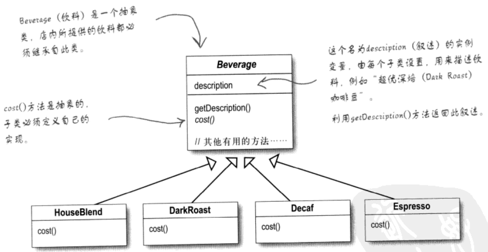
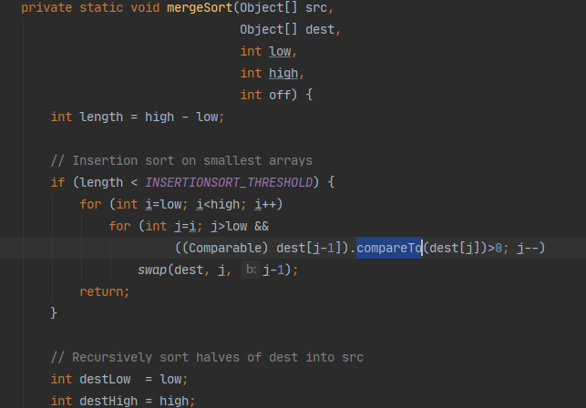

## 装饰者模式

由于Joe之前的任务完成的很好，客户很满意，所以老板又给Joe接了一个任务。这次是星巴兹咖啡店的设计。星巴兹咖啡店有很多种咖啡，所以Joe一开始使用继承完成需求。

<div align="center"></div>

但是每种咖啡之中又可以放置多种调料，所以Joe增加了一个调料集合。

```java
class Beverage {
	private List<Condiment> condimentList;
	private String description;
	public abstact float cost();
    public String getDescription() {
        return description;
    }
    protected float condimentsCost(){
        float sum = 0f;
        for(Condiment condiment : condimentList) {
            sum += condiment.getCost();
        }
        return sum;
    }
    public void addCondiment(Condiment condiment) {
        condimentList.add(condiment);
    }
}
```

看到这些，Joe的主管Mick欣慰的笑了一笑，Joe已经掌握了组合的应用，现在的设计可以满足对调料类拓展的开放，同时不用修改源代码。这时，Mick又给Joe增加一个需求，对于外卖咖啡，需要增加一美元的包装费，并且不能修改原有的代码。Joe犯难了，因为之前的代码中没有组合包装费这个属性。Mick说让我叫你一招装饰者模式，这个模式的目的是给原有的类增加功能，比如在这个案例中，原有的类是各种咖啡，增加的功能就是包装费。说着，Mick就写起了代码。

**实现**

调料

```java
public abstract class Condiment {
    
    private String description;
    
    public String getDescription() {
        return description;
    }
    public Condiment(String description) {
        this.description = description;
    }
    public abstract float cost();
}

public class Milk extends Condiment {
    public Milk() {
        super("milk");
    }
    @Override
    public float cost() {
        return 1.2f;
    }
}

public class Mocha extends Condiment{
    public Mocha() {
        super("mocha");
    }
    @Override
    public float cost() {
        return 1.1f;
    }
}
```

咖啡

```java
// 饮料
public abstract class Beverage {

    private List<Condiment> condimentList = new ArrayList<>();
    String description = "Unknown Beverage";

    public void addCondiment(Condiment condiment) {
        condimentList.add(condiment);
    }
    public String getDescription() {
        return description + ", " + condimentDescription();
    }
    protected float condimentCost() {
        float sum = 0f;
        for (Condiment condiment : condimentList) {
            sum += condiment.cost();
        }
        return sum;
    }
    private String condimentDescription() {
        String description = "condiment description: ";
        for(Condiment condiment : condimentList) {
            description = description + condiment.getDescription() + ", ";
        }
        return description.substring(0,  description.lastIndexOf(", ")) + ".";
    }
    public abstract double cost();
}

public class DarkRoast extends Beverage {
    public DarkRoast() {
        description = "Dark Roast Coffee";
    }
    @Override
    public double cost() {
        return condimentCost() + 1;
    }
}
```

装饰者

```java
public abstract class PackingDecorator extends Beverage {
    
    private Beverage beverage;
    
    public PackingDecorator(Beverage beverage) {
        this.beverage = beverage;
    }
    protected Beverage getBeverage() {
        return beverage;
    }
}

public class TakeoutDecorator extends PackingDecorator {
    public TakeoutDecorator(Beverage beverage) {
        super(beverage);
    }
    @Override
    public String getDescription() {
        return "take out food. " + getBeverage().getDescription();
    }
    @Override
    public double cost() {
        return 1 + getBeverage().cost();
    }
}
```

客户端

```java
public class Client {
    public static void main(String[] args) {
        Beverage darkRoast = new DarkRoast();
        darkRoast.addCondiment(new Milk());
        darkRoast.addCondiment(new Mocha());
        System.out.println(darkRoast.getDescription() + " cost: " + darkRoast.cost() + ".");

        Beverage takeoutDecorator = new TakeoutDecorator(darkRoast);
        System.out.println(takeoutDecorator.getDescription() + " cost: " + takeoutDecorator.cost() + ".");
    }
}
```

Joe看了之后恍然大悟，让包装类实现咖啡类的接口，同时将咖啡类设置为包装类的属性，既不破坏咖啡类的功能，又能把咖啡类和包装类的功能叠加在一起。


## 工厂模式

### 工厂方法

上一次的任务Joe在Mick的帮助下完成的不错，所以公司又给Joe一个任务，给披萨店做设计。这个披萨店可不得了，它们有两家门店（New York和Chicago）和两种口味（cheese和veggie）的披萨，并且他们还计划在其他地区开设分店，这还不是最有趣的，最有趣的是他们的披萨店必须融合当地口味，即New York的cheese披萨和Chicago的cheese披萨不是同一种披萨。Joe作为一个职场新人，遇到这种问题，第一想法就是 `if-else`。但这事想想肯定没有那么简单，作为Mick最得意的弟子，`if-else` 也太掉价了，而且以后无论新增门店还是新增披萨类型，都需要修改 `if-else` 的逻辑，明显违反了开闭原则。Joe在思考未果之后，打开了Head First设计模式，发现了一个叫工厂方法的东西。

工厂方法的核心特点是将对象的实现放在不同的工厂中，这些工厂都继承一个父类，而不在父类中使用 `if-else` 判断。进行这个案例里，披萨店的主要职责是生产披萨，但是不同的披萨店生产的披萨不同，所以Joe需要将生产披萨的方法从披萨店解耦至具体的披萨店，将其他的方法，比如制作、切片和装盒放在披萨店实现。

**实现**

披萨

```java
public abstract class Pizza {

    String name;
    String dough;	// 面团
    String sauce;	// 酱
    ArrayList<String> toppings = new ArrayList<>();

    protected void prepare() {
        System.out.println("Prepare " + name);
        System.out.println("Tossing dough...");
        System.out.println("Adding sauce...");
        System.out.println("Adding toppings: ");
        for (String topping : toppings) {
            System.out.print("   " + topping);
        }
        System.out.println();
    }
    void bake() {
        System.out.println("Bake for 25 minutes at 350");
    }
    void cut() {
        System.out.println("Cut the pizza into diagonal slices");
    }
    void box() {
        System.out.println("Place pizza in official PizzaStore box");
    }
    public String getName() {
        return name;
    }
    @Override
    public String toString() {
        StringBuffer display = new StringBuffer();
        display.append("---- " + name + " ----\n");
        display.append(dough + "\n");
        display.append(sauce + "\n");
        for (String topping : toppings) {
            display.append(topping + "\n");
        }
        return display.toString();
    }
}

public class NYStyleVeggiePizza extends Pizza {
    public NYStyleVeggiePizza() {
        name = "NY Style Veggie Pizza";
        dough = "Thin Crust Dough";
        sauce = "Marinara Sauce";

        toppings.add("Grated Reggiano Cheese");
        toppings.add("Garlic");
        toppings.add("Onion");
        toppings.add("Mushrooms");
        toppings.add("Red Pepper");
    }
}

public class NYStyleCheesePizza extends Pizza {
    public NYStyleCheesePizza() {
        name = "NY Style Sauce and Cheese Pizza";
        dough = "Thin Crust Dough";
        sauce = "Marinara Sauce";

        toppings.add("Grated Reggiano Cheese");
    }
}

public class ChicagoStyleVeggiePizza extends Pizza {
    public ChicagoStyleVeggiePizza() {
        name = "Chicago Deep Dish Veggie Pizza";
        dough = "Extra Thick Crust Dough";
        sauce = "Plum Tomato Sauce";

        toppings.add("Shredded Mozzarella Cheese");
        toppings.add("Black Olives");
        toppings.add("Spinach");
        toppings.add("Eggplant");
    }
    @Override
    void cut() {
        System.out.println("Cutting the pizza into square slices");
    }
}

public class ChicagoStyleCheesePizza extends Pizza {
    public ChicagoStyleCheesePizza() {
        name = "Chicago Style Deep Dish Cheese Pizza";
        dough = "Extra Thick Crust Dough";
        sauce = "Plum Tomato Sauce";

        toppings.add("Shredded Mozzarella Cheese");
    }
    @Override
    void cut() {
        System.out.println("Cutting the pizza into square slices");
    }
}
```

披萨店

```java
public abstract class PizzaStore {

    abstract Pizza createPizza(String item);
    public Pizza orderPizza(String type) {
        Pizza pizza = createPizza(type);
        System.out.println("--- Making a " + pizza.getName() + " ---");
        pizza.prepare();
        pizza.bake();
        pizza.cut();
        pizza.box();
        return pizza;
    }
    
}

public class NYPizzaStore extends PizzaStore {

    @Override
    Pizza createPizza(String item) {
        switch (item) {
            case "cheese":
                return new NYStyleCheesePizza();
            case "veggie":
                return new NYStyleVeggiePizza();
            default:
                return null;
        }
    }

}

public class ChicagoPizzaStore extends PizzaStore {
    @Override
    Pizza createPizza(String item) {
        switch (item) {
            case "cheese":
                return new ChicagoStyleCheesePizza();
            case "veggie":
                return new ChicagoStyleVeggiePizza();
            default:
                return null;
        }
    }
}
```

客户端

```java
public class Client {
    public static void main(String[] args) {
        PizzaStore nyStore = new NYPizzaStore();
        PizzaStore chicagoStore = new ChicagoPizzaStore();

        Pizza pizza = nyStore.orderPizza("cheese");
        System.out.println("Ethan ordered a " + pizza.getName() + "\n");

        pizza = chicagoStore.orderPizza("cheese");
        System.out.println("Joel ordered a " + pizza.getName() + "\n");

        pizza = nyStore.orderPizza("veggie");
        System.out.println("Ethan ordered a " + pizza.getName() + "\n");

        pizza = chicagoStore.orderPizza("veggie");
        System.out.println("Joel ordered a " + pizza.getName() + "\n");

    }
}
```

现在如果披萨店想再北京开一家门店，只需要再创建一个 `BeijingPizzaStore` 类就行了，其他的门店的逻辑不需要修改，如果想在New York门店增加一种椒盐口味的披萨，也只需要修改 `NYPizzaStore` 类就行了，其他门店的逻辑也不用修改，虽然不能完全做到对拓展开放，但是将修改范围缩小到了一家门店里。实际上任何设计都不可能做到完全的对拓展开放，对修改关闭，因为你无法知道下一个用户的需求是什么，如果对所有可能修改的地方都留下拓展点，实际上是一种冗余的设计，会大大增加维护人员的压力，反而得不偿失。


### 抽象工厂

还记得我们之前说的披萨店的最有趣的事情吗？就是这家披萨店的披萨必须融合当地口味，所以他们老板与提出来了一个变态的要求，就是原料也必须使用当地原料。这该怎么做呢？聪明的Joe想到工厂方法+组合的设计方案，将每个披萨店都有一个原料工厂，这些原料工厂的行为被接口定义，这样不就可以了吗。

**实现**

原料工厂

```java
public interface PizzaIngredientFactory {
    String getDough();
    String getSauce();
}

public class ChicagoIngredientFactory implements PizzaIngredientFactory{
    @Override
    public String getDough() {
        return "Chicago Dough";
    }
    @Override
    public String getSauce() {
        return "Chicago Sauce";
    }
}

public class NYPizzaIngredientFactory implements PizzaIngredientFactory{
    @Override
    public String getDough() {
        return "New York Dough";
    }
    @Override
    public String getSauce() {
        return "New York Sauce";
    }
}
```

披萨

```java
public abstract class Pizza {

    PizzaIngredientFactory pizzaIngredientFactory;
    String name;
    String dough;
    String sauce;
    ArrayList<String> toppings = new ArrayList<>();

    public Pizza(PizzaIngredientFactory pizzaIngredientFactory) {
        this.pizzaIngredientFactory = pizzaIngredientFactory;
    }

    protected void prepare() {
        System.out.println("Prepare " + name);
        System.out.println(pizzaIngredientFactory.getDough());
        System.out.println(pizzaIngredientFactory.getSauce());
        System.out.println("Adding toppings: ");
        for (String topping : toppings) {
            System.out.print("   " + topping);
        }
        System.out.println();
    }
    void bake() {
        System.out.println("Bake for 25 minutes at 350");
    }
    void cut() {
        System.out.println("Cut the pizza into diagonal slices");
    }
    void box() {
        System.out.println("Place pizza in official PizzaStore box");
    }
    public String getName() {
        return name;
    }
    @Override
    public String toString() {
        StringBuffer display = new StringBuffer();
        display.append("---- " + name + " ----\n");
        display.append(dough + "\n");
        display.append(sauce + "\n");
        for (String topping : toppings) {
            display.append(topping + "\n");
        }
        return display.toString();
    }

}

public class ChicagoStyleCheesePizza extends Pizza {
    public ChicagoStyleCheesePizza(PizzaIngredientFactory pizzaIngredientFactory) {
        super(pizzaIngredientFactory);
        name = "Chicago Style Deep Dish Cheese Pizza";
        toppings.add("Shredded Mozzarella Cheese");
    }

    @Override
    void cut() {
        System.out.println("Cutting the pizza into square slices");
    }
}

public class ChicagoStyleCheesePizza extends Pizza {
    public ChicagoStyleCheesePizza(PizzaIngredientFactory pizzaIngredientFactory) {
        super(pizzaIngredientFactory);
        name = "Chicago Style Deep Dish Cheese Pizza";
        toppings.add("Shredded Mozzarella Cheese");
    }
    @Override
    void cut() {
        System.out.println("Cutting the pizza into square slices");
    }
}

public class ChicagoStyleVeggiePizza extends Pizza {
    public ChicagoStyleVeggiePizza(PizzaIngredientFactory pizzaIngredientFactory) {
        super(pizzaIngredientFactory);
        name = "Chicago Deep Dish Veggie Pizza";

        toppings.add("Shredded Mozzarella Cheese");
        toppings.add("Black Olives");
        toppings.add("Spinach");
        toppings.add("Eggplant");
    }
    @Override
    void cut() {
        System.out.println("Cutting the pizza into square slices");
    }
}

public class NYStyleCheesePizza extends Pizza {
    public NYStyleCheesePizza(PizzaIngredientFactory pizzaIngredientFactory) {
        super(pizzaIngredientFactory);
        name = "NY Style Sauce and Cheese Pizza";

        toppings.add("Grated Reggiano Cheese");
    }
}

public class NYStyleVeggiePizza extends Pizza {
    public NYStyleVeggiePizza(PizzaIngredientFactory pizzaIngredientFactory) {
        super(pizzaIngredientFactory);
        name = "NY Style Veggie Pizza";

        toppings.add("Grated Reggiano Cheese");
        toppings.add("Garlic");
        toppings.add("Onion");
        toppings.add("Mushrooms");
        toppings.add("Red Pepper");
    }
}
```

披萨店

```java
public abstract class PizzaStore {

    PizzaIngredientFactory pizzaIngredientFactory;
    protected void setPizzaIngredientFactory(PizzaIngredientFactory pizzaIngredientFactory) {
        this.pizzaIngredientFactory = pizzaIngredientFactory;
    }
    
    abstract Pizza createPizza(String item);
    public Pizza orderPizza(String type) {
        Pizza pizza = createPizza(type);
        System.out.println("--- Making a " + pizza.getName() + " ---");
        pizza.prepare();
        pizza.bake();
        pizza.cut();
        pizza.box();
        return pizza;
    }
}

public class ChicagoPizzaStore extends PizzaStore {
    public ChicagoPizzaStore() {
        setPizzaIngredientFactory(new ChicagoIngredientFactory());
    }

    @Override
    Pizza createPizza(String item) {
        switch (item) {
            case "cheese":
                return new ChicagoStyleCheesePizza(pizzaIngredientFactory);
            case "veggie":
                return new ChicagoStyleVeggiePizza(pizzaIngredientFactory);
            default:
                return null;
        }
    }
}

public class NYPizzaStore extends PizzaStore {
    public NYPizzaStore() {
        setPizzaIngredientFactory(new NYPizzaIngredientFactory());
    }
    @Override
    Pizza createPizza(String item) {
        switch (item) {
            case "cheese":
                return new NYStyleCheesePizza(pizzaIngredientFactory);
            case "veggie":
                return new NYStyleVeggiePizza(pizzaIngredientFactory);
            default:
                return null;
        }
    }
}
```

客户端

```java
public class Client {
    public static void main(String[] args) {
        PizzaStore nyStore = new NYPizzaStore();
        PizzaStore chicagoStore = new ChicagoPizzaStore();

        Pizza pizza = nyStore.orderPizza("cheese");
        System.out.println("Ethan ordered a " + pizza.getName() + "\n");

        pizza = chicagoStore.orderPizza("cheese");
        System.out.println("Joel ordered a " + pizza.getName() + "\n");

        pizza = nyStore.orderPizza("veggie");
        System.out.println("Ethan ordered a " + pizza.getName() + "\n");

        pizza = chicagoStore.orderPizza("veggie");
        System.out.println("Joel ordered a " + pizza.getName() + "\n");

    }
}
```


## 建造者模式

建造者模式也是用来构建对象的，实际上，建造者模式和抽象工厂模式很像。区别是建造者模式的目的是将一个产品的细节转移到建造者类中，比如参数校验，而工厂模式是直接将一个产品的建造转移到工厂类中。打个比方：顾客走进一家餐馆点餐，我们利用工厂模式，根据用户不同的选择，来制作不同的食物，比如披萨、汉堡、沙拉。对于披萨来说，用户又有各种配料可以定制，比如奶酪、西红柿、起司，我们通过建造者模式根据用户选择的不同配料来制作披萨。下面是一个建造房子的例子。

**实现**

房子

```java
public class House {

    private String height;
    private String color;
    private String layers;

	// getter and setter

    @Override
    public String toString() {
        return "House{" +
            "baise='" + height + '\'' +
            ", wall='" + color + '\'' +
            ", roofed='" + layers + '\'' +
            '}';
    }
}
```

建造者

```java
public abstract class HouseBuilder {

	protected House house = new House();
	protected abstract void buildHeight();
	protected abstract void buildColor();
	protected abstract void buildLayers();
	
	public House buildHouse() {
		if(StringUtils.isBlank(house.getHeight()) || 
			StringUtils.isBlank(house.getColor()) || StringUtils.isBlank(house.getLayers()))
			throw new NullPointerException("house 没有建造好");
		return house;
	}
	
}

public class CommonHouseBuilder extends HouseBuilder {

	@Override
	protected void buildHeight() {
		house.setHeight("20m");
	}
	@Override
	protected void buildColor() {
		house.setColor("红色");
	}
	@Override
	protected void buildLayers() {
		house.setLayers("10层");
	}

}

public class HighBuildingBuilder extends HouseBuilder {

	@Override
	protected void buildHeight() {
		house.setHeight("100m");
	}
	@Override
	protected void buildColor() {
		house.setColor("白色");
	}
	@Override
	protected void buildLayers() {
		house.setLayers("50层");
	}

}
```

客户端

```java
public class Client {
	public static void main(String[] args) {
		
		HouseBuilder commonHouseBuilder = new CommonHouseBuilder();
		commonHouseBuilder.buildColor();
		commonHouseBuilder.buildHeight();
		commonHouseBuilder.buildLayers();
		System.out.println(commonHouseBuilder.getHouse());

		System.out.println("-------------------------------------------------------");

		HouseBuilder highBuildingBuilder1 = new HighBuildingBuilder();
		highBuildingBuilder1.buildColor();
		highBuildingBuilder1.buildHeight();
		highBuildingBuilder1.buildLayers();
		System.out.println(highBuildingBuilder1.getHouse());

	}
}
```


## 模板模式

相信心细的读者在看了建造者模式的代码后会发现其中的瑕疵，就是两种房子的建造逻辑是一样的，即`buildColor()`，`buildHeight()`，`buildLayers()`的建造顺序是一样的。那么我们为什么不将这个逻辑封装在一起呢？对于客户端来说，他只是想要一个 `House` 而已，至于房子是怎么建造的他是不考虑的。想到这里。Joe留下了悲伤的眼泪，他不敢奢想house，只想要个apartment都要背上二三十年的房贷。回到模板模式，模板模式就是将算法进行了封装。

**实现**

指挥者：封装建房的算法

```java
public class HouseDirector {
	
	HouseBuilder houseBuilder;

	// getter and setter

	public House constructHouse() {
		houseBuilder.buildHeight();
		houseBuilder.buildColor();
		houseBuilder.buildLayers();
		return houseBuilder.buildHouse();
	}

}
```

客户端

```java
public class Client {

	public static void main(String[] args) {
	
		HouseBuilder commonHouseBuilder = new CommonHouseBuilder();
		HouseDirector houseDirector = new HouseDirector(commonHouseBuilder);
		House house = houseDirector.constructHouse();
		System.out.println(house);
		
		System.out.println("--------------------------");

		HighBuildingBuilder highBuildingBuilder = new HighBuildingBuilder();
		houseDirector.setHouseBuilder(highBuildingBuilder);
		House house1 = houseDirector.constructHouse();
		System.out.println(house1);

	}

}
```

模板方法的实现有很多种方法，但是他的思想就是封装算法，将算法的某些步骤交给其他类（可能是实现某些接口类，也可能是当前类的子类）实现。比如我们常用的排序算法就是将比较函数交给其他类实现，在模板方法中实现排序的算法。

<div align="center"></div>


## 适配器模式

披萨店做的十分成功，但是老板并不满意，觉得自己的产品太过单一，所以收购了New York店铺旁边的汉堡店。这样New York披萨店也要卖汉堡了，这个汉堡店之前有两款产品。

```java
public abstract class Hamburger {
    String bread;
    String meat;
    abstract void bakeBread();
    abstract void bakeMeat();
    void assemble() {
        System.out.println("将面包和肉组装在一起");
    }
    void packing(){
        System.out.println("将汉堡打包");
    }
    @Override
    public String toString() {
        return "Hamburger{" +
            "bread='" + bread + '\'' +
            ", meat='" + meat + '\'' +
            '}';
    }
}

public class BlackBeefHamburger extends Hamburger {
    @Override
    void bakeBread() {
        System.out.println("制作黑面包");
    }
    @Override
    void bakeMeat() {
        System.out.println("制作牛肉");
    }
}

public class WhiteChickenHamburger extends Hamburger {
    @Override
    void bakeBread() {
        System.out.println("制作白面包");
    }
    @Override
    void bakeMeat() {
        System.out.println("制作鸡肉");
    }
}
```

由于汉堡店和披萨店的接口不一样，所以需要Joe想着重写一次，但是他俩的流程却又大致一致，都是制作、包装。要是能写一个转换接口就好了。说干Joe就干。

汉堡到披萨适配器

```java
public class HamburgerToPizzaAdaptor extends Pizza {

    Hamburger hamburger;

    public HamburgerToPizzaAdaptor(Hamburger hamburger, String name) {
        super(new HamburgerIngredientFactory());
        this.hamburger = hamburger;
        this.name = name;
    }
    public HamburgerToPizzaAdaptor() {
        super(new HamburgerIngredientFactory());
    }
    
    @Override
    protected void prepare() {

    }
    @Override
    void bake() {
        hamburger.bakeBread();
        hamburger.bakeMeat();
    }
    @Override
    void cut() {
        hamburger.assemble();
    }
    @Override
    void box() {
        hamburger.packing();
    }
}
```

汉堡原料工厂

```java
public class HamburgerIngredientFactory implements PizzaIngredientFactory {
    @Override
    public String getDough() {
        return "";
    }
    @Override
    public String getSauce() {
        return "";
    }
}
```

New York披萨店

```java
public class NYPizzaStore extends PizzaStore {

    public NYPizzaStore() {
        setPizzaIngredientFactory(new NYPizzaIngredientFactory());
    }

    @Override
    Pizza createPizza(String item) {
        switch (item) {
            case "cheese":
                return new NYStyleCheesePizza(pizzaIngredientFactory);
            case "veggie":
                return new NYStyleVeggiePizza(pizzaIngredientFactory);
            case "whiteChickenHamburger":
                return new HamburgerToPizzaAdaptor(new WhiteChickenHamburger(), "whiteChickenHamburger");
            case "blackBeefHamburger":
                return new HamburgerToPizzaAdaptor(new BlackBeefHamburger(), "blackBeefHamburger");
            default:
                return null;
        }
    }

}
```

客户端

```java
public class PizzaTestDrive {
    public static void main(String[] args) {
        PizzaStore nyStore = new NYPizzaStore();
        Pizza whiteChickenHamburger = nyStore.orderPizza("whiteChickenHamburger");
    }
}
```


## 门面模式

适配器模式是转换接口，门面模式是组合接口。为了做到单一职责，有时候接口拆的会很细，类在实现接口的时候会实现一串接口，所以为了实现类时更方便一些，会将一系列的接口组合成一个大的接口。这也是最小知道原则的体现，最小知道原则：**只和自己的朋友交谈**。

1. 解决易用性问题：门面模式可以用来封装系统的底层实现，隐藏系统的复杂性，提供一组更加简单易用、更高层的接口。比如，Linux 系统调用函数就可以看作一种“门面”。它是 Linux 操作系统暴露给开发者的一组“特殊”的编程接口，它封装了底层更基础的 Linux 内核调用。再比如，Linux 的 Shell 命令，实际上也可以看作一种门面模式的应用。它继续封装系统调用，提供更加友好、简单的命令，让我们可以直接通过执行命令来跟操作系统交互。我们前面也多次讲过，设计原则、思想、模式很多都是相通的，是同一个道理不同角度的表述。实际上，从隐藏实现复杂性，提供更易用接口这个意图来看，门面模式有点类似之前讲到的迪米特法则（最少知识原则）和接口隔离原则：两个有交互的系统，只暴露有限的必要的接口。除此之外，门面模式还有点类似之前提到封装、抽象的设计思想，提供更抽象的接口，封装底层实现细节。
2. 解决性能问题：关于利用门面模式解决性能问题这一点，刚刚我们已经讲过了。我们通过将多个接口调用替换为一个门面接口调用，减少网络通信成本，提高 App 客户端的响应速度。所以，关于这点，我就不再举例说明了。我们来讨论一下这样一个问题：从代码实现的角度来看，该如何组织门面接口和非门面接口？如果门面接口不多，我们完全可以将它跟非门面接口放到一块，也不需要特殊标记，当作普通接口来用即可。如果门面接口很多，我们可以在已有的接口之上，再重新抽象出一层，专门放置门面接口，从类、包的命名上跟原来的接口层做区分。如果门面接口特别多，并且很多都是跨多个子系统的，我们可以将门面接口放到一个新的子系统中。
3. 解决分布式事务问题：关于利用门面模式来解决分布式事务问题，我们通过一个例子来解释一下。在一个金融系统中，有两个业务领域模型，用户和钱包。这两个业务领域模型都对外暴露了一系列接口，比如用户的增删改查接口、钱包的增删改查接口。假设有这样一个业务场景：在用户注册的时候，我们不仅会创建用户（在数据库 User 表中），还会给用户创建一个钱包（在数据库的 Wallet 表中）。对于这样一个简单的业务需求，我们可以通过依次调用用户的创建接口和钱包的创建接口来完成。但是，用户注册需要支持事务，也就是说，创建用户和钱包的两个操作，要么都成功，要么都失败，不能一个成功、一个失败。要支持两个接口调用在一个事务中执行，是比较难实现的，这涉及分布式事务问题。虽然我们可以通过引入分布式事务框架或者事后补偿的机制来解决，但代码实现都比较复杂。而最简单的解决方案是，利用数据库事务或者 Spring 框架提供的事务（如果是 Java 语言的话），在一个事务中，执行创建用户和创建钱包这两个 SQL 操作。这就要求两个 SQL 操作要在一个接口中完成，所以，我们可以借鉴门面模式的思想，再设计一个包裹这两个操作的新接口，让新接口在一个事务中执行两个 SQL 操作。


