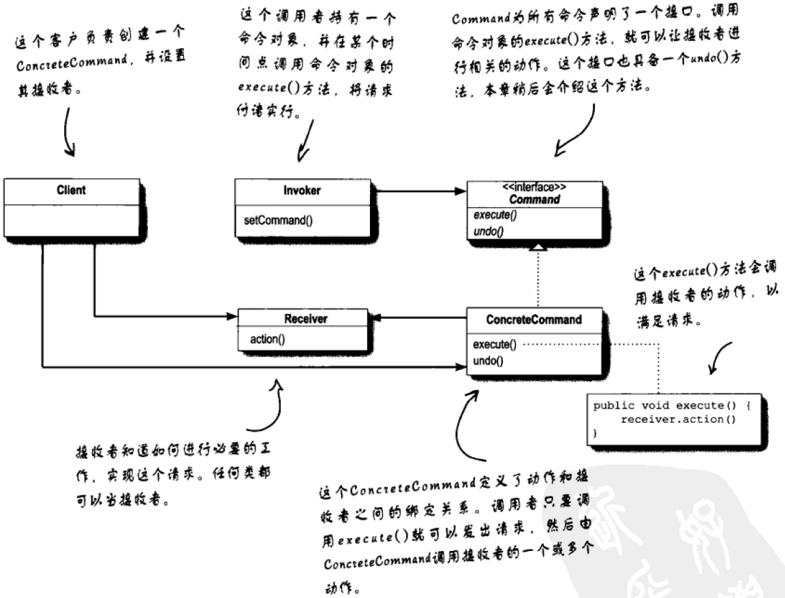
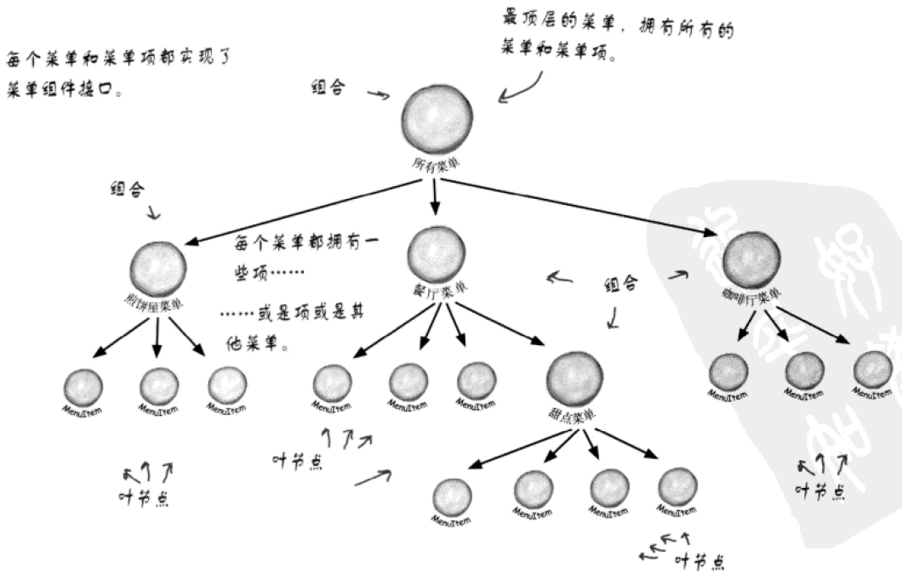
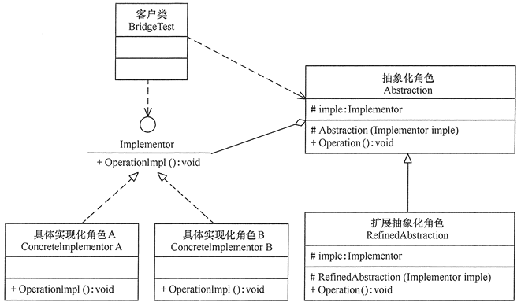
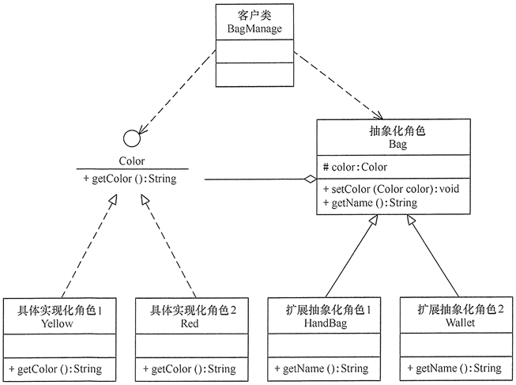

## 命令模式

命令模式的目的是将**动作的请求者**和**动作的执行者**分离，它的实现思路是将请求封装为对象，这种对象被称为命令，动作的请求者发出请求的时候只会创建命令，至于命令何时被执行却和请求者无关；命令被创建后会被存在某个对象里，这个对象就是命令的持有者；真正执行请求的对象会在之后的某个时间来执行命令。

<div align="center"></div>

类图中Invoker持有命令的对象，Receiver是真正执行命令的对象。命令模式最大的好处就是它可以实现 undo 操作。

Receiver

```java
public class CeilingFan {

    public static final int HIGH = 3;
    public static final int MEDIUM = 2;
    public static final int LOW = 1;
    public static final int OFF = 0;
    String location;
    int speed;

    public CeilingFan(String location) {
        this.location = location;
        speed = OFF;
    }
    public void high() {
        speed = HIGH;
        System.out.println(location + " ceiling fan is on high");
    }
    public void medium() {
        speed = MEDIUM;
        System.out.println(location + " ceiling fan is on medium");
    }
    public void low() {
        speed = LOW;
        System.out.println(location + " ceiling fan is on low");
    }
    public void off() {
        speed = OFF;
        System.out.println(location + " ceiling fan is off");
    }
    public int getSpeed() {
        return speed;
    }
}

public class Light {

    String location;
    int level;

    public Light(String location) {
        this.location = location;
    }
    public void on() {
        level = 100;
        System.out.println("Light is on");
    }
    public void off() {
        level = 0;
        System.out.println("Light is off");
    }
    public void dim(int level) {
        this.level = level;
        if (level == 0) {
            off();
        } else {
            System.out.println("Light is dimmed to " + level + "%");
        }
    }
    public int getLevel() {
        return level;
    }
}
```

命令

```java
public interface Command {
    void execute();
    void undo();
}

public abstract class AbstractCeilingFanCommand implements Command {

    protected int prevSpeed;
    protected CeilingFan ceilingFan;
    public abstract void execute();

    @Override
    public void undo() {
        if (prevSpeed == CeilingFan.HIGH) {
            ceilingFan.high();
        } else if (prevSpeed == CeilingFan.MEDIUM) {
            ceilingFan.medium();
        } else if (prevSpeed == CeilingFan.LOW) {
            ceilingFan.low();
        } else if (prevSpeed == CeilingFan.OFF) {
            ceilingFan.off();
        }
    }
}

public class CeilingFanHighCommand extends AbstractCeilingFanCommand {

    public CeilingFanHighCommand(CeilingFan ceilingFan) {
        this.ceilingFan = ceilingFan;
    }
    public void execute() {
        prevSpeed = ceilingFan.getSpeed();
        ceilingFan.high();
    }

}

public class CeilingFanLowCommand extends AbstractCeilingFanCommand  {

    public CeilingFanLowCommand(CeilingFan ceilingFan) {
        this.ceilingFan = ceilingFan;
    }
    public void execute() {
        prevSpeed = ceilingFan.getSpeed();
        ceilingFan.low();
    }

}

public class CeilingFanMediumCommand extends AbstractCeilingFanCommand  {

    public CeilingFanMediumCommand(CeilingFan ceilingFan) {
        this.ceilingFan = ceilingFan;
    }
    public void execute() {
        prevSpeed = ceilingFan.getSpeed();
        ceilingFan.medium();
    }

}

public class CeilingFanOffCommand extends AbstractCeilingFanCommand {

    public CeilingFanOffCommand(CeilingFan ceilingFan) {
        this.ceilingFan = ceilingFan;
    }
    public void execute() {
        prevSpeed = ceilingFan.getSpeed();
        ceilingFan.off();
    }

}

public class LightOffCommand implements Command {
    
    Light light;
    int level;
    
    public LightOffCommand(Light light) {
        this.light = light;
    }
    public void execute() {
        level = light.getLevel();
        light.off();
    }
    public void undo() {
        light.dim(level);
    }

}

public class LightOnCommand implements Command {
    
    Light light;
    int level;
    
    public LightOnCommand(Light light) {
        this.light = light;
    }
    public void execute() {
        level = light.getLevel();
        light.on();
    }
    public void undo() {
        light.dim(level);
    }
    
}

public class NoCommand implements Command {
    public void execute() { }
    public void undo() { }
}
```

Invoker

```
public class RemoteControl {

    Command[] onCommands;
    Command[] offCommands;
    Command undoCommand;

    public RemoteControl() {
        onCommands = new Command[7];
        offCommands = new Command[7];

        Command noCommand = new NoCommand();
        for (int i = 0; i < 7; i++) {
            onCommands[i] = noCommand;
            offCommands[i] = noCommand;
        }
        undoCommand = noCommand;
    }

    public void setCommand(int slot, Command onCommand, Command offCommand) {
        onCommands[slot] = onCommand;
        offCommands[slot] = offCommand;
    }

    public void onButtonWasPushed(int slot) {
        onCommands[slot].execute();
        undoCommand = onCommands[slot];
    }

    public void offButtonWasPushed(int slot) {
        offCommands[slot].execute();
        undoCommand = offCommands[slot];
    }

    public void undoButtonWasPushed() {
        undoCommand.undo();
    }

    public String toString() {
        StringBuffer stringBuff = new StringBuffer();
        stringBuff.append("\n------ Remote Control -------\n");
        for (int i = 0; i < onCommands.length; i++) {
            stringBuff.append("[slot " + i + "] " + onCommands[i].getClass().getName()
                + "    " + offCommands[i].getClass().getName() + "\n");
        }
        stringBuff.append("[undo] " + undoCommand.getClass().getName() + "\n");
        return stringBuff.toString();
    }
}
```

Client

```java
public class RemoteLoader {
    public static void main(String[] args) {
        RemoteControl remoteControl = new RemoteControl();

        Light livingRoomLight = new Light("Living Room");
        LightOnCommand livingRoomLightOn = new LightOnCommand(livingRoomLight);
        LightOffCommand livingRoomLightOff = new LightOffCommand(livingRoomLight);

        remoteControl.setCommand(0, livingRoomLightOn, livingRoomLightOff);

        remoteControl.onButtonWasPushed(0);
        remoteControl.offButtonWasPushed(0);
        System.out.println(remoteControl);
        remoteControl.undoButtonWasPushed();
        remoteControl.offButtonWasPushed(0);
        remoteControl.onButtonWasPushed(0);
        System.out.println(remoteControl);
        remoteControl.undoButtonWasPushed();

        CeilingFan ceilingFan = new CeilingFan("Living Room");
        CeilingFanMediumCommand ceilingFanMedium = new CeilingFanMediumCommand(ceilingFan);
        CeilingFanHighCommand ceilingFanHigh = new CeilingFanHighCommand(ceilingFan);
        CeilingFanOffCommand ceilingFanOff = new CeilingFanOffCommand(ceilingFan);

        remoteControl.setCommand(0, ceilingFanMedium, ceilingFanOff);
        remoteControl.setCommand(1, ceilingFanHigh, ceilingFanOff);

        remoteControl.onButtonWasPushed(0);
        remoteControl.offButtonWasPushed(0);
        System.out.println(remoteControl);
        remoteControl.undoButtonWasPushed();

        remoteControl.onButtonWasPushed(1);
        System.out.println(remoteControl);
        remoteControl.undoButtonWasPushed();
    }
}
```


## 状态模式

将状态封装为类，持有状态的对象（状态机）在运行时更改自己的状态，状态机的方法在被调用时会将动作委托给状态对象。

状态

```java
public interface State {
 	void insertQuarter();
	void ejectQuarter();
	void turnCrank();
	void dispense();
	void refill();
}

public class NoQuarterState implements State {

    GumballMachine gumballMachine;
    public NoQuarterState(GumballMachine gumballMachine) {
        this.gumballMachine = gumballMachine;
    }
 
	@Override
	public void insertQuarter() {
		System.out.println("You inserted a quarter");
		gumballMachine.setState(gumballMachine.getHasQuarterState());
	}
 	@Override
	public void ejectQuarter() {
		System.out.println("You haven't inserted a quarter");
	}
 	@Override
	public void turnCrank() {
		System.out.println("You turned, but there's no quarter");
	}
 	@Override
	public void dispense() {
		System.out.println("You need to pay first");
	} 
	@Override
	public void refill() { }
 
	public String toString() {
		return "waiting for quarter";
	}
}

public class HasQuarterState implements State {

	Random randomWinner = new Random(System.currentTimeMillis());
	private GumballMachine gumballMachine;
 	public HasQuarterState(GumballMachine gumballMachine) {
		this.gumballMachine = gumballMachine;
	}
  
	@Override
	public void insertQuarter() {
		System.out.println("You can't insert another quarter");
	}
 	@Override
	public void ejectQuarter() {
		System.out.println("Quarter returned");
		gumballMachine.setState(gumballMachine.getNoQuarterState());
	}
 	@Override
	public void turnCrank() {
		System.out.println("You turned...");
		int winner = randomWinner.nextInt(10);
		if ((winner == 0) && (gumballMachine.getCount() > 1)) {
			gumballMachine.setState(gumballMachine.getWinnerState());
		} else {
			gumballMachine.setState(gumballMachine.getSoldState());
		}
	}
    @Override
	public void dispense() {
        System.out.println("No gumball dispensed");
    }
    @Override
	public void refill() { }
 
	public String toString() {
		return "waiting for turn of crank";
	}
	
}

public class SoldOutState implements State {

    GumballMachine gumballMachine;
    public SoldOutState(GumballMachine gumballMachine) {
        this.gumballMachine = gumballMachine;
    }
 
	@Override
	public void insertQuarter() {
		System.out.println("You can't insert a quarter, the machine is sold out");
	}
 	@Override
	public void ejectQuarter() {
		System.out.println("You can't eject, you haven't inserted a quarter yet");
	}
 	@Override
	public void turnCrank() {
		System.out.println("You turned, but there are no gumballs");
	}
 	@Override
	public void dispense() {
		System.out.println("No gumball dispensed");
	}
	@Override
	public void refill() {
		gumballMachine.setState(gumballMachine.getNoQuarterState());
	}
    
	public String toString() {
		return "sold out";
	}
	
}

public class SoldState implements State {

    GumballMachine gumballMachine; 
    public SoldState(GumballMachine gumballMachine) {
        this.gumballMachine = gumballMachine;
    }
       
	@Override
	public void insertQuarter() {
		System.out.println("Please wait, we're already giving you a gumball");
	} 
	@Override
	public void ejectQuarter() {
		System.out.println("Sorry, you already turned the crank");
	} 
	@Override
	public void turnCrank() {
		System.out.println("Turning twice doesn't get you another gumball!");
	} 
	@Override
	public void dispense() {
		gumballMachine.releaseBall();
		if (gumballMachine.getCount() > 0) {
			gumballMachine.setState(gumballMachine.getNoQuarterState());
		} else {
			System.out.println("Oops, out of gumballs!");
			gumballMachine.setState(gumballMachine.getSoldOutState());
		}
	}	
	@Override
	public void refill() { }
 
	public String toString() {
		return "dispensing a gumball";
	}
	
}

public class WinnerState implements State {

    GumballMachine gumballMachine; 
    public WinnerState(GumballMachine gumballMachine) {
        this.gumballMachine = gumballMachine;
    }
 
	@Override
	public void insertQuarter() {
		System.out.println("Please wait, we're already giving you a Gumball");
	} 
	@Override
	public void ejectQuarter() {
		System.out.println("Please wait, we're already giving you a Gumball");
	} 
	@Override
	public void turnCrank() {
		System.out.println("Turning again doesn't get you another gumball!");
	} 
	@Override
	public void dispense() {
		gumballMachine.releaseBall();
		if (gumballMachine.getCount() == 0) {
			gumballMachine.setState(gumballMachine.getSoldOutState());
		} else {
			gumballMachine.releaseBall();
			System.out.println("YOU'RE A WINNER! You got two gumballs for your quarter");
			if (gumballMachine.getCount() > 0) {
				gumballMachine.setState(gumballMachine.getNoQuarterState());
			} else {
            	System.out.println("Oops, out of gumballs!");
				gumballMachine.setState(gumballMachine.getSoldOutState());
			}
		}
	} 
	@Override
	public void refill() { }
	
	@Override
	public String toString() {
		return "despensing two gumballs for your quarter, because YOU'RE A WINNER!";
	}
	
}
```

状态机

```java
public class GumballMachine {

	State soldOutState;
	State noQuarterState;
	State hasQuarterState;
	State soldState;
	State winnerState;
 
	State state = soldOutState;
	int count;
 
	public GumballMachine(int numberGumballs) {
		soldOutState = new SoldOutState(this);
		noQuarterState = new NoQuarterState(this);
		hasQuarterState = new HasQuarterState(this);
		soldState = new SoldState(this);
		winnerState = new WinnerState(this);

		this.count = numberGumballs;
 		if (numberGumballs > 0) {
			state = noQuarterState;
		} 
	}

	public void insertQuarter() {
		state.insertQuarter();
	} 
	public void ejectQuarter() {
		state.ejectQuarter();
	} 
	public void turnCrank() {
		state.turnCrank();
		state.dispense();
	}
	void setState(State state) {
		this.state = state;
	} 
	void releaseBall() {
		System.out.println("A gumball comes rolling out the slot...");
		if (count != 0) {
			count = count - 1;
		}
	} 
	int getCount() {
		return count;
	} 
	void refill(int count) {
		this.count += count;
		System.out.println("The gumball machine was just refilled; it's new count is: " + this.count);
		state.refill();
	}
    public State getState() {
        return state;
    }
    public State getSoldOutState() {
        return soldOutState;
    }
    public State getNoQuarterState() {
        return noQuarterState;
    }
    public State getHasQuarterState() {
        return hasQuarterState;
    }
    public State getSoldState() {
        return soldState;
    }
    public State getWinnerState() {
        return winnerState;
    }
    
	@Override
	public String toString() {
		StringBuffer result = new StringBuffer();
		result.append("\nMighty Gumball, Inc.");
		result.append("\nJava-enabled Standing Gumball Model #2004");
		result.append("\nInventory: " + count + " gumball");
		if (count != 1) {
			result.append("s");
		}
		result.append("\n");
		result.append("Machine is " + state + "\n");
		return result.toString();
	}
    
}
```

客户端

```java
public class GumballMachineTestDrive {
	public static void main(String[] args) {
	
		GumballMachine gumballMachine = new GumballMachine(10);

		System.out.println(gumballMachine);
		gumballMachine.insertQuarter();
		gumballMachine.turnCrank();
		gumballMachine.insertQuarter();
		gumballMachine.turnCrank();

		System.out.println(gumballMachine);
		gumballMachine.insertQuarter();
		gumballMachine.turnCrank();
		gumballMachine.insertQuarter();
		gumballMachine.turnCrank();

		System.out.println(gumballMachine);
		gumballMachine.insertQuarter();
		gumballMachine.turnCrank();
		gumballMachine.insertQuarter();
		gumballMachine.turnCrank();

		System.out.println(gumballMachine);
		gumballMachine.insertQuarter();
		gumballMachine.turnCrank();
		gumballMachine.insertQuarter();
		gumballMachine.turnCrank();

		System.out.println(gumballMachine);
		gumballMachine.insertQuarter();
		gumballMachine.turnCrank();
		gumballMachine.insertQuarter();
		gumballMachine.turnCrank();

		gumballMachine.refill(10);

		System.out.println(gumballMachine);
		gumballMachine.insertQuarter();
		gumballMachine.turnCrank();
		gumballMachine.insertQuarter();
		gumballMachine.turnCrank();

	}
}
```


## 访问者模式

假设我们从网站上爬取了很多资源文件，它们的格式有三种：PDF、PPT、Word。我们现在要开发一个工具来处理这批资源文件。这个工具的其中一个功能是，把这些资源文件中的文本内容抽取出来放到 txt 文件中。如果让你来实现，你会怎么来做呢？实现这个功能并不难，不同的人有不同的写法，我将其中一种代码实现方式贴在这里。其中，ResourceFile 是一个抽象类，包含一个抽象函数 extract2txt()。PdfFile、PPTFile、WordFile 都继承 ResourceFile 类，并且重写了 extract2txt() 函数。在 ToolApplication 中，我们可以利用多态特性，根据对象的实际类型，来决定执行哪个方法。

```java
public abstract class ResourceFile {
    protected String filePath;
    public ResourceFile(String filePath) {
        this.filePath = filePath;
    }
    public abstract void extract2txt();
}
public class PPTFile extends ResourceFile {
    public PPTFile(String filePath) {
        super(filePath);
    }
    @Override
    public void extract2txt() {
        //...省略一大坨从PPT中抽取文本的代码...
        System.out.println("Extract PPT.");
    }
}
public class PdfFile extends ResourceFile {
    public PdfFile(String filePath) {
        super(filePath);
    }
    @Override
    public void extract2txt() {
        System.out.println("Extract PDF.");
    }
}
public class WordFile extends ResourceFile {
    public WordFile(String filePath) {
        super(filePath);
    }
    @Override
    public void extract2txt() {
        System.out.println("Extract WORD.");
    }
}
```

如果工具的功能不停地扩展，不仅要能抽取文本内容，还要支持压缩、提取文件元信息（文件名、大小、更新时间等等）构建索引等一系列的功能，那如果我们继续按照上面的实现思路，就会存在这样几个问题：

1. 违背开闭原则，添加一个新的功能，所有类的代码都要修改；
2. 虽然功能增多，每个类的代码都不断膨胀，可读性和可维护性都变差了；
3. 把所有比较上层的业务逻辑都耦合到 PdfFile、PPTFile、WordFile 类中，导致这些类的职责不够单一，变成了大杂烩。

针对上面的问题，我们常用的解决方法就是拆分解耦，把业务操作跟具体的数据结构解耦，设计成独立的类。这里我们按照访问者模式的演进思路来对上面的代码进行重构。重构之后的代码如下所示。

```java
public abstract class ResourceFile {
    protected String filePath;
    public ResourceFile(String filePath) {
        this.filePath = filePath;
    }
}
public class PdfFile extends ResourceFile {
    public PdfFile(String filePath) {
        super(filePath);
    }
    //...
}
//...PPTFile、WordFile代码省略...
public class Extractor {
    public void extract2txt(PPTFile pptFile) {
        //...
        System.out.println("Extract PPT.");
    }
    public void extract2txt(PdfFile pdfFile) {
        //...
        System.out.println("Extract PDF.");
    }
    public void extract2txt(WordFile wordFile) {
        //...
        System.out.println("Extract WORD.");
    }
}
public class ToolApplication {
    public static void main(String[] args) {
        Extractor extractor = new Extractor();
        List<ResourceFile> resourceFiles = listAllResourceFiles();
        for (ResourceFile resourceFile : resourceFiles) {
            extractor.extract2txt(resourceFile);	// 编译错误
        }
    }
    private static List<ResourceFile> listAllResourceFiles(){            
        List<ResourceFile> resourceFiles = new ArrayList<>();
        //...根据后缀(pdf/ppt/word)由工厂方法创建不同的类对象(PdfFile/PPTFile/WordFile)
        resourceFiles.add(new PdfFile("a.pdf"));
        resourceFiles.add(new WordFile("b.word"));
        resourceFiles.add(new PPTFile("c.ppt"));
        return resourceFiles;
    }
}
```

这时候会有两种解决方案，其中一种是增加一个文件的标识。

```java
public abstract class ResourceFile {

    protected ResourceFileType resourceFileType;
    protected String filePath;

	public ResourceFile(String filePath, ResourceFileType resourceFileType) {
        this.filePath = filePath;
        this.resourceFileType = resourceFileType;
    }
    enum ResourceFileType {
        PDF, WORD, PPT;
    }

}

public class PdfFile extends ResourceFile {
    public PdfFile(String filePath) {
        super(filePath, ResourceFileType.PDF);
    }
}

public class PPTFile extends ResourceFile {
    public PPTFile(String filePath) {
        super(filePath, ResourceFileType.PPT);
    }
}

public class WordFile extends ResourceFile {
    public WordFile(String filePath) {
        super(filePath, ResourceFileType.WORD);
    }
}

public abstract class Action {

    public void action(ResourceFile resourceFile) {
        if (resourceFile.resourceFileType == ResourceFileType.PDF) {
            doActionPdfFile((PdfFile) resourceFile);
        } else if (resourceFile.resourceFileType == ResourceFileType.PPT) {
            doActionPptFile((PPTFile) resourceFile);
        } else if (resourceFile.resourceFileType == ResourceFileType.WORD) {
            doActionWordFile((WordFile) resourceFile);
        }
    }

    protected abstract void doActionPptFile(PPTFile pptFile);
    protected abstract void doActionPdfFile(PdfFile pdfFile);
    protected abstract void doActionWordFile(WordFile wordFile);
}

public class Extractor extends Action {
    protected void doActionPptFile(PPTFile pptFile) {
        //...
        System.out.println("Extract PPT: " + pptFile.filePath);
    }
    protected void doActionPdfFile(PdfFile pdfFile) {
        //...
        System.out.println("Extract PDF: " + pdfFile.filePath);
    }
    protected void doActionWordFile(WordFile wordFile) {
        //...
        System.out.println("Extract WORD: " + wordFile.filePath);
    }
}

public class ToolApplication {
    public static void main(String[] args) {
        Extractor extractor = new Extractor();
        List<ResourceFile> resourceFiles = listAllResourceFiles();
        for (ResourceFile resourceFile : resourceFiles) {
            extractor.action(resourceFile);	// 编译错误
        }
    }
    private static List<ResourceFile> listAllResourceFiles(){            
        List<ResourceFile> resourceFiles = new ArrayList<>();
        //...根据后缀(pdf/ppt/word)由工厂方法创建不同的类对象(PdfFile/PPTFile/WordFile)
        resourceFiles.add(new PdfFile("a.pdf"));
        resourceFiles.add(new WordFile("b.word"));
        resourceFiles.add(new PPTFile("c.ppt"));
        return resourceFiles;
    }
}
```

这种方式是我们最容易想到的方式，它的思路和JDK处理泛型时的桥方法类似，我们分析一下它的拓展性问题。

- 如果想增加一个行为，只需要实现一个行为类就可以，不用修改文件类簇。
- 如果想增加一个文件，需要修改ResourceFileType和所有的行为类。

也就是说在文件类型（数据类型）确定的时候这种模式很好用。再看看访问者模式，它的思路是将行为传递到数据中去。

文件类

```java
public interface Acceptable {
    void accept(Visitor visitor);
}

public abstract class ResourceFile implements Acceptable {
    protected String filePath;
    public ResourceFile(String filePath) {
        this.filePath = filePath;
    }
}

public class PdfFile extends ResourceFile {
    public PdfFile(String filePath) {
        super(filePath);
    }
    @Override
    public void accept(Visitor visitor) {
        visitor.visit(this);
    }
}

public class PPTFile extends ResourceFile {
    public PPTFile(String filePath) {
        super(filePath);
    }
    @Override
    public void accept(Visitor visitor) {
        visitor.visit(this);
    }
}

public class WordFile extends ResourceFile {
    public WordFile(String filePath) {
        super(filePath);
    }
    @Override
    public void accept(Visitor visitor) {
        visitor.visit(this);
    }
}
```

访问者

```java
public interface Visitor {
    void visit(PdfFile pdfFile);
    void visit(PPTFile pdfFile);
    void visit(WordFile pdfFile);
}
public class Extractor implements Visitor {
    @Override
    public void visit(PPTFile pptFile) {
        System.out.println("Extract PPT.");
    }
    @Override
    public void visit(PdfFile pdfFile) {
        System.out.println("Extract PDF.");
    }
    @Override
    public void visit(WordFile wordFile) {
        System.out.println("Extract WORD.");
    }
}
public class Compressor implements Visitor {
    @Override
    public void visit(PPTFile pptFile) {
        System.out.println("Compress PPT.");
    }
    @Override
    public void visit(PdfFile pdfFile) {
        System.out.println("Compress PDF.");
    }
    @Override
    public void visit(WordFile wordFile) {
        System.out.println("Compress WORD.");
    }
}
```

客户端

```java
public class ToolApplication {
    public static void main(String[] args) {

        List<ResourceFile> resourceFiles = listAllResourceFiles();
        Extractor extractor = new Extractor();
        for (ResourceFile resourceFile : resourceFiles) {
            resourceFile.accept(extractor);
        }
        Compressor compressor = new Compressor();
        for(ResourceFile resourceFile : resourceFiles) {
            resourceFile.accept(compressor);
        }

    }

    private static List<ResourceFile> listAllResourceFiles() {
        List<ResourceFile> resourceFiles = new ArrayList<>();
        resourceFiles.add(new PdfFile("a.pdf"));
        resourceFiles.add(new WordFile("b.word"));
        resourceFiles.add(new PPTFile("c.ppt"));
        return resourceFiles;
    }
}
```

这两种模式的区别是将前者将数据传给行为，后者是将行为传给数据。前者的劣势是Action这个类耦合了太多的逻辑，可以说整个判断逻辑都在这里了。任何行为都要在action这个方法里进行if-else，比如此时如果有一个包含ResourceFile属性的网络文件也想使用Compressor，只需要让其实现Acceptable接口即可。

```java
public class NetWorkFile implements Acceptable {

    PdfFile pdfFile = new PdfFile("network file");
    @Override
    public void accept(Visitor visitor) {
        visitor.visit(pdfFile);
    }
    
}
```

而对于第一种方式，emmmm，第一种方式貌似也不错...


## 依赖倒置


## 责任链模式

责任链模式的任务很明确，就是将某一类行为施加到对象上。实现方式分为链表和数组。

数组

```java
public interface IHandler {
    boolean handle(Object object);
}

public class HandlerA implements IHandler {
    @Override
    public boolean handle(Object object) {
        boolean handled = false;
        System.out.println("HandlerA is invoked");
        return handled;
    }
}

public class HandlerB implements IHandler {
    @Override
    public boolean handle(Object object) {
        boolean handled = false;
        System.out.println("HandlerB is invoked");
        return handled;
    }
}


public class HandlerChain {
    private Object object;
    public HandlerChain(Object object) {
        this.object = object;
    }
    private List<IHandler> handlers = new ArrayList<>();
    public void addHandler(IHandler handler) {
        this.handlers.add(handler);
    }
    public void handle() {
        for (IHandler handler : handlers) {
            boolean handled = handler.handle(object);
            if (handled) {
                break;
            }
        }
    }
}

public class Application {
    public static void main(String[] args) {
        HandlerChain chain = new HandlerChain(new Object());
        chain.addHandler(new HandlerA());
        chain.addHandler(new HandlerB());
        chain.handle();
    }
}
```

链表

```java
public abstract class Handler {
    protected Handler successor = null;
    public void setSuccessor(Handler successor) {
        this.successor = successor;
    }

    public final void handle(Object object) {
        boolean handled = doHandle(object);

        /**
         * 沿着handler链一直处理到末尾
         */
//        if (successor != null) {

        /**
         * 处理到某个handler截止
         */
        if (successor != null && !handled) {
            successor.handle(object);
        }
    }
    protected abstract boolean doHandle(Object object);
}

public class HandlerA extends Handler {
    @Override
    protected boolean doHandle(Object object) {
        boolean handled = false;
        /**
         * ...
         */
        System.out.println("HandlerA is invoked");
        return handled;
    }
}
public class HandlerB extends Handler {
    @Override
    protected boolean doHandle(Object object) {
        boolean handled = false;
        System.out.println("HandlerB is invoked");
        return handled;
    }
}
public class HandlerC extends Handler {
    @Override
    protected boolean doHandle(Object object) {
        boolean handled = false;
        System.out.println("HandlerC is invoked");
        return handled;
    }
}

public class HandlerChain {

    private Object object;
    public HandlerChain(Object object) {
        this.object = object;
    }

    private Handler head = null;
    private Handler tail = null;

    public void addHandler(Handler handler) {
        handler.setSuccessor(null);
        if (head == null) {
            head = handler;
            tail = handler;
            return;
        }
        tail.setSuccessor(handler);
        tail = handler;
    }

    public void handle() {
        if (head != null) {
            head.handle(object);
        }
    }
}

public class Application {
    public static void main(String[] args) {
        HandlerChain chain = new HandlerChain(new Object());
        chain.addHandler(new HandlerA());
        chain.addHandler(new HandlerB());
        chain.addHandler(new HandlerC());
        chain.handle();
    }
}
```


## 迭代器模式

迭代器模式的目的是让集合的使用者对数据的遍历行为从具体的数据结构中解耦。

菜单项

```java
public class MenuItem {
	private String name;
	private String description;
	private boolean vegetarian;
	private double price;
 
	public MenuItem(String name, 
	                String description, 
	                boolean vegetarian, 
	                double price) {
		this.name = name;
		this.description = description;
		this.vegetarian = vegetarian;
		this.price = price;
	}
  
	public String getName() {
		return name;
	}
	public String getDescription() {
		return description;
	}
	public double getPrice() {
		return price;
	}
	public boolean isVegetarian() {
		return vegetarian;
	}
	public String toString() {
		return (name + ", $" + price + "\n   " + description);
	}

}
```

菜单

```java
public interface Menu {
	Iterator<MenuItem> createIterator();
}

public class DinerMenu implements Menu {

	private static final int MAX_ITEMS = 6;
	private int numberOfItems = 0;
	private MenuItem[] menuItems;
  
	public DinerMenu() {
		menuItems = new MenuItem[MAX_ITEMS];
		addItem("Vegetarian BLT",
			"(Fakin') Bacon with lettuce & tomato on whole wheat", true, 2.99);
		addItem("BLT",
			"Bacon with lettuce & tomato on whole wheat", false, 2.99);
		addItem("Soup of the day",
			"Soup of the day, with a side of potato salad", false, 3.29);
		addItem("Hotdog",
			"A hot dog, with saurkraut, relish, onions, topped with cheese",
			false, 3.05);
		addItem("Steamed Veggies and Brown Rice",
			"Steamed vegetables over brown rice", true, 3.99);
		addItem("Pasta",
			"Spaghetti with Marinara Sauce, and a slice of sourdough bread",
			true, 3.89);
	}
	public void addItem(String name, String description, 
	                     boolean vegetarian, double price) {
		MenuItem menuItem = new MenuItem(name, description, vegetarian, price);
		if (numberOfItems >= MAX_ITEMS) {
			System.err.println("Sorry, menu is full!  Can't add item to menu");
		} else {
			menuItems[numberOfItems] = menuItem;
			numberOfItems = numberOfItems + 1;
		}
	}
	public MenuItem[] getMenuItems() {
		return menuItems;
	}
	public Iterator<MenuItem> createIterator() {
		return new DinerMenuIterator(menuItems);
	}
}

public class PancakeHouseMenu implements Menu {
	private ArrayList<MenuItem> menuItems;
 
	public PancakeHouseMenu() {
		menuItems = new ArrayList<>();
    		addItem("K&B's Pancake Breakfast", 
			"Pancakes with scrambled eggs, and toast", 
			true,
			2.99);
 		addItem("Regular Pancake Breakfast", 
			"Pancakes with fried eggs, sausage", 
			false,
			2.99);
 		addItem("Blueberry Pancakes",
			"Pancakes made with fresh blueberries, and blueberry syrup",
			true,
			3.49);
 		addItem("Waffles",
			"Waffles, with your choice of blueberries or strawberries",
			true,
			3.59);
	}
	public void addItem(String name, String description,
	                    boolean vegetarian, double price) {
		MenuItem menuItem = new MenuItem(name, description, vegetarian, price);
		menuItems.add(menuItem);
	} 
	public ArrayList<MenuItem> getMenuItems() {
		return menuItems;
	}  
	public Iterator<MenuItem> createIterator() {
		return menuItems.iterator();
	} 
}
```

迭代器

```java
/*
 * PancakeHouseMenu 使用了 java.util.ArrayList 的迭代器
 */

public class DinerMenuIterator implements Iterator<MenuItem> {

	private MenuItem[] items;
	private int position = 0;
 
	public DinerMenuIterator(MenuItem[] items) {
		this.items = items;
	}

	@Override
	public MenuItem next() {
		MenuItem menuItem = items[position];
		position = position + 1;
		return menuItem;
	}

	@Override
	public boolean hasNext() {
		if (position >= items.length || items[position] == null) {
			return false;
		} else {
			return true;
		}
	}
}
```

调用者

```java
public class Waitress {
	private Menu pancakeHouseMenu;
	private Menu dinerMenu;
 
	public Waitress(Menu pancakeHouseMenu, Menu dinerMenu) {
		this.pancakeHouseMenu = pancakeHouseMenu;
		this.dinerMenu = dinerMenu;
	}
 
	public void printMenu() {
		Iterator pancakeIterator = pancakeHouseMenu.createIterator();
		Iterator dinerIterator = dinerMenu.createIterator();

		System.out.println("MENU\n-----------------------------------\nBREAKFAST");
		printMenu(pancakeIterator);
		System.out.println("\nLUNCH");
		printMenu(dinerIterator);

	}
 
	private void printMenu(Iterator<MenuItem> iterator) {
		while (iterator.hasNext()) {
			MenuItem menuItem = iterator.next();
			System.out.print(menuItem.getName() + ", ");
			System.out.print(menuItem.getPrice() + " -- ");
			System.out.println(menuItem.getDescription());
		}
	}
 
	public void printVegetarianMenu() {
		printVegetarianMenu(pancakeHouseMenu.createIterator());
		printVegetarianMenu(dinerMenu.createIterator());
	}

	private void printVegetarianMenu(Iterator<MenuItem> iterator) {
		while (iterator.hasNext()) {
			MenuItem menuItem = iterator.next();
			if (menuItem.isVegetarian()) {
				System.out.print(menuItem.getName());
				System.out.println("\t\t" + menuItem.getPrice());
				System.out.println("\t" + menuItem.getDescription());
			}
		}
	}

}
```

客户端

```java
public class MenuTestDrive {
	public static void main(String args[]) {
        
        PancakeHouseMenu pancakeHouseMenu = new PancakeHouseMenu();
        DinerMenu dinerMenu = new DinerMenu();
 		Waitress waitress = new Waitress(pancakeHouseMenu, dinerMenu);
		waitress.printMenu();
		System.out.println("\n***********************************************************\n");
		waitress.printVegetarianMenu();
        
	}
}
```


## 组合模式

组合模式就是把对象组合成树形结构，以表示“部分-整体”的层次结构，用户可以像处理一个简单对象一样来处理一个复杂对象，从而使得调用者无需了解复杂元素的内部结构。

组合模式的目的是处理某一类型的对象，这些对象之间存在一定的相似之处，即存在相同的属性或行为，但他们之间又存在包含关系。这样的话对象之间就会构成树形关系，比如文件和文件夹，文件和文件夹都有一个路径，都有增删查改功能。组合模式通常和迭代器模式一起出现，因为他俩都有一个共同的目的，就是封装数据结构信息，使得调用者无需了解复杂元素的内部结构。

<div align="center"></div>

组合模式中的角色有：

- 抽象组件（容器）：定义了树形结构中所有类的公共行为，例如add(),remove()等方法。
- 树叶：最终实现类，没有子类。
- 树枝：有子类的管理类，并通过管理方法调用其管理的子类的相关操作。
- 调用者：通过容器接口操作整个树形结构。

下面的例子是菜单和菜品的例子，菜单就是树枝，菜品就是树叶。

抽象组件

```java
public abstract class MenuComponent {  
	public void add(MenuComponent menuComponent) {
		throw new UnsupportedOperationException();
	}
	public void remove(MenuComponent menuComponent) {
		throw new UnsupportedOperationException();
	}
	public MenuComponent getChild(int i) {
		throw new UnsupportedOperationException();
	}
	public String getName() {
		throw new UnsupportedOperationException();
	}
	public String getDescription() {
		throw new UnsupportedOperationException();
	}
	public double getPrice() {
		throw new UnsupportedOperationException();
	}
	public boolean isVegetarian() {
		throw new UnsupportedOperationException();
	}
	public abstract Iterator<MenuComponent> createIterator();
	public void print() {
		throw new UnsupportedOperationException();
	}
}
```

树叶

```java
public class MenuItem extends MenuComponent {
 
	private String name;
	private String description;
	private boolean vegetarian;
	private double price;
    
	public MenuItem(String name, String description, boolean vegetarian, double price) {
		this.name = name;
		this.description = description;
		this.vegetarian = vegetarian;
		this.price = price;
	}
  
	@Override
	public String getName() {
		return name;
	}
	@Override
	public String getDescription() {
		return description;
	}
	@Override
	public double getPrice() {
		return price;
	}
	@Override
	public boolean isVegetarian() {
		return vegetarian;
	}
	@Override
	public Iterator<MenuComponent> createIterator() {
		return new NullIterator();
	}
	@Override
	public void print() {
		System.out.print("  " + getName());
		if (isVegetarian()) {
			System.out.print("(v)");
		}
		System.out.println(", " + getPrice());
		System.out.println("     -- " + getDescription());
	}

}
```

内部节点

```java
public class Menu extends MenuComponent {
	private Iterator<MenuComponent> iterator = null;
	private ArrayList<MenuComponent> menuComponents = new ArrayList<>();
	private String name;
	private String description;
  
	public Menu(String name, String description) {
		this.name = name;
		this.description = description;
	}

	@Override
	public void add(MenuComponent menuComponent) {
		menuComponents.add(menuComponent);
	}
 	@Override
	public void remove(MenuComponent menuComponent) {
		menuComponents.remove(menuComponent);
	}
 	@Override
	public MenuComponent getChild(int i) {
		return menuComponents.get(i);
	}
 	@Override
	public String getName() {
		return name;
	}
 	@Override
	public String getDescription() {
		return description;
	}
	@Override
	public Iterator<MenuComponent> createIterator() {
		if (iterator == null) {
			iterator = new CompositeIterator(menuComponents.iterator());
		}
		return iterator;
	}
 	@Override
	public void print() {
		System.out.print("\n" + getName());
		System.out.println(", " + getDescription());
		System.out.println("---------------------");
  
		Iterator<MenuComponent> iterator = menuComponents.iterator();
		while (iterator.hasNext()) {
			MenuComponent menuComponent = iterator.next();
			menuComponent.print();
		}
	}
	
}
```

迭代器

```java
public class CompositeIterator implements Iterator<MenuComponent> {

	Stack<Iterator<MenuComponent>> stack = new Stack<>();
    
	public CompositeIterator(Iterator<MenuComponent> iterator) {
		stack.push(iterator);
	}   
	@Override
	public MenuComponent next() {
		if (hasNext()) {
			Iterator<MenuComponent> iterator = stack.peek();
			MenuComponent component = iterator.next();
			stack.push(component.createIterator());
			return component;
		} else {
			return null;
		}
	}  
	@Override
	public boolean hasNext() {
		if (stack.empty()) {
			return false;
		} else {
			Iterator<MenuComponent> iterator = stack.peek();
			if (!iterator.hasNext()) {
				stack.pop();
				return hasNext();
			} else {
				return true;
			}
		}
	}
}

public class NullIterator implements Iterator<MenuComponent> {
   	public MenuComponent next() {
		return null;
	}
  	public boolean hasNext() {
		return false;
	}
}
```

调用者

```java
public class Waitress {

	private MenuComponent allMenus;
 
	public Waitress(MenuComponent allMenus) {
		this.allMenus = allMenus;
	} 
	public void printMenu() {
		allMenus.print();
	}
  	public void printVegetarianMenu() {
		Iterator<MenuComponent> iterator = allMenus.createIterator();
		System.out.println("\nVEGETARIAN MENU\n----");
		while (iterator.hasNext()) {
			MenuComponent menuComponent = iterator.next();
			try {
				if (menuComponent.isVegetarian()) {
					menuComponent.print();
				}
			} catch (UnsupportedOperationException e) {}
		}
	}

}
```

客户端

```java
public class MenuTestDrive {
	public static void main(String args[]) {
		
		MenuComponent pancakeHouseMenu = new Menu("PANCAKE HOUSE MENU", "Breakfast");
		MenuComponent dinerMenu = new Menu("DINER MENU", "Lunch");
		MenuComponent cafeMenu = new Menu("CAFE MENU", "Dinner");
		MenuComponent dessertMenu = new Menu("DESSERT MENU", "Dessert of course!");
  
		MenuComponent allMenus = new Menu("ALL MENUS", "All menus combined");
  
		allMenus.add(pancakeHouseMenu);
		allMenus.add(dinerMenu);
		allMenus.add(cafeMenu);
  
  		// 煎饼菜单
		pancakeHouseMenu.add(new MenuItem(
			"K&B's Pancake Breakfast", 
			"Pancakes with scrambled eggs, and toast", 
			true, 2.99));
		pancakeHouseMenu.add(new MenuItem(
			"Regular Pancake Breakfast", 
			"Pancakes with fried eggs, sausage", 
			false, 2.99));
		pancakeHouseMenu.add(new MenuItem(
			"Blueberry Pancakes",
			"Pancakes made with fresh blueberries, and blueberry syrup",
			true, 3.49));
		pancakeHouseMenu.add(new MenuItem(
			"Waffles",
			"Waffles, with your choice of blueberries or strawberries",
			true, 3.59));

		// 午餐菜单
		dinerMenu.add(new MenuItem(
			"Vegetarian BLT",
			"(Fakin') Bacon with lettuce & tomato on whole wheat", 
			true, 2.99));
		dinerMenu.add(new MenuItem(
			"BLT",
			"Bacon with lettuce & tomato on whole wheat", 
			false, 2.99));
		dinerMenu.add(new MenuItem(
			"Soup of the day",
			"A bowl of the soup of the day, with a side of potato salad", 
			false, 3.29));
		dinerMenu.add(new MenuItem(
			"Hotdog",
			"A hot dog, with saurkraut, relish, onions, topped with cheese",
			false, 3.05));
		dinerMenu.add(new MenuItem(
			"Steamed Veggies and Brown Rice",
			"A medly of steamed vegetables over brown rice", 
			true, 3.99));
		dinerMenu.add(new MenuItem(
			"Pasta",
			"Spaghetti with Marinara Sauce, and a slice of sourdough bread",
			true, 3.89));
   
   		// 午餐菜单里的甜品
		dinerMenu.add(dessertMenu);
		dessertMenu.add(new MenuItem(
			"Apple Pie",
			"Apple pie with a flakey crust, topped with vanilla icecream",
			true, 1.59));
		dessertMenu.add(new MenuItem(
			"Cheesecake",
			"Creamy New York cheesecake, with a chocolate graham crust",
			true, 1.99));
		dessertMenu.add(new MenuItem(
			"Sorbet",
			"A scoop of raspberry and a scoop of lime",
			true,
			1.89));

		// 咖啡菜单
		cafeMenu.add(new MenuItem(
			"Veggie Burger and Air Fries",
			"Veggie burger on a whole wheat bun, lettuce, tomato, and fries",
			true, 3.99));
		cafeMenu.add(new MenuItem(
			"Soup of the day",
			"A cup of the soup of the day, with a side salad",
			false, 3.69));
		cafeMenu.add(new MenuItem(
			"Burrito",
			"A large burrito, with whole pinto beans, salsa, guacamole",
			true, 4.29));
 
		new Waitress(allMenus).printMenu();
		System.out.println("\n**************************************");
		new Waitress(dinerMenu).printMenu();
	}
}
```


## 备忘录模式

备忘录模式，也叫快照（Snapshot）模式：在不违背封装原则的前提下，捕获一个对象的内部状态，并在该对象之外保存这个状态，以便之后恢复对象为先前的状态。需要注意的一点是快照不应该有修改方法，一旦创建，内部的数据就不可修改。

下面案例的需求是，用户输入文本时，程序将其追加存储在内存文本中；用户输入“:list”，程序在命令行中输出内存文本的内容；用户输入“:undo”，程序会撤销上一次输入的文本，也就是从内存文本中将上次输入的文本删除掉。

```java
public class Snapshot {
    private String text;
    public Snapshot(String text) {
        this.text = text;
    }
    public String getText() {
        return this.text;
    }
}

public class SnapshotHolder {
    private Stack<Snapshot> snapshots = new Stack<>();
    public Snapshot popSnapshot() {
        return snapshots.pop();
    }
    public void pushSnapshot(Snapshot snapshot) {
        snapshots.push(snapshot);
    }
}

public class InputText {
    private StringBuilder text = new StringBuilder();
    public String getText() {
        return text.toString();
    }
    public void append(String input) {
        text.append(input);
    }
    public Snapshot createSnapshot() {
        return new Snapshot(text.toString());
    }
    public void restoreSnapshot(Snapshot snapshot) {
        this.text.replace(0, this.text.length(), snapshot.getText());
    }
    @Override
    public String toString() {
        return "InputText{" +
            "text=" + text +
            '}';
    }
}

public class ApplicationMain {
    public static void main(String[] args) {
        InputText inputText = new InputText();
        SnapshotHolder snapshotsHolder = new SnapshotHolder();
        Scanner scanner = new Scanner(System.in);
        while (scanner.hasNext()) {
            String input = scanner.next();
            if (input.equals(":list")) {
                System.out.println(inputText.toString());
            } else if (input.equals(":undo")) {
                Snapshot snapshot = snapshotsHolder.popSnapshot();
                inputText.restoreSnapshot(snapshot);
            } else {
                snapshotsHolder.pushSnapshot(inputText.createSnapshot());
               inputText.append(input);
            }
        }
    }
}
```


## 桥接模式

桥接（Bridge）模式包含以下主要角色。

1. 抽象化（Abstraction）角色：定义抽象类，并包含一个对实现化对象的引用。
2. 扩展抽象化（Refined  Abstraction）角色：是抽象化角色的子类，实现父类中的业务方法，并通过组合关系调用实现化角色中的业务方法。
3. 实现化（Implementor）角色：定义实现化角色的接口，供扩展抽象化角色调用。
4. 具体实现化（Concrete Implementor）角色：给出实现化角色接口的具体实现。

<div align="center"></div>

女士皮包有很多种，可以按用途分、按皮质分、按品牌分、按颜色分、按大小分等，存在多个维度的变化，所以采用桥接模式来实现女士皮包的选购比较合适。本实例按用途分可选钱包（Wallet）和挎包（HandBag），按颜色分可选黄色（Yellow）和红色（Red）。可以按两个维度定义为颜色类和包类。颜色类（Color）是一个维度，定义为实现化角色，它有两个具体实现化角色：黄色和红色，通过 getColor() 方法可以选择颜色；包类（Bag）是另一个维度，定义为抽象化角色，它有两个扩展抽象化角色：挎包和钱包，它包含了颜色类对象，通过 getName() 方法可以选择相关颜色的挎包和钱包。

<div align="center"></div>

实现化角色：颜色

```java
interface Color {
    String getColor();
}
class Red implements Color {
    public String getColor() {
        return "Red";
    }
    
}
class Yellow implements Color {
    public String getColor() {
        return "Yellow";
    }
}
```

抽象化角色：包

```java
// Abstraction
abstract class Bag {
    protected Color color;
    public void setColor(Color color) {
        this.color = color;
    }
    public abstract String getStyle();
}

// Refined  Abstraction
class HandBag extends Bag {
    public String getStyle() {
        return color.getColor() + "HandBag";
    }
}
class Wallet extends Bag {
    public String getStyle() {
        return color.getColor() + "Wallet";
    }
}
```

客户端

```java
public class BagManage {

    public static void main(String[] args) {
        Color color;
        Bag bag;
        color = (Color) ReadXML.getObject("color");
        bag = (Bag) ReadXML.getObject("bag");
        bag.setColor(color);
        String name = bag.getStyle();
        show(name);
    }

    public static void show(String name) {
        JFrame jf = new JFrame("桥接模式测试");
        Container contentPane = jf.getContentPane();
        JPanel p = new JPanel();
        System.out.println("src/main/java/_20_bridge/" + name + ".jpg");
        JLabel l = new JLabel(new ImageIcon("design-pattern/src/main/java/headfirst/_20_bridge/" + name + ".jpg"));
        p.setLayout(new GridLayout(1, 1));
        p.setBorder(BorderFactory.createTitledBorder("女士皮包"));
        p.add(l);
        contentPane.add(p, BorderLayout.CENTER);
        jf.pack();
        jf.setVisible(true);
        jf.setDefaultCloseOperation(JFrame.EXIT_ON_CLOSE);
    }
}

class ReadXML {
   public static Object getObject(String args) {
        try {
            DocumentBuilderFactory dFactory = DocumentBuilderFactory.newInstance();
            DocumentBuilder builder = dFactory.newDocumentBuilder();
            Document doc;
            doc = builder.parse(new File("design-pattern/src/main/java/headfirst/_20_bridge/config.xml"));
            NodeList nl = doc.getElementsByTagName("className");
            Node classNode = null;
            if (args.equals("color")) {
                classNode = nl.item(0).getFirstChild();
            } else if (args.equals("bag")) {
                classNode = nl.item(1).getFirstChild();
            }
            String cName = "headfirst._20_bridge." + classNode.getNodeValue();
            Class<?> c = Class.forName(cName);
            return c.newInstance();
        } catch (Exception e) {
            e.printStackTrace()
            return null;
        }
    }
}
```


## 解释器模式


## 中介模式


## 享元模式


