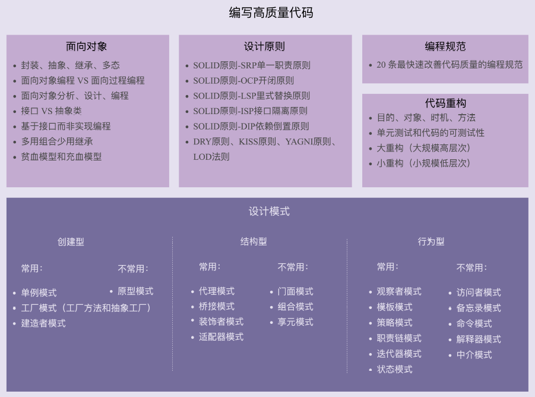

## 面向对象编程

- 面向对象的四大特性：封装、抽象、继承、多态
- 面向对象编程与面向过程编程的区别和联系
- 面向对象分析、面向对象设计、面向对象编程
- 接口和抽象类的区别以及各自的应用场景
- 基于接口而非实现编程的设计思想
- 多用组合少用继承的设计思想
- 面向过程的贫血模型和面向对象的充血模型

## 设计原则

- SOLID 原则 -SRP 单一职责原则

- SOLID 原则 -OCP 开闭原则

- SOLID 原则 -LSP 里式替换原则

- SOLID 原则 -ISP 接口隔离原则

- SOLID 原则 -DIP 依赖倒置原则

- DRY 原则、KISS 原则、YAGNI 原则、LOD 法则

## 编码规范

- 《重构》

- 《代码大全》

- 《代码整洁之道》

## 什么时候用静态类

如果我们有两个类 A 和 B，它们要用到一块相同的功能逻辑，为了避免代码重复，我们不应该在两个类中，将这个相同的功能逻辑，重复地实现两遍。利用继承特性，我们把相同的属性和方法，抽取出来，定义到父类中。子类复用父类中的属性和方法，达到代码复用的目的。但是，有的时候，从业务含义上，A 类和 B 类并不一定具有继承关系，比如 Crawler 类和 PageAnalyzer 类，它们都用到了 URL 拼接和分割的功能，但并不具有继承关系（既不是父子关系，也不是兄弟关系）。仅仅为了代码复用，生硬地抽象出一个父类出来，会影响到代码的可读性。当继承不能解决这个问题时，我们可以定义一个新的类，实现 URL 拼接和分割的方法。而拼接和分割两个方法，不需要共享任何数据，所以新的类不需要定义任何属性，这个时候，我们就可以把它定义为只包含静态方法的 Utils 类了。

